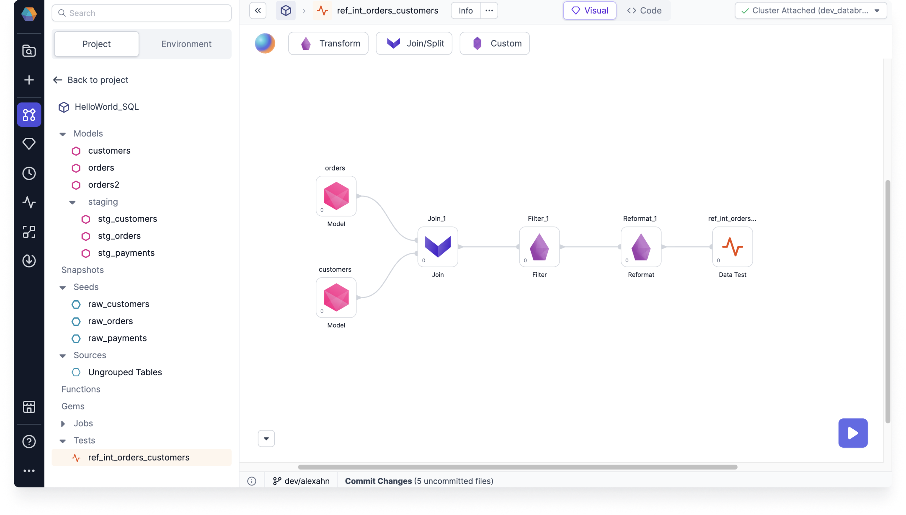

A data test is an assertion you define about a dataset in your project. Use data tests to verify that your business-critical data is consistently generated and meets expectations over time. Instead of manually reviewing datasets after each pipeline run or model execution, you can define tests that automatically validate your data and ensure data quality.

When you create data tests in the visual canvas, Prophecy runs [dbt](https://docs.getdbt.com/docs/build/data-tests) for the underlying test execution and simplifies the test definitions that are normally defined in `.sql` and `.yaml` files.

## Prerequisites

To use data tests in your SQL project, you will need to use a SQL fabric.

### Limitations

- [Prophecy fabrics](/core/prophecy-fabrics/) are not compatible.
- SQL fabrics configured with BigQuery and a CMEK are not compatible.

## Test types

There are two different data test types supported in Prophecy:

- **Project tests**: Singular-use tests that apply to one specific table.
- **Generic tests (Test definitions)**: Generic tests that can be reused repeatedly for table and column tests.

| General situations   | Project test              | Model test                | Column test               |
| :------------------- | :------------------------ | :------------------------ | :------------------------ |
| Test a single table  |    |  |  |
| Test multiple tables |  |    |    |

## When to use each test type

See a few recommendations in the following tables to get an idea of when to use each test type.

| Specific situations                                                        | Project test              | Model test                | Column test               |
| :------------------------------------------------------------------------- | :------------------------ | :------------------------ | :------------------------ |
| Test for referential integrity                                             |    |  |  |
| Test for late arriving data                                                |    |  |  |
| Test for data consistency verification                                     |    |  |  |
| Test for model size and aggregations                                       |  |    |  |
| Test for column data format and data presence (nulls, empty strings, etc.) |  |  |    |

## Example: Referential integrity check

The following test named `ref_int_orders_customers` checks for referential integrity. In particular, it checks if every `customer_id` entry in the **orders** table is present in the **customers** table.

This test starts with several models from the `HelloWorld_SQL` project, combines their data with a series of transformation steps, and feeds the resulting table into the Data Test gem.

If there are `customer_id` entries in the **orders** table that are not present in the **customers** table, then the `ref_int_orders_customers` test fails.

## What's next

To set up a project test, see [Use project tests](/docs/core/development/data-tests/use-project-tests.md).

If you need to reuse a test that is defined by a parametrized query, see [Use model tests](/docs/core/development/data-tests/use-model-tests.md).
