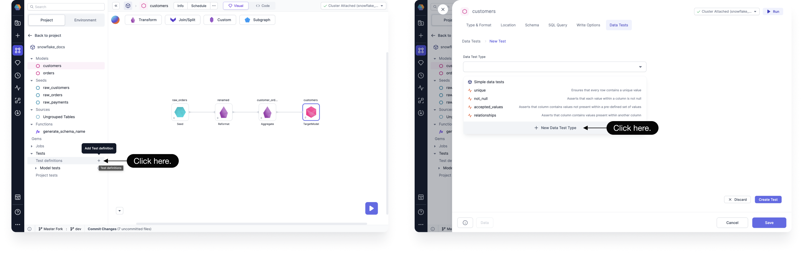
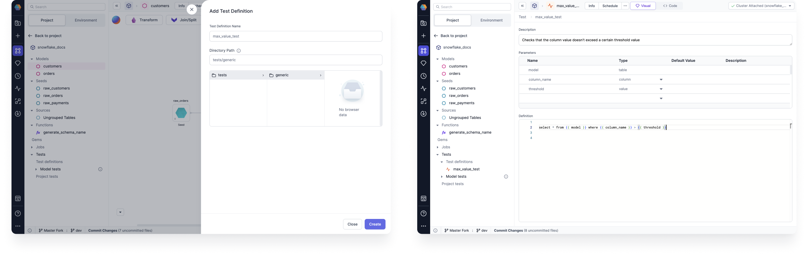
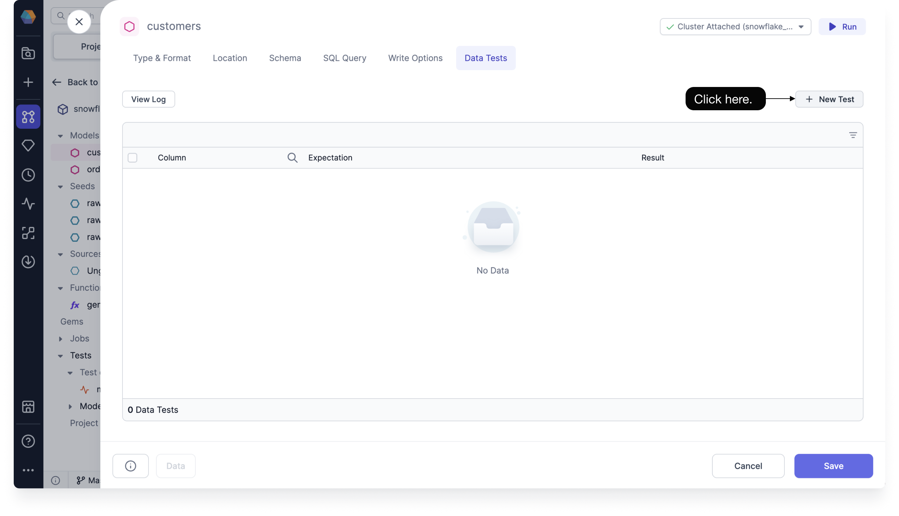
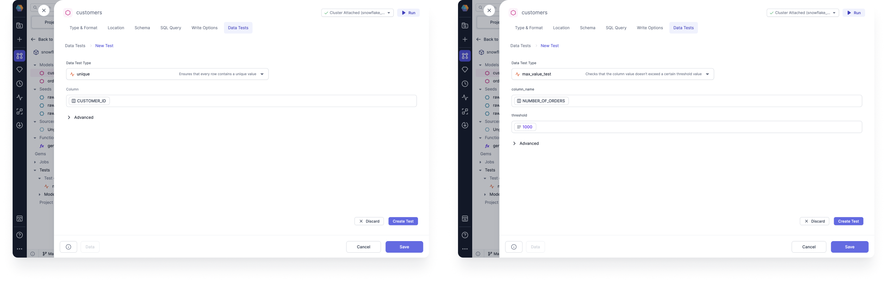
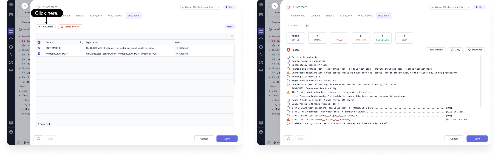
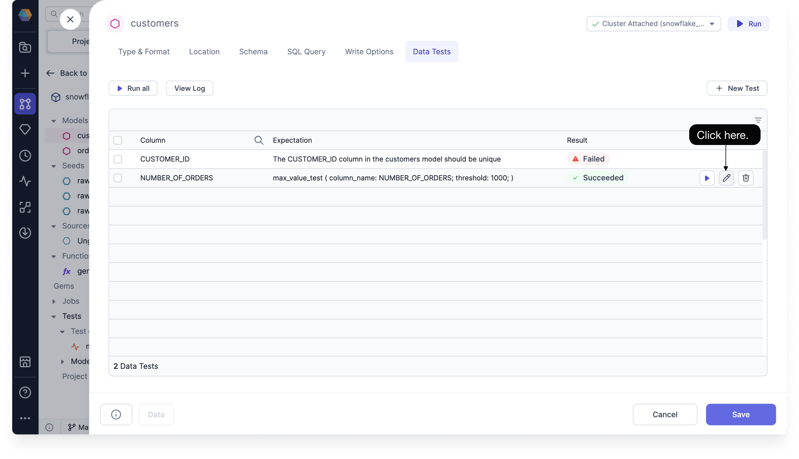
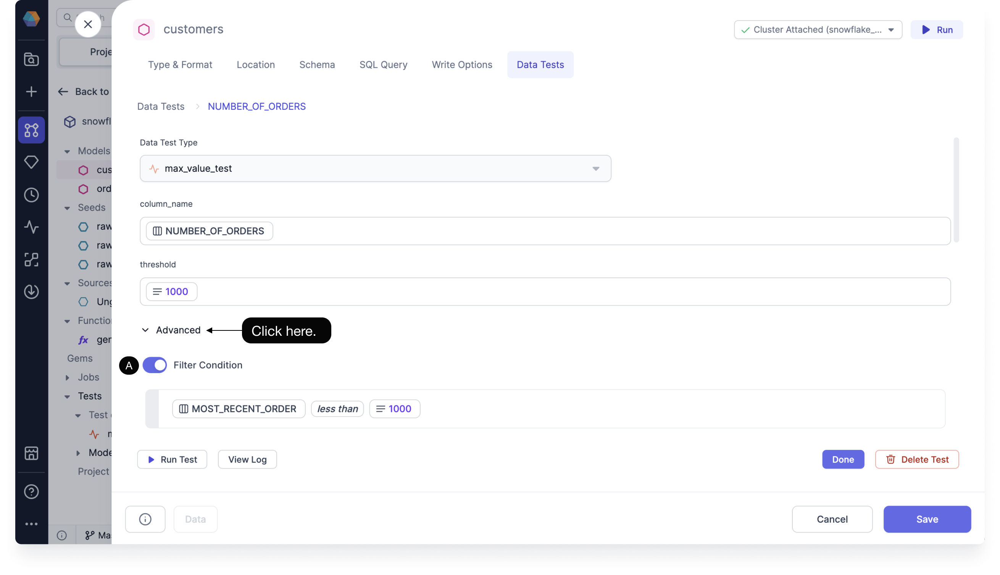
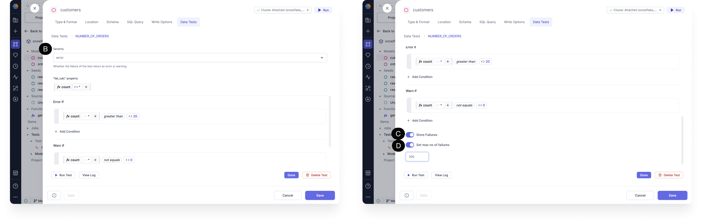
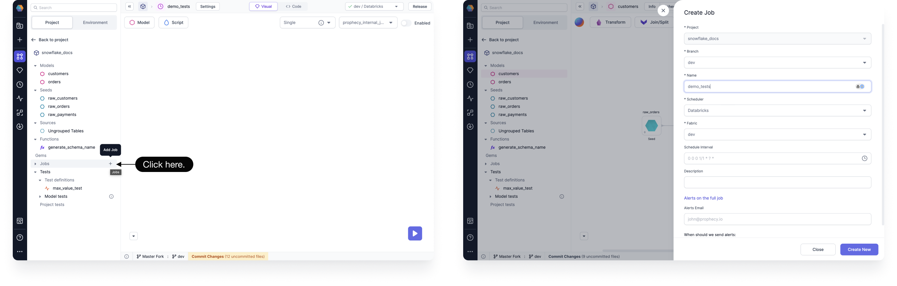
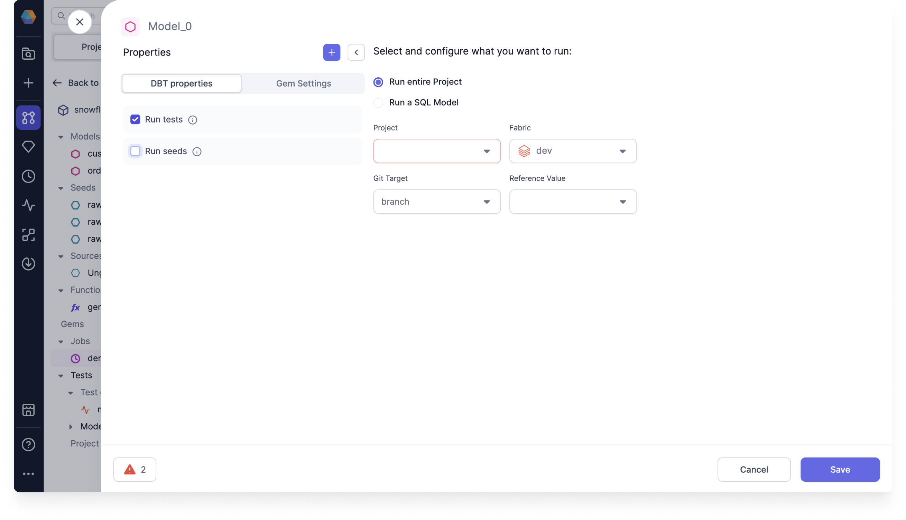

Model and column data tests are dbt macro generated tests that can be parametrized and applied to a given model or any number of columns. These tests are called generic data tests, and are based on the following [dbt generic test types](https://docs.getdbt.com/docs/build/data-tests#generic-data-tests).

- Model-level tests: Can span across many columns for a given model, or even multiple models, and are defined at a model level
- Column-level tests: Are defined on a column level of each model

:::note

There could be many tests within a project. Each test is checking a table created by your choice of input models, data sources, and transformation gems.

:::

For each model, you can create a macro-based test definition to use as a model test.

For each column within a model, you can define out-of-the-box supported dbt Simple data tests.

- Unique: Asserts that each value within a column is unique
- Not null: Asserts that each value within a column is not null
- Accepted values: Asserts that column contains values present within a pre-defined set of values
- Relationships: Asserts that column contains values present within another column

You can also use generic tests defined within the project or those defined within dependency packages.

:::note

Prophecy doesn't differentiate between model and column tests, and refers to these generic tests as simply data tests.

:::

## Set up a test

Depending on the type of test, you can set up a new model or column test from either the Tests section of the project tab or the Data Tests tab of the target model.

### Develop a test

You can create a new data test definition to use in your model or column test. You can also skip creating a data test definition, and use one of the Simple data tests previously mentioned.

To develop a model or column test, start by opening a project:

1. Under the Project Browser, click **Add Test definition**. You can also click **+ New Data Test Type** from the Target Model Data Tests tab.

   

2. Enter your **Test Definition Name**, and then click **Create**. The test definition page opens. Data tests are saved to a tests > generic SQL file in the Git directory by default.

   

3. On the test definition page, enter the description, parameters, and definition. In the previous image example, we created a test definition that checks that the column value doesn't exceed a certain threshold value.

4. To create a new data test, whether it's one that uses a test definition or one that uses an out-of-the-box Simple data test, navigate to the Data Tests tab in the target model, and then click **+ New Test**.

   

5. Choose your Data Test Type from the drop down menu, and then click **Create Test**. You can find the Simple data tests, the test definition you created earlier under the current project name, and any data tests from dependencies connected to your project listed here.

   

6. After selecting your Data Test Type, fill out the column fields and any other required for your data test. The following image example on the left uses the Simple data test `unique`, while the example on the right uses the created test definition.

   

:::caution

If changes are made to the columns or schemas used in your data test, then Prophecy will delete the data test. For example, if you run into a data mismatch error on the Schema tab of your target model or update the schema, then your data test will be affected.

:::

### Run a test

After you’ve developed your model or column test, you can run it.

1. From the Data Tests tab of your target model, select the data tests that you'd like to run, and then click **Run tests** to execute your tests. The table input to the target model gem is what’s tested.

   

2. You can click to view the **Test Summary**, **Copy** the logs, or **Download** them. Depending on the outcome of the test, different colored icons are presented.

## Fix a failed test

If your model or column test fails, you can check the stored failed records using the Store Failures advanced setting. See [Configure a test](#configure-a-test) to learn how to set up this setting.

- Check the test output tables to see your failed rows.

:::note

Make sure you have write permission to create a new table in your data warehouse, otherwise you may run into errors while trying to run your own tests.

:::

## Configure a test

You can configure your model or column test to help decide which cases to focus on.

To configure a test, follow these steps:

1. From the Data Tests tab of your target model, hover over the data test that you'd like to configure, and then click the edit icon.

   

2. Click **Advanced** to open the advanced settings, and then enter the conditional values for the following options:

   

   

   - **(A)** **Filter Condition**: Sets a filter for what you want your test to run on.
   - **(B)** **Severity**: Determines whether the failure of the test returns an error or warning. The severity operates from the highest priority selection, error, to the lowest, warning. So if you select error, then the test first checks for errors. If it doesn’t find any, then it then checks for warnings. If you select warning, then the test only checks for warnings. If you don’t select a severity, then error is chosen by default.
     You can set conditions for when to return an error or warning using **Error If** and **Warn If** respectively. You can set the number of failed rows to determine an error, or otherwise just return a warning.
   - **(C)** **Store Failures**: Stores all records that failed the test. The records are saved in a new table with schema `dbt_test\_\_audit` in your database. The table is named after the name of the model and data test.
   - **(D)** **Set max no of failures**: Sets the maximum number of failures returned by a test query. You can set the limit to save resources and time by having the test stop its query as soon as it encounters a certain number of failed rows.

3. Click **Save**.

## Schedule a test

When scheduling your project, you can opt in to run a test along with the project or model. Scheduling a test allows you to ensure on a daily basis that your data is correct. You can only schedule a test with a project or model. You cannot schedule one individually.

To Schedule your project to run with tests, follow these steps:

1. Under the Project Browser, click **Add Job**. Enter a name for your job and click **Create New**.

   

2. Drag a Model gem to your visual canvas.

3. Click the model to open the model properties.

4. Select the database object you want to run the test on. You can schedule the entire project or just a single model:

   - Run entire project
   - Run a SQL model

   

5. Select **Run tests**.

6. Check that your **project, model**, and **fabric** are correct.

7. Click **Save**. The job runs automatically. You can see the job status by clicking **Detail**.
