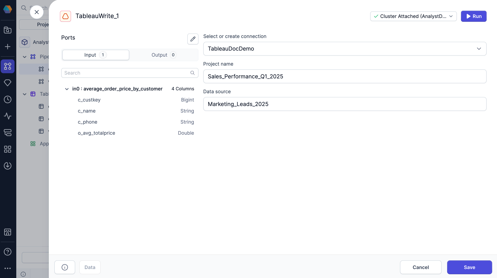

import SQLRequirements from '@site/src/components/sql-gem-requirements';

<SQLRequirements
  execution_engine="Prophecy Automate"
  sql_package_name=""
  sql_package_version=""
/>

The TableauWrite gem lets you send data that updates the data sources that are utilized by Tableau dashboards.

## Input

The TableauWrite gem accepts the following inputs.

| Port    | Description                                                                                                         |
| ------- | ------------------------------------------------------------------------------------------------------------------- |
| **in0** | The table that will be sent as a `Hyper` file to update your Tableau data source. You can only configure one input. |

No output table will be written to your data warehouse.

## Parameters

| Parameter                   | Description                                                                                                                                 |
| --------------------------- | ------------------------------------------------------------------------------------------------------------------------------------------- |
| Select or create connection | Defines which [Tableau connection](docs/core/prophecy-fabrics/connections/tableau.md) to use for the gem.                                   |
| Project name                | The name of your Tableau project that contains the data source to update.                                                                   |
| Data source                 | The data source you want to update in Tableau. A data source is a connection to data that you are using for analysis and visualization. |

