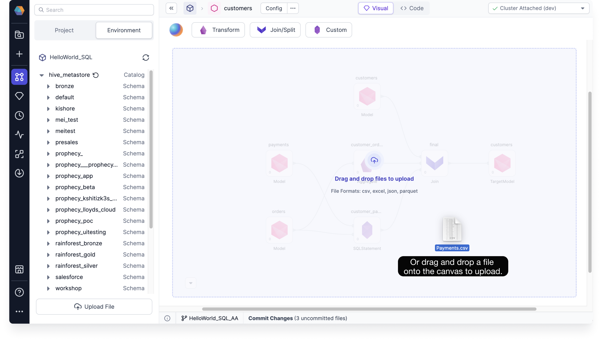
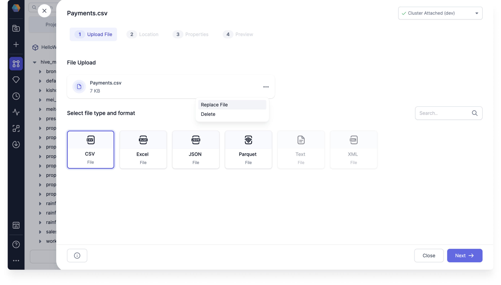
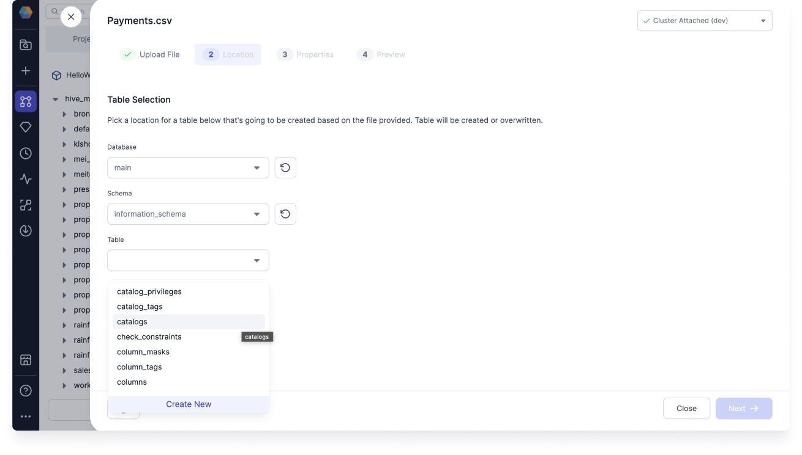
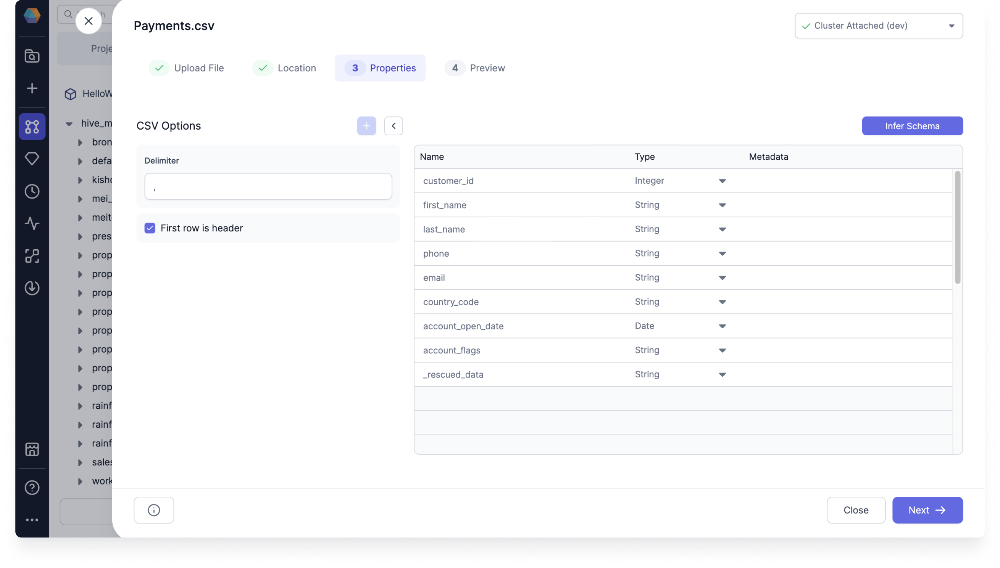
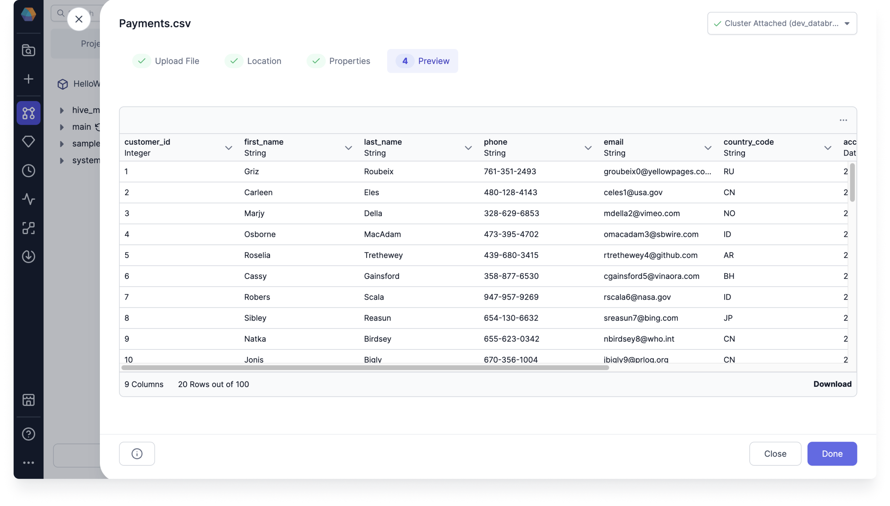

import SQLRequirements from '@site/src/components/sql-gem-requirements';

<SQLRequirements
  execution_engine="SQL Warehouse"
  sql_package_name=""
  sql_package_version=""
/>

You can add a source table to your primary SQL warehouse by uploading a file directly onto the visual canvas. This gives you greater control over your data and how you incorporate it into your model transformation.

Supported file types:

- CSV
- Excel (XLS, XLSX)
- JSON
- Parquet
- XML

When you upload your file through Prophecy, it's added directly to your SQL warehouse as a [table](/analysts/source-target).

:::note
The recommended maximum file size is 100&nbsp;MB.
:::

## File upload

To upload your file:

1. Open a pipeline.
1. Drag and drop your file onto the canvas. This opens a new Source gem.

## Type and format

Once the Source gem opens, you can review the type and format of the file.

1. Optional: Replace or delete your uploaded file.
1. Optional: Change the type and format of the file.
1. Click **Next**.

## Location

Now, set the location where the table will be stored in the primary SQL warehouse configured in your fabric.

1. Choose the database.
1. Choose the schema.
1. Choose the table. You can either select an existing table or create a new one.

:::caution
If you select an existing table, Prophecy deletes and recreates the table with your uploaded file.
:::

## Properties

You can configure the table properties before completing the file upload.

1. Review the file's options. Depending on the file type and format, common defaults are already chosen for you.
2. Optional: Modify the options. For example, you can change the header row by selecting **First row is header**.
3. Optional: If you made any changes to the options, click **Infer Schema**. This will update the schema according to the defined options.

## Preview

The preview step shows your table data and gives you the option to download it.

1. To generate the preview, click **Load**. This loads the data.
1. Check that your preview looks correct and click **Done**.
1. If you selected a table to write your uploaded file to, you'll need to confirm the upload in the pop-up window by clicking **Proceed**.

The new table is now in your environment and available in Source/Target gems. You can upload another file or start working with your new source gem.
