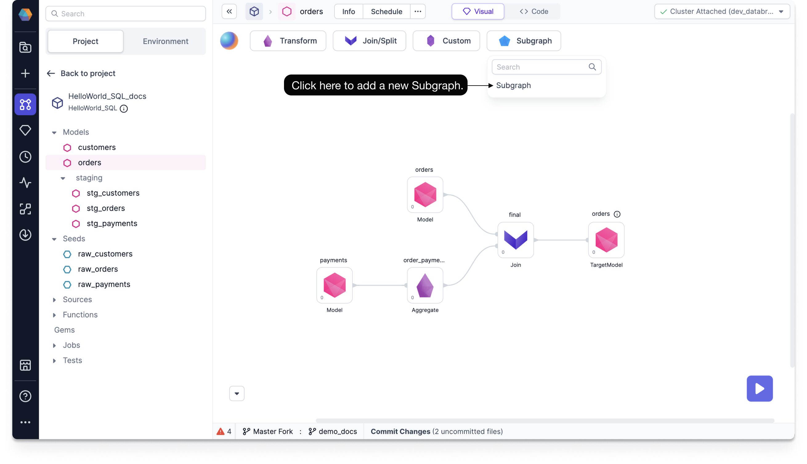
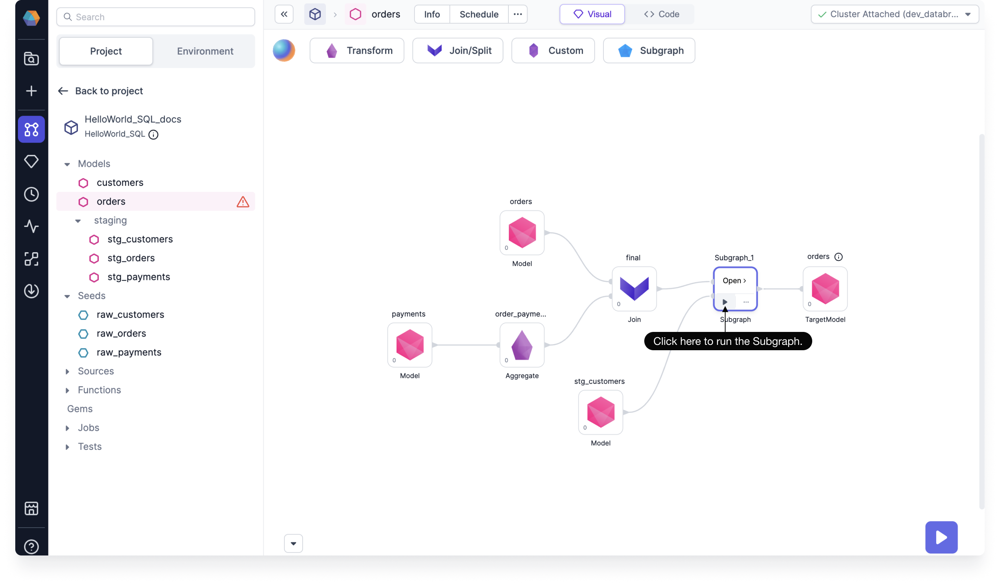
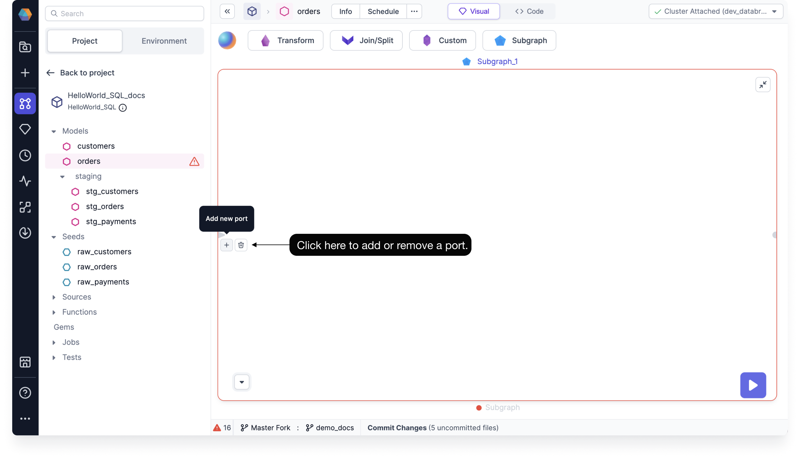
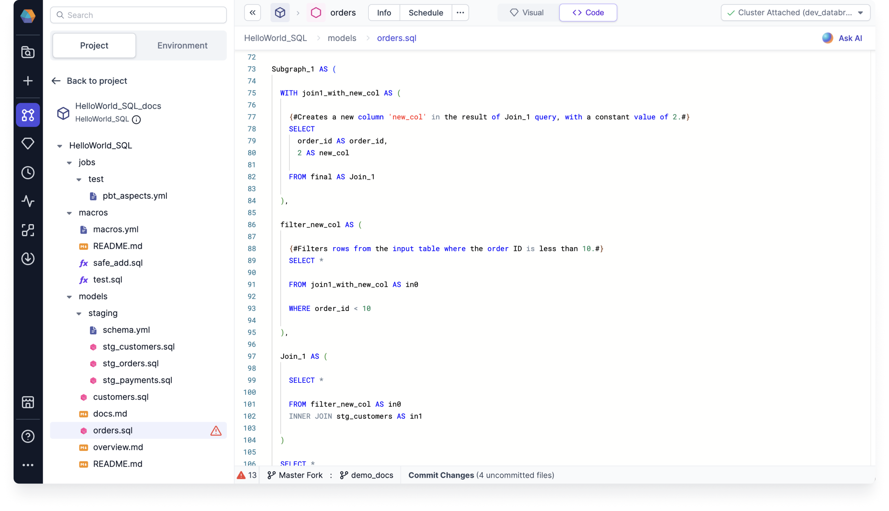

Subgraph gems let you take multiple different gems and wrap them under a single reusable parent gem. In other words, they allow you to decompose complex logic into reusable components and simplify the visual view of your data model.

## Basic Subgraph

Basic Subgraphs are single-use containers that capture one or more gems within a model. They are the equivalent of a nested CTE.

If you want to create a complex model with large sets of Transform and Join gems, you can use a Basic Subgraph to group them together. This organizational approach enhances the visual clarity of your model by grouping various sections together under a common parent gem. Additionally, it empowers you to break down intricate logic into modular components, thereby streamlining your data transformation processes.

### Create a Basic Subgraph

You can create a Basic Subgraph the same way you create other gems.

To create a Basic Subgraph, follow these steps:

1. Drag and drop the **Subgraph** gem from the Subgraph menu, and connect it to any previously created gem on your canvas.

2. Once you've added the gem, click on it to open the subgraph canvas.

3. On the subgraph canvas, add gems to your Basic Subgraph by dragging and dropping from the gems menu. You can even add a subgraph within the subgraph to create a nested subgraph.

### Run a Basic Subgraph

A Basic Subgraph is functionally equivalent to the sequence of gems that it contains. You can run a Basic Subgraph to see the output.

To run a Basic Subgraph, follow this step:

- On the Basic Subgraph gem, click on the play button,

### Add/Remove Port

Gems and subgraphs are operations or transformations that takes one or more tables as inputs. Therefore, Input ports signify the number of tables that a Basic Subgraph is taking in as inputs. There is no limit to the number of Input ports you can add.

While using a Subgraph, you can configure the number of Input ports as per the requirements. However, as with all SQL gems, there can only be one Output port.

To add an Input port, follow these steps:

1. On the subgraph canvas, click on the **+** button to add a new port.
2. Optional: You can click the **Delete** icon next to the input port you want to remove.

## Code view

Normally from the Code view, we create one gem per CTE. However, since subgraphs are represented as nested CTEs in code, one subgraph can represent multiple nested SQL statements.

If you'd like, you can create a subgraph from the Code view by writing multiple nested statements. Then toggle back to the Visual view to see an auto-generated Subgraph gem based on your defined transformations.

## Subgraph Configurations

You can configure your subgraphs by using either:

- Model-level configurations
- Project-level configurations
