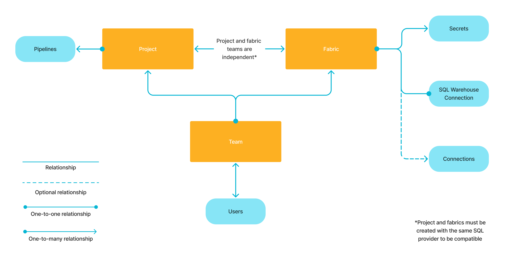

Prophecy lets you work with various data providers when building your pipelines. When you create a connection in a [fabric](docs/core/prophecy-fabrics/prophecy-fabrics.md), the connection lets you access external data in your pipelines. While pipeline execution still occurs in the primary SQL warehouse, connections let you read and write data in other data providers.

After you attach to a fabric in a project, you'll be able to:

- Create connections from the [Environment browser](/analysts/project-editor#sidebar) or from external Source and Target gems.
- Configure [secrets](#secrets-in-connections) for your connections that will encrypt your connection credentials.
- Reuse connections throughout your pipeline without needing to reconnect.
- Browse data from established connections in the Environment browser.

## Connections in projects

In the following sections, let's explore how you will interact with connections inside of a project.

### Environment browser

Connections allow Prophecy to access specific data from external providers using your credentials. The data will appear in the [Environment browser](/analysts/project-editor) of the project sidebar, allowing you to easily locate data, explore data, and add data to your pipeline canvas. Data access permissions are inherited from your external user account.


When you attach a Prophecy fabric to your project, you will by default see the data from your [primary SQL warehouse](/core/prophecy-fabrics/) in the Environment browser. If you want to see more connections in your project, you can click **+ Connect more data** at the bottom of the Environment browser. Once you configure a connection, Prophecy will automatically save it to your attached fabric. To understand how to configure individual connection types, visit the [list of connections](docs/core/prophecy-fabrics/connections/connections.md).

To use data from the environment browser:

1. Drag a source from the environment browser to the pipeline canvas.
1. Open the gem configuration.
1. Notice Prophecy has configured the source gem for you.
1. Load and preview the data.
1. Add downstream gems to perform data transformations.

### External Source/Target gems

If you add an external Source or Target gem from the gem drawer to your pipeline canvas, you will need to configure the gem:

1. Add an external Source or Target gem to your canvas.
1. Open the gem to view the configuration dialog.
1. Select the correct **Type and Format**.
1. Open the **Location** tab.
1. Select an existing connection for your gem, or [create a new one](docs/core/prophecy-fabrics/connections/connections.md).
1. Open the **Properties** tab and verify the schema of your table.
1. Save the gem.

:::caution
When setting up external sources and targets, consider the primary SQL connection in your Prophecy fabric. Processing tables natively in the primary SQL warehouse will be fast. Processing external data is slower. **Do not create an external connection that duplicates your primary SQL warehouse connection.**
:::

## Secrets in connections

As you create connections, you will notice that credentials must be populated with [secrets](docs/core/prophecy-fabrics/secrets.md). Secrets keep your credentials encrypted and secure. Once you add your secrets to your connections, you can reuse the connections throughout the pipeline without having to reauthenticate or re-enter your credentials. This relationship between secrets and connections keeps Prophecy secure for your data processing needs.

## Connections access

Prophecy controls access to connections through fabric-level permissions. To access a connection, you must have access to the fabric that contains the connection. You can only access fabrics that are assigned to one of your teams.



:::info
Most connections are only used to read from and write to data sources. The SQL Warehouse connection is an exception—it also provides the compute environment for pipeline execution.
:::

## Connections in fabrics

To configure a new connection directly in a Prophecy fabric:

- Open the **Metadata** page from the left sidebar in Prophecy.
- Navigate to the **Fabric** tab.
- Open the fabric where you want to add the connection.
- Navigate to the **Connections** tab.
- Click **+ Add Connection**. This opens the **Create Connection** dialog.
- Select a data provider from the list of connection types.
- Click **Next** to open the connection details.
- Configure the connection and save your changes.

Learn about individual connection parameters in the connection's respective reference page.

:::note
You can also create connections inside the project editor.
:::

## What's next

Visit the following pages to learn more about available connections.

```mdx-code-block
import DocCardList from '@theme/DocCardList';
import {useCurrentSidebarCategory} from '@docusaurus/theme-common';

<DocCardList items={useCurrentSidebarCategory().items}/>
```
