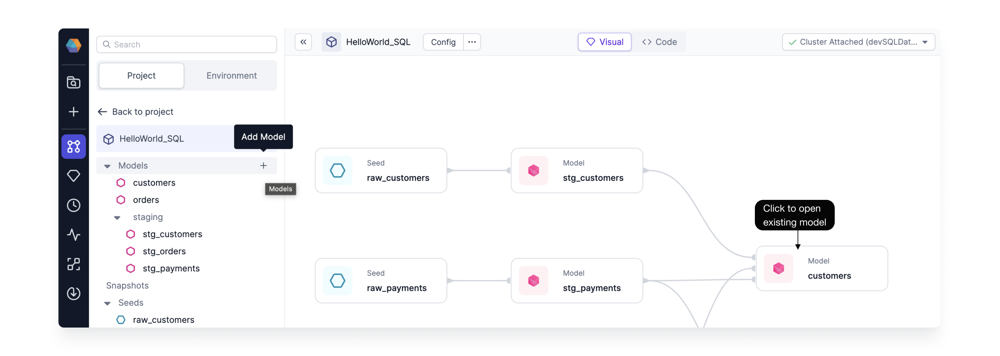
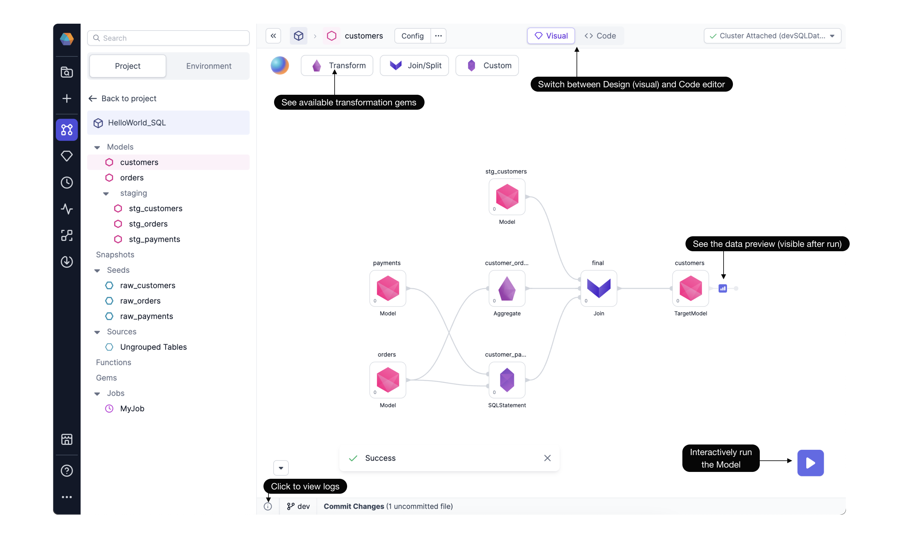
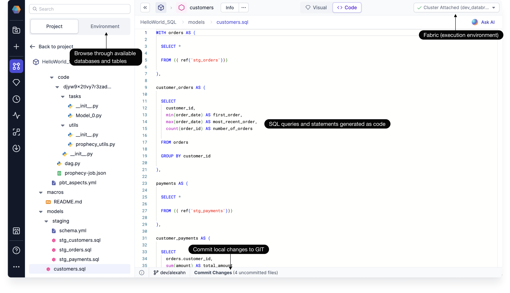

<span class="badge">SQL</span><br/><br/>

Data [models](docs/data-modeling/models.md) are transformations that are compiled into SQL code and executed on SQL warehouses. Use the **model canvas** to visually develop your models, and switch to the code view to see your transformations in SQL.


## Project editor

Open any SQL project in the project editor. Here, you will find the complete end-to-end **project lineage**. The project lineage provides a quick, high-level understanding of how models refer to other models, seeds, or sources. You'll also be able to browse different project components and view data from your SQL environment.


## Model canvas

The model canvas is your main workspace to develop data models. To begin, you can create a new model by clicking on **+** next to the models pane.



Once a model is open, the model-editing canvas appears. In the following image, we can see the `customers` model starts with three existing models. The data is transformed according to Aggregate, SQLStatement, and Join [gems](docs/data-modeling/gems/gems.md). The transformation gems are accessible via the gem drawer. As you develop the model, you can [iteratively run](docs/data-modeling/execution/execution.md) and see [sample data](docs/analysts/development/data-explorer.md) as well as the relevant logs.



## Code view

Switch to the **Code View** to reveal the SQL queries generated from the visual model canvas. Each gem is represented by a CTE or subquery.



You may wish to edit the code view. Add a SQL statement in the code view and notice the visual editor displays the updated code.

## Version control

Projects built through Prophecy are stored in the dbt Core format as repositories on Git, which allows data teams to follow best software engineering practices like CI/CD.

Prophecy automatically saves your work as you develop in a working directory securely stored on the cloud. Just make sure to commit your changes every once in a while, to see your code reflected on your Git and to collaborate easier with your team.

## SQL and dbt constructs

Even if dbt and SQL constructs are not supported in the visual editor, it is still supported in code. In other words:

- **For SQL**, Prophecy automatically maps unsupported SQL statements to a generic SQL gem, allowing you to still freely edit even unsupported code.
- **For dbt**, Features in dbt-core that may lack their visual-editor alternatives still work as expected from the standard dbt cli. Prophecy will never modify your existing codebase in unsupported ways.

## Share models

If you want, you can import an existing dbt Core project or start from scratch. Then, you can publish projects to the [Package Hub](docs/extensibility/package-hub/package-hub.md) and share your models with other teams.

## Learn more

A word from Prophecy's co-Founder, Maciej! See how Prophecy allows every team, whether visual or code developers, to use the same software development best practices.

<div class="wistia_responsive_padding" style={{padding:'56% 0 0 0', position:'relative'}}>
<div class="wistia_responsive_wrapper" style={{height:'100%',left:0,position:'absolute',top:0,width:'100%'}}>
<iframe src="https://fast.wistia.net/embed/iframe/3i9g2dciah?seo=false?videoFoam=true" title="Design a Pipeline Video" allow="autoplay; fullscreen" allowtransparency="true" frameborder="0" scrolling="no" class="wistia_embed" name="wistia_embed" msallowfullscreen width="100%" height="100%"></iframe>
</div></div>
<script src="https://fast.wistia.net/assets/external/E-v1.js" async></script>

## What's next

To get started developing SQL models, check out the pages below or try this [modeling](docs/getting-started/tutorials/sql-with-snowflake.md) tutorial.

```mdx-code-block
import DocCardList from '@theme/DocCardList';
import {useCurrentSidebarCategory} from '@docusaurus/theme-common';

<DocCardList items={useCurrentSidebarCategory().items}/>
```
