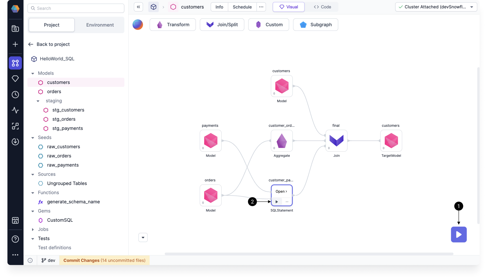

You can leverage Data Copilot for SQL by building your model and adding individual gems, and then check how the process is going by interactively running the model. Use the Data Explorer to dig into your interim data sample, with the ability to sort, filter, and download your sample data.

## Interim data samples {#interims}

When you run a model in the model canvas, Prophecy generates **interim** data samples that let you preview the output of your data transformations. There are two ways to run a model interactively:

- Run the entire model using the **play** button on the pipeline canvas.
- Execute the model up to and including a particular gem using the **play** button on that gem.

After you run your model, you will see the interims appear between gems. These previews are temporarily cached. Learn more about how to navigate the interim data samples in [Data Explorer](docs/analysts/development/data-explorer.md).
