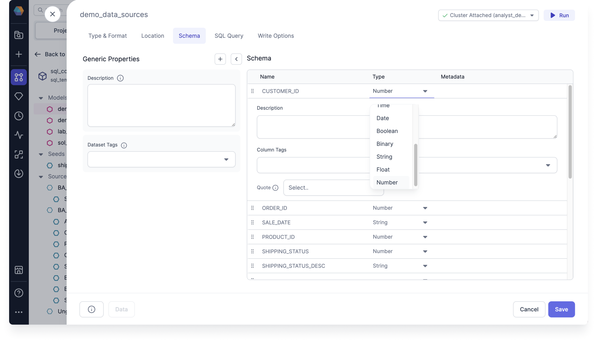

You can use the Schema tab to view the schema, and add any additional properties.

## Generic Properties

You can use the Generic Properties to do the following:

- add a description
- apply dataset tags to the resource

## Schema

You can use Schema to do the following:

- reorder the rows
- change the Type
- expand the row to
  - add a description
  - apply column tags
  - enable or disable quoting for column names
