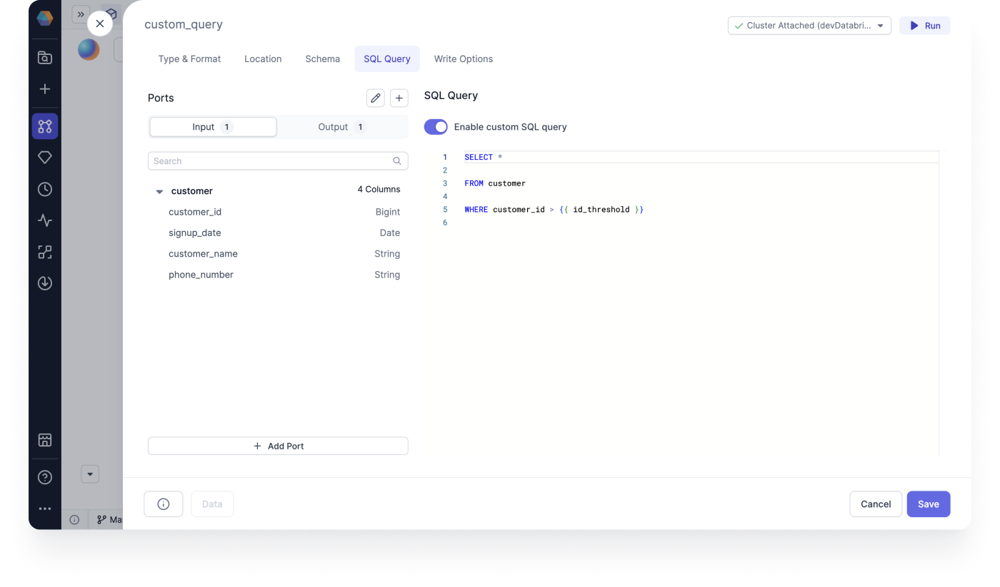

You can use the SQL Query tab to view and enable your custom SQL query at the end of your Target model. A custom SQL query enables you to perform one last data transformation step as a SQL query, before creating the model.

This is useful if you import your own codebase and your final query has additional conditions. Your query is saved here for you to view and edit. For low code users you can use a Filter gem to achieve the same results.

## Enable custom SQL query

You can add a custom SQL query if you're doing data processing with advance Jinja or dbt templating.
This gives you flexibility when doing last mile operations for your SQL models. To that end, we support the use of declared variables directly in the SQL queries for those last mile operations on each model write.

### Ports

Ports represent the tables or gems that you want to use in the SQL query. You can access them using the table aliases, or port names. The visual order of the ports defines the order of the variables.

You can edit or add Ports for Input and Output.

### SQL Query

You can enable customer SQL query on the SQL Query tab.

- Toggle **Enable custom SQL query** to enable your custom SQL query at the end of your model.



Your SQL query will appear as a normal string in the Code view.

```SQL
SELECT *

FROM customers_raw

WHERE customer_id > {{ id_threshold }}
```

You can use your declared dbt variables in the SQL query.

## Declare variables

The variable declaration interface allows you to configure variables directly in the SQL query for your Target model.

Declared variables are accessible by clicking configuration to add the variable of interest.

- You can declare the variables under **...** > **Configuration** using key-value pairs. Variables can be defined at the model or project level.


You can then use the variable, along with standard dbt functions, in the Target model SQL Query tab.
