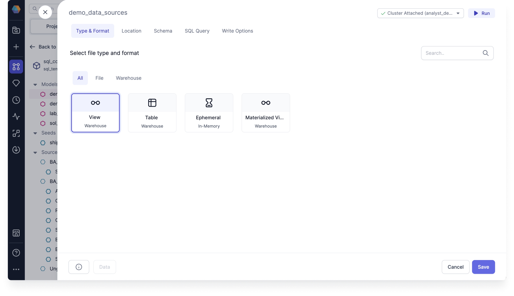

You can use the Type & Format tab to update the format of the model between different types of materializations. This determines the underlying physical format of your Target model.

You can select the type of data you want to write from. The Warehouse represents all native warehouse and optimized data formats.

## Materialization types

The model materialization types include the following:

- **View**: View models are rebuilt as a view on each run. Views built on top of source data always have the latest records, but they don't store any additional data. So they're simply queries based on other tables. Use the view materialization type for models that don't do significant transformations. This is the default type.
- **Table**: Table models are rebuilt as a table on each run. Tables are fast to query, but they can take a long time to rebuild. Use the table materialization type for any models that are queried by BI tools. To apply a write mode to your Target model, you must use the Table type.
- **Ephemeral**: Ephemeral models aren't built into the database. Instead, the model code is taken from an ephemeral model and inserted into its dependent models using a common table expression (CTE). Use the ephemeral materialization type for undemanding transformations that appear at the start of your DAG.
- **Materialized View**: Materialized View models are a combination of a view and a table. They are similar to incremental models in that they serve similar use cases. A materialized view model allows you to create and maintain a materialized view in the target database Warehouse type. This is not supported in Snowflake.

  
