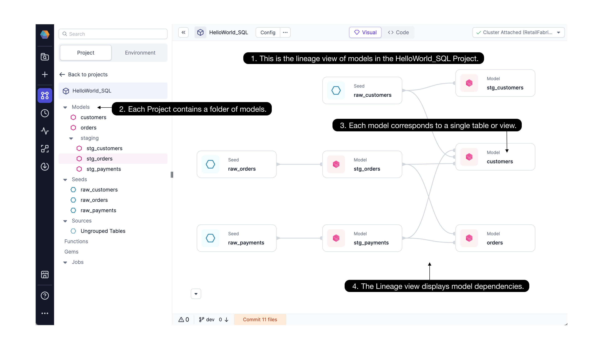
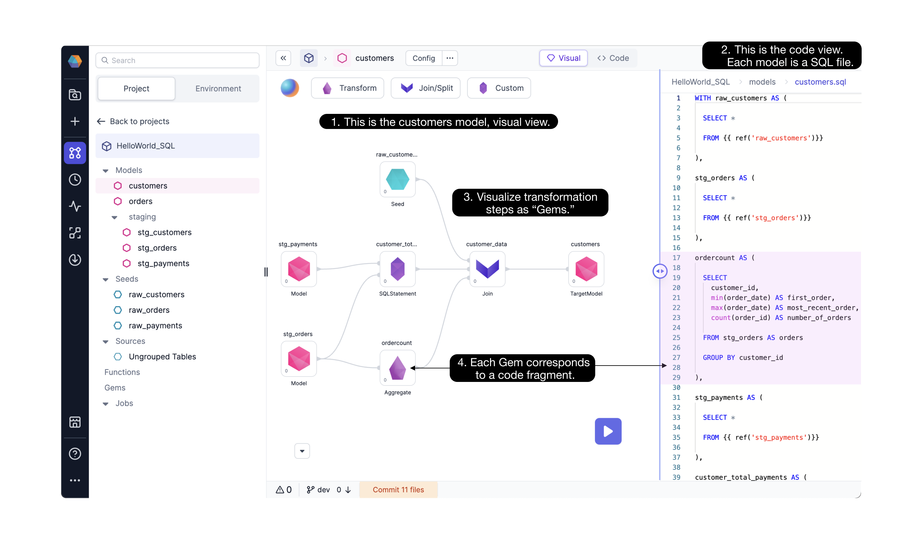

Models are based on SQL-native code and use the [dbt Core™️](https://docs.getdbt.com/docs/build/models) build system. Models define a single dataset, typically a table or view, and are useful for transforming data directly in a data warehouse or for existing dbt users. They are best suited for data analytics and transformation needs.

You can build models from a **visual** or **code** interface. When using the visual interface, model components are automatically compiled into SQL select statements that you can reuse and customize.

:::note
Prophecy’s visual interface supports SQL models only. If you’d like to define Python models, you can still use them within the code interface.
:::

## Data modeling

**Data modeling** refers to shaping your data from its raw state to its transformed final state. In Prophecy and dbt, data models are SQL statements that build a single table or view and enable better management. Data models incorporate step-by-step logic, compatible with Prophecy [gems](docs/getting-started/concepts/gems.md). Each model is stored as a SQL file on Git as open-source code. Models can also be reused through Prophecy [packages](docs/extensibility/package-hub/package-hub.md).

## Model development

In the [Project Editor](docs/getting-started/concepts/project.md#project-editor) of a SQL project, Prophecy displays models using a lineage view, a visual view, and a code view. As you develop your models, you can commit and release your changes via [Git](/docs/ci-cd/git/git.md).

- **Lineage view**. When you open a SQL project, you first see the **lineage** view. The lineage provides a high-level view of the project's models with dependencies displayed from left to right.

- **Visual view**. If you open a specific model, you are taken to the model visual canvas. The visual canvas shows each step needed to move from the referenced tables/seeds/models to the final model. [Gems](docs/getting-started/concepts/gems.md) drive data transformations in Prophecy.

- **Code view**. Any changes that you make in the visual view are automatically compiled into code (and vice-versa).

## Models vs pipelines

Models are data transformations that run exclusively on a SQL warehouse using dbt. Because of this, models follow dbt limitations like each model can only define one output. Pipelines, on the other hand, can use a Spark engine (for Python or Scala projects) or Prophecy Automate (for SQL projects) for computation. Because of this, pipelines are more flexible in their capabilities.
