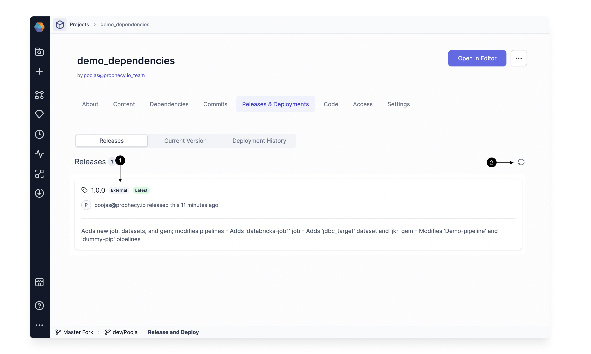
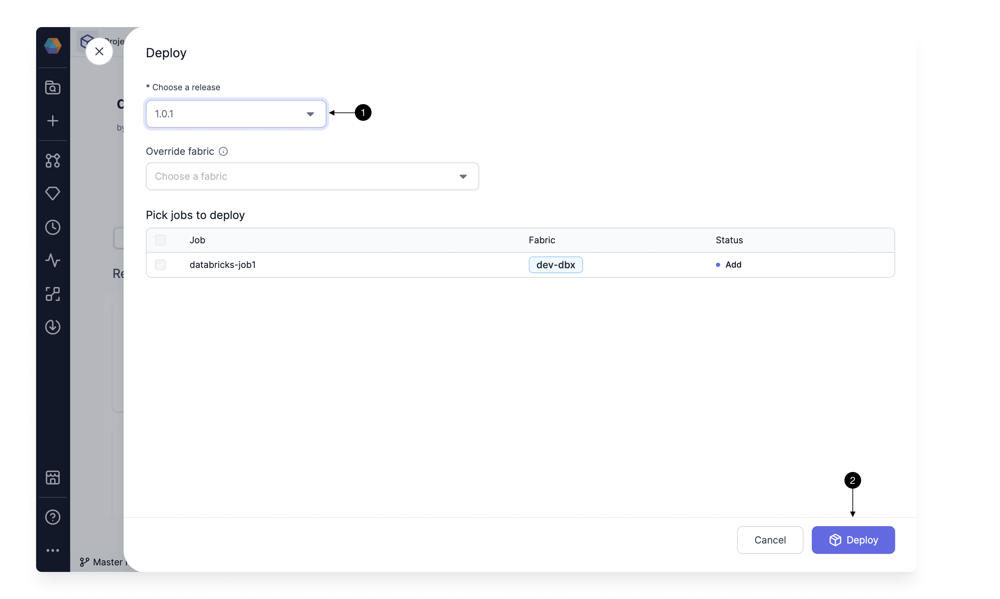
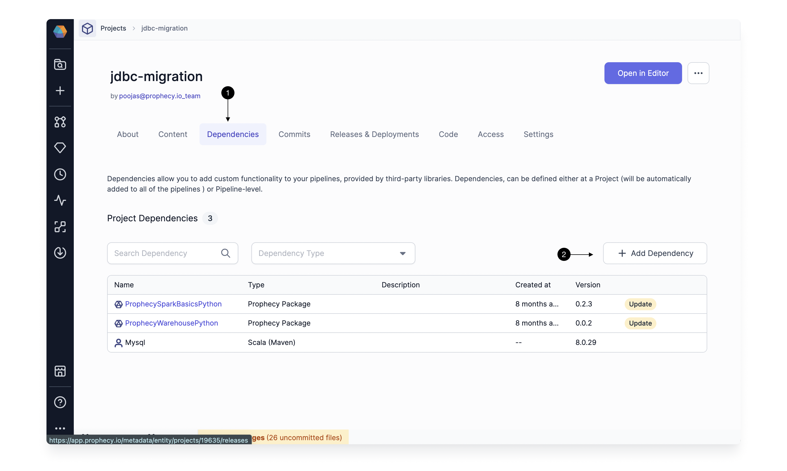
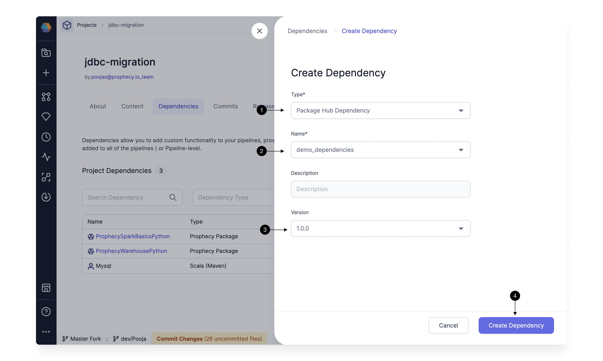

If you use external CI-CD tools to merge and release your projects, you can use [release tags](https://git-scm.com/book/en/v2/Git-Basics-Tagging) from those tools within Prophecy for deployment and dependencies.

Once you've deployed an external tag in Prophecy, you can add that release as a dependency in a Project.

## View external release tags

Any externally created release tag that you pull into Prophecy is visible on the **Releases & Deployments** tab of your Project metadata.

Tags that are created externally are labeled with an **(1) External** tag. If your latest tags aren't showing, click on the **(2) Refresh** button to refresh the list of tags.

## Deploy an external release tag

To deploy an existing tag, follow these steps:

1. From `...` in the top right corner, select **(1) Deploy**. This opens the Deploy dialog.

   

2. Select a release version you wish to deploy by using the **(1) Choose a release** dropdown. Once you select a version, the table below shows the Jobs that are going to be modified (there might not be any Jobs). Click **(2) Deploy** to start the deployment.

   

   :::note
   If you have enabled [Selective Job Deployment](./deployment.md#selective-job-deployment), then you can pick the Jobs you wish to deploy. Additionally, you have the option to override the Fabrics for these Jobs. Job selection **is not required** to deploy the release.
   :::

This deploys a new release. You can access deployment logs from the [Deployment History](./deployment.md#deployment-history) tab.

## Use the release as a dependency

Once you've deployed a tag, you can use the release as a dependency in a Project.

First, navigate to the **(1) Dependencies** tab of the relevant Project and click **(2) + Add Dependency**.

Next, in the **Create Dependency** dialog:

1. For **Type**, select **Package Hub Dependency**.
1. For **Name**, choose the Project that contains the external release tag.
1. For **Version**, select the option that matches your external release tag.
1. Click **Create Dependency**.

You can also edit a dependency and update its version to an externally released version.

## FAQ

**How does Prophecy support tags from a repo that is linked to multiple Prophecy Projects?**

A Git tag is a pointer to a specific commit in the repo. It's not linked to a subfolder in the repo. So in this case, if you create a tag, it would be available for all Projects linked to the repo.

**Do the tags have to follow a certain pattern to be recognized?**

No. Prophecy supports all tag patterns supported in Git. Prophecy automatically recognizes external tags after you visit the Release and Deployment page or refresh the page.
