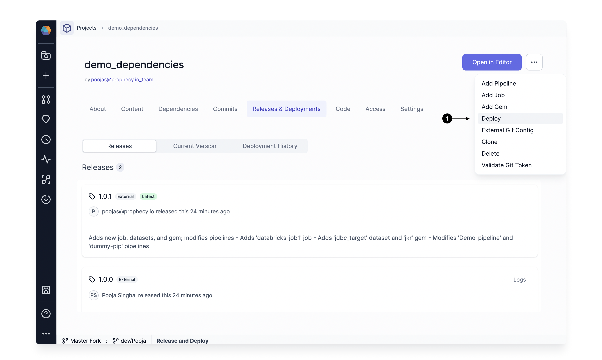

If you use external CI-CD tools like Github or Jenkins to merge and release your projects, you can use release tags from those tools in Prophecy for deployment and dependencies. The tags can be directly deployed via Prophecy or added as a dependency to an existing Project.

Any externally created release tag that you pull into Prophecy is visible on Releases and Deployments.

Tags that are created externally are labeled with an **(1) External** tag. If your latest tags aren't showing, click on the **(2) Refresh** button to refresh the list of tags.

## Deploy an External Release tag

To deploy an existing tag, follow these steps:

1. From `...` in the top right corner, select **(1) Deploy**.

   

   This opens up the Deploy dialog.

2. Select a release version you wish to deploy by using the **(1) Choose a release** dropdown. Once you select a version, the table below shows the Jobs that are going to be modified.

   

   1. Optional: You can override the Fabric for all Jobs, or if you have enabled Selective Job Deployment, then you can pick the Jobs you wish to deploy. For more details about these settings, see [Selective Job Deployment](./deployment.md#selective-job-deployment).

   2. Click **(2) Deploy** to start the deployment. The deployment process is shown.

   

You can access these deployment logs from the [Deployment History](./deployment.md#deployment-history) tab.

## Use External Release tag for dependencies

You can also use these externally created tags as a dependency in your Projects.

To add a tag as a dependency, follow these steps:

1. Navigate to the **(1) Dependencies** tab in the Project you want to add dependency in, and click on **(2) + Add Dependency**.

   

   This opens up the Create Dependency dialog.

2. Select the following fields:

   1. Select `Package Hub Dependency` as the **(1) Type**.
   2. Select the **(2) Name** of the Project.
   3. Select the **(3) Version** you want for the dependency.

   Click **(4) Create Dependency** to save.

   

Similarly, you can also edit the dependency and update the version to an externally released version.

## FAQ

**How does Prophecy support tags from a repo that is linked to multiple Prophecy Projects?**

A Git tag is a pointer to a specific commit in the repo. It's not linked to a subfolder in the repo. So in this case, if you create a tag, it would be available for all Projects linked to the repo.

**Do the tags have to follow a certain pattern to be recognized?**

No. Prophecy supports all tag patterns supported in Git. We automatically refresh the tags in the Release and Deployment page when you land on the page.
