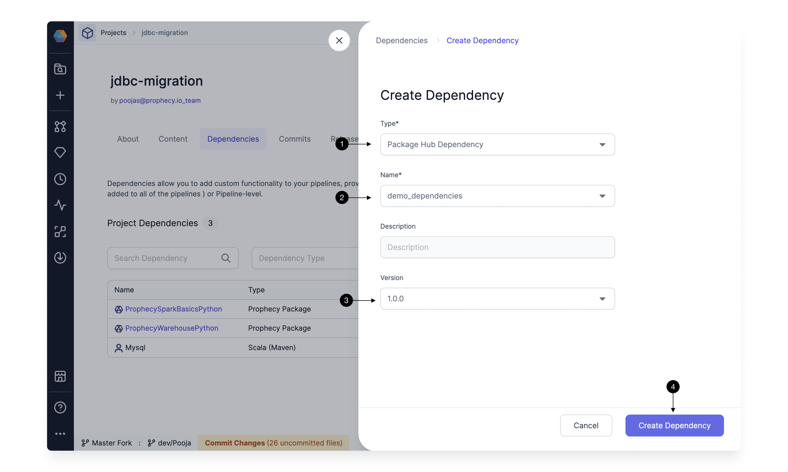

If you use external CI-CD tools like Github or Jenkins to merge and release your projects, you can use the release tags created externally in Prophecy for deployment and dependencies.

Any Release tags created externally, will also be pulled in Prophecy and Users can check the Release tags from the Releases and Deployments page as shown below
The tags which are created externally, will show a Tag **(1) External** on them. Click on the **(2) Refresh** button, to refresh the list of tags, if your latest tags are not showing.

These tags can be now directly deployed via Prophecy or added as a dependency to an existing Project.

## Deploying an External Release Tag

To deploy an existing tag, click on the **(1) Deploy** button, in the `...` in the Top right corner.

This opens up the Deploy dialog as shown below. Simply **(1) Choose a version**, you wish to deploy. Once you select a version, the table below will show which are going to get modified on what Fabrics.
You can optionally override the Fabric for all Jobs, or if you have enabled Selective Job deployment, can pick the Jobs you wish to deploy. More details about these settings [here](./deployment.md#deploy)

Click on **(2) Deploy** to start the deployment. The progress of the deployment is shown as below.

You can access these deployment logs from the [Deployment History Page](./deployment.md#deployment-history) too.

## Using External Release tag for Dependencies

You can also use these tags created externally, as a dependency in your Projects. To add as dependency, simply go to the **(1) Dependencies** tab in the Project you want to add dependency in.
Click on the **(2) Add dependency** button, to add a new dependency.

This opens up the form to add a new dependency. You can select the **(1) Type** as Package Hub Dependency, select the **(2) Name** of the project, and pick the **(3) Version** you want as dependency.
Click **(4) Create Dependency** to save.

Similarly, you can also edit the dependency and update the version to an externally released version.
