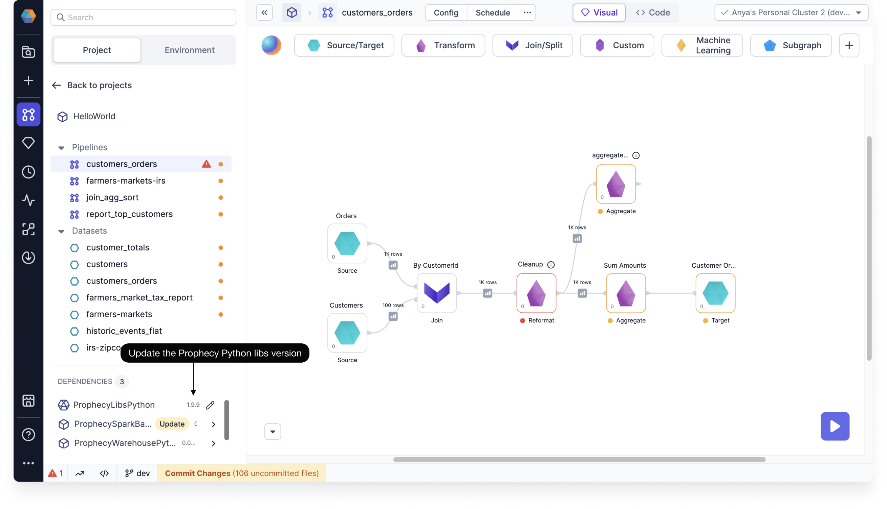
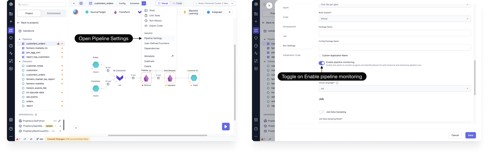

To use Pipeline Monitoring, you must enable it by updating the Prophecy Library version in your project dependencies, and turn on the Pipeline Monitoring flag in Pipeline Settings.

## Update Prophecy Library version

Pipeline Monitoring requires your project to be on the follow versions:

- Prophecy Scala libs version 8.0.23 or above.
- Prophecy Python libs version 1.9.9 or above.

You can check your **ProphecyLibsPython** version under **Dependencies**.

- If your project's Prophecy Scala and Python libs versions are out of date, **Update** them.

If you have uncommitted changes in your pipelines, you may be prompted to either **Commit & Save** or **Save Without Committing**. The update will affect all pipelines in your project.

For an up-to-date list of Prophecy versions and libraries, see [Version Chart](//release_notes/version_chart/version_chart).

## Turn on the Pipeline Monitoring flag

By default, Pipeline Monitoring is enabled for all new pipelines. For existing pipelines, the feature is turned off by default in order to prevent unexpected changes in your generated pipeline code.

- To turn on Pipeline Monitoring, you must toggle on **Enable Pipeline monitoring** in **Pipeline Settings**.

You can check the code view to see added instrument annotations that adds all of the details for monitoring your pipeline.
