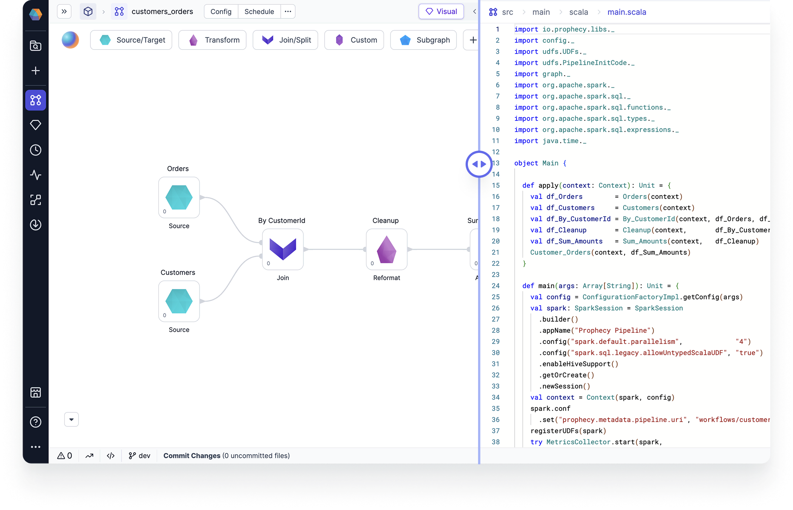

Pipeline development is foundational to data engineering. Prophecy simplifies the development of Spark-based data pipelines with a visual interface that automatically compiles pipelines into production-ready code.



Learn more about pipeline development in the following pages.

```mdx-code-block
import DocCardList from '@theme/DocCardList';
import {useCurrentSidebarCategory} from '@docusaurus/theme-common';

<DocCardList items={useCurrentSidebarCategory().items}/>
```
