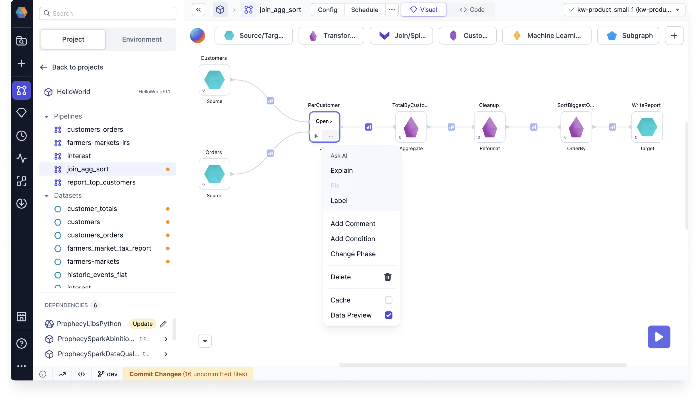
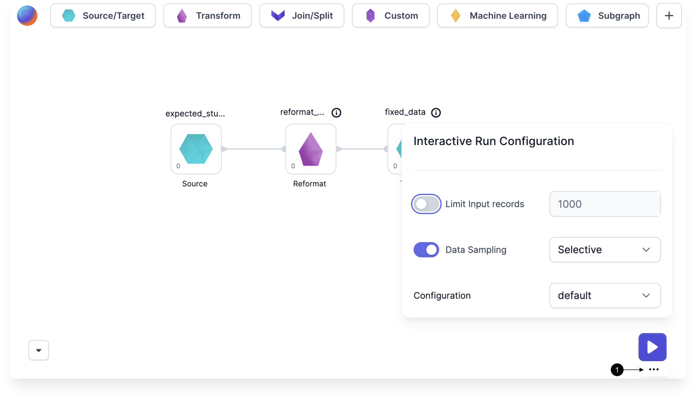
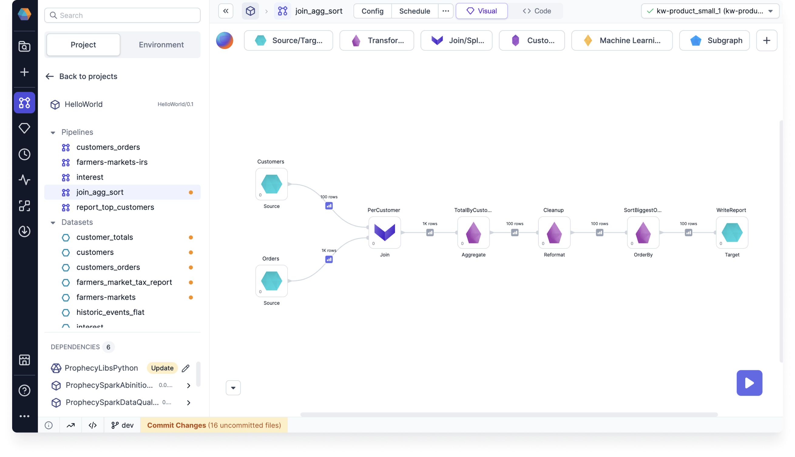
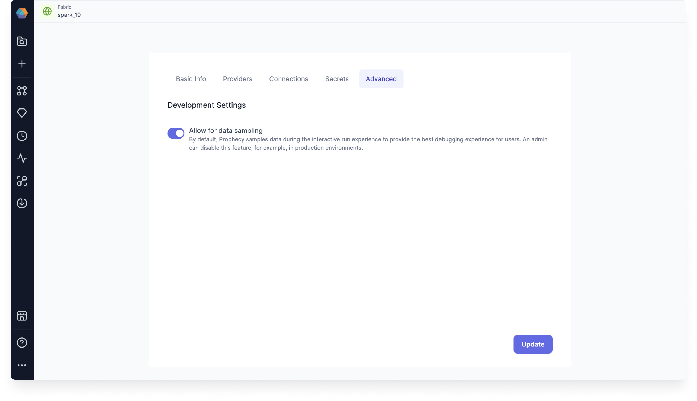

Prophecy gives you control over when and where data samples are generated during interactive pipeline execution. This helps you optimize for speed, visibility, or compatibility with your fabric setup.

You can customize data sampling at three levels:

- **Gem level**: Turn sampling on or off for individual or multiple gems.
- **Pipeline level**: Set the sampling mode used during interactive runs.
- **Fabric level**: Enable or disable data sampling for pipelines running on particular fabrics.

This page describes how to set up and use data samples for your use cases.

## Data sampling modes

Prophecy provides the following data sampling modes.

| Mode                            | Samples generated                                                         | Use case                           |
| ------------------------------- | ------------------------------------------------------------------------- | ---------------------------------- |
| **All** (default)               | After every gem, excluding Target gems.                                   | Full visibility                    |
| **Selective** (Databricks only) | When **Data Preview** enabled per gem. [Learn more](#selective-sampling). | Full control per gem               |
| **Sources**                     | Only after Source gems.                                                   | Focus on inputs                    |
| **Targets**                     | Only before Target gems.                                                  | Focus on outputs                   |
| **IO**                          | Only after Sources and before Targets (not between intermediate gems).    | High-level input/output inspection |

### Selective sampling

Selective data sampling gives you granular control by letting you enable or disable data samples for individual gems. To control data sampling for gems:

- **Single gem**: Select the Data Preview checkbox in the gem's [action menu](/engineers/gems).
- **Multiple gems**: Select multiple gems by dragging, then click the Data Preview button in the bottom menu.

When Data Preview is disabled for a gem, its output appears pale after pipeline execution, indicating no sample was generated. Click the pale output to load the data sample on demand. The output icon will then display in normal bold colors.

:::tip
We recommend using Selective sampling mode for all Databricks users. It is faster and more powerful than the default mode. Selective sampling is also important when working with [Databricks UC standard clusters](/enterprise/fabrics/Spark-fabrics/databricks/ucshared), as other sampling modes only generate data samples on edge nodes for this access mode.
:::

Modify the behavior of selective sampling

Selectively-generated samples load up to 10,000 rows (or 2 MB payload) by default. Set the following environment variables in Databricks to modify this behavior:

- `EXECUTION_DATA_SAMPLE_LOADER_MAX_ROWS`: Max number of rows (default is 10,000 rows).
- `EXECUTION_DATA_SAMPLE_LOADER_PAYLOAD_SIZE_LIMIT`: Max payload size (default 2 MB).
- `EXECUTION_DATA_SAMPLE_LOADER_CHAR_LIMIT`: Per column character limit (default 200 KB). Values exceeding the limit are truncated.

## Interactive run configuration

You can adjust data sampling settings for each pipeline through the **Interactive Run Configuration** panel. You can also access the same settings in [Pipeline Settings](/engineers/pipeline-settings#run-settings).

1. Hover the large **play** button in the canvas.
1. Click on the **ellipses** that appears on hover.
1. Toggle data sampling on or off.
1. When data sampling is on, select your preferred mode from the **Data Sampling** dropdown.

This mode will be used when you interactively run the pipeline.

## Cached interims

When you change data sampling settings and re-run a pipeline, some data samples may appear grayed out. These cached samples are from previous runs and may not reflect your current data or pipeline changes.

## Fabric settings

In a fabric, you can enable or disable data sampling and override pipeline-level settings when a pipeline runs on that fabric. You can access this option in the **Advanced** tab of a fabric. A common use case is preventing sample data generation in **production** pipelines.

By default, only team admins can access the Advanced tab in a fabric. However, there are two flags you can set in your deployment to change this behavior:

- `ALLOW_FABRIC_ACCESS_CLUSTER_ADMIN`: Grants cluster admins full access to fabrics, even if they are not team admins.
- `DISALLOW_FABRIC_CODEDEPS_UPDATE_TEAM_ADMIN`: Prevents team admins from modifying the data sampling settings within a fabric.
