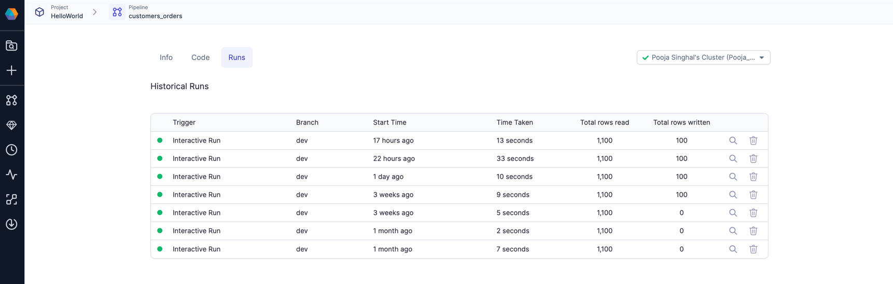
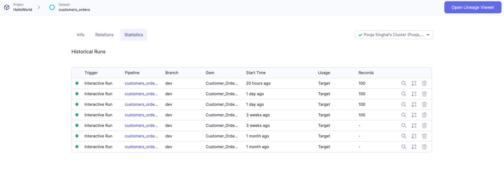
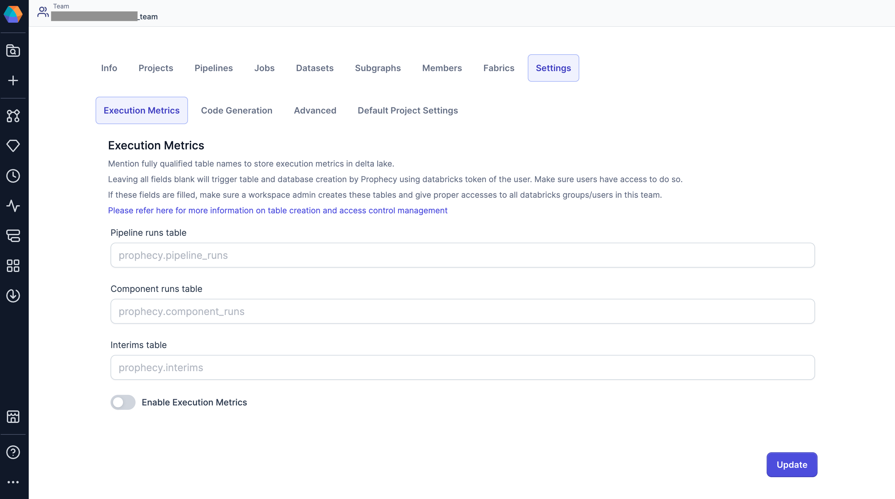

Execution metrics help you monitor and analyze your pipeline performance by tracking data including records and bytes processed, pipeline execution time, and data samples (interims) between pipeline components.

When enabled, these metrics are automatically collected during pipeline runs and stored in your data environment, where you can review them later through the Prophecy interface.

:::note
Execution metrics are available for Spark pipelines only.
:::

## Access control

Execution metrics are controlled at the team level. This means:

- Team admins can enable or disable execution metrics for their team
- Metrics are only captured for pipelines running on fabrics assigned to teams with execution metrics enabled
- All team members can view execution metrics for pipelines they have access to

If execution metrics are disabled for a team, data will not be collected for any pipelines running on that team's fabrics.

## Storage architecture

Execution metrics storage varies by execution environment, with different capabilities for automatic table creation and storage options.

### What execution metrics are stored?

There are three execution metrics tables that store data for pipelines, individual components, and the generated data samples, also known as interims.

- **Pipeline runs table**: The pipeline metrics table that contains metrics and code for pipeline runs
- **Component runs table**: The component (dataset) metrics table that contains metrics for individual component runs
- **Interims table**: The interims table that contains samples of data, depending on the interim mode selected

Prophecy can automatically create these tables for you when execution metrics are enabled for certain execution environments. Alternatively, you can define your own tables in any supported format (Delta, Parquet, ORC, Avro) and point Prophecy to them. Learn how to configure the storage location for execution metrics in the [Enable execution metrics](#enable-execution-metrics) section.

### Databricks

By default, Prophecy automatically creates and stores execution metrics in Delta tables within your Databricks workspace. These are created in the workspace's default storage and uses configured metastore (Unity Catalog, Hive metastore, etc.).

If preferred, you can specify custom database and table names where you want to store the data.

:::note
Reading execution metrics from High-Concurrency Clusters with Table-ACL enabled is supported in Databricks runtimes 11.0 or below. Execution metrics are **not available** for `Shared mode` clusters (both normal workspaces and Unity Catalog workspaces). You should see an error when trying to get historical runs of pipelines/jobs executed on `Shared mode` clusters.

Additionally, for clusters with table ACL enabled, you may have limited access on catalogs, schemas, and tables. For this case, we recommend you set up your execution metrics tables manually and point to them in Prophecy.
:::

#### Store as Delta tables

The following are sample `CREATE TABLE` commands for tables using Delta.

These are suitable for Databricks or if your metastore supports Delta tables.

<details>
<summary>Create pipeline metrics table</summary>

```sql
  CREATE TABLE IF NOT EXISTS <database>.<pipeline_runs_table_name>
  (
      uid STRING NOT NULL COMMENT 'Unique identifier for the pipeline run',
      pipeline_uri STRING NOT NULL COMMENT 'URI of the pipeline',
      job_uri STRING COMMENT 'URI of the job associated with the pipeline run',
      job_run_uid STRING COMMENT 'Unique identifier for the job run',
      task_run_uid STRING COMMENT 'Unique identifier for the task run',
      status STRING COMMENT 'Status of the pipeline run',
      fabric_uid STRING NOT NULL COMMENT 'Unique identifier for the fabric',
      time_taken LONG COMMENT 'Time taken for the pipeline run',
      rows_read LONG COMMENT 'Number of rows read during the pipeline run',
      rows_written LONG COMMENT 'Number of rows written during the pipeline run',
      created_at TIMESTAMP COMMENT 'Timestamp when the pipeline run was created',
      created_by STRING NOT NULL COMMENT 'Prophecy user ID who created the pipeline run',
      run_type STRING COMMENT 'Type of the run - Interactive, Adhoc, or Scheduled',
      input_datasets ARRAY<STRING> COMMENT 'List of input datasets',
      output_datasets ARRAY<STRING> COMMENT 'List of output datasets',
      workflow_code MAP<STRING, STRING> COMMENT 'Workflow code associated with the pipeline run',
      expired BOOLEAN COMMENT 'Indicates if the pipeline run has expired',
      branch STRING COMMENT 'Git entity information for the pipeline run. Can be branch name or release tag',
      pipeline_config STRING COMMENT 'Pipeline configuration details',
      user_config STRING COMMENT 'User configuration details',
      expected_interims INT COMMENT 'Expected number of interims',
      actual_interims INT COMMENT 'Actual number of interims',
      logs STRING COMMENT 'Logs for the pipeline run'
  )
  USING DELTA
  PARTITIONED BY (fabric_uid, pipeline_uri, created_by)
  LOCATION '<table_path>'
  TBLPROPERTIES (delta.autoOptimize.optimizeWrite = true, delta.autoOptimize.autoCompact = true)
```

</details>

<details>
<summary>Create component metrics table</summary>

```sql
  CREATE TABLE IF NOT EXISTS <database>.<component_runs_table_name>
  (
      uid STRING NOT NULL COMMENT 'Unique identifier for the component run',
      component_uri STRING NOT NULL COMMENT 'URI of the component',
      pipeline_uri STRING COMMENT 'URI of the pipeline associated with the component run',
      pipeline_run_uid STRING NOT NULL COMMENT 'Unique identifier for the pipeline run',
      fabric_uid STRING NOT NULL COMMENT 'Unique identifier for the fabric',
      component_name STRING COMMENT 'Name of the component',
      interim_component_name STRING COMMENT 'Name of the component holding interim for this component. Targets are supplied interims by the upstream component',
      component_type STRING COMMENT 'Type of the component - Source, Reformat, Target, etc.',
      interim_subgraph_name STRING COMMENT 'Name of the graph where interim component resides',
      interim_process_id STRING COMMENT 'Identifier for the interim process',
      interim_out_port STRING COMMENT 'Output port for the interim component',
      created_at TIMESTAMP COMMENT 'Timestamp when the component run was created',
      created_by STRING NOT NULL COMMENT 'Identifier of the user who created the component run',
      records LONG COMMENT 'Number of records processed by the component. Represents the aggregated amount of all rows read through this component. Rows can be re-read if there were multiple downstream components or if Spark ran the same plan multiple times',
      bytes LONG COMMENT 'Number of bytes processed by the component',
      partitions LONG COMMENT 'Number of partitions of the data processed by the component',
      expired BOOLEAN COMMENT 'Indicates if the component run has expired',
      run_type STRING COMMENT 'Type of the run',
      job_uri STRING COMMENT 'URI of the job associated with the component run',
      branch STRING COMMENT 'Branch information for the component run',
      gem_name STRING COMMENT 'Hierarchical component name',
      process_id STRING COMMENT 'Process identifier of the gem',
      gem_type STRING COMMENT 'Type of the gem',
      input_gems ARRAY<STRUCT<gem_name: STRING, from_port: STRING, to_port: STRING, num_rows: LONG>> COMMENT 'List of input gems with details',
      output_gems ARRAY<STRUCT<gem_name: STRING, from_port: STRING, to_port: STRING, num_rows: LONG>> COMMENT 'List of output gems with details',
      in_ports ARRAY<STRING> COMMENT 'List of input ports',
      out_ports ARRAY<STRING> COMMENT 'List of output ports',
      num_rows_output LONG COMMENT 'Number of rows output by the component. Represents the maximum number of rows read through this component across Spark plans and possible re-runs',
      stdout ARRAY<STRUCT<content: STRING, time: LONG>> COMMENT 'Standard output logs',
      stderr ARRAY<STRUCT<content: STRING, time: LONG>> COMMENT 'Standard error logs',
      start_time LONG COMMENT 'Start time of the component run',
      end_time LONG COMMENT 'End time of the component run',
      state STRING COMMENT 'State of the component run',
      exception STRUCT<exception_type: STRING, msg: STRING, cause_msg: STRING, stack_trace: STRING, time: LONG> COMMENT 'Exception details if any occurred during the component run'
  )
  USING DELTA
  PARTITIONED BY (fabric_uid, component_uri, created_by)
  LOCATION '<table_path>'
  TBLPROPERTIES (delta.autoOptimize.optimizeWrite = true, delta.autoOptimize.autoCompact = true)
```

</details>

<details>
<summary>Create interims table</summary>

```sql
  CREATE TABLE IF NOT EXISTS <database>.<interims_table_name>
  (
      uid STRING NOT NULL COMMENT 'Unique identifier for the interim',
      interim STRING COMMENT 'Interim data or information',
      created_by STRING COMMENT 'Identifier of the user who created the interim',
      created_at TIMESTAMP COMMENT 'Timestamp when the interim was created',
      fabric_uid STRING COMMENT 'Unique identifier for the fabric'
  )
  USING DELTA
  PARTITIONED BY (created_by, fabric_uid)
  LOCATION '<table_path>'
  TBLPROPERTIES (delta.autoOptimize.optimizeWrite = true, delta.autoOptimize.autoCompact = true)
```

</details>

<details>
<summary>Grant permissions on these tables</summary>

```sql
  GRANT USAGE ON SCHEMA <database> TO group1;
  GRANT USAGE ON SCHEMA <database> TO group2;

  GRANT SELECT ON <database.component-runs-table> TO group1;
  GRANT SELECT ON <database.component-runs-table> TO group2;
  GRANT MODIFY ON <database.component-runs-table> TO group1;
  GRANT MODIFY ON <database.component-runs-table> TO group2;

  GRANT SELECT ON <database.pipeline-runs-table> TO group1;
  GRANT SELECT ON <database.pipeline-runs-table> TO group2;
  GRANT MODIFY ON <database.pipeline-runs-table> TO group1;
  GRANT MODIFY ON <database.pipeline-runs-table> TO group2;

  GRANT SELECT ON <database.interims-table> TO group1;
  GRANT SELECT ON <database.interims-table> TO group2;
  GRANT MODIFY ON <database.interims-table> TO group1;
  GRANT MODIFY ON <database.interims-table> TO group2;
```

</details>

### Amazon EMR

Prophecy cannot automatically create tables in AWS. You must create the required tables before enabling execution metrics.

- **Hive Metastore**: Default storage location for execution metrics.
- **AWS Glue**: Tables can be stored in Glue Data Catalog with S3 as the underlying storage. When using Glue databases with S3 storage, EMR or EMR Serverless instances must be in the same AWS region as your Glue tables.

#### Store tables as Parquet

The following are sample `CREATE TABLE` commands for tables using Parquet.

These are suitable for Livy or for your Hive metastore in Hadoop setups.

<details>
<summary>Create pipeline metrics table</summary>

```sql
  CREATE TABLE IF NOT EXISTS <database>.<pipeline_runs_table_name>
  (
      uid STRING NOT NULL COMMENT 'Unique identifier for the pipeline run',
      pipeline_uri STRING NOT NULL COMMENT 'URI of the pipeline',
      job_uri STRING COMMENT 'URI of the job associated with the pipeline run',
      job_run_uid STRING COMMENT 'Unique identifier for the job run',
      task_run_uid STRING COMMENT 'Unique identifier for the task run',
      status STRING COMMENT 'Status of the pipeline run',
      fabric_uid STRING NOT NULL COMMENT 'Unique identifier for the fabric',
      time_taken LONG COMMENT 'Time taken for the pipeline run',
      rows_read LONG COMMENT 'Number of rows read during the pipeline run',
      rows_written LONG COMMENT 'Number of rows written during the pipeline run',
      created_at TIMESTAMP COMMENT 'Timestamp when the pipeline run was created',
      created_by STRING NOT NULL COMMENT 'Prophecy user ID who created the pipeline run',
      run_type STRING COMMENT 'Type of the run - Interactive, Adhoc, or Scheduled',
      input_datasets ARRAY<STRING> COMMENT 'List of input datasets',
      output_datasets ARRAY<STRING> COMMENT 'List of output datasets',
      workflow_code MAP<STRING, STRING> COMMENT 'Workflow code associated with the pipeline run',
      expired BOOLEAN COMMENT 'Indicates if the pipeline run has expired',
      branch STRING COMMENT 'Git entity information for the pipeline run. Can be branch name or release tag',
      pipeline_config STRING COMMENT 'Pipeline configuration details',
      user_config STRING COMMENT 'User configuration details',
      expected_interims INT COMMENT 'Expected number of interims',
      actual_interims INT COMMENT 'Actual number of interims',
      logs STRING COMMENT 'Logs for the pipeline run'
  ) stored as parquet
  PARTITIONED BY (fabric_uid, pipeline_uri, created_by)
```

</details>

<details>
<summary>Create components metrics table</summary>

```sql
  CREATE TABLE IF NOT EXISTS <database>.<component_runs_table_name>
  (
      uid STRING NOT NULL COMMENT 'Unique identifier for the component run',
    component_uri STRING NOT NULL COMMENT 'URI of the component',
    pipeline_uri STRING COMMENT 'URI of the pipeline associated with the component run',
    pipeline_run_uid STRING NOT NULL COMMENT 'Unique identifier for the pipeline run',
    fabric_uid STRING NOT NULL COMMENT 'Unique identifier for the fabric',
    component_name STRING COMMENT 'Name of the component',
    interim_component_name STRING COMMENT 'Name of the component holding interim for this component. Targets are supplied interims by the upstream component',
    component_type STRING COMMENT 'Type of the component - Source, Reformat, Target, etc.',
    interim_subgraph_name STRING COMMENT 'Name of the graph where interim component resides',
    interim_process_id STRING COMMENT 'Identifier for the interim process',
    interim_out_port STRING COMMENT 'Output port for the interim component',
    created_at TIMESTAMP COMMENT 'Timestamp when the component run was created',
    created_by STRING NOT NULL COMMENT 'Identifier of the user who created the component run',
    records LONG COMMENT 'Number of records processed by the component. Represents the aggregated amount of all rows read through this component. Rows can be re-read if there were multiple downstream components or if Spark ran the same plan multiple times',
    bytes LONG COMMENT 'Number of bytes processed by the component',
    partitions LONG COMMENT 'Number of partitions of the data processed by the component',
    expired BOOLEAN COMMENT 'Indicates if the component run has expired',
    run_type STRING COMMENT 'Type of the run',
    job_uri STRING COMMENT 'URI of the job associated with the component run',
    branch STRING COMMENT 'Branch information for the component run',
    gem_name STRING COMMENT 'Hierarchical component name',
    process_id STRING COMMENT 'Process identifier of the gem',
    gem_type STRING COMMENT 'Type of the gem',
    input_gems ARRAY<STRUCT<gem_name: STRING, from_port: STRING, to_port: STRING, num_rows: LONG>> COMMENT 'List of input gems with details',
    output_gems ARRAY<STRUCT<gem_name: STRING, from_port: STRING, to_port: STRING, num_rows: LONG>> COMMENT 'List of output gems with details',
    in_ports ARRAY<STRING> COMMENT 'List of input ports',
    out_ports ARRAY<STRING> COMMENT 'List of output ports',
    num_rows_output LONG COMMENT 'Number of rows output by the component. Represents the maximum number of rows read through this component across Spark plans and possible re-runs',
    stdout ARRAY<STRUCT<content: STRING, time: LONG>> COMMENT 'Standard output logs',
    stderr ARRAY<STRUCT<content: STRING, time: LONG>> COMMENT 'Standard error logs',
    start_time LONG COMMENT 'Start time of the component run',
    end_time LONG COMMENT 'End time of the component run',
    state STRING COMMENT 'State of the component run',
    exception STRUCT<exception_type: STRING, msg: STRING, cause_msg: STRING, stack_trace: STRING, time: LONG> COMMENT 'Exception details if any occurred during the component run'
  ) stored as parquet
  PARTITIONED BY (fabric_uid, component_uri, created_by)
```

</details>

<details>
<summary>Create interims table</summary>

```sql
  CREATE TABLE IF NOT EXISTS <database>.<interims_table_name>
  (
      uid STRING NOT NULL COMMENT 'Unique identifier for the interim',
      interim STRING COMMENT 'Interim data or information',
      created_by STRING COMMENT 'Identifier of the user who created the interim',
      created_at TIMESTAMP COMMENT 'Timestamp when the interim was created',
      fabric_uid STRING COMMENT 'Unique identifier for the fabric'
  ) stored as parquet
  PARTITIONED BY (created_by, fabric_uid)
```

</details>

## View execution metrics

You can find execution metrics in the historical runs of pipelines and datasets.

### Pipeline execution metrics

1. From the **Metadata** page in Prophecy, open your project.
1. Click on **Content**.
1. Open a pipeline that you want to inspect.
1. Navigate to the **Runs** tab. Each row corresponds to one run of the pipeline.
1. Click on a particular run and see the interims for that run, as well as metrics like rows read, rows written, time taken, etc.



### Dataset execution metrics

1. From the **Metadata** page in Prophecy, open your project.
1. Click on **Content**.
1. Open a dataset that you want to inspect.
1. Navigate to the **Statistics** tab. Each row corresponds to one pipeline run where this dataset was used.
1. Click on a particular run and see more detailed insights on your data, along with a preview.



## Enable execution metrics

### Prerequisites

Before enabling execution metrics for a team, ensure the following requirements are met:

- **Team access**: You must be a team admin for the team where execution metrics will be enabled.
- **Execution environment**: Execution metrics are only available for pipelines running on Spark.
- **For EMR environments**: Prophecy cannot automatically create tables in AWS. You must create the required tables in advance to store execution metrics.

### Procedure

Use the following steps to configure execution metrics for a team.

1. Open the **Metadata** page of the Prophecy UI.
1. Navigate to the **Teams** tab.
1. Open the team for which you would like to enable execution metrics.
1. Navigate to the **Settings > Execution Metrics** subtab.
1. Turn on the **Enable Execution Metrics** toggle.
1. If applicable, add your table to the **Pipeline runs table**: `<database>.<pipeline-table>`
1. If applicable, add your table to the **Component runs table**: `<database>.<component-table>`
1. If applicable, add your table to the **Interims table**: `<database>.<interim-table>`
1. Click **Update** to save your changes.


