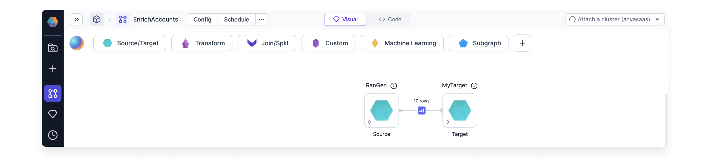

import Requirements from '@site/src/components/gem-requirements';

<Requirements
  python_package_name="ProphecySparkBasicsPython"
  python_package_version="0.2.32+"
  scala_package_name=""
  scala_package_version=""
  scala_lib=""
  python_lib=""
  uc_single="14.3+"
  uc_shared="15.4+"
  livy="Not Supported"
/>

Synthetic data helps you test, validate, and optimize your pipelines performance before you use production data. This ensures that your pipeline can handle various data formats, structures, and edge cases effectively, which minimizes potential issues in a live environment.

You can create a wide range of mock data using any column name and an array of data types. For example, you can generate the following browser history data:

:::info
The Data Generator gem can only be a **Source** gem. It cannot be a Target gem.
:::

## Cluster requirements

Create a fabric and configure the [Job Size](/docs/enterprise/fabrics/Spark-fabrics/databricks/databricks.md), or login to an existing Spark cluster UI. To create a fabric and configure the job size in the Spark Cluster UI:

1. Login to your Databricks account.
1. Verify your Databricks Runtime uses Python version >= 3.8.

   For example, [Databricks Runtime 12.2 LTS](https://docs.databricks.com/en/release-notes/runtime/12.2lts.html) uses Python 3.9.19. If you are using Databricks Runtime 12.2+, the Python version meets this requirement.

## Prophecy requirements

Open a Prophecy project and upgrade the `ProphecySparkBasicsPython` Dependency to `0.2.32` or later.

:::note
Connecting a Prophecy project to a Spark cluster with a different dependency version prompts the Spark cluster to restart.
:::

:::caution Caution
If you use two Prophecy projects with the same Spark cluster, Spark restarts the cluster when each project attaches to the cluster, unless the `ProphecySparkBasicsPython` and `ProphecyLibsPython` versions match across both projects.

_Solution:_ Upgrade all your Prophecy projects to the same `ProphecySparkBasicsPython` and `ProphecyLibsPython` versions, or use separate Spark clusters.
:::

## Source properties

The Source gem requires the following properties.

| Property name              | Description                                                                                              | Default       |
| -------------------------- | -------------------------------------------------------------------------------------------------------- | ------------- |
| Provider                   | Type of random data to generate. For a list of the possible data providers, see [Providers](#providers). | `Random Name` |
| Column Name                | Name for the output column.                                                                              | None          |
| Data Type                  | Data type of the output column.                                                                          | `String`      |
| Null Percentage (Optional) | Percent of values to populate as null in the generated column based on the row count.                    | None          |

### Providers

Prophecy offers the following data providers.

| Data Provider             | Description                                                                                                                                                                                                                                                                  |
| ------------------------- | ---------------------------------------------------------------------------------------------------------------------------------------------------------------------------------------------------------------------------------------------------------------------------- |
| Random Name               | Generates random names. Select `Full Name`, `First Name`, or `Last Name` as the sub-types.                                                                                                                                                                                   |
| Random Address            | Generates random addresses.                                                                                                                                                                                                                                                  |
| Random Email              | Generates random emails.                                                                                                                                                                                                                                                     |
| Random Phone Number       | Generates random phone numbers based on the pattern you specify or the default pattern.  For example, you can specify the pattern for a phone number as (###) ###-####.                                                                                                  |
| Random String UUID        | Generates random UUID values as a string.                                                                                                                                                                                                                                    |
| Random Boolean Values     | Generates random boolean values.                                                                                                                                                                                                                                             |
| Random Integer Numbers    | Generates random integers within the range from the `Start Value` to the`End Value` you specify.                                                                                                                                                                             |
| Random Elements From List | Generates random values from the list of values you specify.                                                                                                                                                                                                                 |
| Random Date               | Generates random dates within the range you specify.                                                                                                                                                                                                                         |
| Random DateTime           | Generates random datetime values within the range you specify.                                                                                                                                                                                                               |
| Random Foreign Key Values | Randomly picks values from the foreign key column you specify.  Select another table to act as the reference table and provide the location (e.g. `catalog` or `database`).  Select any column from the reference table to designate as the `Reference Column Name`. |

## Store the data

By default, the Source gem does not save the newly generated data. To save the data, store the data in a Target gem:

1. Create a Target gem.

   

1. Connect your Source gem to your Target gem.

   

1. Configure the `Write Mode` property for the Target gem.

   This is **very important** because there is a **new random seed** each time you run the Source gem.

   

:::info
To see if Prophecy supports this gem in the Unity Catalog standard access mode clusters, see [Unity Catalog standard cluster support](docs/enterprise/fabrics/Spark-fabrics/databricks/UCShared.md).
:::
