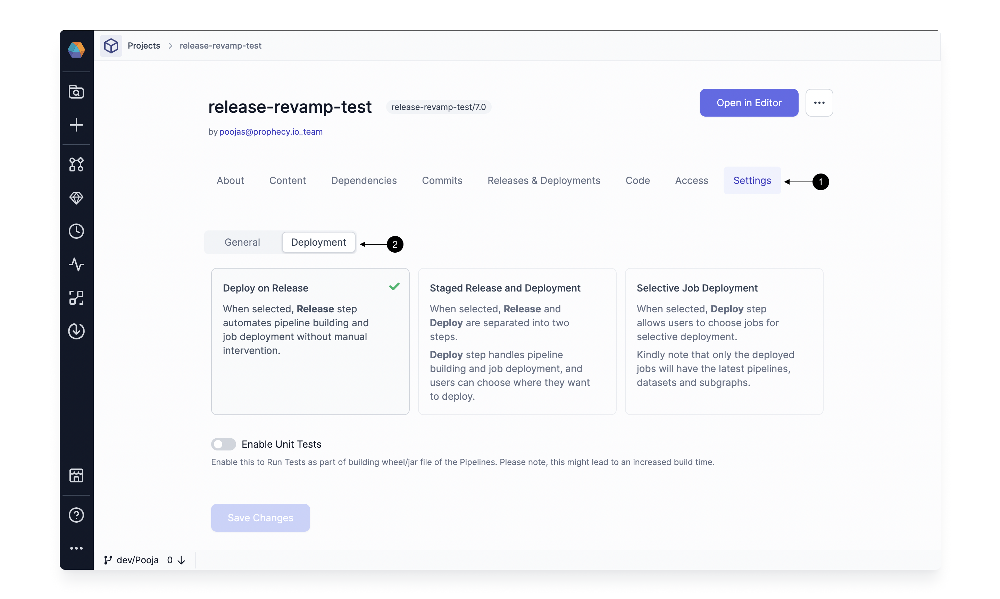
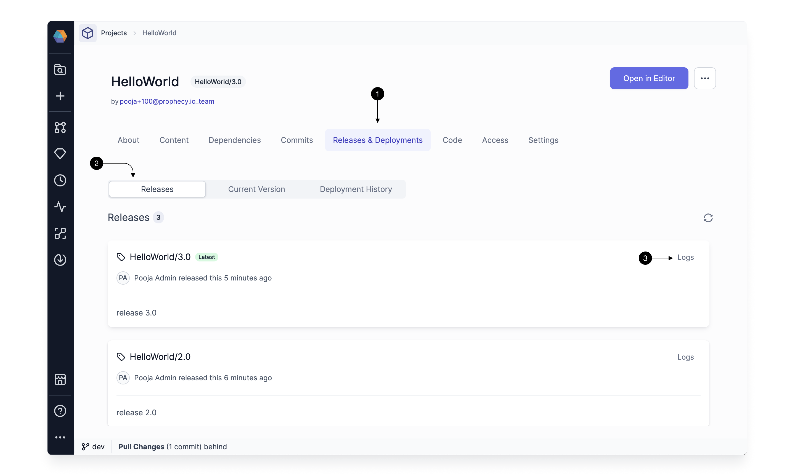

Once you have developed and tested your custom components like gems, pipelines, models, or jobs in Prophecy, the next step is to make them available for use. This involves Releasing and Deploying them to the respective environments.

You can Release and Deploy via Prophecy UI or you can use [Prophecy Build Tool](/engineers/prophecy-build-tool) CLI to integrate with any other CI-CD tools. Lets see how you can do it via the Prophecy UI below.

## Requirements

You must be a [team admin](/teams) to release and deploy a project.

## Overview

What happens when you click **Release and Deploy** in the [Git workflow](/engineers/git-workflow) of your project?

### Release

The release step ensures that your new project code is synced to your Git repository.

- A [Git tag](https://git-scm.com/book/en/v2/Git-Basics-Tagging) is created with the version you specify.
- The new project version is pushed to your Git repository.

### Deploy

The deploy step builds all the pipelines and gems, uploads the artifacts, and schedules all the jobs in the project to the respective environments.

- Pipelines are compiled and built into an artifact (Wheel file for Python and Jar file for Scala). These artifacts are then uploaded to your environment.
- Gems (including custom gems) are built and uploaded to an internal artifactory. They aren't directly copied to your environments, as they are used in generating code for the pipelines, not during job/pipeline execution. Note, the code for gems do get committed to your Git repo as part of the project.
- Depending on the type of job (Databricks or Airflow), jobs are copied to their respective environments as JSON files for Databricks jobs and as Python DAGs for Airflow.

:::note
There are no specific deployment steps needed for other project entities.
:::

## Advanced Settings

For most users, a regular project release takes care of both the release and deployment of pipelines, gems, and jobs to respective environments. However, if you want more control over the deployment process, you can update the project settings.

1. Open the **Settings** page in the project metadata.
1. Open the **Deployment** subtab.
1. Change the deployment mode or enable/disable unit testing.

### Deployment modes

Deployment modes dictate how the release and deploy steps will be controlled.

- **Deploy on Release (default)**: Release and deploy in a single step.
- **Staged Release and Deployment**: Separate release and deploy into two separate steps.
- **Selective Job Deployment**: Select specific jobs during the Deploy step. Use this if you have many jobs in a project and only want to deploy a few at a time. _Only the deployed jobs will use the latest versions of pipelines, datasets, and subgraphs._

### Unit tests

Writing good [unit tests](/engineers/unit-tests) is key for data pipeline quality and management. When you enable unit tests for deployment, unit tests will run as part of pipeline builds. This might lead to a slight increase in the build time.

## History

You can view the release and deployment history in the **Releases & Deployments** tab of your project metadata.

The page includes the following subtabs.

- **Releases**: Find a history of releases including information about the author, creation time, and latest tag. You can also view the logs of the latest deployment associated with that tag.
- **Current Version**: View the current state of all deployed jobs per environment. Select the fabric to view the list of all jobs deployed in that environment, along with their versions and deployment logs.
- **Deployment History**: See the history of all past deployments, along with the time that it was deployed and related logs.

## What's next

Follow the tutorial [Develop and deploy a project](/engineers/develop-and-deploy) to try to deploy a project yourself!
