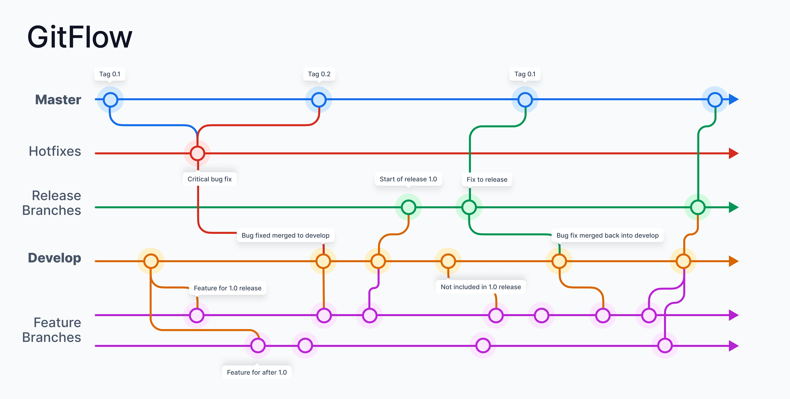

## Overview

To minimize and ideally avoid conflicts in your pull requests:

1. Have each user create their own feature branches.
1. Keep feature branches modular, which means:

   - Only modify assets as needed on your feature branch
   - Avoid modifying assets that other users are modifying in parallel feature branches

## Deep dive: Branching Strategy

Use a proper Git branching strategy that aligns with your team's goals.

### Small teams

For small teams:

1. Have a main branch for developers to merge in their changes.
1. (Optional) Create a release branch to use as a staging area for releases across different environments.
1. Check out a new feature branch off the main branch for any new features.
1. Pull in the latest changes and resolve all merge conflicts on your feature branch before merging it into the main branch.
1. Have one developer work on a pipeline at any given time.

   A Prophecy merge conflict resolution occurs at the entity level, and a pipeline is considered as a single entity.

1. Have your admin enable pull requests for specific projects.

   This encourages teams to perform code reviews and collaborate, which ensures higher code quality and fewer bugs.

### Large teams

For large teams with rigid and separate execution environments, and promotion processes:

1. Create the following branches: `main`, `release`, `develop`, and feature branches
1. Correspond each branch to different execution environment:

   For example, the following branches may correspond to the following execution environments:

   | Branch                  | Execution environment  |
   | ----------------------- | ---------------------- |
   | `main`, or `hotfix`     | `prod`                 |
   | `release`               | `uat`, `test`, or `qa` |
   | `develop`, or `feature` | `dev`                  |
