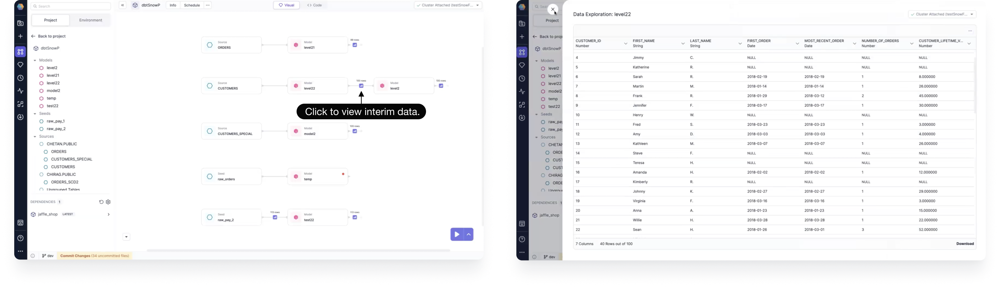
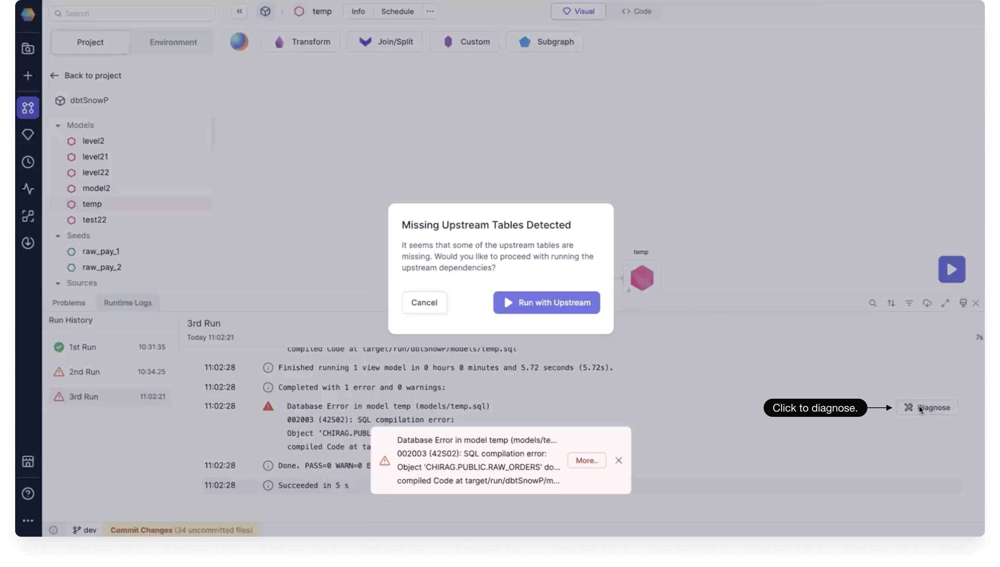

When you open a SQL project, the canvas shows the lineage view of your project. On this page, you can run the different flows and inspect the lineage.

## Lineage run

You can interactively run your project from the lineage page using the following steps.

1. Click the up arrow next to the play button to select which entities you'd like to include in your run. You can choose to run all seeds, all models, and all tests.

2. Once you've made your selection, click the Play button.

3. After the run has completed, you can click to view interim data.

:::info

The run order is determined by the topological sort of the entities and their dependencies.

:::

## Runtime logs

After a lineage run, runtime logs will be generated that include information about successful and failed runs. In the Runtime Logs panel, you can:

- Search
- Filter
- Sort
- Download logs
- Clear logs

Logs are grouped for easy viewing. You can click a grouping to expand it.

## Lineage diagnose

From the Runtime Logs panel, you can diagnose a failed run.

- On an opened failed run, click **Diagnose** next to the error log.

You are shown the error and a suggestion for a possible way to fix it.
