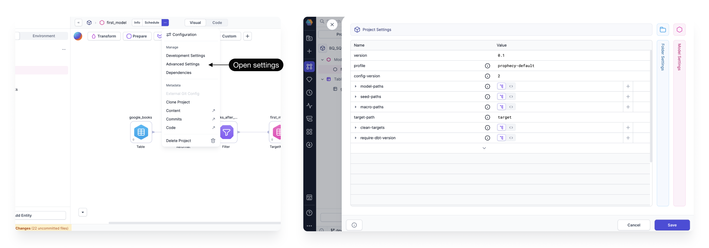

In Prophecy, a model comprises a set of gems that process data into one output. In other words, each model corresponds to a **single table** in your database.

Models leverage the dbt build system and can run on either SQL fabrics or Prophecy fabrics. To work with the dbt build, Prophecy saves each visual model as a SQL file in your project repository in Git. Prophecy’s visual interface supports SQL models only; if you’d like to define Python models, you must do so using the code interface.

## Create models

To add a new model to your project:

1. Open your project in the project editor.
1. Click **+ Add Entity** from the bottom of the **Project** tab in the left sidebar.
1. Click **Model**.
1. In the Add Model dialog, add a **Model Name**.
1. Review the path where the model will be saved in the project repository. In most cases, the default `model` path is sufficient.
1. Click **Create**.

This opens a new model canvas that is prepopulated with a target model. Note that the dbt framework restricts models to one target output.

:::tip
While you can develop models visually using gems, you can also write models directly in the code view, which is automatically synced with the visual view.
:::

## Compatible gems

Each gem in a model maps to a SQL statement. As you configure gems on the visual canvas, Prophecy automatically generates the corresponding SQL, determines whether to use a CTE or subquery for each step, and integrates your changes into the overall model.

Models run exclusively in your SQL warehouse and can only use gems supported in that environment. Gems that can run in SQL are marked with the following badge: <a href="https://docs.prophecy.io/core/prophecy-fabrics/">SQL Warehouse</a>

## Advanced settings

The **Advanced Settings** dialog lets you set dbt configurations at the project, folder, or model level. Each setting corresponds to standard dbt configurations, typically defined in a dbt project [YAML file](https://docs.getdbt.com/docs/build/projects#project-configuration). They cover properties such as materialization behavior, physical storage, metadata, and access controls.

Some settings reflect properties found in the target model gem. When you update a setting through the Advanced Settings panel, it automatically syncs with the corresponding target model gem when relevant.

To open the Advanced Settings:

1. Click **...** from the project header.
1. Select **Advanced Settings**.
1. Choose to edit the Project Settings, Folder Settings, or Model Settings.

:::note
Folder Settings only apply to directories that contain models.
:::

## Schedule models

To schedule model execution, set up [Databricks Jobs](/engineers/databricks-jobs) or Apache Airflow DAGs directly within Prophecy. Models can only be scheduled on [Analytics Engineer](/administration/project-types/) projects.

## Models vs pipelines

Models and pipelines are two different SQL project components. The following table describes the key differences between models and pipelines.

| Feature          | Models                                                           | Pipelines                                                                                           |
| ---------------- | ---------------------------------------------------------------- | --------------------------------------------------------------------------------------------------- |
| Execution Engine | Models run entirely on the SQL Warehouse.                        | Pipelines run on the SQL Warehouse and can also use Prophecy Automate.                              |
| Supported Gems   | Models support only gems that execute within the SQL Warehouse.  | Pipelines support additional gems that run in Prophecy Automate, such as the Email or REST API gem. |
| Data Sources     | Models can only use native tables/models as sources and targets. | Pipelines can use both native tables/models and external data sources.                              |
| Outputs          | Models are limited to a single output.                           | Pipelines can write multiple outputs.                                                               |
| Orchestration    | Models must be orchestrated using Databricks Jobs or Airflow.    | Pipelines can be orchestrated externally or natively using Prophecy Automate.                       |
| Exportability    | Models generate SQL code that can be run outside of Prophecy.    | Pipelines that include Prophecy Automate gems cannot be run outside of Prophecy.                    |

### Show underlying models

Many visual transformations in pipelines are compiled into models under the hood. If you are working on a pipeline, you can view and edit the code of [underlying dbt models](/analysts/pipeline-execution#execution-environment) in a pipeline. However, you cannot visually edit these underlying models.

To view these models, select **Show Models** from the **...** menu in the left sidebar of a project.

