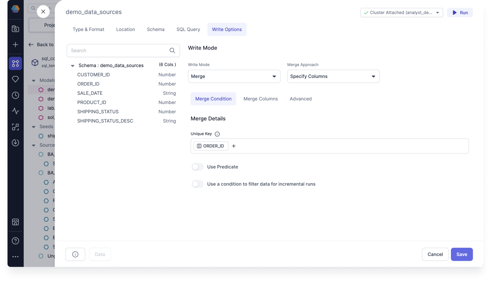
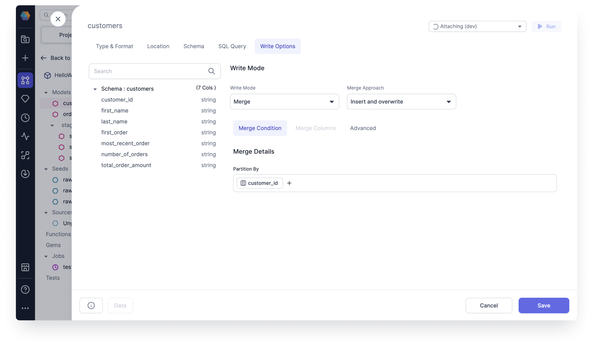

:::edition Enterprise Only
This feature requires the [Enterprise Edition](/getting-started/editions/prophecy-editions) of Prophecy.
:::

When you select the **Merge** write mode for target tables, you also need to choose the **merge approach** to leverage for your use case. Review the following examples for each merge approach to better understand how each strategy works.

## Example: Specify columns

The **Specify columns** approach lets you customize the columns included in your data queries by selecting, deselecting, and reordering columns.

Consider a scenario where you have an **ORDERS** table with a column called _ORDER_ID_. In this case, you want to update the shipping status for existing orders without affecting any other fields. When new records are added, if an _ORDER_ID_ already exists in the table, only the _SHIPPING_STATUS_ column should be updated, and all other fields should remain unchanged.

By using the **specify columns** merge approach, the merge operation targets only the _SHIPPING_STATUS_ column, ensuring that it is updated while preserving the values in all other columns based on the matching _ORDER_ID_.

## Example: SCD2

**SCD2** (Slowly Changing Dimensions Type 2) is a method for managing historical data changes in data warehouses. It tracks changes in dimension records over time, preserving both current and historical data. SCD2 captures all changes in the target model, with null values representing new, active, and valid rows.

Imagine you have an ORDERS table with a _SHIPPING_STATUS_ field. As orders are processed, the status may change from "pending" to "shipped". However, simply updating the status field would overwrite the previous value, making it impossible to analyze how long an order stayed in the "pending" state.

To solve this, SCD2 adds a new row each time the status changes, rather than overwriting the existing data. For example, when an order’s status changes, a new row is added with the updated status, and the previous row is preserved with the relevant historical information. Here's how this works:

**Table 1**: When an order is first created, the status is "pending".

| ORDER_ID | SHIPPING_STATUS | UPDATED_AT |
| -------- | --------------- | ---------- |
| 1        | pending         | 2024-01-01 |
| 2        | pending         | 2024-01-02 |

**Table 2**: When the status changes, the previous record remains, and a new row is added with the updated status. Additionally, new columns are added to record the validity of the record. In this case, the order was pending until **2024-01-02**.

| ORDER_ID | SHIPPING_STATUS | UPDATED_AT | valid_from | valid_to   |
| -------- | --------------- | ---------- | ---------- | ---------- |
| 1        | pending         | 2024-01-01 | 2024-01-01 | 2024-01-02 |
| 1        | shipped         | 2024-01-02 | 2024-01-02 | null       |
| 2        | pending         | 2024-01-02 | 2024-01-02 | null       |

If the data doesn't have a date but instead has `null`, then it means that the data is currently valid.

## Example: Insert and overwrite

The **Insert and overwrite** approach allows you to overwrite existing records and insert new ones in a single operation, ensuring data accuracy.

Consider a scenario where you have a **CUSTOMERS** table and want to replace all partitions based on the _CUSTOMER_ID_ column. Instead of updating individual records, this approach replaces all partitions that match the query conditions with new data. This ensures that only the most current records are retained while outdated partitions are replaced.

## Example: Replace where

The **Replace where** approach lets you update records that match the condition defined in the predicate.

In a **TRANSACTIONS** table, you may want to update the payment status only for transactions made within the last 30 days. By defining a predicate such as `TRANSACTION_DATE >= DATE_SUB(CURRENT_DATE(), 30)`, only records created within the last 30 days should be modified, ensuring efficient updates while preserving historical data.
