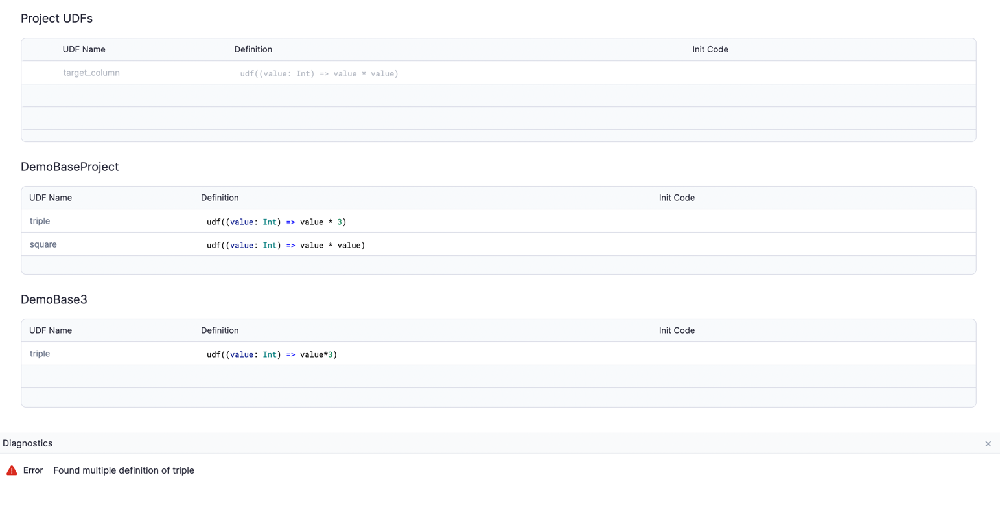
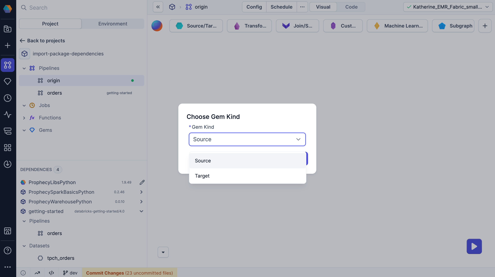
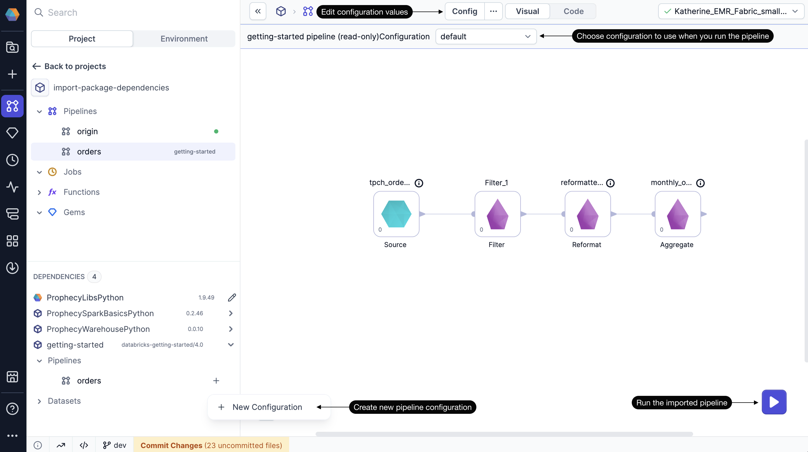

:::edition Enterprise Only
This feature requires the [Enterprise Edition](/getting-started/editions/prophecy-editions) of Prophecy.
:::

You can reuse components from other projects by importing them as dependencies from the Package Hub. These components can include functions, datasets, pipelines, and subgraphs. This page outlines how to use imported package components for Spark projects and packages.

Keep in mind that imported components are read-only. You can configure and run them in your project, but changes to components can only be made in the original source project.

## Imported gems

[Gems](/engineers/gems) from dependencies appear in two places:

- In the **Dependencies** panel in the bottom left of the project editor. Drag them to the canvas or click **+** on hover.
- In the gem drawer on the pipeline canvas. These appear when imported from a Prophecy-provided package.

When you add the gem to the canvas, you can configure the gem with custom values, but you can't modify its underlying logic.

## Imported functions

Functions in dependencies are automatically accessible in your project gems. This includes both [UDFs](/engineers/user-defined-functions) and [business rules](/engineers/business-rules). If you have UDFs coming from two different projects with conflicting definitions, you will see an error in the **Diagnostics** panel.

## Imported datasets

[Datasets](/engineers/dataset) from dependencies appear in the **Dependencies** panel in the bottom left corner of the project editor. You can either drag the dataset onto the pipeline canvas or click the **+** button that appears on hover.

When you add the gem to the pipeline canvas, Prophecy prompts you to choose whether to add the dataset as a Source or Target gem. You must choose before the gem appears on the canvas.

:::caution
When importing a dataset from another project, you may not know its source, configuration, or whether you have access to it. Make sure to verify access and understand the dataset's structure before using it.
:::

## Imported pipelines

[Pipelines](/engineers/pipelines) from dependencies appear in the **Dependencies** panel in the bottom left of the project editor. You can’t edit these pipelines, but you can run them using customizable [pipeline configs](/engineers/configurations). You can also schedule imported pipelines in [jobs](/engineers/orchestration) using default or custom configs.

If the source pipeline doesn’t include a configuration schema, Prophecy uses an empty default config. If the source pipeline does include a configuration schema, you can:

- Use the default config to run the pipeline.
- Create a custom config to update values in the pipeline.

After you use an imported pipeline, it appears in the project browser under **Pipelines**.

## Imported subgraphs

[Subgraphs](/engineers/subgraph) from dependencies appear in the **Dependencies** panel in the bottom left corner of the project editor. You can either drag the gem onto the pipeline canvas or click the **+** button that appears on hover.

As with pipelines, you can run the subgraph using your own [subgraph config](/engineers/basic-subgraph#subgraph-configurations) values. However, you cannot edit the subgraph itself.

## Transitive packages

If you import a packaged project that itself has dependencies, your project will inherit those dependencies as well. Inherited dependencies will be marked as **Transitive** packages.
