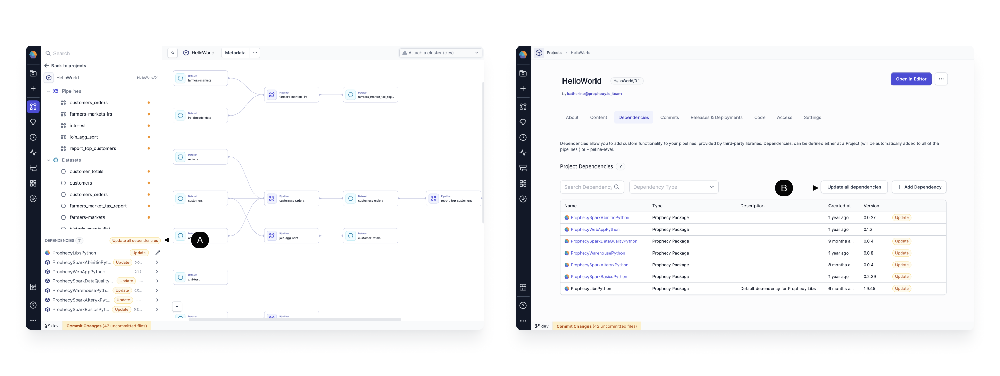
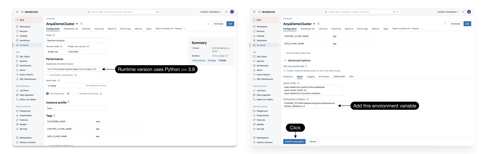
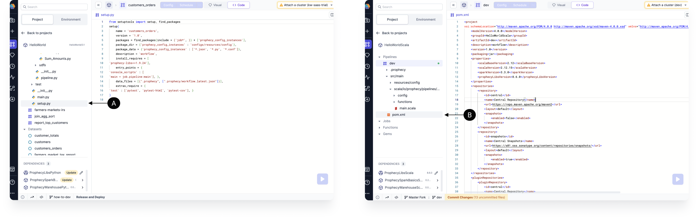

Dependencies allow you to make use of a variety of packages in your data pipelines and jobs. There are three types of dependencies for Spark projects:

- **Package Hub Dependencies.** When you import a project from the Package Hub as a dependency, you gain access to all its components, including pipelines, gems, and business rules for use in your own project. If a new version of the project is published, you can update your dependency to take advantage of the latest changes.
- **Python ([PyPI](https://pypi.org/)) Dependencies.** Python packages hosted on PyPI can be imported in your project using standard PyPI coordinates. This is useful for including popular libraries or your own published packages in PySpark pipelines.
- **Scala ([Maven](https://mvnrepository.com/)) Dependencies.** These are JAR packages hosted on Maven Central or other Maven-compatible repositories. You can add them to Scala projects using Maven coordinates.

## Scope

Dependencies can be stored at the project or pipeline level. Project-level dependencies are available to all pipelines in the project. We recommend that you store dependencies at the project level to minimize time spent connecting to clusters when switching between pipelines.

## Manage dependencies

There are two primary ways to manage project dependencies:

- A) Open your project in the **Pipeline editor**. Then, click **… > Dependencies** from the project header.
- B) Open your project from the **Metadata** page. Then, click on the **Dependencies** tab.

### Add dependencies

The table below describes the fields available when you select **Add Dependency**.

| Parameter                   | Description                                                                                                                                                                                                                                                                              |
| --------------------------- | ---------------------------------------------------------------------------------------------------------------------------------------------------------------------------------------------------------------------------------------------------------------------------------------- |
| Scope                       | The dependency is enabled at the project level or the pipeline level.                                                                                                                                                                                                                    |
| Type                        | The dependency is either from the Package Hub, Scala (Maven) or Python (PyPI).                                                                                                                                                                                                           |
| Name                        | This will identify the dependency.                                                                                                                                                                                                                                                       |
| Version/Package/Coordinates | For Package Hub dependencies, input the package version. <br/>For Scala, use the Maven coordinates in the `groupId:artifcatId:version` format. <br/>For Python, use the package and the version number.                                                                                  |
| Repository (Advanced)       | If you'd like to use an external repository (like your organization’s repository), you can specify the link to it in this field.                                                                                                                                                         |
| Exclusion (Advanced)        | **Scala only** — This is an optional list of `groupId:artifactId` pairs of dependencies you'd like to exclude. Learn more about dependency exclusion [here](https://maven.apache.org/guides/introduction/introduction-to-optional-and-excludes-dependencies.html#dependency-exclusions). |

Once you save a new dependency, Prophecy will validate it to make sure the dependency coordinates are valid and accessible. If
that fails, you should see an **invalid coordinates** error.

:::info
In rare cases, your dependency might be only accessible to the Spark cluster or the build system, but not to Prophecy
itself. If you're confident that the dependency is correct, but the validation error shows up, it's safe to press **Save
Anyways** to ignore that warning.
:::

### Update dependencies

If a dependency update is available, the **Update** label should appear next to the dependency. Click the label to update the individual dependency.

Spark projects often have multiple dependencies. To simultaneously update all dependencies to the latest version, you have two options:

- A) Click **Update all dependencies** in the Dependencies panel of the project editor.
- B) Click **Update all dependencies** in the Dependencies tab of the project metadata.



:::caution
Connecting a Prophecy project to a Spark cluster with a different dependency version will prompt a cluster restart.
:::

## Install dependencies on a Spark cluster

When you connect a pipeline to a cluster, dependencies are automatically installed on that cluster. However, there are two cases that can prevent automatic installation:

- **Dependency on the cluster's Spark and Scala versions.** A few dependencies depend on your cluster’s Spark and Scala versions. You can usually find these version requirements in the respective repositories. For example, take a look at the [Spark Excel](https://mvnrepository.com/artifact/com.crealytics/spark-excel) page in the Maven Repository.
- **Required manual installation on cluster**. Additionally, certain dependencies must be installed directly on your cluster. This is documented per dependency.



## Storage

Dependencies are natively saved within your build system files. For example, if you're using Scala, dependencies are saved in the
**pom.xml** file. If you're using Python, dependencies are saved in the **setup.py** file.



## Build System template

The **Build System** template in the Settings tab of a project defines how build files are generated for all pipelines within a project. You can edit the template to include specific items you need during the build process—for example, adding the JaCoCo plugin to enable coverage report generation.

:::info
For any help required to enable the template for older projects, please reach out to the Prophecy support team.
:::

### Jobs support

When the Build System template is enabled for a project and you [add a dependency](#add-dependencies), Prophecy will automatically update your **pom.xml** or **setup.py** files to include it.

Though not recommended, if templating is disabled and you still want to add dependencies that are visible to your pipelines when scheduled, you can manually edit the **pom.xml** or **setup.py** files. Below is an example for a Scala project.

To add the `io.github.etspaceman:scalacheck-faker_2.12:7.0.0` dependency, edit the **pom.xml** like so:

```
...
<dependencies>
   <dependency>
       <groupId>io.github.etspaceman</groupId>
       <artifactId>scalacheck-faker_2.12</artifactId>
       <version>7.0.0</version>
   </dependency>

   ...
</dependencies>
...
```

### Managing dependencies for WHL format deployments

:::info
Special consideration for Scala dependencies in Pyspark projects must be given when deploying WHL files outside of PBT.
If you do not create jobs in the Prophecy editor or use the `pbt deploy` or `pbt deploy-v2` commands, then this
section will help track those Scala dependencies.
:::

When manually deploying pipelines using WHL format, you need to account for dependencies in both Python and Scala.
WHL files inherently record Python dependencies, which ensures Python-related packages are handled during deployment.
You can use the following option in [Prophecy Build Tool (PBT)](/engineers/prophecy-build-tool) to
generate and include Scala dependency metadata in your deployment.

#### Run the PBT command

Run the following PBT command in your project directory to capture Scala dependencies and include them in the WHL package:

```
pbt build-v2 --add-pom-xml-python --path .
```

This command will:

- Generate a dummy `pom.xml` and `MAVEN_COORDINATES` containing Maven dependencies.
  (These files contain the same information in different formats for your convenience.)
- Add these files to the WHL package under the directory: `{package_name}-1.0.data/data/`

#### Configuring Spark version

Set the SPARK_VERSION environment variable to specify the Spark version you intend to use in your execution environment.

The version must end with `.0`. To set the environment variable, run a command like `export SPARK_VERSION=3.4.0`.

If SPARK_VERSION is not set, PBT will set the Spark version in the Maven coordinate with the placeholder string `{{REPLACE_ME}}`.
