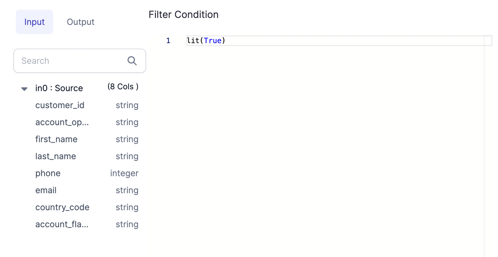

import Tabs from '@theme/Tabs';
import TabItem from '@theme/TabItem';

This page provides information about how gems are written in code. Reference this page when you are building or editing custom gems.

## Requirements

Some options require a specific **gemLibsVersion**. To update this, you must manually change the `gemLibsVersion` value inside **pbt_project.yml** in your project Git repository.

## Mode

There are a few different types of gems that you can create. The table below describes each mode you can choose.

| Mode                              | Description                                                                                                | Additional settings                                   |
| --------------------------------- | ---------------------------------------------------------------------------------------------------------- | ----------------------------------------------------- |
| Transformation                    | Edits intermediate data in the pipeline that is in-memory.                                                 | Choose the **category** of the transformation gem     |
| Dataset Format                    | Reads and writes data between storage and memory.                                                          | Choose whether the type is **batch** or **streaming** |
| Custom Subgraph (**Python only**) | Controls the flow of gems. Visit the [Subgraph](docs/Spark/gems/subgraph/subgraph.md) page for an example. | None                                                  |

## Classes

The following classes must be included in all Spark gems. Each class extends a base class that Prophecy has defined.

- A class where you inherit the representation of the overall gem.
- A class that contains the properties to be made available to the user for this particular gem.
- A class that defines the Spark code that needs to run on your Spark cluster.

| Class                           | Base Class for Transformation | Base Class for Dataset Format | Base Class for Custom Subgraph |
| ------------------------------- | ----------------------------- | ----------------------------- | ------------------------------ |
| class CustomGem(BaseClass)      | `ComponentSpec`               | `DatasetSpec`                 | `MetaComponentSpec`            |
| class YourProperties(BaseClass) | `ComponentProperties`         | `ComponentProperties`         | `MetaComponentProperties`      |
| class YourCode(BaseClass)       | `ComponentCode`               | `ComponentCode`               | `MetaComponentCode`            |

## Functions

The following functions can be used to customize Spark gems.

| Function                    | Purpose                                                                                                                                             | Return                                 | Gem Mode                    |
| --------------------------- | --------------------------------------------------------------------------------------------------------------------------------------------------- | -------------------------------------- | --------------------------- |
| `optimizeCode`              | Enables the Prophecy optimizer to simplify the gem code when it runs.                                                                               | Boolean                                | All                         |
| `customOutputSchemaEnabled` | Enables the [custom schema](docs/getting-started/concepts/gems.md#outputs) option by default in the gem. Requires gemLibsVersion 1.1.47+ for Scala. | Boolean                                | Transformation              |
| `dialog`                    | Defines how you want the gem to look like in the visual interface.                                                                                  | `Dialog` object                        | Transformation and Subgraph |
| `sourceDialog`              | Defines how you want the source gem to look like in the visual interface.                                                                           | `DatasetDialog` object                 | Dataset and Subgraph        |
| `targetDialog`              | Defines how you want the target gem to look like in the visual interface.                                                                           | `DatasetDialog` object                 | Dataset and Subgraph        |
| `validate`                  | Defines how to detect user errors when using the gem.                                                                                               | `Diagnostics` array                    | All                         |
| `onChange`                  | Define UI state transformations.                                                                                                                    | `Properties` object                    | All                         |
| `serializeProperty`         | (**Scala only**) Takes a Properties object and converts it into JSON format.                                                                        | String                                 | All                         |
| `deserializeProperty`       | (**Scala only**) Parses a JSON string and converts it into a Properties object.                                                                     | `Properties` object                    | All                         |
| `apply`                     | Included in the class that extends [component code](#component-code) to define Spark logic.                                                         | None, DataFrame, or list of DataFrames | Transformation and Subgraph |
| `sourceApply`               | Included in the class that extends [component code](#component-code) to define Spark logic.                                                         | DataFrame                              | Dataset                     |
| `targetApply`               | Included in the class that extends [component code](#component-code) to define Spark logic.                                                         | None                                   | Dataset                     |

## Examples

### Parent Class

````mdx-code-block
<Tabs>

<TabItem value="py" label="Python">

```py
class Filter(ComponentSpec):
name: str = "Filter"
    category: str = "Transform"
    def optimizeCode(self) -> bool:
        return True
```
</TabItem>

<TabItem value="scala" label="Scala">

```scala
object Filter extends ComponentSpec {
val name: String = "Filter"
val category: String = "Transform"
override def optimizeCode: Boolean = true
```
</TabItem>
</Tabs>

````

### Properties Classes

````mdx-code-block
<Tabs>

<TabItem value="py" label="Python">

```py
@dataclass(frozen=True)
    class FilterProperties(ComponentProperties):
        columnsSelector: List[str] = field(default_factory=list)
        condition: SColumn = SColumn("lit(True)")
```
</TabItem>

<TabItem value="scala" label="Scala">

```scala
    case class FilterProperties(
    @Property("Columns selector")
    columnsSelector: List[String] = Nil,
    @Property("Filter", "Predicate expression to filter rows of incoming dataframe")
    condition: SColumn = SColumn("lit(true)")
  ) extends ComponentProperties

```
</TabItem>
</Tabs>

````

### Dialog (UI)

````mdx-code-block
<Tabs>

<TabItem value="py" label="Python">

```py
def dialog(self) -> Dialog:
        return Dialog("Filter").addElement(
            ColumnsLayout(height="100%")
                .addColumn(PortSchemaTabs(selectedFieldsProperty=("columnsSelector")).importSchema(), "2fr")
                .addColumn(StackLayout(height=("100%"))
                .addElement(TitleElement("Filter Condition"))
                .addElement(
                Editor(height=("100%")).withSchemaSuggestions().bindProperty("condition.expression")
            ), "5fr"))
```
</TabItem>
<TabItem value="scala" label="Scala">

```scala
def dialog: Dialog = Dialog("Filter")
    .addElement(
      ColumnsLayout(height = Some("100%"))
        .addColumn(
          PortSchemaTabs(selectedFieldsProperty = Some("columnsSelector")).importSchema(),
          "2fr"
        )
        .addColumn(
          StackLayout(height = Some("100%"))
            .addElement(TitleElement("Filter Condition"))
            .addElement(
              Editor(height = Some("100%"))
                .withSchemaSuggestions()
                .bindProperty("condition.expression")
            ),
          "5fr"
        )
    )
```
</TabItem>
</Tabs>

````

After the Dialog object is defined, it is serialized as JSON and rendered in the UI. When you preview this visual interface of the example code above, it appears like this:



Various UI components can be added to this function such as scroll boxes, tabs, buttons, and more. You can also group these components into different panels.

Column Selector: This is a special property that you should add if you want to select the columns from UI and then highlight the used columns using the `onChange` function.

### Validation

````mdx-code-block
<Tabs>

<TabItem value="py" label="Python">

```py
def validate(self, component: Component[FilterProperties]) -> List[Diagnostic]:
        return validateSColumn(component.properties.condition, "condition", component)

```
</TabItem>
<TabItem value="scala" label="Scala">

```scala
def validate(component: Component)(implicit context: WorkflowContext): List[Diagnostic] = {
    val diagnostics =
      validateSColumn(component.properties.condition, "condition", component)
    diagnostics.toList
  }
```
</TabItem>
</Tabs>

````

### State Changes

````mdx-code-block
<Tabs>

<TabItem value="py" label="Python">

```py
def onChange(self, oldState: Component[FilterProperties], newState: Component[FilterProperties]) -> Component[
        FilterProperties]:
        newProps = newState.properties
        usedColExps = getColumnsToHighlight2([newProps.condition], newState)
        return newState.bindProperties(replace(newProps, columnsSelector=usedColExps))

```
</TabItem>
<TabItem value="scala" label="Scala">

```scala
def onChange(oldState: Component, newState: Component)(implicit context: WorkflowContext): Component = {
    val newProps = newState.properties
    val portId = newState.ports.inputs.head.id

    val expressions = getColumnsToHighlight(List(newProps.condition), newState)

    newState.copy(properties = newProps.copy(columnsSelector = expressions))
  }
```
</TabItem>
</Tabs>

````

### Component Code

````mdx-code-block
<Tabs>

<TabItem value="py" label="Python">

```py
class FilterCode(ComponentCode):
def __init__(self, newProps):
self.props: Filter.FilterProperties = newProps

    def apply(self, spark: SparkSession, in0: DataFrame) -> DataFrame:
            return in0.filter(self.props.condition.column())
```
</TabItem>
<TabItem value="scala" label="Scala">

```scala
class FilterCode(props: PropertiesType)(implicit context: WorkflowContext) extends ComponentCode {

    def apply(spark: SparkSession, in: DataFrame): DataFrame = {
      val out = in.filter(props.condition.column)
      out
    }

  }
```
</TabItem>
</Tabs>

````

If you want to test your Spark code, you can modify properties in the visual preview and save the changes. Then, you can see the generated Spark code which will eventually run on your cluster.

:::info

To keep gems generally compatible with each other, they must conform to a common interface. Therefore, as defined in the `apply()` method, gems must accept and produce **DataFrame objects** at the input and output ports.

:::

:::note

To assist the Spark Catalyst Optimizer to build scalable code, Prophecy performs some minor optimizations to the code
generated by the `apply()` method.

:::

### Dataset Format example

The previous examples were for Transformation gems. The following example is the code for a Dataset Format gem.

````mdx-code-block
<Tabs>
<TabItem value="py" label="Python">

```py
from pyspark.sql import SparkSession, DataFrame
from pyspark.sql.types import StructType

from prophecy.cb.server.base.ComponentBuilderBase import ComponentCode, Diagnostic, SeverityLevelEnum
from prophecy.cb.server.base.DatasetBuilderBase import DatasetSpec, DatasetProperties, Component
from prophecy.cb.ui.uispec import *


class ParquetFormat(DatasetSpec):
    name: str = "parquet"
    datasetType: str = "File"

    def optimizeCode(self) -> bool:
        return True

    @dataclass(frozen=True)
    class ParquetProperties(DatasetProperties):
        schema: Optional[StructType] = None
        description: Optional[str] = ""
        useSchema: Optional[bool] = False
        path: str = ""
        mergeSchema: Optional[bool] = None
        datetimeRebaseMode: Optional[str] = None
        int96RebaseMode: Optional[str] = None
        compression: Optional[str] = None
        partitionColumns: Optional[List[str]] = None
        writeMode: Optional[str] = None
        pathGlobFilter: Optional[str] = None
        modifiedBefore: Optional[str] = None
        modifiedAfter: Optional[str] = None
        recursiveFileLookup: Optional[bool] = None

    def sourceDialog(self) -> DatasetDialog:
        return DatasetDialog("parquet") \
            .addSection("LOCATION", TargetLocation("path")) \
            .addSection(
            "PROPERTIES",
            ColumnsLayout(gap=("1rem"), height=("100%"))
                .addColumn(
                ScrollBox().addElement(
                    StackLayout(height=("100%"))
                        .addElement(
                        StackItem(grow=(1)).addElement(
                            FieldPicker(height=("100%"))
                                .addField(
                                TextArea("Description", 2, placeholder="Dataset description..."),
                                "description",
                                True
                            )
                                .addField(Checkbox("Use user-defined schema"), "useSchema", True)
                                .addField(Checkbox("Merge schema"), "mergeSchema")
                                .addField(
                                SelectBox("Datetime Rebase Mode")
                                    .addOption("EXCEPTION", "EXCEPTION")
                                    .addOption("CORRECTED", "CORRECTED")
                                    .addOption("LEGACY", "LEGACY"),
                                "datetimeRebaseMode"
                            )
                                .addField(
                                SelectBox("Int96 Rebase Mode")
                                    .addOption("EXCEPTION", "EXCEPTION")
                                    .addOption("CORRECTED", "CORRECTED")
                                    .addOption("LEGACY", "LEGACY"),
                                "int96RebaseMode"
                            )
                                .addField(Checkbox("Recursive File Lookup"), "recursiveFileLookup")
                                .addField(TextBox("Path Global Filter").bindPlaceholder(""), "pathGlobFilter")
                                .addField(TextBox("Modified Before").bindPlaceholder(""), "modifiedBefore")
                                .addField(TextBox("Modified After").bindPlaceholder(""), "modifiedAfter")
                        )
                    )
                ),
                "auto"
            )
                .addColumn(SchemaTable("").bindProperty("schema"), "5fr")
        ) \
            .addSection(
            "PREVIEW",
            PreviewTable("").bindProperty("schema")
        )

    def targetDialog(self) -> DatasetDialog:
        return DatasetDialog("parquet") \
            .addSection("LOCATION", TargetLocation("path")) \
            .addSection(
            "PROPERTIES",
            ColumnsLayout(gap=("1rem"), height=("100%"))
                .addColumn(
                ScrollBox().addElement(
                    StackLayout(height=("100%")).addElement(
                        StackItem(grow=(1)).addElement(
                            FieldPicker(height=("100%"))
                                .addField(
                                TextArea("Description", 2, placeholder="Dataset description..."),
                                "description",
                                True
                            )
                                .addField(
                                SelectBox("Write Mode")
                                    .addOption("error", "error")
                                    .addOption("overwrite", "overwrite")
                                    .addOption("append", "append")
                                    .addOption("ignore", "ignore"),
                                "writeMode"
                            )
                                .addField(
                                SchemaColumnsDropdown("Partition Columns")
                                    .withMultipleSelection()
                                    .bindSchema("schema")
                                    .showErrorsFor("partitionColumns"),
                                "partitionColumns"
                            )
                                .addField(
                                SelectBox("Compression Codec")
                                    .addOption("none", "none")
                                    .addOption("uncompressed", "uncompressed")
                                    .addOption("gzip", "gzip")
                                    .addOption("lz4", "lz4")
                                    .addOption("snappy", "snappy")
                                    .addOption("lzo", "lzo")
                                    .addOption("brotli", "brotli")
                                    .addOption("zstd", "zstd"),
                                "compression"
                            )
                        )
                    )
                ),
                "auto"
            )
                .addColumn(SchemaTable("").isReadOnly().withoutInferSchema().bindProperty("schema"), "5fr")
        )

    def validate(self, component: Component) -> list:
        diagnostics = super(ParquetFormat, self).validate(component)
        if len(component.properties.path) == 0:
            diagnostics.append(
                Diagnostic("properties.path", "path variable cannot be empty [Location]", SeverityLevelEnum.Error))
        return diagnostics

    def onChange(self, oldState: Component, newState: Component) -> Component:
        return newState

    class ParquetFormatCode(ComponentCode):
        def __init__(self, props):
            self.props: ParquetFormat.ParquetProperties = props

        def sourceApply(self, spark: SparkSession) -> DataFrame:
            reader = spark.read.format("parquet")
            if self.props.mergeSchema is not None:
                reader = reader.option("mergeSchema", self.props.mergeSchema)
            if self.props.datetimeRebaseMode is not None:
                reader = reader.option("datetimeRebaseMode", self.props.datetimeRebaseMode)
            if self.props.int96RebaseMode is not None:
                reader = reader.option("int96RebaseMode", self.props.int96RebaseMode)
            if self.props.modifiedBefore is not None:
                reader = reader.option("modifiedBefore", self.props.modifiedBefore)
            if self.props.modifiedAfter is not None:
                reader = reader.option("modifiedAfter", self.props.modifiedAfter)
            if self.props.recursiveFileLookup is not None:
                reader = reader.option("recursiveFileLookup", self.props.recursiveFileLookup)
            if self.props.pathGlobFilter is not None:
                reader = reader.option("pathGlobFilter", self.props.pathGlobFilter)

            if self.props.schema is not None and self.props.useSchema:
                reader = reader.schema(self.props.schema)

            return reader.load(self.props.path)

        def targetApply(self, spark: SparkSession, in0: DataFrame):
            writer = in0.write.format("parquet")
            if self.props.compression is not None:
                writer = writer.option("compression", self.props.compression)

            if self.props.writeMode is not None:
                writer = writer.mode(self.props.writeMode)
            if self.props.partitionColumns is not None and len(self.props.partitionColumns) > 0:
                writer = writer.partitionBy(*self.props.partitionColumns)

            writer.save(self.props.path)

```

</TabItem>
<TabItem value="scala" label="Scala">

```scala
package io.prophecy.core.instructions.all.datasets

import io.prophecy.core.instructions.all._
import io.prophecy.core.instructions.spec._
import io.prophecy.core.program.WorkflowContext
import org.apache.spark.sql.{DataFrame, SparkSession}
import org.apache.spark.sql.types.StructType
import io.prophecy.libs._

object ParquetFormat extends DatasetSpec {

  val name: String = "parquet"
  val datasetType: String = "File"

  type PropertiesType = ParquetProperties
  case class ParquetProperties(
    @Property("Schema")
    schema: Option[StructType] = None,
    @Property("Description")
    description: Option[String] = Some(""),
    @Property("useSchema")
    useSchema: Option[Boolean] = Some(false),
    @Property("Path")
    path: String = "",
    @Property(
      "",
      "(default is the value specified in spark.sql.parquet.mergeSchema(false)): sets whether we should merge schemas collected from all Parquet part-files. This will override spark.sql.parquet.mergeSchema."
    )
    mergeSchema: Option[Boolean] = None,
    @Property(
      "datetimeRebaseMode",
      "The datetimeRebaseMode option allows to specify the rebasing mode for the values of the DATE, TIMESTAMP_MILLIS, TIMESTAMP_MICROS logical types from the Julian to Proleptic Gregorian calendar."
    )
    datetimeRebaseMode: Option[String] = None,
    @Property(
      "int96RebaseMode",
      "The int96RebaseMode option allows to specify the rebasing mode for INT96 timestamps from the Julian to Proleptic Gregorian calendar."
    )
    int96RebaseMode: Option[String] = None,
    @Property("compression", "(default: none) compression codec to use when saving to file.")
    compression: Option[String] = None,
    @Property("partitionColumns", "Partitioning column.")
    partitionColumns: Option[List[String]] = None,
    @Property("Write Mode", """(default: "error") Specifies the behavior when data or table already exists.""")
    writeMode: Option[String] = None,
    @Property(
      "",
      "an optional glob pattern to only include files with paths matching the pattern. The syntax follows org.apache.hadoop.fs.GlobFilter. It does not change the behavior of partition discovery."
    )
    pathGlobFilter: Option[String] = None,
    @Property(
      "",
      "(batch only): an optional timestamp to only include files with modification times occurring before the specified Time. The provided timestamp must be in the following form: YYYY-MM-DDTHH:mm:ss (e.g. 2020-06-01T13:00:00)"
    )
    modifiedBefore: Option[String] = None,
    @Property(
      "",
      "(batch only): an optional timestamp to only include files with modification times occurring after the specified Time. The provided timestamp must be in the following form: YYYY-MM-DDTHH:mm:ss (e.g. 2020-06-01T13:00:00)"
    )
    modifiedAfter: Option[String] = None,
    @Property("", "recursively scan a directory for files. Using this option disables partition discovery")
    recursiveFileLookup: Option[Boolean] = None
  ) extends DatasetProperties

  def sourceDialog: DatasetDialog = DatasetDialog("parquet")
    .addSection("LOCATION", TargetLocation("path"))
    .addSection(
      "PROPERTIES",
      ColumnsLayout(gap = Some("1rem"), height = Some("100%"))
        .addColumn(
          ScrollBox().addElement(
            StackLayout(height = Some("100%"))
              .addElement(
                StackItem(grow = Some(1)).addElement(
                  FieldPicker(height = Some("100%"))
                    .addField(
                      TextArea("Description", 2, placeholder = "Dataset description..."),
                      "description",
                      true
                    )
                    .addField(Checkbox("Use user-defined schema"), "useSchema", true)
                    .addField(Checkbox("Merge schema"), "mergeSchema")
                    .addField(
                      SelectBox("Datetime Rebase Mode")
                        .addOption("EXCEPTION", "EXCEPTION")
                        .addOption("CORRECTED", "CORRECTED")
                        .addOption("LEGACY", "LEGACY"),
                      "datetimeRebaseMode"
                    )
                    .addField(
                      SelectBox("Int96 Rebase Mode")
                        .addOption("EXCEPTION", "EXCEPTION")
                        .addOption("CORRECTED", "CORRECTED")
                        .addOption("LEGACY", "LEGACY"),
                      "int96RebaseMode"
                    )
                    .addField(Checkbox("Recursive File Lookup"), "recursiveFileLookup")
                    .addField(TextBox("Path Global Filter").bindPlaceholder(""), "pathGlobFilter")
                    .addField(TextBox("Modified Before").bindPlaceholder(""), "modifiedBefore")
                    .addField(TextBox("Modified After").bindPlaceholder(""), "modifiedAfter")
                )
              )
          ),
          "auto"
        )
        .addColumn(SchemaTable("").bindProperty("schema"), "5fr")
    )
    .addSection(
      "PREVIEW",
      PreviewTable("").bindProperty("schema")
    )

  def targetDialog: DatasetDialog = DatasetDialog("parquet")
    .addSection("LOCATION", TargetLocation("path"))
    .addSection(
      "PROPERTIES",
      ColumnsLayout(gap = Some("1rem"), height = Some("100%"))
        .addColumn(
          ScrollBox().addElement(
            StackLayout(height = Some("100%")).addElement(
              StackItem(grow = Some(1)).addElement(
                FieldPicker(height = Some("100%"))
                  .addField(
                    TextArea("Description", 2, placeholder = "Dataset description..."),
                    "description",
                    true
                  )
                  .addField(
                    SelectBox("Write Mode")
                      .addOption("error", "error")
                      .addOption("overwrite", "overwrite")
                      .addOption("append", "append")
                      .addOption("ignore", "ignore"),
                    "writeMode"
                  )
                  .addField(
                    SchemaColumnsDropdown("Partition Columns")
                      .withMultipleSelection()
                      .bindSchema("schema")
                      .showErrorsFor("partitionColumns"),
                    "partitionColumns"
                  )
                  .addField(
                    SelectBox("Compression Codec")
                      .addOption("none", "none")
                      .addOption("uncompressed", "uncompressed")
                      .addOption("gzip", "gzip")
                      .addOption("lz4", "lz4")
                      .addOption("snappy", "snappy")
                      .addOption("lzo", "lzo")
                      .addOption("brotli", "brotli")
                      .addOption("zstd", "zstd"),
                    "compression"
                  )
              )
            )
          ),
          "auto"
        )
        .addColumn(SchemaTable("").isReadOnly().withoutInferSchema().bindProperty("schema"), "5fr")
    )

  override def validate(component: Component)(implicit context: WorkflowContext): List[Diagnostic] = {
    import scala.collection.mutable.ListBuffer
    val diagnostics = ListBuffer[Diagnostic]()
    diagnostics ++= super.validate(component)

    if (component.properties.path.isEmpty) {
      diagnostics += Diagnostic("properties.path", "path variable cannot be empty [Location]", SeverityLevel.Error)
    }
    if (component.properties.schema.isEmpty) {
      // diagnostics += Diagnostic("properties.schema", "Schema cannot be empty [Properties]", SeverityLevel.Error)
    }

    diagnostics.toList
  }

  def onChange(oldState: Component, newState: Component)(implicit context: WorkflowContext): Component = newState

  class ParquetFormatCode(props: ParquetProperties) extends ComponentCode {

    def sourceApply(spark: SparkSession): DataFrame = {
      var reader = spark.read
        .format("parquet")
        .option("mergeSchema", props.mergeSchema)
        .option("datetimeRebaseMode", props.datetimeRebaseMode)
        .option("int96RebaseMode", props.int96RebaseMode)
        .option("modifiedBefore", props.modifiedBefore)
        .option("modifiedAfter", props.modifiedAfter)
        .option("recursiveFileLookup", props.recursiveFileLookup)
        .option("pathGlobFilter", props.pathGlobFilter)

      if (props.useSchema.isDefined && props.useSchema.get)
        props.schema.foreach(schema ⇒ reader = reader.schema(schema))

      reader.load(props.path)
    }

    def targetApply(spark: SparkSession, in: DataFrame): Unit = {
      var writer = in.write
        .format("parquet")
        .option("compression", props.compression)

      props.writeMode.foreach { mode ⇒
        writer = writer.mode(mode)
      }
      props.partitionColumns.foreach(pcols ⇒
        writer = pcols match {
          case Nil ⇒ writer
          case _ ⇒ writer.partitionBy(pcols: _*)
        }
      )
      writer.save(props.path)
    }

  }

}


```

</TabItem>
</Tabs>
````
