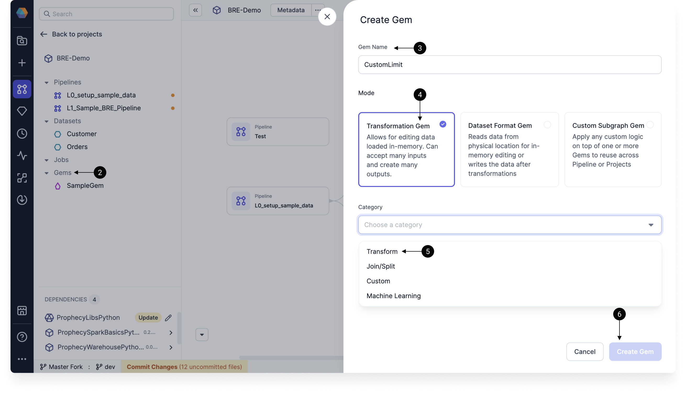
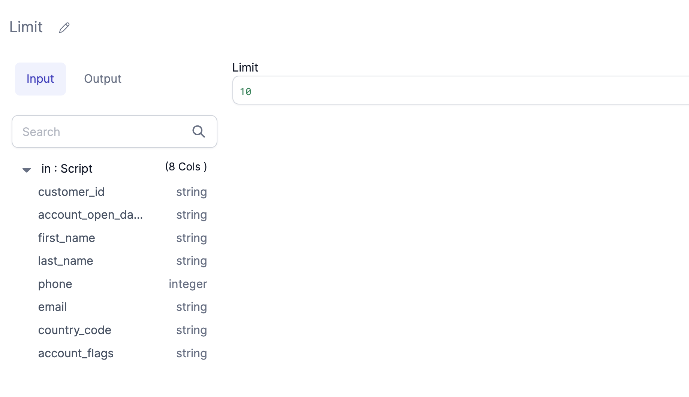
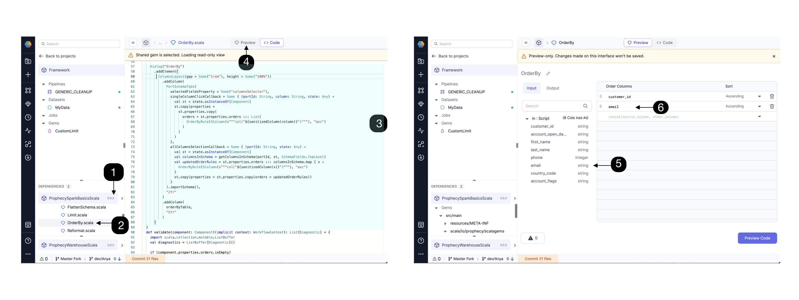
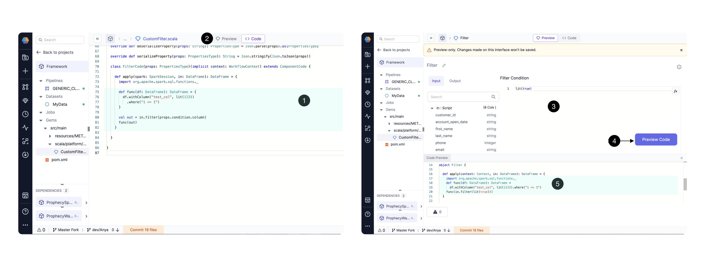
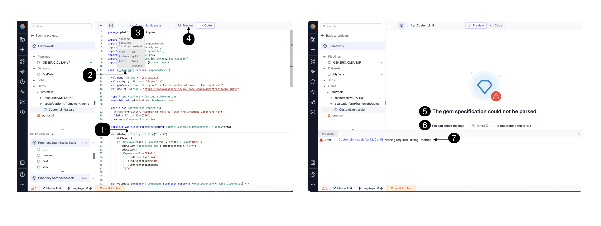

import Tabs from '@theme/Tabs';
import TabItem from '@theme/TabItem';

[Gems](docs/getting-started/concepts/project/gems.md) are visually-packaged parcels of code that perform specific operations on data. While Prophecy provides many gems out of the box, Prophecy also lets you create your own gems! Not only can you create new gems, but you can also share them in the [Package Hub](/docs/extensibility/package-hub/package-hub.md) or with selected teams.

## Overview

Let's learn how to create a Spark gem. At a high level, this involves the following steps:

1. Create a Spark project in which you will create your custom gem.
1. Add a gem to the Gems section of the project sidebar.
1. Specify the name and type of gem that you want to create.
1. Write your code specifications.
1. Preview the rendered visual interface of your gem.
1. Fill in some values and review the generated code.

:::note
If you plan to share these gems in a package, be aware that everything in the project (pipelines, subgraphs, jobs, etc.) will be part of the package, too.
:::

Next, we will review these steps in greater detail.

## Gem template

Each type of gem will have a different code template that Prophecy provides. Let's review the template of a **transformation** gem.

<Tabs>
<TabItem value="py" label="Python">

```py
from prophecy.cb.server.base.ComponentBuilderBase import *
from pyspark.sql import *
from pyspark.sql.functions import *

from prophecy.cb.server.base import WorkflowContext
from prophecy.cb.server.base.datatypes import SInt, SString
from prophecy.cb.ui.uispec import *


class CustomLimit(ComponentSpec):
    name: str = "CustomLimit"
    category: str = "Transform"

    def optimizeCode(self) -> bool:
        # Return whether code optimization is enabled for this component
        return True

    @dataclass(frozen=True)
    class CustomLimitProperties(ComponentProperties):
        # properties for the component with default values
        my_property: SString = SString("default value of my property")

    def dialog(self) -> Dialog:
        # Define the UI dialog structure for the component
        return Dialog("CustomLimit")

    def validate(self, context: WorkflowContext, component: Component[CustomLimitProperties]) -> List[Diagnostic]:
        # Validate the component's state
        return []

    def onChange(self, context: WorkflowContext, oldState: Component[CustomLimitProperties], newState: Component[CustomLimitProperties]) -> Component[
    CustomLimitProperties]:
        # Handle changes in the component's state and return the new state
        return newState


    class CustomLimitCode(ComponentCode):
        def __init__(self, newProps):
            self.props: CustomLimit.CustomLimitProperties = newProps

        def apply(self, spark: SparkSession, in0: DataFrame) -> DataFrame:
            # This method contains logic used to generate the spark code from the given inputs.
            return in0
```

</TabItem>

<TabItem value="Scala" label="Scala">

```scala

package prophecyioteam.helloworldscala.gems

import io.prophecy.gems._
import io.prophecy.gems.dataTypes._
import io.prophecy.gems.uiSpec._
import io.prophecy.gems.diagnostics._
import io.prophecy.gems.componentSpec._
import org.apache.spark.sql.{DataFrame, SparkSession}
import io.prophecy.gems.copilot._
import play.api.libs.json.{Format, OFormat, JsResult, JsValue, Json}


class CustomLimit extends ComponentSpec {

  val name: String = "CustomLimit"
  val category: String = "Transform"
  type PropertiesType = CustomLimitProperties
  override def optimizeCode: Boolean = true

  case class CustomLimitProperties(
    @Property("Property1")
    property1: String = ""
  ) extends ComponentProperties

  implicit val CustomLimitPropertiesFormat: Format[CustomLimitProperties] = Json.format

  def dialog: Dialog = Dialog("CustomLimit")

  def validate(component: Component)(implicit context: WorkflowContext): List[Diagnostic] = Nil

  def onChange(oldState: Component, newState: Component)(implicit context: WorkflowContext): Component = newState

  def deserializeProperty(props: String): CustomLimitProperties = Json.parse(props).as[CustomLimitProperties]

  def serializeProperty(props: CustomLimitProperties): String = Json.toJson(props).toString()

  class CustomLimitCode(props: PropertiesType) extends ComponentCode {
    def apply(spark: SparkSession, in: DataFrame): DataFrame = {
      val out = in
      out
    }
  }
}
```

</TabItem>
</Tabs>

The template consists of the following components:

| Component                                       | Description                                                                                      |
| ----------------------------------------------- | ------------------------------------------------------------------------------------------------ |
| Parent class                                    | Extends a parent class from which it inherits the representation of the overall gem.             |
| Optimize function                               | Enable or disable [code optimization](docs/extensibility/gem-builder/optimization-functions.md). |
| Properties class                                | Contains a list of the properties to be made available to the user for this particular gem.      |
| Dialog function                                 | Contains code specific to how the gem UI should look to the user.                                |
| Serialize/deserialize function (**Scala only**) | Persists objects or exchanges data between different parts of a system                           |
| Validate function                               | Recognizes errors with any inputs provided by the user.                                          |
| State change function                           | Defines UI state transformations.                                                                |
| Component code class                            | Contains the Spark code that needs to run on your Spark cluster.                                 |

## Tutorial

### Create a gem

1. Create a Spark project in Python. The gem will inherit the project-level language.
1. Click on the **+** in the gems section of the project sidebar. This will appear on hover.
1. In the **Gem Name** field, write `CustomLimit`.
1. Choose **Transformation Gem** [mode](/extensibility/gem-builder/gem-builder-reference#mode).
1. Select the **Transform** category.
1. Click **Create Gem**.



Next, we'll add custom code the to code template. The best way to learn how to create new gems is to review the code of existing gems. In this tutorial, we will base our custom gem on the Limit gem. Afterward, you can extend the custom gem logic further.

### Update header

:::note

For gems written in Scala, be sure to update the package to reflect the project name. For example, if the gem is in a "Framework" project, use the statement `package platform.framework.Gems`

:::

<Tabs>
<TabItem value="py" label="Python">

```py
from prophecy.cb.server.base.ComponentBuilderBase import *
from pyspark.sql import *
from pyspark.sql.functions import *

from prophecy.cb.server.base.datatypes import SInt
from prophecy.cb.ui.uispec import *
from prophecy.cb.server.base import WorkflowContext

```

</TabItem>

<TabItem value="Scala" label="Scala">

```scala

package platform.< project name >.Gems
import io.prophecy.Gems._
import io.prophecy.Gems.componentSpec._
import io.prophecy.Gems.dataTypes._
import io.prophecy.Gems.diagnostics._
import io.prophecy.Gems.uiSpec._
import org.apache.spark.sql.{DataFrame, SparkSession}
import play.api.libs.json.{Format, Json}

```

</TabItem>
</Tabs>

### Extend parent class

Every gem class needs to extend a parent class from which it inherits the representation of the overall gem. This includes the UI and the logic. For transform gems, you need to extend ComponentSpec .

Next provide the name and category of your gem, "Limit" and "Transform" in this example.

Another thing to note here is optimizeCode. This flag can be set to True or False value depending on whether we want the Prophecy Optimizer to run on this code to simplify it. In most cases, it's best to leave this value as True.

<Tabs>
<TabItem value="py" label="Python">

```py
class Limit(ComponentSpec):
    name: str = "Limit"
    category: str = "Transform"
    GemDescription: str = "Limits the number of rows in the output"
    docUrl: str = "https://docs.prophecy.io/Spark/Gems/transform/limit/"

    def optimizeCode(self) -> bool:
        return True

    @dataclass(frozen=True)

```

</TabItem>

<TabItem value="Scala" label="Scala">

```scala

class Limit extends ComponentSpec {

  val name: String = "Limit"
  val category: String = "Transform"
  val GemDescription: String = "Limits the number of rows in the input data"
  val docUrl: String = "https://docs.prophecy.io/Spark/Gems/transform/limit/"

  type PropertiesType = LimitProperties
  override def optimizeCode: Boolean = true
  ...
```

</TabItem>
</Tabs>

For our CustomLimit gem, we can start with the same code as the Limit gem and change the `class` name and the `val` name.

### Populate properties class

There is one class (seen here as LimitProperties) that contains a list of the properties to be made available to the user for this particular Gem. Think of these as all the values a user fills out within the interface of this Gem, or any other UI state that you need to maintain (seen here as limit).

:::caution

The content of these Properties classes is persisted in JSON and stored in Git.

:::

These properties are available in validate, onChange and apply and can be set from dialog, functions.

<Tabs>
<TabItem value="py" label="Python">

```py
    class LimitProperties(ComponentProperties):
        limit: SInt = SInt("10")

```

</TabItem>

<TabItem value="Scala" label="Scala">

```scala

  case class LimitProperties(
    @Property("Limit", "Number of rows to limit the incoming DataFrame to")
    limit: SInt = SInt("10")
  ) extends ComponentProperties

```

</TabItem>
</Tabs>

For our CustomLimit gem, we can take the same case class as the Limit gem, maybe changing the default limit value.

Now let’s take a look at the methods for the UI gem component.

### Create UI components

The dialog function contains code specific to how the gem UI should look to the user.

<Tabs>
<TabItem value="py" label="Python">

```py
 def dialog(self) -> Dialog:
        return Dialog("Limit").addElement(
            ColumnsLayout(gap="1rem", height="100%")
                .addColumn(PortSchemaTabs().importSchema(), "2fr")
                .addColumn(
                ExpressionBox("Limit")
                    .bindPlaceholder("10")
                    .bindProperty("limit")
                    .withFrontEndLanguage(),
                "5fr"
            )
        )


```

</TabItem>

<TabItem value="Scala" label="Scala">

```scala
 def dialog: Dialog = Dialog("Limit")
    .addElement(
      ColumnsLayout(gap = Some("1rem"), height = Some("100%"))
        .addColumn(PortSchemaTabs().importSchema(), "2fr")
        .addColumn(
          ExpressionBox("Limit")
            .bindProperty("limit")
            .bindPlaceholder("10")
            .withFrontEndLanguage,
          "5fr"
        )
    )
```

</TabItem>
</Tabs>

The above Dialog function in the limit gem is rendered on the UI like this:


There are various UI components that can be defined for custom gems such as scroll boxes, tabs, buttons, etc.

These UI components can be grouped together in various types of panels to create a custom user experience when using the gem. After the Dialog object is defined, it's serialized as JSON, sent to the UI, and rendered there.

Depending on what kind of gem is being created, either a Dialog or a DatasetDialog needs to be defined. See Transformation vs DatasetFormat gems for details.

Take a look through the gems inside SparkBasicsScala and SparkBasicsPython projects to for more example dialog methods.

### Validate user input

The validate method performs validation checks so that in the case where there's any issue with any inputs provided for the user an Error can be displayed. In our example case the Limit condition must be an integer within a defined range. Similarly, you can add any validation on your properties.

<Tabs>
<TabItem value="py" label="Python">

```py
 def validate(self, context: WorkflowContext, component: Component[LimitProperties]) -> List[Diagnostic]:
        diagnostics = []
        limitDiagMsg = "Limit has to be an integer between [0, (2**31)-1]"
        if component.properties.limit.diagnosticMessages is not None and len(component.properties.limit.diagnosticMessages) > 0:
            for message in component.properties.limit.diagnosticMessages:
                diagnostics.append(Diagnostic("properties.limit", message, SeverityLevelEnum.Error))
        else:
            resolved = component.properties.limit.value
            if resolved <= 0:
                diagnostics.append(Diagnostic("properties.limit", limitDiagMsg, SeverityLevelEnum.Error))
            else:
                pass
        return diagnostics
```

</TabItem>

<TabItem value="Scala" label="Scala">

```scala
 def validate(component: Component)(implicit context: WorkflowContext): List[Diagnostic] = {
    import Scala.collection.mutable.ListBuffer

    val diagnostics = ListBuffer[Diagnostic]()

    val (diag, limit) = (component.properties.limit.diagnostics, component.properties.limit.value)
    diagnostics ++= diag

    val limitDiagMsg = "Limit has to be an integer between [0, (2**31)-1]"
    if (limit.isDefined) {
      if (limit.get < 0)
        diagnostics += Diagnostic("properties.limit", limitDiagMsg, SeverityLevel.Error)
    }
    diagnostics.toList
  }

```

</TabItem>
</Tabs>

### Define state changes

The onChange method is given for the UI State transformations. You are given both the previous and the new incoming state and can merge or modify the state as needed. The properties of the gem are also accessible to this function, so functions like selecting columns, etc. are possible to add from here.

<Tabs>
<TabItem value="py" label="Python">

```py
    def onChange(self, context: WorkflowContext, oldState: Component[LimitProperties], newState: Component[LimitProperties]) -> Component[
        LimitProperties]:
        return newState
```

</TabItem>

<TabItem value="Scala" label="Scala">

```scala
  def onChange(oldState: Component, newState: Component)(implicit context: WorkflowContext): Component = newState
```

</TabItem>
</Tabs>

### Serialize or deserialize

Serialize and deserialize methods in Scala are now open source and exposed to the user, so you could extend your own serializer classes if desired, using Play JSON [library](https://www.playframework.com/documentation/2.8.x/ScalaJson) or any other format.

<Tabs>
<TabItem value="py" label="Python">

```py
< not applicable for Python >
```

</TabItem>

<TabItem value="Scala" label="Scala">

```scala

 override def deserializeProperty(props: String): PropertiesType = Json.parse(props).as[PropertiesType]

  override def serializeProperty(props: PropertiesType): String = Json.stringify(Json.toJson(props))

```

</TabItem>
</Tabs>

:::note
For Scala, this snippet binds the UI Properties to the case class:

`(props: testProperties): String = Json.toJson(props).toString()`
:::

### Define Spark logic

The last class used here is LimitCode which is inherited from ComponentCode class. This class contains the actual Spark code that needs to run on your Spark cluster. The Spark code for the gem logic is defined in the apply function. Input/Output of apply method can only be DataFrame or list of DataFrames or empty. For example, we are calling the .limit() method in this example in the apply function.

<Tabs>
<TabItem value="py" label="Python">

```py

    class LimitCode(ComponentCode):
        def __init__(self, newProps):
            self.props: Limit.LimitProperties = newProps

        def apply(self, spark: SparkSession, in0: DataFrame) -> DataFrame:
            return in0.limit(self.props.limit.value)

```

</TabItem>

<TabItem value="Scala" label="Scala">

```scala
class LimitCode(props: PropertiesType) extends ComponentCode {

    def apply(spark: SparkSession, in: DataFrame): DataFrame = {
      val out = in.limit(props.limit)
      out
    }

  }
```

</TabItem>
</Tabs>

You can go ahead and preview the component to see how it looks. Note some gem examples have functions defined within the apply method.

That’s all the code for our example Transformation, the Limit gem. We walked through the package and import statements, parent class, and properties class. We explored the required methods dialog, validation, onChange, (de)serializeProperty. Finally we saw the Limit gem’s component code. Now we have a basic understanding of the components needed for any Transformation gem.

:::info
If you are using an existing gem as a guide to creating your new gem, you will need to change the following at a minimum: ComponentSpec, ComponentProperties, and ComponentCode.
:::

## Extend functionality

Now for the fun part! We understand a Transform example, and now we want to explore extending to our custom gem needs. There are several ways to extend your custom gem.

Looking to craft or adjust a UI element for your custom gem? Get inspiration from the existing gems. Find a gem that has a UI element you want to use - like ColumnsLayout - and use that gem’s code.

Looking to supply your own function for your custom gem? Add your function in the ComponentCode’s apply method.

Looking to read or write to a data format beyond the (filetypes, warehouses, and catalog) provided out of the box? GemBuilder is not just for Transformations. Design a new DatasetFormat with Gem Builder using some modifications from the Transformation example.

### Extend UI

Let’s see how to use the ColumnsLayout UI element in detail:


Open the **(1) SparkBasics** package dependency for Python or Scala. Explore and scroll to find a gem, e.g. **(2) OrderBy** with the desired visual component, in this case ColumnsLayout. Find the **(3) relevant code** for the visual element and click **(4) Preview** to see how this visual element is rendered. Try it out! Click on the **(5)customer_id and email** columns, and note these columns now **(6) appear** in the Order Columns list.

If you like the column layout, then add the ColumnsLayout element to your custom gem. Each time you edit the code, you can click “Preview” to test the change in the UI.

### Extend the Component Code with functions

The ComponentCode contains the actual Spark code that needs to run on your Spark cluster. Functions are supported inside the apply method; just define and call the function.

For example, the existing Filter ComponentCode can be **(1) edited** by adding the withColumn function:

Clicking **(2) Preview** will allow you to view the gem’s **(3) UI**. Clicking **(4) Preview Code** will allow you to view the gem’s **(5) code** together with the **(3) UI**, facilitating iteration. See the code samples below in Scala.

filter ComponentCode:

```
  class FilterCode(props: PropertiesType)(implicit context: WorkflowContext) extends ComponentCode {

    def apply(spark: SparkSession, in: DataFrame): DataFrame = {
      val out = in.filter(props.condition.column)
      out
    }

  }
```

filter ComponentCode with the added withColumn function:

```
  class FilterCode(props: PropertiesType)(implicit context: WorkflowContext) extends ComponentCode {

    def apply(spark: SparkSession, in: DataFrame): DataFrame = {
      import org.apache.spark.sql.functions._

      def func(df: DataFrame): DataFrame = {
        df.withColumn("test_col", lit(123))
          .where("1 == 1")
      }

      val out = in.filter(props.condition.column)
      func(out)
    }

  }
```

## Troubleshoot errors

If there is an error in your code, your gem preview might not render correctly.


If there is a **(1) typo / error** in a required method (e.g. dialog1 instead of dialog), Prophecy will direct your attention to a particular line of code.

- Click the **(2) underlined code**.
- Notice a **(3) detailed error message**.
- Click **(4) Preview** to see how the gem will look as rendered in the UI.
- If a value is incorrect, the gem will not be able to be parsed, and a very clear error will appear **(5) here** as well.
- Click the **(6) Errors** button to see the **(7) full error message**.

:::caution

“The gem specification could not be parsed” means that there’s an error in one or more required methods, classes, or properties. These components could not be analyzed and/or converted into the gem UI.

:::

## What's next?

Now that you know how to create Spark gems, have a look at how to [create custom SQL gems](docs/extensibility/gem-builder/sql-gem-builder.md).
