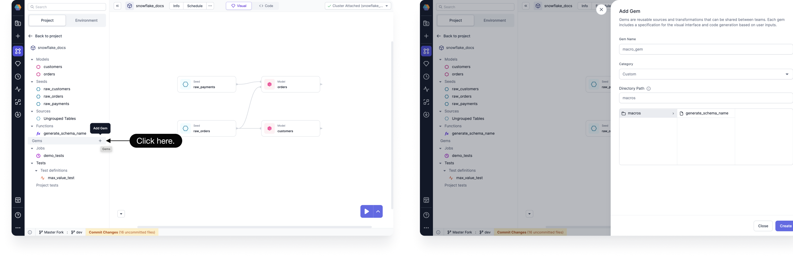
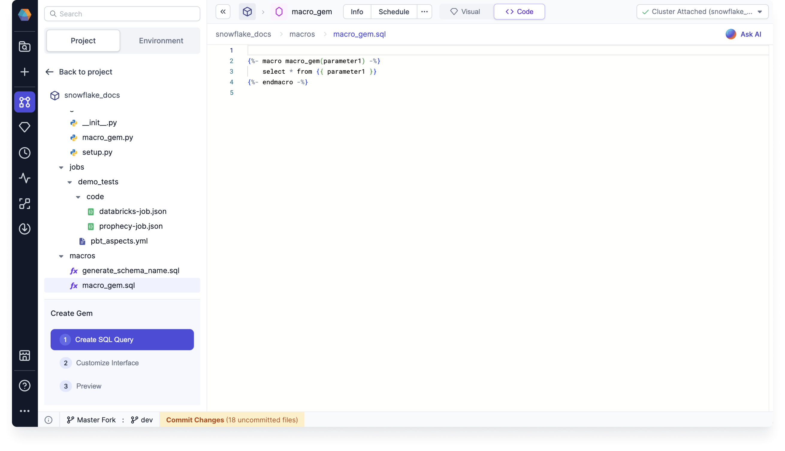
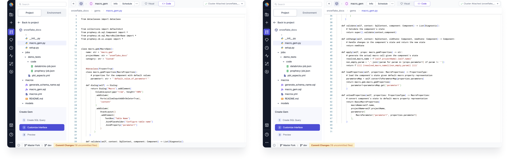
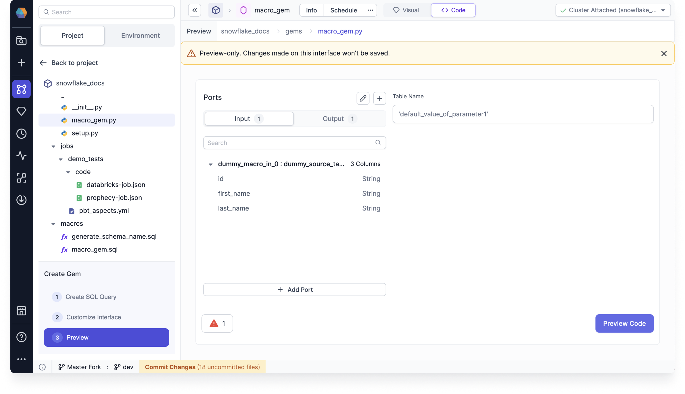

:::caution Enterprise Only

Please [contact us](https://www.prophecy.io/request-a-demo) to learn more about the Enterprise offering.

:::

Each Prophecy Model is composed of individual operations, or [Gems](/docs/concepts/project/gems.md), that perform actions on data. While Prophecy offers dozens of Gems out-of-the-box, some data practitioners want to extend this idea and create their own Gems. Gem builder allows enterprise users to add custom Gems. You can create custom source, target, and transformation Gems, and then publish them for your team to use.

Our SQL Gem builder supports Databricks and Snowflake SQL. It's built on dbt Core™, allowing you to build upon existing dbt libraries to define new macros to use in your custom Gem.

You can create a Gem that writes a reference to either of the following options:

- a new user-defined macro
- an existing macro present in a dependency (such as `dbt-utils`)

## Getting Started

You can get started with creating your own Gem by completing the following steps:

1. Open a SQL project, and the click **Add Gem**.

   

2. Enter a Gem Name, choose a Category, and verify the Directory Path. Then click **Create**. The Gem is automatically set to save in `macros/` as `gem_name.py` and `gem_name.sql` files.

Now you can customize the Gem using the split-screen code editor. See the following [Creating a Gem](#creating-a-gem) section to learn how to define your Gem.

## Creating a Gem

A Gem is made up of multiple components that determine the UI and logic of the Gem. The Gem builder breaks up these components into steps for you while you create your Gem.

### Gem components

There are two types of Gems that you can create while using the Gem builder:

- **DataSource Gems**: These Gems enable the reading and writing of data from or to various data sources.
- **Transform Gems**: These Gems apply transformations/joins/any other custom logic onto any source that is passed into them.

Programmatically, a Gem is a component with the following parts:

- The **Gem UI Component** defines the user experience of using the Gem on the visual canvas. This code is rendered on the Prophecy UI.
- The **Gem Code Logic** which is how the Gem acts within the context of a Model.

Gem code can be written using either Python or Scala.

### Steps to follow

There are three parts to creating a Gem:

1. [Create SQL Query](#1-create-sql-query)
2. [Customize Interface](#2-customize-interface)
3. [Preview](#3-preview)

In the first part, you'll define the SQL query using a new or existing macro. You'll then need to customize the UI and logic of your Gem. Finally, you can preview your Gem.

## 1. Create SQL Query

Prophecy Gems are powered by macros. Therefore, you can either define a new macro or leverage an existing one for your custom Gem.



Existing dbt macros can help define table-to-table transformations. Consider using them to complete your SQL Query. See the [dbt utils source code](https://github.com/dbt-labs/dbt-utils/tree/main/macros/sql) for macro definitions.

## 2. Customize Interface

Customizing your Gem involves editing the code for specific classes, functions, and methods.



The code starts with a list of imports from the Prophecy codebase to help get you started.

```sql

from dataclasses import dataclass


from collections import defaultdict
from prophecy.cb.sql.Component import *
from prophecy.cb.sql.MacroBuilderBase import *
from prophecy.cb.ui.uispec import *

```

The following sections describe how to make edits to your Gem's interface.

### Parent Class

Every Gem class needs to extend a parent class from which it inherits the representation of the overall Gem. This includes the UI and the logic.

You can determine the name and category of your Gem, which are `"macro_gem"` and `"Custom"` in this template.

```sql

class macro_gem(MacroSpec):
    name: str = "macro_gem"
    projectName: str = "snowflake_docs"
    category: str = "Custom"

```

### Properties Classes

There is one class that contains a list of the properties to be made available to the user for this particular Gem. Think of these as all the values a user fills out within the template of this Gem, or any other UI state that you need to maintain.

- A collection of input tables, represented as input ports (optional).
- A configurable set of additional parameters through the dialog (optional).

:::caution

The content of these `Properties` classes is persisted in JSON and stored in Git.

:::

These properties can be **set** in the `dialog` function by taking input from user-controlled UI elements.
The properties are then available for reading in the following functions:
`validate`, `onChange`, and `apply`.

```sql

    @dataclass(frozen=True)
    class macro_gemProperties(MacroProperties):
        # properties for the component with default values
        parameter1: str = "'default_value_of_parameter1'"

```

Additional information on these functions are available in the following sections.

### Dialog (UI)

The `dialog` function contains code specific to how the Gem UI should look to the user.

- Automatically generated based on parameters (default).
- Custom dialogs using Python or visual configurations.

```sql

    def dialog(self) -> Dialog:
        return Dialog("Macro").addElement(
            ColumnsLayout(gap="1rem", height="100%")
            .addColumn(
                Ports(allowInputAddOrDelete=True),
                "content"
            )
            .addColumn(
                StackLayout()
                .addElement(
                    TextBox("Table Name")
                    .bindPlaceholder("Configure table name")
                    .bindProperty("parameter1")
                )
           )
       )

```

After defining a Gem in the code editor, you can preview and test it. See [Preview](#3-preview). This feature directly renders the interface for the selected Gem using a dummy schema, enabling you to configure and experiment with the Gem’s UI components. You can then finalize them by previewing the generated SQL code.



There are various UI components that can be defined for custom Gems such as scroll boxes, tabs, and buttons. These UI components can be grouped together in various types of panels to create a custom user experience when using the Gem.

After the Dialog object is defined, it's serialized as JSON, sent to the UI, and rendered there.

Depending on what kind of Gem is being created, a `Dialog` needs to be defined.

#### Column selector

You can use the column selector property if you want to select the columns from UI and then highlight the used columns using the `onChange` function. The function defines the changes that you want to apply to the Gem properties once changes have been made from the UI. For example, in the reformat component provided by Prophecy, based on the columns used on the expression table `onChange` highlights the columns used on the input schema.

It is recommended to try out this dialogue code in Gem builder UI and see how each of these elements looks in UI.

### Validation

The `validate` method performs validation checks so that in the case where there's any issue with any inputs provided for the user an Error can be displayed. You can add any validation on your properties.

- Optional functions such as `onChange` or `validate`, which are executed on user actions. They can dynamically alter the state of how the Gem works based on the user input.

```sql

    def validate(self, context: SqlContext, component: Component) -> List[Diagnostic]:
        # Validate the component's state
        return super().validate(context,component)

```

### State Changes

The `onChange` method is given for the UI State transformations. You are given both the previous and the new incoming state and can merge or modify the state as needed. The properties of the Gem are also accessible to this function, so functions like selecting columns, etc. are possible to add from here.

```sql

    def onChange(self, context: SqlContext, oldState: Component, newState: Component) -> Component:
        # Handle changes in the component's state and return the new state
        return newState

```

### Apply

The code for invoking the macro with the Gem logic is defined in the `apply` function. Here the above User Defined properties are accessible using `self.projectName.{self.name}`.

```sql

    def apply(self, props: macro_gemProperties) -> str:
        # generate the actual macro call given the component's state
        resolved_macro_name = f"{self.projectName}.{self.name}"
        non_empty_param = ",".join([param for param in [props.parameter1] if param != ''])
        return f'{{{{ {resolved_macro_name}({non_empty_param}) }}}}'

```

### Macro Properties

When Prophecy parses a macro invocation, it represents a macro definition in a default state. `MacroProperties` consists of the following:

- macro name
- project name
- parameters used

For example, if macro invocation is

```sql
dbt_utils.deduplicate(relation, partition_by, order_by)`
```

then Prophecy parses it into an object such as the following:

```sql
MacroParameter(value="relation"),
MacroParameter(value="partition_by"),
MacroParameter(value="relation")
```

This object now has to be converted into the Gem state defined by the user. This logic is defined in `loadProperties`.

```sql

    def loadProperties(self, properties: MacroProperties) -> PropertiesType:
        # load the component's state given default macro property representation
        parametersMap = self.convertToParameterMap(properties.parameters)
        return macro_gem.macro_gemProperties(
            parameter1=parametersMap.get('parameter1')
        )

    def unloadProperties(self, properties: PropertiesType) -> MacroProperties:
        # convert component's state to default macro property representation
        return BasicMacroProperties(
            macroName=self.name,
            projectName=self.projectName,
            parameters=[
                MacroParameter("parameter1", properties.parameter1)
            ],
        )

```

Similarly the opposite case where this enhanced UX is not available due to some reason, Prophecy needs to be able to render the default macro UI. For this purpose you must define the logic to convert the Gem properties back to the default macro properties object which Prophecy understands.

## 3. Preview

You can preview the component in the Gem builder to see how it looks. You can modify the properties and then save it to preview the generated code which will eventually run on your cluster.


Certain Gems may generate SQL code that isn’t compatible with a specific Fabric provider, rendering the Gem unusable and guaranteeing failure if attempted. This issue arises because some dbt macros are designed to support only specific warehouse types.

:::note

Custom Gem logic can be shared with other users within the Team and Organization. Navigate to the Gem listing to review Prophecy-defined and User-defined Gems. When your Gem is ready, publish it so that it is available to use in other Models.

:::

## Example code

This is an example specification of a Gem for an existing deduplicate macro from `dbt utils`.

```sql
from dataclasses import dataclass

from collections import defaultdict
from prophecy.cb.sql.MacroBuilderBase import *
from prophecy.cb.ui.uispec import *


class Deduplicate(MacroSpec):
    name: str = "deduplicate"
    projectName: str = "dbt_utils"
    category: str = "Custom"


    @dataclass(frozen=True)
    class DeduplicateProperties(MacroProperties):
        tableName: str = ''
        partitionBy: str = ''
        orderBy: str = ''

    def dialog(self) -> Dialog:
        return Dialog("Macro") \
            .addElement(
            ColumnsLayout(gap="1rem", height="100%")
            .addColumn(
                Ports(allowInputAddOrDelete=True),
                "content"
            )
            .addColumn(
                StackLayout()
                .addElement(
                    TextBox("Table Name")
                    .bindPlaceholder("Configure table name")
                    .bindProperty("tableName")
                )
                .addElement(
                    TextBox("Deduplicate Columns")
                    .bindPlaceholder("Select a column to deduplicate on")
                    .bindProperty("partitionBy")
                )
                .addElement(
                    TextBox("Rows to keep logic")
                    .bindPlaceholder("Select row on the basis of ordering a particular column")
                    .bindProperty("orderBy")
                )
            )
        )

    def validate(self, context: SqlContext, component: Component) -> List[Diagnostic]:
        diagnostics = []
        macroProjectMap = self.getMacroMap(context)
        projectName = self.projectName if self.projectName != "" else context.projectName
        if projectName not in macroProjectMap:
            diagnostics.append(Diagnostic(
                "properties.projectName",
                f"Project name {self.projectName} doesn't exist. Current Project is ${context.projectName}",
                SeverityLevelEnum.Error
            ))
        else:
            macroDef: Optional[MacroDefFromSqlSource] = self.getMacro(self.name, projectName,
                                                                      context)
            if macroDef is None:
                diagnostics.append(Diagnostic(
                    "properties.macroName",
                    f"Macro {self.name} doesn't exist",
                    SeverityLevelEnum.Error
                ))
            else:
                if component.properties.tableName == '':
                    diagnostics.append(
                        Diagnostic(
                            f"properties.tableName",
                            f"Please define table name",
                            SeverityLevelEnum.Error
                        )
                    )
                if component.properties.partitionBy == '':
                    diagnostics.append(
                        Diagnostic(
                            f"properties.partitionBy",
                            f"Please define partition by column",
                            SeverityLevelEnum.Error
                        )
                    )
                if component.properties.orderBy == '':
                    diagnostics.append(
                        Diagnostic(
                            f"properties.orderBy",
                            f"Please define order by by column",
                            SeverityLevelEnum.Error
                        )
                    )
        return diagnostics

    def onChange(self, context: SqlContext, oldState: Component, newState: Component) -> Component:
        return newState

    def apply(self, props: DeduplicateProperties) -> str:
        if self.projectName != "":
            resolved_macro_name = f"{self.projectName}.{self.name}"
        else:
            resolved_macro_name = self.name
        non_empty_param = ",".join([param for param in [props.tableName, props.partitionBy, props.orderBy] if param != ''])
        return f'{{{{ {resolved_macro_name}({non_empty_param}) }}}}'

    def loadProperties(self, properties: MacroProperties) -> PropertiesType:
        parametersMap = self.convertToParameterMap(properties.parameters)
        return Deduplicate.DeduplicateProperties(
            tableName=parametersMap.get('relation'),
            orderBy=parametersMap.get('order_by'),
            partitionBy=parametersMap.get('partition_by')
        )
```
