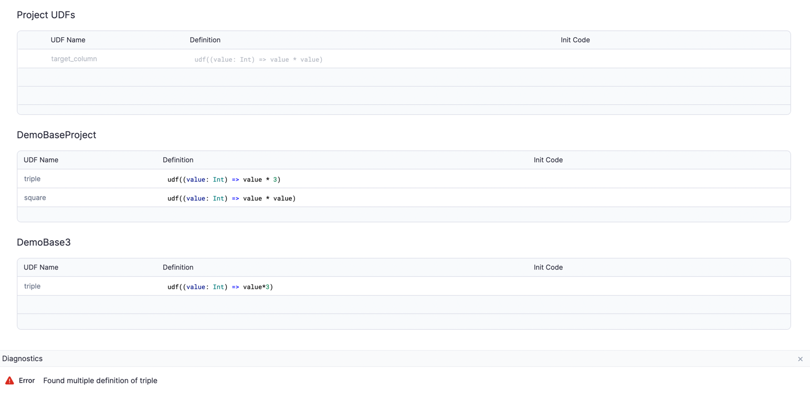

Within Package Hub, you can build your package where you can share [datasets](#datasets), [pipelines](#pipelines), [subgraphs](#subgraphs), and [user-defined functions (UDFs)](#user-defined-functions) across Spark projects.

This page shows how to build a package with datasets, pipelines, subgraph, and UDFs. You can add additional components in your package such as business rules and gems.

## Datasets

You can share a [dataset](/engineers/dataset) across projects.

A dataset in Prophecy points to your actual data in your data storage solution. Prophecy does not store any data, so we recommend not configuring datasets in a package and leaving datasets configurable in the project where you use them.

Importantly, access to the actual data depends on your personal access token or username/password credentials. To access the data in a new project, you must select a fabric with access permissions for that data.

## Pipelines

You can share pipelines from one project to another project and run it with a [Config](/engineers/configurations) in the dependent projects. This allows data administrators to create deployment templates for the pipelines that use the best practices for authorization, notifications, error handling, and logging information.

:::note
If you modify anything from an existing or new pipeline, you must publish these updates as a new version for the package to pick up the changes. Then, you must manually update the project dependency to get the updated package version.
:::

### Prepare a pipeline

To update a Config for a pipeline:

1. Open the pipeline you want to create a Config for.

1. At the top of the window, click **Config**.

1. Click the **Config** tab.

1. On the top right, select the Config you want to update.

1. Update the values in teh Config.

1. Click **Save**.

### Interactively run a pipeline

If you interactively run a pipeline from your current project, you need to create a Config in your other project. Then, the pipeline is visible in other project.

To interactively run a pipeline:

1. Hover over the play button at the bottom right corner of the screen, and click **...**.

   The **Interactive Run Configuration** modal appears.

1. (Optional) If you want to only use a subset of your data for the input, toggle on **Limit Input records** and enter the amount you want to use.

1. (Optional) If you want to no longer use the pipelines data sampling settings, toggle off **Data Sampling**.

   By default, data sampling is enabled. When left enabled, Data sampling uses the pipeline's data sampling settings. Prophecy samples data during the interactive run experience to provide the best debugging experience for users.

1. Select the configuration you want to run in the **Configuration** drop down.

1. Click the play button to run your pipeline.

### Schedule a pipeline

To schedule a pipeline to run:

1. In the left side bar, hover over **Jobs** and click **+**.

1. Enter your jobs **Name**, and update the **Schedule Interval** to how often you would like it to run.

   To learn more about scheduling, see [Scheduling](/analysts/scheduling).

1. Assure the other fields are accurate.

1. Click **Create New**.

   Notice that your new schedule appears under **Jobs** in teh left side bar.

1. At the top left of the screen, click **Pipeline**.

1. Open the Pipeline gem, and select the pipeline you want to schedule.

1. Select the configuration you want to run with the pipeline.

1. Click **Save**.

## Subgraphs

You can share published [subgraphs](/engineers/subgraph) across your pipelines. This helps central Data Platform teams to build reusable code to cover a wide variety of business needs, such as encryption, decryption, or identity masking, and have their Data Practitioners depend on that reusable code.

### Configurable subgraphs

To use subgraphs from a dependency, use [configuration variables](/engineers/basic-subgraph#subgraph-configurations). This makes your subgraph reusable and allows you to use these in the gems of the subgraph.

:::info
You can only use subgraph Configs in a subgraph. Pipeline config variables cannot be used in gems inside a subgraph. Similarly, subgraph Configs are not available to other outside gems of the pipeline.

You can only edit subgraph Configs in the subgraph. Also, Prophecy shows subgraph Configs as part of pipeline Configs.
:::

### Subgraphs across pipelines

:::note
You can add a subgraph to any pipeline in the same project after you publish it.
:::

To publish a subgraph:

1. Open the subgraph.

1. At the top right corner, click **Publish**.

1. Enter the **Subgraph Name**, **Package Name**, and optionally, the **Description**.

1. Click **Save**.

Notice that the **Publish** button now says **Published (Edit details)**.

## User-defined functions

You can share [user-defined functions (UDF)](docs/Spark/functions/user-defined-functions.md) across your projects.

After you add your UDF as a dependency to another project, you can use all UDFs from your current project in your other project.

If you have UDFs coming from two different projects with conflicting definitions, you will see an error in your **Diagnostics** window in the UDF:

:::note
Similar to [sharable pipelines](#pipelines), if you modify anything from an existing or new UDF, Prophecy updates your current project after you release the original project, and updates the dependency in your current project.
:::
