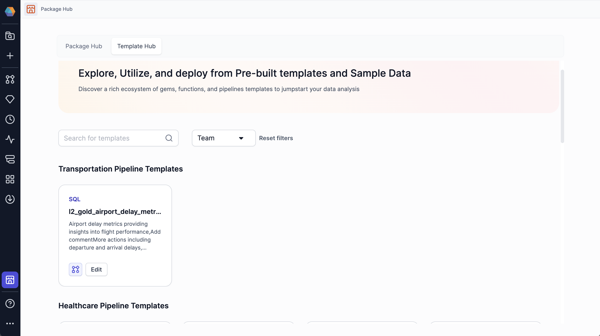

To extend the functionality of a project, you can download **packages** from the Package Hub. Packages are **versioned projects** that contain shareable components, such as pipelines, gems, business rules, user-defined functions, jobs, macros, models, and more.

The Package Hub includes Prophecy-provided packages and packages that you can publish yourself.


The Template Hub offers pipeline templates that you can run to deepen your understanding of how our gems work. Then, if you want to do the same thing in your project, you can copy it over to your environment.



## Add to the Package Hub

To create reusable components for yourself and others:

1. Create a project.

1. Build the component(s).

1. [Release and deploy](/engineers/deployment) the project.

1. Share your project with other teams in the Access tab of the [project metadata](docs/getting-started/concepts/project.md) page.

1. Publish the project to the Package Hub.

   

Importantly, if you add a project to the Package Hub, **all of its components will be available for reuse**.

:::info
Packages in the Package Hub are only available to users in teams that you have shared the project with.

After you share your dependency with a team, the team can add your project as a dependency to their new or existing projects. If the team does not see the package listed when they try to add it as a dependency, be sure the new project and dependent project are using the same language, such as Scala or Python.

For example, if the new project is a Scala project, only Scala Packages can be added as dependencies.
:::

## Update package

When you update a project that is published as a package, the changes will only be available in the Package Hub when you [release and deploy](/engineers/deployment) the project as a new version.

:::note
The release must be made from the branch specified on project creation (usually `main` or `master`). This ensures that teams will review the code before releasing the project.
:::

If you want to change how the package works for a particular project without changing the original package, clone the packaged project and make your changes.

## Use package in project

There are a few different ways to add a package to a project:

- Open the project and click **+** in the Gem Drawer.
- Open the project dependencies and add a dependency.
- Open the package in Package Hub and select **Use Package**.


You cannot change package components that have been imported into a project. You can only change the components from the source project.

## Use a pipeline template

You can use a pipeline template if you are a new Prophecy user in version 4.1 and above.

To use a pipeline template:

1. At the top left, select the **Template Hub** tab.

1. Click on a template you would like to run.

   Each template contains several tables, and at least one pipeline.

   To learn about what each sample pipeline does, see [Template Hub](/analysts/template-hub).

1. Select and run a pipeline.

   :::note
   Prophecy automatically attaches a fabric for you to use.
   :::

## What's next

Check out our in-depth tutorials on creating shareable components!

```mdx-code-block
import DocCardList from '@theme/DocCardList';
import {useCurrentSidebarCategory} from '@docusaurus/theme-common';

<DocCardList items={useCurrentSidebarCategory().items}/>
```
