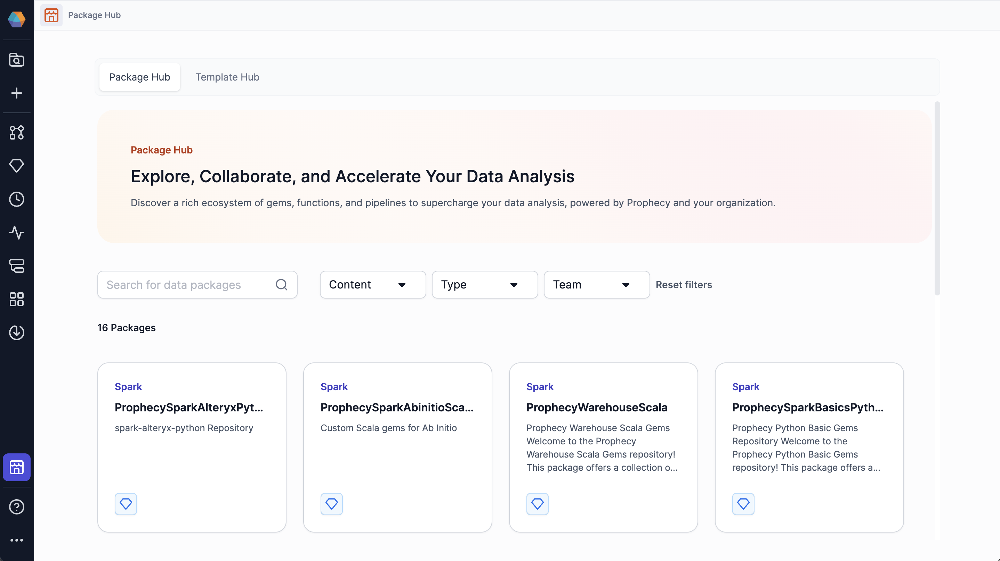
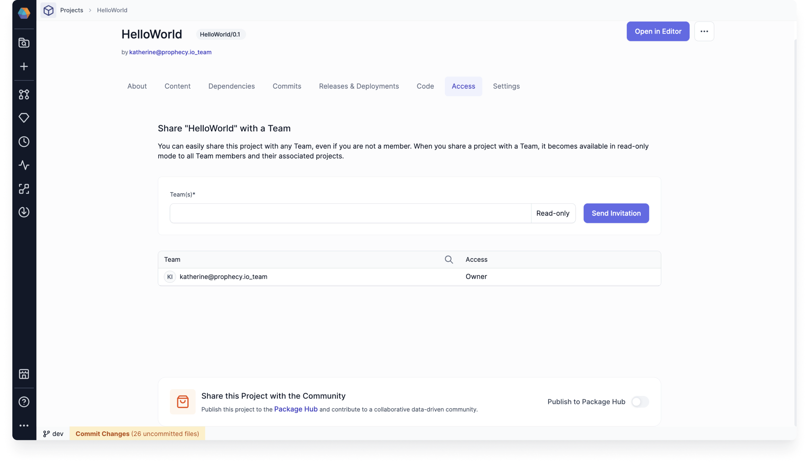
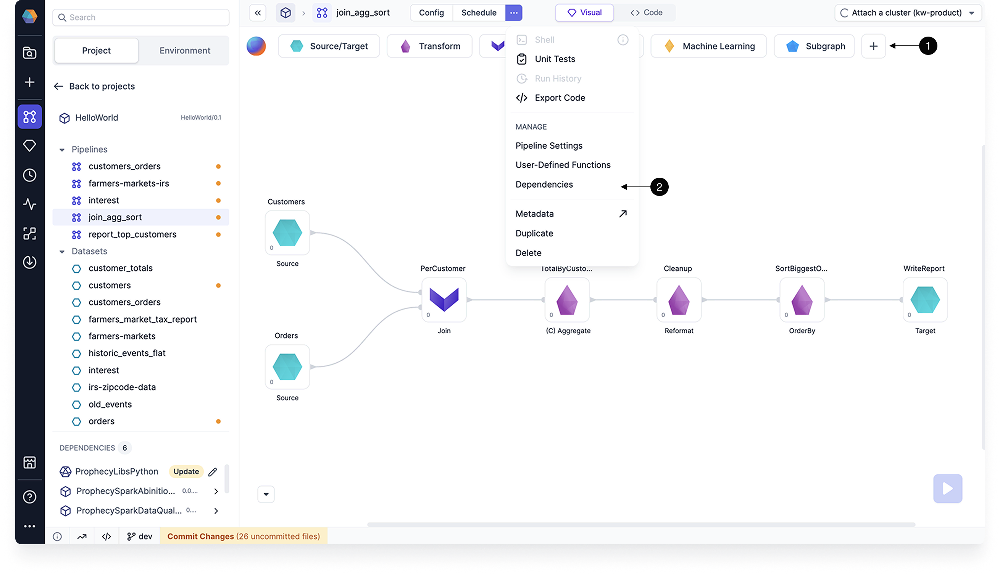

To extend the functionality of a project, you can download **packages** from the Package Hub. Packages are **versioned projects** that contain shareable components, such as pipelines, gems, business rules, user-defined functions, jobs, macros, models, and more.

The Package Hub includes Prophecy-provided packages and packages that you can publish yourself.



## Publish to the Package Hub

To create reusable components for yourself and others:

1. Create a project.
1. Build the component(s).
1. [Release and deploy](/engineers/deployment) the project.
1. Share your project with other teams in the Access tab of the [project metadata](/projects#metadata) page.
1. Publish the project to the Package Hub.

Importantly, if you add a project to the Package Hub, **all of its components will be available for reuse**.



## Access and permissions

Packages in the Package Hub are only available to users in teams that you have shared the project with.

After you share your dependency with a team, users in the team can add your project as a dependency to their new or existing projects. If the team does not see the package listed when they try to add it as a dependency, be sure the new project and dependent project use the same language, such as Scala or Python.

For example, if the new project is a Scala project, only Scala Packages can be added as dependencies.

## Create a new package version

When you update a project that is published as a package, the changes will only be available in the Package Hub when you [release and deploy](/engineers/deployment) the project as a new version.

:::note
The release must be made from the branch specified on project creation (usually `main` or `master`). This ensures that teams will review the code before releasing the project.
:::

If you want to change how the package works for a particular project without changing the original package, clone the packaged project and make your changes.

## Import a package as a project dependency

There are a few different ways to add a package to a project:

- Open the project and click **+** in the Gem Drawer.
- Open the project dependencies and add a dependency.
- Open the package in Package Hub and select **Use Package**.



You cannot change package components that have been imported into a project. You can only change the components from the source project.

## Prophecy-provided packages

Explore Prophecy-provided packages in the Package Hub to find extra gems and pipelines that may be helpful for your projects. For example, the `ProphecyDatabricksSqlSpatial` package includes gems like [CreatePoint](/analysts/create-point) and [Distance](/analysts/distance) that can help you handle spatial data in your pipelines.

Gems that pertain to certain Prophecy-provided packages are specified in the documentation.

## What's next

Learn more about packages and the Template Hub in the following pages.

```mdx-code-block
import DocCardList from '@theme/DocCardList';
import {useCurrentSidebarCategory} from '@docusaurus/theme-common';

<DocCardList items={useCurrentSidebarCategory().items}/>
```
