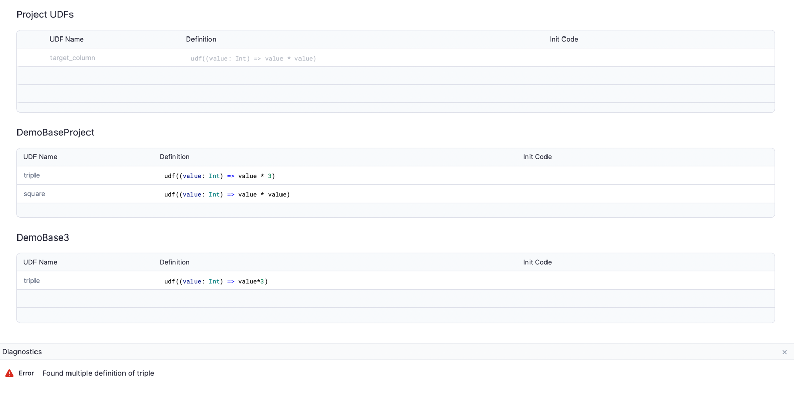
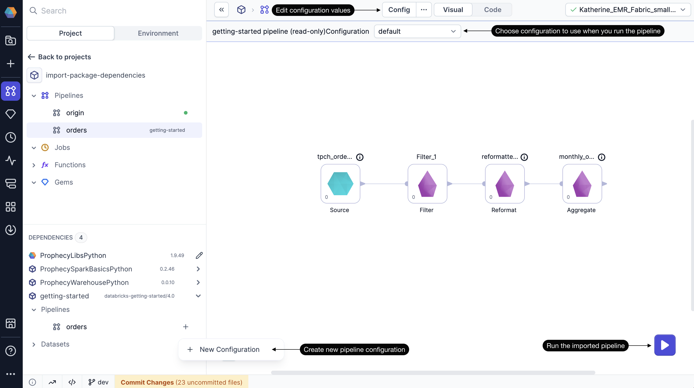

When you import a project from the Package Hub as a project dependency, there are certain ways to specifically leverage different components in the package. This page describes how to import functions, datasets, pipelines, and subgraphs from a package (source project) for use in your project.

While reading this page, keep in mind that you cannot edit the source components that you use from dependencies. Using components from packages will never change the original component provided in the package.

:::info
These examples are specifically written for Spark projects and packages.
:::

## Import functions

Functions in dependencies are automatically accessible in your project gems. This includes both [UDFs](/engineers/user-defined-functions) and [business rules](/engineers/business-rules).

If you have UDFs coming from two different projects with conflicting definitions, you will see an error in the **Diagnostics** panel.

## Import gems

[Gems](/engineers/gems) from dependencies appear in two places:

- All gems from dependencies can be accessed from the dependencies panel in the bottom left corner of the project editor. You can either drag the gem onto the pipeline canvas or click the **+** button that appears on hover.
- Some gems may appear in the gem drawer if they are imported from a Prophecy-provided package

When you add the gem to the canvas, you can configure the gem using custom values, but gem definitions (how the gem is written to function) cannot be.

## Import datasets

[Datasets](/engineers/dataset) from dependencies appear in the dependencies panel in the bottom left corner of the project editor. You can either drag the dataset onto the pipeline canvas or click the **+** button that appears on hover.

When you add the gem to the pipeline canvas, Prophecy prompts you to choose whether to add the dataset as a Source or Target gem. You must choose before the gem appears on the canvas.

:::info
When you use a dataset from another project, you might not be sure how the dataset is configured or where the dataset comes from. You might have access to the dataset, and you might not. Be aware of this as you import datasets from other projects.
:::

## Import pipelines

[Pipelines](/engineers/pipelines) from dependencies appear in the dependencies panel in the bottom left corner of the project editor. They cannot be edited, but rather can be run on editable configs that you create for the pipeline. They appear in the project browser under **Pipelines** once you start using the pipeline in your project.

If the source pipeline does not have a config schema set up, use the default config, which will be empty. If the source pipeline does have a config schema set up, you can also use the default schema to run the pipeline. Only if you want to change the values do you have to create your own config.

Imported pipeline can also be used for jobs. The same configs will appear for you to choose from in the pipeline gem of your job.

## Import subgraphs

[Subgraphs](/engineers/subgraph) from dependencies appear in the dependencies panel in the bottom left corner of the project editor. You can either drag the gem onto the pipeline canvas or click the **+** button that appears on hover.

As with pipelines, you can run the subgraph using your own [subgraph config](/engineers/basic-subgraph#subgraph-configurations) values. However, you cannot edit the subgraph itself.

## Transitive packages

If you import a packaged project that itself has dependencies, your project will inherit those dependencies as well. Inherited dependencies will be marked as **Transitive** packages.
