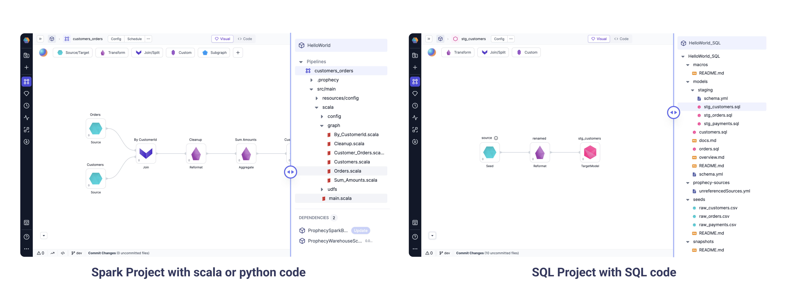

A **Project** in Prophecy is the core unit for developing, organizing, and deploying data workflows to production. It encompasses all the components needed for building and running data processes.

## Project types

When you create a project, you must choose a **project type**: Spark/Python, Spark/Scala, or SQL. Visually designed pipelines will generate code in the selected project output language.


Spark projects contain [pipelines](docs/get-started/concepts/project/pipelines.md), [datasets](docs/get-started/concepts/project/dataset.md), and [jobs](docs/Orchestration/Orchestration.md). SQL projects contain [models](docs/get-started/concepts/project/models.md), [datasets](docs/get-started/concepts/project/dataset.md), and [jobs](docs/Orchestration/Orchestration.md). You can view these components in the **Metadata** tab of the Prophecy user interface.

:::note
It is not currently possible to switch the output language of a project after it has been created.
:::

## Projects and Git

Each project must be stored in a Git repository. You can either choose to host your project on a Prophecy-managed repository, or you can connect your own external repository, like one on GitHub. Additionally, all assets within a project (like pipelines, models, datasets, and jobs) are stored as code in the project's Git repository.

Open any pipeline (left) or model (right) in your project. Simply toggle from visual to code to see the underlying code for that pipeline or model, as well as the rest of the project components.



Version control lets users and teams collaborate on projects, contribute simultaneously, and reuse code.

## What's next

To learn about the project lifecycle, visit [Develop and deploy a project](docs/ci-cd/deployment/deploy-project.md).

To explore different project components, view the following pages:

```mdx-code-block
import DocCardList from '@theme/DocCardList';
import {useCurrentSidebarCategory} from '@docusaurus/theme-common';

<DocCardList items={useCurrentSidebarCategory().items}/>
```
