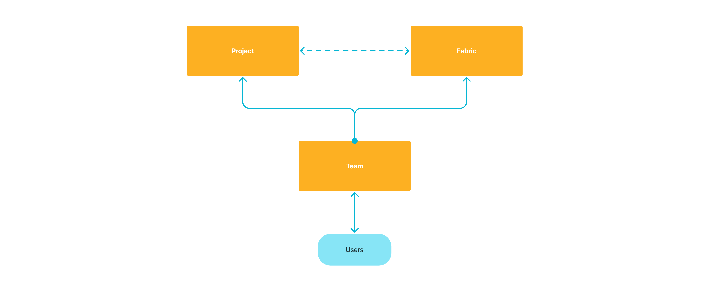
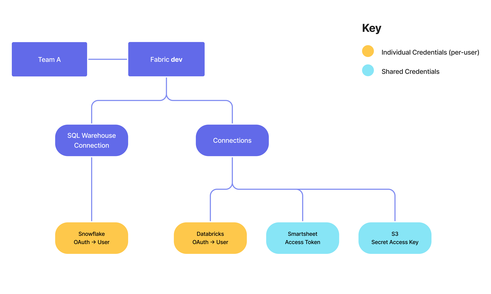
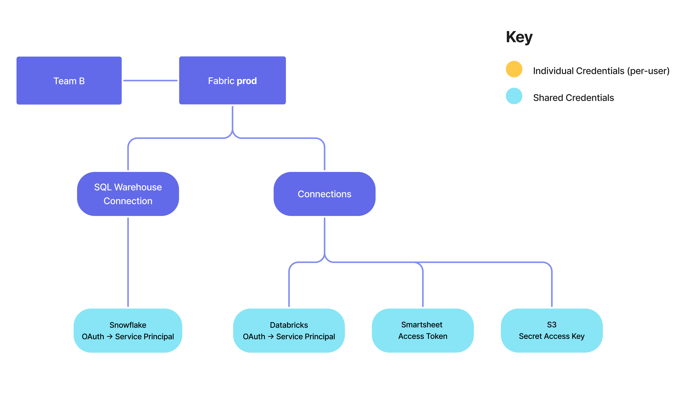
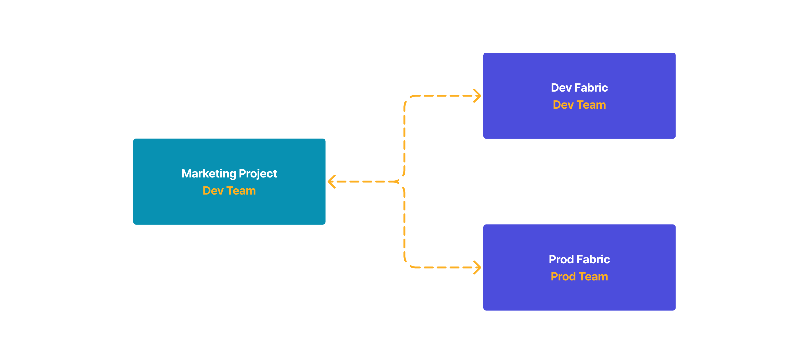

In Prophecy, access to resources is based on team associations with resources. Projects and fabrics are the fundamental resources to which teams are assigned. Users who belong to a team can access all projects and fabrics assigned to that team.

This guide provides comprehensive best practices for implementing and managing team-based access to optimize collaboration while maintaining appropriate security boundaries.

:::note
[Team admins](/administration/rbac#team-admins) have special privileges for managing team membership and team fabric creation, but the core access model remains focused on the team-to-resource relationship. Each team can be assigned to many projects and fabrics, but importantly, each project and fabric can only be assigned to one team.
:::

## Team structure

The way you structure your teams will fundamentally shape how users interact with data and resources in Prophecy. There are several approaches to team organization, each with its own advantages depending on your organization's needs.

In any case, teams should be assigned only to the resources they genuinely need to access. This principle minimizes the potential impact of compromised credentials and reduces the risk of accidental data modifications.

### Strategy 1: Environment-based teams

One of the most straightforward approaches is to split teams based on access to development and production environments. This creates a clear separation between experimentation and production workloads.

#### Dev Team (All Users)

- Limited access to data
- Access to development environment(s) only
- Allows for safe experimentation and testing

#### Prod Team (Platform Team Only)

- Complete access and control to production environment
- Restricted to users responsible for production operations
- Ensures controlled deployment to production

### Strategy 2: Function-based teams

As organizations scale, they often benefit from more granular team structures aligned with specific job functions. This approach allows for more precise resource allocation and specialized access patterns tailored to different roles within the data ecosystem. Here we provide one example of function-based teams.

#### Data Engineering Team

- Access to all environments, especially with raw data
- Design and build data pipelines
- Manage data quality and optimization

#### Marketing Analytics Team

- Access to environment with web analytics and campaign data
- Create reporting pipelines
- Send reports to BI tools to create dashboards
- Run [Prophecy Apps](/analysts/business-applications)

#### Product Analytics Team

- Access to environment with user behavior data and product metrics
- Create reporting pipelines
- Send reports to BI tools to create dashboards
- Run [Prophecy Apps](/analysts/business-applications)

## Fabric creation

Fabrics are the bridge between Prophecy and your execution environment. They encapsulate connection details and access credentials, making them a critical component of your security architecture. Thoughtfully configured fabrics ensure that the right people have the right level of access to your data processing resources.

:::note
Authentication capabilities vary between different connection types across fabrics. Visit individual connection documentation to learn about the specific authentication strategies available for that connection.
:::

### Development fabrics

Development fabrics should be configured to facilitate collaborative work and allow for experimentation.

- **Team assignment**: Dev team
- **Connection authentication**: Individual authentication
- **Benefits**: Maintains accountability with each run linked to an individual identity
- **Usage**: For projects in development phase only

Here is one example of how you may configure a [Prophecy fabric](docs/core/prophecy-fabrics/prophecy-fabrics.md) for development.

### Production fabrics

Production fabrics require a different approach focused on stability and reliability. These environments run your business-critical processes and must operate consistently without frequent intervention.

- **Team assignment**: Prod team
- **Authentication**: Service principal
- **Benefits**: Eliminates reauthentication needs and ensures smooth job execution
- **Usage**: For scheduled pipelines in deployed projects

Using service principals for production fabrics ensures that scheduled jobs continue to run even when individual team members are unavailable or their credentials change.

Here is one example of how you may configure a [Prophecy fabric](docs/core/prophecy-fabrics/prophecy-fabrics.md) for production.

## Project management

Projects in Prophecy encapsulate data pipelines, gems, tables, and other components. How you structure and assign these projects to teams will differ between use cases.

When you first begin using Prophecy, you can create projects with personal team for experimentation, then migrate to collaborative projects organized by business objectives:

- **Create purpose-specific projects**: "Marketing Analytics," "Customer Retention," etc.
- **Align with team structure**: Ensure projects are assigned to appropriate teams
- **Document project scope**: Define project boundaries and ownership

Purpose-specific projects help maintain focus and prevent the sprawl of unrelated components within a single project. By clearly defining each project's boundaries, teams can more easily understand what belongs where and how different components relate to business objectives.

### Sharing and collaboration

Prophecy's sharing model enables teams to reuse project components without compromising governance.

Projects can be shared with other teams to extend access. When a project is shared with your team:

- You can import project components into your own projects through the [Package Hub](/engineers/package-hub).
- You can run [Prophecy Apps](/analysts/business-applications) built on top of project pipelines.
- You **cannot** modify original project components.

This model encourages the creation of reusable components that can be leveraged across teams without duplication. When a team creates a high-quality transformation or dataset definition, other teams can incorporate it into their workflows without risk of breaking the original implementation.

:::note
Prophecy Apps are only available for SQL projects at this time.
:::

## Project and fabric relationships

The relationship between projects and fabrics is a fundamental aspect of Prophecy's architecture that directly impacts your team-based access strategy. Let's see how these elements interact.

### Execution requirements

Prophecy projects must be connected to a fabric to run pipelines. This is because fabrics contain your connections to execution environments and data sources that power your pipelines. Without this connection, a project remains a blueprint that cannot be executed.

### Cross-team connections

A key aspect of this relationship is that project and fabric team assignments operate independently. You can connect a project assigned to one team to a fabric assigned to a different team, provided you are a member of both teams. This independence lets you perform actions such as promoting projects from development to production environments.

For example, a business analyst in the development team can develop and test a project using a development fabric. When ready for production, a platform engineer in both the development team and production team can attach a production fabric to the project.

:::info
To accomplish the scenario above, you must ensure that at least one user is a member of both the project's team and the target fabric's team. This way, someone will be able to publish or deploy a project to production environments.
:::

### Provider compatibility

While cross-team connections provide flexibility, there are technical constraints to consider. For SQL projects **only**, the project must have the same provider as the fabric. This means:

- Databricks projects can only attach to Databricks fabrics.
- Snowflake projects can only connect to Snowflake fabrics.

:::note
Python and Scala projects do not specify "providers" at creation. These projects can connect to any Spark fabric.
:::
