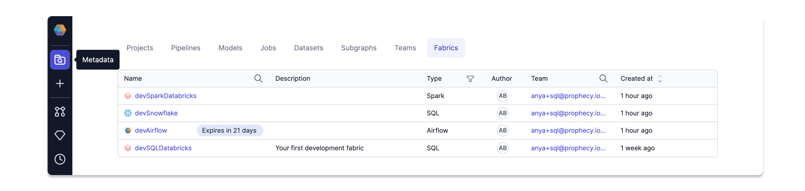

Prophecy helps you develop data pipelines in high-quality Spark or SQL code—but what does Prophecy use to compute these pipelines? The first thing to understand before building any pipeline is that your pipeline must be connected to an **execution environment**.

This is why **fabrics** exist in Prophecy. Fabrics let Prophecy connect to specific execution environments. When you do so, you can access the data sources available to you in that environment.

## Fabric types

Certain fabrics will be compatible with certain project types. Review the table below to understand the different fabric types.

| Fabric type                                    | Description                                            | Usage                                                       |
| ---------------------------------------------- | ------------------------------------------------------ | ----------------------------------------------------------- |
| [Prophecy](/administration/prophecy-fabrics/)  | Computation using the Prophecy engine and a SQL engine | Run pipelines in SQL projects                               |
| [Spark](/administration/Spark-fabrics/Fabrics) | Computation using a Spark engine                       | Run pipelines in PySpark/Scala projects and Databricks jobs |
| [SQL](/administration/sql-fabrics/Fabrics)     | Computation using Spark SQL engines or SQL warehouses  | Run models in SQL projects                                  |
| [Airflow](/Orchestration/airflow/)             | Computation using Airflow-compatible engines           | Run Airflow jobs                                            |

## Share fabrics

When you create a fabric, you assign it to a [team](docs/administration/teams-users/teamuser.md). The fabric then becomes available to all users in the team.

Even though teams share fabrics, users will be prompted to add their individual credentials to be able to use the fabric in their projects.

## Use case

Here is one way you might set up your fabrics. First, the team admin creates:

- A team named Marketing_DSS for the Marketing Decision Support System users.
- A `dev` fabric for development activities that specifies the Marketing_DSS team.
- A `prod` fabric for production pipelines that specifies the Marketing_DSS team.

In this example, all users in the Marketing_DSS Team will have access to the `dev` and `prod` fabrics.

## Components

Fabrics include everything required to run a data pipeline. As an example, the following table describes the components of a Spark Databricks fabric.

| Component              | Description                                                                                                                                                                                                                               |
| ---------------------- | ----------------------------------------------------------------------------------------------------------------------------------------------------------------------------------------------------------------------------------------- |
| Connection Credentials | Includes details like _Workspace URL_ and _Access Token_ for Databricks.                                                                                                                                                                  |
| Cluster Configuration  | Defines settings such as _Databricks Runtime Version_, _Machine Type_, and _Idle Timeout_.                                                                                                                                                |
| Job Sizes              | Lets you define reusable cluster sizes (e.g., an XL cluster with 10 i3.xlarge servers, 40 CPUs, and 70GB memory).                                                                                                                         |
| Scheduler              | Executes Spark data pipelines on a defined schedule, such as weekdays at 9:00 AM. Databricks provides a default scheduler, and an Airflow Scheduler is available for enterprise users.                                                    |
| Database Connections   | Supports connections to databases (MySQL, Postgres) and data warehouses (Snowflake) via JDBC or other protocols. Credentials are securely stored on the fabric for reuse.                                                                 |
| Credentials & Secrets  | Securely stores credentials in Databricks using Personal Access Tokens (PAT) or [Databricks OAuth](/docs/administration/authentication/databricks-oauth.md). Secrets are stored as key-value pairs, accessible only to running workflows. |

## Fabric metadata

A list of all fabrics available to you can be found in the **Fabrics** tab of the **Metadata** page.

You can click into each fabric to access the fabric settings. These will resemble the settings that appear during fabric creation.
