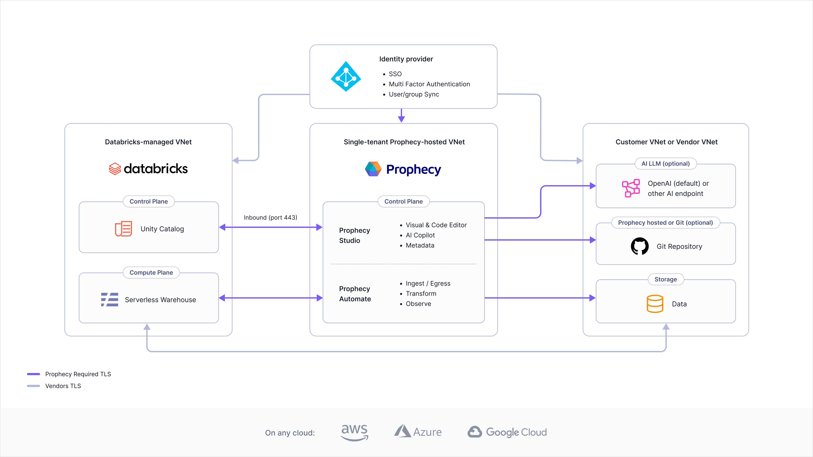
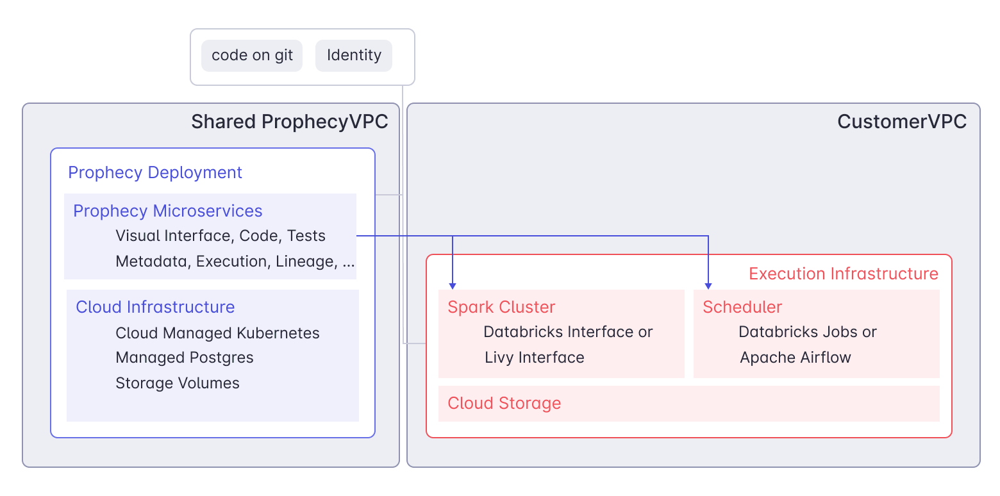

Prophecy operates as a distributed system built on microservices architecture, orchestrated by Kubernetes across multiple cloud platforms. The platform consists of several core components that work together to provide data transformation, orchestration, and management capabilities.

## Free and Professional Edition

The Free and Professional editions provide a complete data platform with managed components:

| Component          | Description                                                                                                   |
| ------------------ | ------------------------------------------------------------------------------------------------------------- |
| Prophecy Studio    | The control plane that provides the user interface for developing visual data pipelines and managing projects |
| Prophecy Automate  | The native runtime designed for data ingestion, egress, and built-in scheduling capabilities                  |
| Prophecy Warehouse | The execution engine that processes data transformations using Prophecy-managed compute resources             |
| AI                 | Prophecy-managed LLM subscription and endpoint                                                                |
| Source control     | Git integration supporting both Prophecy-managed and external Git repositories                                |

:::info
**Deployment**: SaaS only. Learn more in [Deployment models](#deployment-models).
:::

## Express Edition

The Express edition combines Prophecy's control plane with your existing data warehouse infrastructure:

| Component          | Description                                                                                                            |
| ------------------ | ---------------------------------------------------------------------------------------------------------------------- |
| Prophecy Studio    | The control plane that provides the user interface for developing visual data pipelines and managing projects          |
| Prophecy Automate  | The native runtime designed for data ingestion, egress, and built-in scheduling capabilities                           |
| External Warehouse | Your own Databricks SQL engine that executes data transformations, allowing you to leverage existing compute resources |
| AI                 | Customer-managed LLM subscription and endpoint                                                                         |
| Source control     | Git integration supporting both Prophecy-managed and external Git repositories                                         |

:::info
**Deployment**: Dedicated SaaS only. Learn more in [Deployment models](#deployment-models).
:::

## Enterprise Edition

The Enterprise edition offers maximum flexibility with multiple execution engine options and deployment models:

| Component        | Description                                                                                                                                                                                                                                                                                                                        |
| ---------------- | ---------------------------------------------------------------------------------------------------------------------------------------------------------------------------------------------------------------------------------------------------------------------------------------------------------------------------------- |
| Prophecy Studio  | The control plane that provides the user interface for developing visual data pipelines and managing projects across various data platforms                                                                                                                                                                                        |
| Execution engine | Flexible compute options including Spark clusters or external SQL warehouses combined with Prophecy Automate. Prophecy executes data transformations on your chosen execution environment. [Fabrics](/getting-started/concepts/fabrics) enable users to execute pipelines on these platforms. Prophecy does not persist your data. |
| AI               | Customer-managed LLM subscription and endpoint                                                                                                                                                                                                                                                                                     |
| Source control   | Git integration supporting both Prophecy-managed and external Git repositories                                                                                                                                                                                                                                                     |

:::info
**Deployment**: Dedicated SaaS preferred, Self-hosted supported, and SaaS available. Learn more in [Deployment models](#deployment-models).
:::

Prophecy supports flexible architecture configurations beyond the illustrated examples:

- **Execution engines**: While the diagram shows Databricks as the execution engine, you can connect to other platforms including Amazon EMR, Google Cloud Dataproc, or any Spark engine through [Apache Livy](https://livy.apache.org/)
- **Source control providers**: The diagram displays a connection to an external Git repository, but you can integrate with various providers including GitHub, Bitbucket, GitLab, and other Git-compatible systems

## What is Prophecy Automate?

Prophecy Automate is the native runtime available across all Prophecy editions. This integrated platform provides three core capabilities:

- **Ingest**: Data ingestion capabilities that support reading from and writing to data warehouses. Designed for business data sources including SharePoint, SFTP, and Excel files.

- **Orchestrate**: Scheduling and workflow management with time-based and trigger-based execution options. Provides intuitive interactive experiences with comprehensive built-in monitoring capabilities.

- **Observe**: Integrated monitoring and observability features that enable quick troubleshooting of scheduled pipelines, cost analysis, performance monitoring, and data quality oversight, all accessible through the Prophecy Studio interface.

:::note
Prophecy Automate is only accessible via [Prophecy fabrics](/core/prophecy-fabrics/) for SQL projects and does not apply to Spark-based projects at this time.
:::

## Deployment models

Prophecy offers multiple deployment options to meet different organizational requirements for security, isolation, and management preferences.

| Feature                                          | SaaS | Dedicated SaaS |
| ------------------------------------------------ | ---- | -------------- |
| No installation required                         | ✔    | ✔              |
| Automatic upgrades and access to latest features | ✔    | ✔              |
| Managed infrastructure costs                     | ✔    | ✔              |
| Isolated data/environment                        |      | ✔              |

### SaaS

The SaaS deployment option is entirely Prophecy-managed and operates on a multi-tenant architecture. This deployment model provides the fastest access to the latest features and updates. Organizations can quickly evaluate Prophecy using our SaaS environment by signing up for a [free trial](https://app.prophecy.io/metadata/auth/signup).

### Dedicated SaaS

:::edition Enterprise Only
This feature requires the [Enterprise Edition](/getting-started/editions/prophecy-editions) of Prophecy.
:::

The Dedicated SaaS deployment combines the convenience of Prophecy-managed infrastructure with the privacy and isolation of a single-tenant architecture. This deployment model operates on Prophecy's Virtual Private Cloud, providing dedicated resources and enhanced security.

Organizations can select their preferred cloud platform (AWS, Azure, or GCP), while Prophecy handles installation, maintenance, resource allocation, and ongoing management tasks.

:::info
While Prophecy continues to support existing customers with self-hosted deployments, new self-hosted installations are **discouraged** in favor of managed deployment options.
:::
