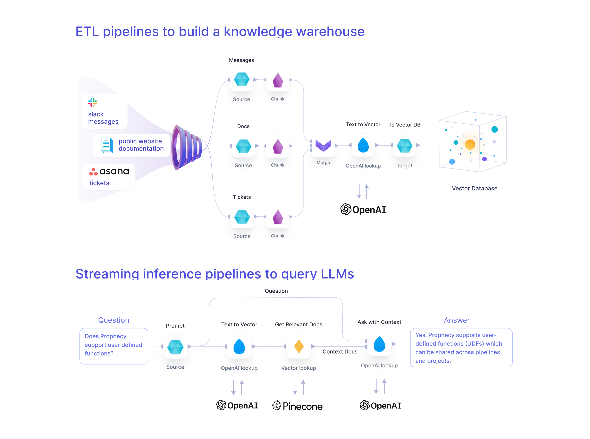

<div class="wistia_responsive_padding" style={{padding:'62.5% 0 0 0', position:'relative'}}>
<div class="wistia_responsive_wrapper" style={{height:'100%',left:0,position:'absolute',top:0,width:'100%'}}>
<iframe src="https://fast.wistia.net/embed/iframe/mzi4es0kxn?seo=false?videoFoam=true" title="Getting Started With SQL Video" allow="autoplay; fullscreen" allowtransparency="true" frameborder="0" scrolling="no" class="wistia_embed" name="wistia_embed" msallowfullscreen width="100%" height="100%"></iframe>
</div></div>
<script src="https://fast.wistia.net/assets/external/E-v1.js" async></script>

This guide showcases how easy it is to build a live chatbot application using your internal datasets on Spark. Here is a summary of the steps you'll take to set up and explore the Generative AI Chatbot Pipelines:

1. **Setup**: You'll configure the dependencies, define credential secrets and load the Pipelines from a Git repository.
2. **Build a Knowledge Warehouse**: You'll explore a set of Spark Pipelines to [(a)ingest](/docs/getting-started/genaichatbot.md#2a-web-ingest-pipeline) unstructured data from your applications, pre-process, and [(b)vectorize](/docs/getting-started/genaichatbot.md#2b-web-vectorize-pipeline) and store the data within your vector database of choice.
3. **Run a Live Inference Pipeline**: You'll run a Spark streaming [Chatbot](/docs/getting-started/genaichatbot.md#step-3-live-inference) Pipeline that reads messages from Slack and answers them live using information from your new Knowledge Warehouse.



This guide is an expanded view of [these](https://github.com/prophecy-samples/gen-ai-chatbot-template) succinct instructions and [this](https://www.youtube.com/watch?v=1exLfT-b-GM&t=1090s) Data+AI Summit session.

## Requirements

### External dependencies

Optional, but recommended for best results:

1. [**Pinecone**](https://www.pinecone.io/) - allows for efficient storage and retrieval of vectors. To simplify, it's possible to use Spark-ML cosine similarity alternatively; however, since that doesn't feature KNNs for more efficient lookup, it's only recommended for small datasets.
2. [**OpenAI**](https://openai.com/) - for creating text embeddings and formulating questions. Alternatively, one can use Spark's [word2vec](https://spark.apache.org/docs/2.2.0/mllib-feature-extraction.html#word2vec) for word embeddings and an [alternative LLM (e.g., Dolly)](https://github.com/prophecy-io/spark-ai/tree/main) for answer formulation based on context.
3. [**Slack**](https://slack.com/) or [**Teams**](https://teams.com/) (support coming soon) - for the chatbot interface. An example batch Pipeline is present for fast debugging when unavailable.

### Cluster library dependencies

Required:

1. [**Spark-AI**](https://github.com/prophecy-io/spark-ai/tree/main) - Toolbox for building Generative AI applications on top of Apache Spark.

:::info

These dependencies are automatically included if you Fork our sample project as detailed below.

:::

### Platform recommendations

Below are some platform recommendations. Like all Prophecy projects the code generated by the template has no vendor lock-in so it should run wherever Spark does.

1. [**Prophecy Low-Code**](https://www.prophecy.io/) (version 3.1 and above) - for building the data Pipelines. A free account is available.
2. [**Databricks**](https://Databricks.com/) (DBR 12.2 ML and above) - for running the data Pipelines. There are some free/low-cost options available or you can use the compute that comes with Prophecy's free trial.

## Step 1: Setup

We'll start by forking our existing sample repository. This will leave you with your own copy that you can modify however you want.

1. [Fork](https://github.com/prophecy-samples/gen-ai-chatbot-template/fork) the repo so you have your copy at something like `https://github.com/<your_username>/gen-ai-chatbot-template`
2. Clone the repo onto your local machine (i.e `git clone https://github.com/<your_username>/gen-ai-chatbot-template`)

### 1a. Dependencies

Create accounts for the services you want to use for your Generative AI Chatbot. For each service create access tokens and save them within a file named `.env` in your repo. See `sample.env` for an example.

For our example, we will be using Slack, OpenAI and Pinecone.

#### Slack

Here are the steps to set up the Slack bot. If you prefer a video walkthrough, [see here](https://www.loom.com/share/2d7afeacd92e44809ab29b43665329dd?sid=c4e08d9d-bf86-4a6f-9e9d-fce9d7a12578). Using a Slack workspace where you have Admin permissions, follow these steps:

1. [Set up a Slack application](https://api.slack.com/reference/manifests#creating_apps) using the manifest file [here](https://github.com/prophecy-samples/gen-ai-chatbot-template/blob/main/apps/slack/manifest.yaml).
2. Install the Slack app in the workspace.
3. Create an [App-Level Token](https://api.slack.com/start/quickstart#getting-auth-token) with `connections:write` permission. This token is going to be used for receiving messages from Slack. Save it as `SLACK_APP_TOKEN` in your `.env` file.
4. Find the Bot User OAuth [Token.](https://api.slack.com/authentication/token-types) The permissions (or scopes, in Slack terminology) are defined in the [manifest](https://github.com/prophecy-samples/gen-ai-chatbot-template/blob/main/apps/slack/manifest.yaml) file. This token is going to be used for sending messages to Slack. Save it as `SLACK_TOKEN` in your `.env` file
5. Create a new Slack channel in this Slack workspace.
6. Invite your Slack app to the channel.

#### OpenAI

1. Join your company's OpenAI Organization by asking your Admin for an email invite. Alternatively, create an account [here](https://platform.openai.com/signup).
2. Find your OpenAI API key as described [here.](https://help.openai.com/en/articles/4936850-where-do-i-find-my-secret-api-key) Save it as `OPEN_AI_API_KEY` in your `.env` file

#### Pinecone

1. Join your company's Pinecone Organization by asking your Admin for an email invite. Alternatively, create an account [here](https://app.pinecone.io).
2. Open an existing Pinecone Project or create a new one.
3. Create an index. We used an index with `1536` dimensions, `Cosine` metric, and an `s1` pod type.
4. Within the appropriate Pinecone Project, generate a Pinecone API key as mentioned [here.](https://docs.pinecone.io/docs/projects#api-keys) Save it as `PINECONE_TOKEN` in your `.env` file.

### 1b. Databricks Secrets and Schemas

The Databricks CLI is a command line tool that lets you interact with your Databricks workspace. Use the Databricks CLI here to store the tokens created in [Step 1a](/docs/getting-started/genaichatbot.md/gen-ai-chatbot#1a-dependencies) safely as Databricks `secrets`. Also, use the Databricks CLI to create catalog tables and schemas. Follow the steps below and for more details about the Databricks CLI read [here.](https://docs.databricks.com/en/archive/dev-tools/cli/index.html)

Find `setup_Databricks.sh` [here](https://github.com/prophecy-samples/gen-ai-chatbot-template/blob/main/setup_databricks.sh).

1.  Ensure that your `.env` file contains all the above secrets. Use the [sample.env](https://github.com/prophecy-samples/gen-ai-chatbot-template/blob/main/sample.env) as an example, and `source` your `.env` file (i.e `source .env`)
2.  Install the Databricks CLI using `pip install Databricks`. Currently version 0.17.x is supported.
3.  Use `databricks configure` to set up a connection from your local machine to your Workspace.
4.  Run `setup_Databricks.sh` to create the required secrets and schemas.
5.  Expected output of `setup_Databricks.sh`:

```
Variable definitions
Resources created, eg catalog tables, Databricks scopes, secrets
```

6.  Verify `setup_Databricks.sh` creates the needed resources using these commands described [here](https://docs.databricks.com/en/archive/dev-tools/cli/unity-catalog-cli.html) and [here](https://docs.databricks.com/en/archive/dev-tools/cli/secrets-cli.html):

```console
databricks unity-catalog catalogs list | grep gen_ai
databricks unity-catalog schemas list --catalog-name gen_ai
databricks secrets list-scopes
databricks secrets list --scope slack
```

### 1c. Load the Git repository

1.  Login to [Prophecy](https://app.prophecy.io/metadata/auth/signup)
2.  Create a new Prophecy Project.
3.  Load the forked Git repository to the Prophecy Project as shown in this 30-second [video.](https://github.com/prophecy-samples/gen-ai-chatbot-template/assets/3248329/dcdfabaf-4870-421d-9f92-4ab028c5db5a), pointing to your fork at `https://github.com/<your_username>/gen-ai-chatbot-template`
4.  Connect to your Spark cluster by creating a Fabric following [these steps.](https://docs.prophecy.io/concepts/fabrics/create-a-fabric/#databricks)

### 1d. Set up Databases

This project runs on Databrick's Unity Catalog by default. However, you can also reconfigure Source & Target gems to use alternative sources.

For Databricks Unity Catalog, the `setup_Databricks.sh` script has already created the following catalog: `gen_ai` and the following databases: `web_bronze` and `web_silver`. The tables are going to be created automatically on the first boot-up.

### 1e. Explore the Low-Code Interface


When you open any Prophecy Pipeline, you’ll see lots of features accessible. From the Environment tab, browse available datasets and tables in the linked data catalog. See a variety of Gems available out-of-the-box by clicking for example the Transformation or Join/Split headers. The visually designed Pipeline is translated to actual Spark code written in Scala, pySpark, or SQL. Just click at the top of the canvas to switch from the visual editor to the code editor. At the very bottom notice there’s a button to commit local changes to Git. Prophecy Pipelines are committed to the user’s Git repository and therefore offer the best software development practices: code review, versioning, proper releases, etc.

The `play` button runs the Pipeline and offers data previews between Gems. This interactive feature is super handy to see how each Gem manipulates the data and to quickly check that the data is produced as expected. The project runs entirely on Spark and will scale for any data volume, big and small.

Now that we’ve had a brief introduction to the Prophecy Pipeline editor, let’s dig into the Pipelines specific to the Generative AI Chatbot. The Pipelines accomplish two goals: (a) build a Knowledge Warehouse full of vectorized web documentation, and (b) a streaming inference Pipeline to read messages from Slack, query an LLM to formulate answers, and send them back to Slack. Notice most of the data manipulations are standard transformations to help construct a prompt for the OpenAI model (or the model of your choice).

## Step 2: Build a Knowledge Warehouse

### 2a. Web Ingest Pipeline

We are ingesting unstructured data from [Prophecy Documentation](https://docs.prophecy.io/), in particular the [sitemap](https://docs.prophecy.io/sitemap.xml) which has links to all the individual web pages.


A new Gem is introduced in this Pipeline: the TextProcessing Gem helps scrape the URL and content from the Documentation pages.

The series of data transformations culminates with nicely formatted web Documentation data saved in a Unity Catalog table to end the Web Ingest Pipeline.

### 2b. Web Vectorize Pipeline

Continuing with the goal of ingesting and vectorizing our web content, here we have the Web Vectorize Pipeline. We want to assign each document a number sequence, or vector, to map the similarity and relationships between those documents. Here we selected OpenAI [ada-002](https://openai.com/blog/new-and-improved-embedding-model) model based on performance and cost. As some of the documents are very long, we split them into smaller chunks. Each chunk is sent to OpenAI’s ada model. Run the Pipeline using the “Play” button and data preview buttons appear between Gems. Open the data preview following the OpenAI Gem and see the schema now includes a vector (or “embedding”) provided by the OpenAI model for each text chunk.


Once the document chunks have each been assigned a vector, these “embeddings” are stored in the Unity Catalog and to a [vector database](https://www.pinecone.io/learn/vector-database/) (eg Pinecone). We can use this Knowledge Warehouse to construct our LLM prompt in the next Pipeline.

#### 2b.i Configuring the Web Vectorize Pipeline

1. Verify the Vectorize OpenAI Gem is configured with Databricks scope `open_ai` and Databricks key `api_key`.
2. Verify the vector_db Target Gem is configured with the Databricks scope `pinecone` and Databricks key `token`.

## Step 3: Live Inference

### 3a. Chatbot Live Pipeline

Finally, we get to run the most exciting Pipeline! The Chatbot Live streaming Pipeline ingests messages from Slack and sends the question and the relevant context to OpenAI which provides an answer.

After ingesting the Slack question message and doing some transformation steps, the Chatbot Live Pipeline queries OpenAI to create an embedding specifically for the question. Then, the Pinecone Lookup Gem identifies documents, based on their vectors, which could be relevant for the question. With the IDs and vectors in hand, we need to pull from the full document corpus the relevant documentation text. The Join Gem does exactly this: gets content for the relevant document IDs. Now we are well on our way to creating a wonderful prompt! The OpenAI Gem sends the relevant content chunks and the Slack question in a prompt to OpenAI, and the model returns an answer. Finally, the Pipeline writes the answer back to the Slack thread.


#### 3a.1 Configuring the Chatbot Live Pipeline

1. Verify the `slack_chat` Source Gem is configured with Databricks scope `slack` and Databricks Key `app_token`. While this token begins with `xapp-`, be sure not to use the plaintext value, as using the Databricks secret is a much more secure approach.
2. Update the `only_user_msgs` Filter Gem with the Slack app member ID:
   
3. Verify the `bot_message` Target Gem is configured with Databricks scope `slack` and Databricks Key `token`. While this bot user OAuth token begins with `xoxb-`, be sure not to enter the plaintext value.
4. Run the streaming Pipeline using the big `play` button rather than the individual Gem `play` buttons
5. Type a question into the Slack channel and check the Pipeline to see if the question is ingested and processed. Use the interims (as described above) to watch your message travel through the Pipeline. Error messages are visible in the data preview samples.
6. Ask lots of questions!


And that’s it! Congratulations on running the Generative AI Chatbot with Prophecy on Spark! You can check out the end result in the [video here](https://www.loom.com/share/a89ee52de80e41abb9b5647c1da73e18?sid=6fcf0298-79e8-412b-8e48-f58c9d6d7f3b) and a longer version [here](https://www.youtube.com/watch?v=1exLfT-b-GM&t=1090s). Don't forget, all of these visually developed Pipelines are converted to Spark code behind the scenes. Toggle to the code editor to see the code. This code is available in your forked GitHub repository when you commit, merge, and release your changes via the Prophecy UI. Now your Spark project can be run on any Spark cluster via the Prophecy interface or using your favorite build and deploy toolset. You may notice a Chatbot Batch Pipeline available in the Project for those who wish to explore it. We won’t go into detail on Chatbot Batch because the steps are similar to those in the Chatbot Live (streaming) Pipeline.

## Summary

Making a GenAI chatbot is largely an ETL problem that can be solved using a low-code interface. Most of the work is setting up the dependencies (Slack, OpenAI, and Pinecone - or your favorite replacements for these). The ETL Pipelines ingest and vectorize the web content. Then the Chatbot Pipeline constructs a prompt for OpenAI using a question in Slack and the documentation content scraped from the web. Once we have the prompt, OpenAI (or another model) can respond with an answer.

What kind of Generative AI applications will you create? We'd love to hear your ideas and feedback! Please send us an email (contact.us@Prophecy.io) or reach out on our Slack [community.](https://join.slack.com/t/prophecy-io-support/shared_invite/zt-moq3xzoj-~5MSJ6WPnZfz7bwsqWi8tQ) We are eager to share the Prophecy interface with as many low-code users as we can because we think enabling more people to build their own solutions is the best way to use the latest technologies.

## FAQ

**What features will be coming soon?**

Stay tuned for support for additional models beyond those provided by OpenAI. Also, Prophecy will support private models and offer additional machine-learning Gems out of the box. [**Teams**](https://teams.com/) message ingestion will soon be available out of the box as well. Of course, Prophecy is entirely extensible to interface with more applications. If you'd like to see a particular application supported, don't hesitate to let us know.

**Exactly which content is sent to OpenAI in the Chatbot Live Pipeline?**

For this to work, you’re sending the scraped web data (here we use Prophecy documentation) to OpenAI for the vectorization Pipeline and again to answer the question.

**Do you support private instances of Open AI or other language models?**

Coming soon!
