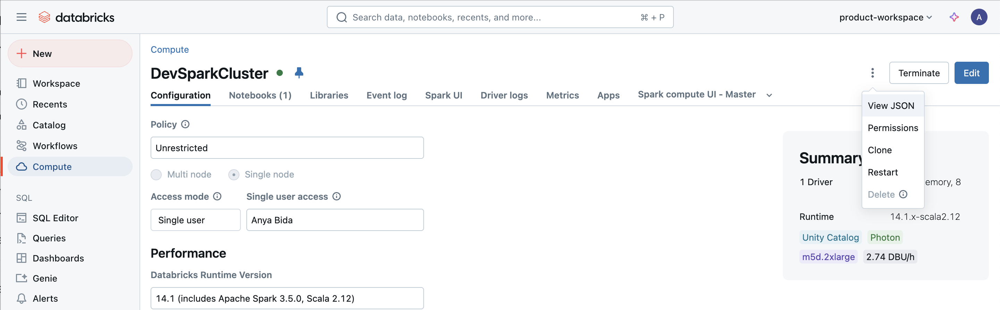
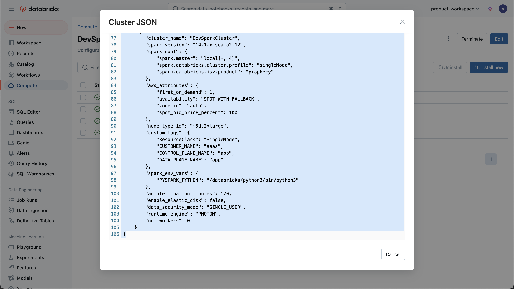
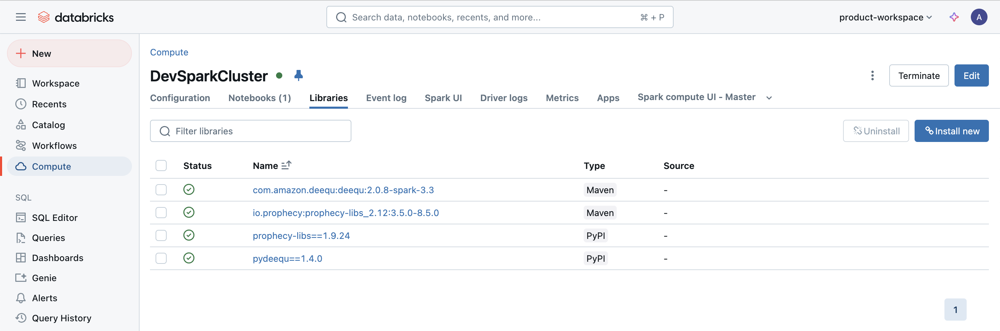
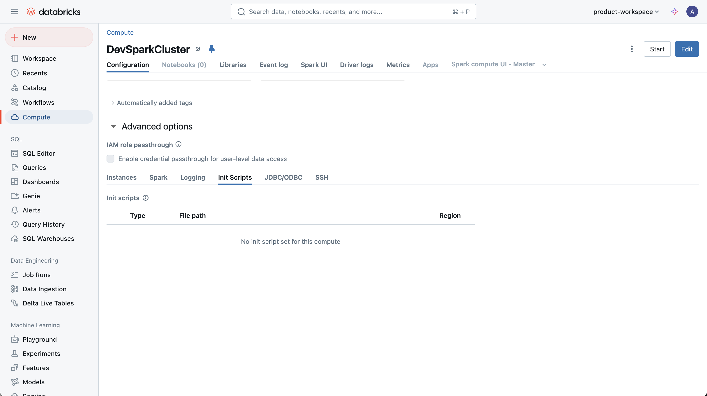

Send the following via the Prophecy [Support Portal](https://prophecy.zendesk.com/)

1. Overall Cluster config (what spark version, databricks runtime version, UC single or UC shared, etc). Please send a screenshot.
   

2. Please provide the json, edited to remove any private or sensitive information.  
   

3. What libraries are installed on the cluster? Please send a screenshot.
   

4. Try attaching the same cluster in a notebook. You may need to duplicate the tab and try attaching the same cluster in the duplicate tab. Please send the error screenshot if any.

5. What init scripts are run on the cluster? Having the script itself is helpful to debug.
   
