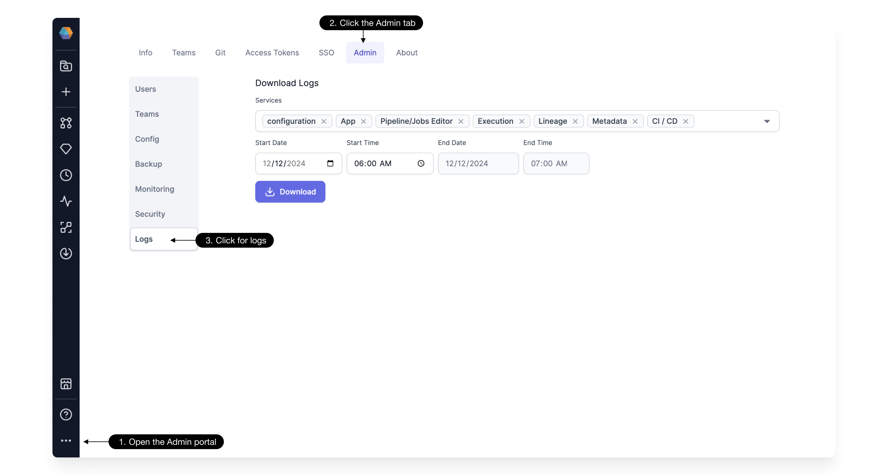

Which logs to send in the [Support Portal](https://prophecy.zendesk.com/)?

<div class="troubleshooting-table">

| <div style={{'width':'100px'}}>I'm having an issue with...</div>   | My Prophecy endpoint is app.prophecy.io                                                                                                                                | My Prophecy endpoint is custom.prophecy.io                                                                                                                             |
| ------------------------------------------------------------------ | ---------------------------------------------------------------------------------------------------------------------------------------------------------------------- | ---------------------------------------------------------------------------------------------------------------------------------------------------------------------- |
| ...attaching a Pipeline to a spark cluster, or running a Pipeline. | Spark cluster [configuration](./logs.md#configurations) and [connectivity](./logs.md#connectivity-check) check.                                                        | Spark cluster [configuration](./logs.md#configurations) and [connectivity](./logs.md#connectivity-check) check.                                                        |
| ...with a Spark application.                                       | Prophecy [Pipeline](./logs.md#pipeline-logs) logs and Spark [Driver](https://docs.databricks.com/en/compute/troubleshooting/debugging-spark-ui.html#driver-logs) logs. | Prophecy [Pipeline](./logs.md#pipeline-logs) logs and Spark [Driver](https://docs.databricks.com/en/compute/troubleshooting/debugging-spark-ui.html#driver-logs) logs. |
| ...anything else.                                                  | Support team can access [Prophecy logs](./logs.md#prophecy-system-logs)) directly.                                                                                     | [Prophecy logs](./logs.md#prophecy-system-logs) from admin page.                                                                                                       |

</div>

## Prophecy Issues

### Prophecy System Logs

:::info
This feature requires Prophecy 3.4.1.0 or later.
:::

Use the log collection feature to download all Prophecy system logs from the [admin page.](/docs/architecture/self-hosted/download-logs.md#navigate-to-the-download-logs-ui)


### Pipeline Logs

Use the log download button inside any Pipeline to download logs related to that particular Pipeline.


## Spark Cluster Issues

When attaching a Spark cluster to a Pipeline, Prophecy uses the Fabric details. Check for error codes [here](/docs/Spark/fabrics/diagnostics.md) and send this information via the Support Portal if applicable.

### Configurations

Use the [Spark UI](./cluster-config-ui.md) or a [notebook](./cluster-config-notebook.md) to collect cluster configurations and send via the Support Portal.

### Connectivity Check

Open a notebook on the Spark cluster and run the following command, adjusting the Prophecy endpoint:

````mdx-code-block
import Tabs from '@theme/Tabs';
import TabItem from '@theme/TabItem';

<Tabs>

<TabItem value="py" label="Python">

```py
import subprocess

command = 'curl -X GET "https://customer_prophecy_url/execution"'
output = subprocess.check_output(['/bin/bash', '-c', command], text=True)

print(output)
```

</TabItem>
<TabItem value="scala" label="Scala">

```scala
%scala
import sys.process._
val command = """curl -X GET "https://customer_prophecy_url/execution""""
Seq("/bin/bash", "-c", command).!!
```
</TabItem>
</Tabs>

````

This command tests the reverse websocket protocol required by Prophecy to execute Pipelines on Spark clusters. Please send the output from this command in the Support Portal.

**We look forward to hearing from you!**
