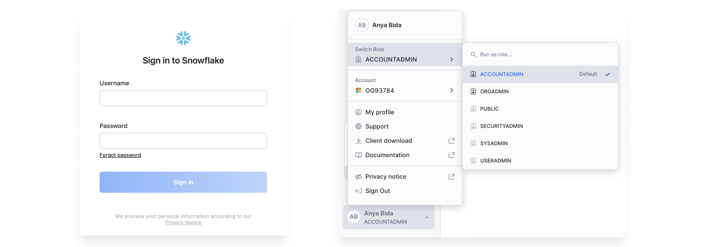
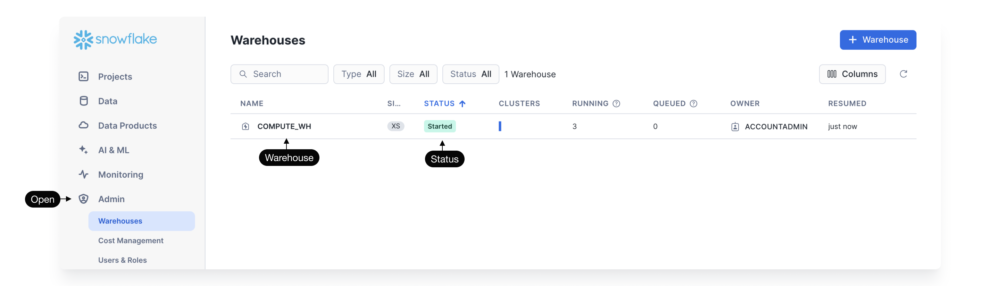
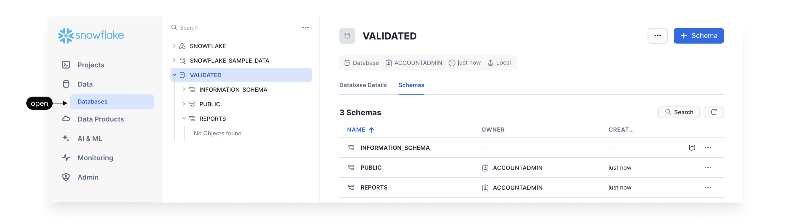
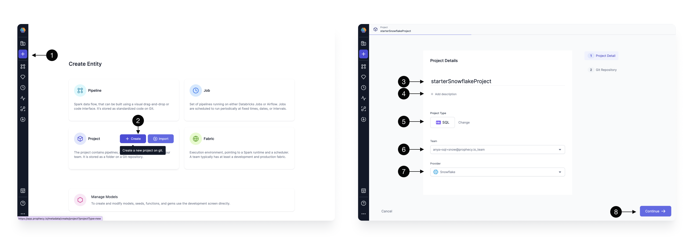
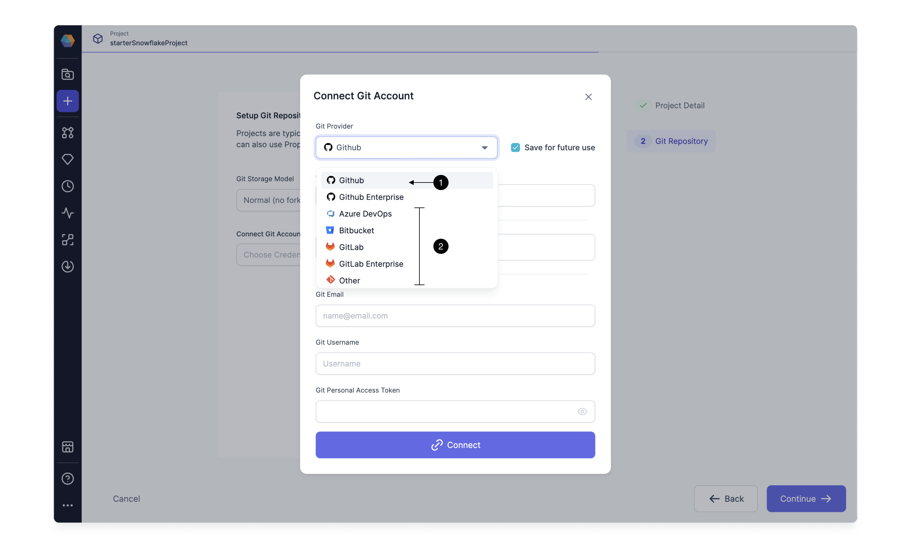
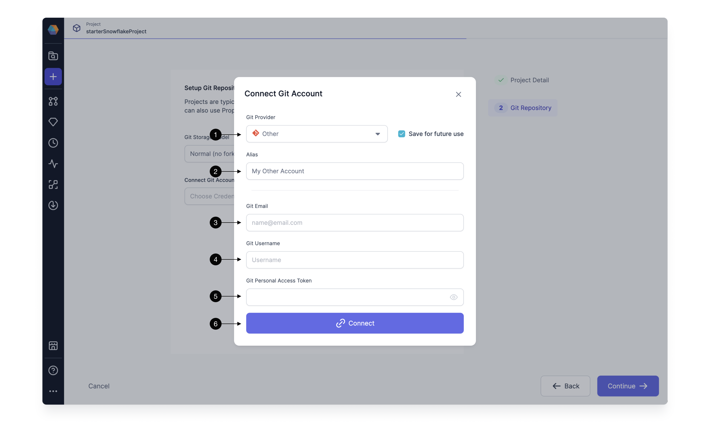
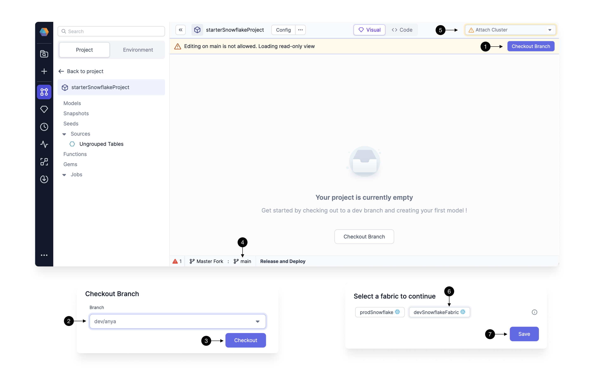
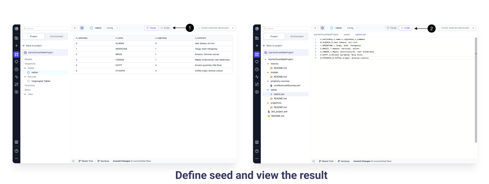
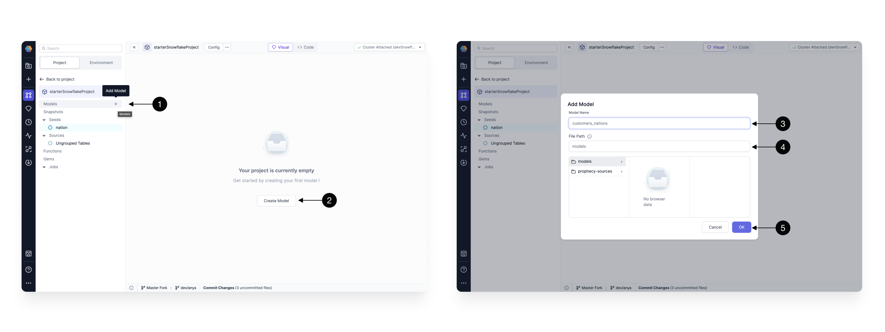
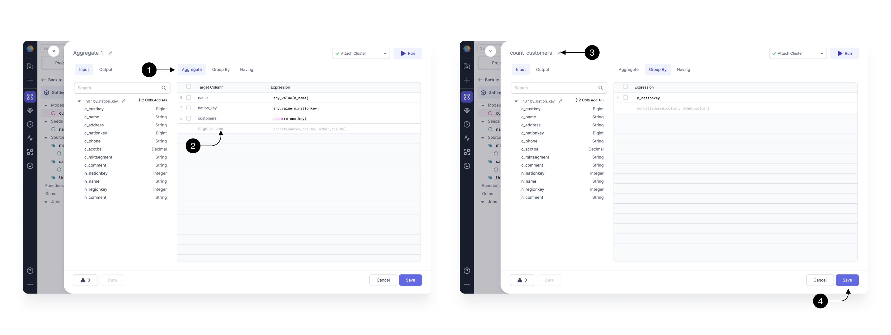

At Prophecy, we've added [low-code SQL capabilities](https://www.prophecy.io/blog/announcing-prophecy-3-0-low-code-sql-transformations) to our platform, so users can build highly performant queries on par with the best analytics engineers without needing to be coding experts. We built this feature on top of [dbt Core™️ ](https://github.com/dbt-labs/dbt-core), an open-source tool for managing SQL-based data transformations. With low-code SQL, our customers can build complex queries visually, and the tool automatically translates them into optimized SQL code in Git that’s fully open and accessible to all. This makes it simpler for more people to work with data and extract insights.

#### This quick start gets you up and running with low-code SQL on Snowflake and low-code Jobs on Airflow

#### You will need

- Snowflake Account
- Github Account (recommended)
- Airflow - MWAA or Composer (optional)

## 1. Setup Prophecy account

Sign up for a [Prophecy account](https://app.Prophecy.io/metadata/auth/signup) to start a 21 day trial.

[](https://app.prophecy.io/metadata/auth/signup)

## 2. Connect to Snowflake

### 2.1 Get Snowflake Account URL and credentials

To connect Prophecy to Snowflake, you'll need to assemble a few items. The Snowflake URL is a combination of the Snowflake organization and account, in the following format:


As a user, you'll login to Snowflake using your username and password credential. Prophecy will use the same credential so that the Prophecy user can obtain the same level of access for Snowflake tables. Snowflake also has a Role for each user; identify the appropriate Role for Prophecy to use.



### 2.2 Identify the location for materializations

Identify the desired Warehouse and make sure the Warehouse is started.



Prophecy needs a default location for materializing tables and views, etc. Identify the desired database and schema for default writes.



### 2.3 Setup Prophecy's Fabric

Prophecy introduces the concept of a Fabric to describe an execution environment. In this case, we create a single Fabric to connect a Snowflake warehouse and execute SQL models interactively. The Fabric defines the environment where SQL tables and views are materialized. Typically you should setup at least one Fabric each for development and production environments. Use the development environment (Fabric) for quick ad-hoc building purposes with only sample data and use the production environment for daily runs with your production Snowflake Warehouse data for your use case. Many Snowflake users will setup daily scheduled runs using Airflow as detailed [below.](#job-orchestration-on-airflow)

You can read more about Fabrics [here.](/docs/concepts/fabrics/fabrics.md)

Setting up a Fabric is very straightforward because we have already identified the Snowflake URL, credentials, etc the previous steps.


| Basic Info                                                                                                                                                                                       |
| ------------------------------------------------------------------------------------------------------------------------------------------------------------------------------------------------ |
| **1 Click** - to add a new entity.                                                                                                                                                               |
| **2 Create** - a new Fabric.                                                                                                                                                                     |
| **3 Fabric Name** - Specify a name, like devSnowflake, for your Fabric. “dev” or “prod” are helpful descriptors for this environment setup. Also specify a description (optional).               |
| **4 Team** - Select a team to own this Fabric. Click the dropdown to list the teams your user is a member. If you don’t see the desired team, ask a Prophecy Administrator to add you to a team. |
| **5 Continue** to the Provider step.                                                                                                                                                             |


| Provider details                                                                                                                                                                                                                                                                                                                                                                       |
| -------------------------------------------------------------------------------------------------------------------------------------------------------------------------------------------------------------------------------------------------------------------------------------------------------------------------------------------------------------------------------------- |
| **1 Provider Type** - Select SQL as the Provider type.                                                                                                                                                                                                                                                                                                                                 |
| **2 Provider** - Click the dropdown menu for the list of supported Provider types. Select Snowflake.                                                                                                                                                                                                                                                                                   |
| **3 URL** - Add the Snowflake Account URL, which looks like this: https://<org\-account>.snowflakecomputing.com                                                                                                                                                                                                                                                                        |
| **4 Username** - Add the username that Prophecy will use to connect to the Snowflake Warehouse.                                                                                                                                                                                                                                                                                        |
| **5 Password** - Add the password that Prophecy will use to connect to the Snowflake Warehouse. These username/password credentials are encrypted for secure storage. Also, each Prophecy user will provide their own username/password credential upon login. Be sure these credentials are scoped appropriately; Prophecy respects the authorization granted to this Snowflake user. |
| **6 Role** - Add the Snowflake [role](https://docs.snowflake.com/en/user-guide/security-access-control-overview#roles) that Prophecy will use to read data and execute queries on the Snowflake Warehouse. The role must be already granted to the username/password provided above and should be scoped according to the permission set desired for Prophecy.                         |
| **7 Warehouse** - Specify the Snowflake warehouse for default writes for this execution environment.                                                                                                                                                                                                                                                                                   |
| **8 Database** - Specify the desired Snowflake database for default writes for this execution environment.                                                                                                                                                                                                                                                                             |
| **9 Schema** - Specify the desired Snowflake schema for default writes for this execution environment.                                                                                                                                                                                                                                                                                 |
| **10 Continue** to complete the Fabric creation.                                                                                                                                                                                                                                                                                                                                       |

:::info
Each user can read tables from each database and schema for which they have access. The default write database and schema is set here in the Fabric.
:::

## 3. Create a new Project

Prophecy’s Project is a Git repository or a directory on Git that contains all of your transformation logic. Each Prophecy Project contains a dbt Core™️ project. Learn more about Projects [here.](/docs/concepts/project/project.md)

After Fabric creation you can see one project initialized for you by default called HelloWorld_SQL. If you just want to play around with Prophecy, you can start there. However, for the purpose of this tutorial we’re going to build a brand new project from scratch.



To create a new Project press on the **(1) Create Entity** button on the sidebar and choose **(2) Create** on the Project tile. The Project creation screen will open. Here, on the first page: we configure basic project details; and on the second page: we configure the Git repository details. Fill in the Project’s **(3) Name,** **(4) Description** (optional), and set the **(5) Project Type** to SQL. After that, select the **(6) Team** which is going to own the newly selected project. By default, you can leave the selected team to be your personal one. Finally, we choose the same **(7) Provider** as we selected in the previous step - Databricks. Once all the details are filled out correctly, you can proceed to the next step by clicking **(8) Continue.**

Once the basic project information is filled out, it’s time to configure the Git repository on which we’re going to store our project. Git brings the best software engineering practices to traditional data engineering. It allows it’s users to version their code, collaborate with teammates easier, and setup robust productionization pipelines.


| Methods for connecting to Git                                                |
| ---------------------------------------------------------------------------- |
| **1 Prophecy Managed Git Credentials** - Not supported for this use case.    |
| **2 Connect to External Git** - click to connect to an external Git account. |

### 3.1 Connect to external Git repository



When connecting to external Git repositories, you have to first setup a Git connection with Prophecy. This can be done in two ways:

| Connect to external Git repos                                                                      |
| -------------------------------------------------------------------------------------------------- |
| **1 For GitHub** - with single click connection (through GitHub OAuth)                             |
| **2 For other Git providers (e.g. Bitbucket, GitLab, etc)** - by providing a Personal Access Token |

#### 3.1.1 Connecting with GitHub


If you have an existing GitHub account this process is very simple, thanks to Prophecy’s strong OAuth GitHub integration. If you don’t have an account, you can create one at [Github.com](http://github.com).

| Link and Authorize                                                                                                                                                                             |
| ---------------------------------------------------------------------------------------------------------------------------------------------------------------------------------------------- |
| **1 Alias** - Each Git connection in Prophecy starts with an **(1) Alias** that’s going to be used to allow you to identify the right Git account. In most cases, this can be left as default. |
| **2 Login with Github** - redirects you to a GitHub login page (if you're not yet logged in).                                                                                                  |
| **3 Sign in** - or create a new GitHub account.                                                                                                                                                |
| **4 Authorize** - Authorize SimpleDataLabs (legal organization name of Prophecy.io). Here you are asked to approve Prophecy as a valid organization.                                           |
| **5 Connect** - to save the Git connection.                                                                                                                                                    |

Please note that Prophecy will not store any information beyond basic user details (like email) and repository content (only queried at your explicit permission for each repository).

If you’d like to connect Prophecy to one of your GitHub organizations, make sure those are approved in the Organization access section.

The tab should be automatically close and you’ll be redirected back to Prophecy, which will mark the connection as complete. If for some reason this hasn’t happened (which can happen if you switched between other tabs), simply try clicking on the **(2) Login** with GitHub again.


Once your GitHub account is setup, select a repository where Prophecy will store all the code for this project. Choose a **(1) Repository** from the dropdown available. If you’d like to create a new repository from scratch follow [this guide.](https://docs.github.com/en/get-started/quickstart/create-a-repo)

**(2) Default Branch** field should populate automatically based on the repository’s default main branch - you can change if necessary. Default branch is a central point where all the code changes are merged, serving as the primary, up-to-date source for a project.

Sometimes, you might want to load a project that’s within a specific subpath of a repository as opposed to the root. In that case, you can specify that path in the **(3) Path** field. Note, that the selected path should be either empty (in which case, Prophecy is going to treat it as a new project) or contain a valid dbt Core project (in which case, Prophecy is going to import it).

Finally, click **(4) Continue** and your main project page will open. The Project will be populated with our data sources, models, etc. Click **Open in Editor** to begin developing.

#### 3.1.2 Connecting with any other Git



To establish Git connection with any other Git provider, simply choose the provider from the **(1) Git Provider** list or select Other. Setup steps for most providers are the same, as they follow standard secure Git protocol.

Firstly, define the **(2) Alias** that will allow you to easily identify your Git account. If you intend on connecting to only one Git account, you can simply leave as default.

Then, you have to provide your **(3) Git Email,** **(4) Git Username,** and **(5) Git Personal Access Token.** For most of the Git providers the username is the same as the email, however this is not always the case. Ensure to provide correct email, as the commits made by Prophecy are going to appear as if made by it.

Each provider is going to use a slightly different process to generate Personal Access Token, here are the guides for some of the most common providers: [GitHub](https://docs.github.com/en/authentication/keeping-your-account-and-data-secure/creating-a-personal-access-token), [BitBucket](https://support.atlassian.com/bitbucket-cloud/docs/create-a-repository-access-token/), and [Azure DevOps](https://learn.microsoft.com/en-us/azure/devops/organizations/accounts/use-personal-access-tokens-to-authenticate?view=azure-devops&tabs=Windows).

Finally, click **(6) Connect** to save the Git connection.


Once your GitHub account is setup, populate the **(1) Repository** field with an HTTPS URL to a Git repository you’d like to pull.

Then, fill in the **(2) Default Branch** field based on the default main repository’s branch (this is usually main or master). Default branch is a central point where all the code changes are merged, serving as the primary, up-to-date source for a project.

Sometimes, you might want to load a project that’s within a specific subpath of a repository as opposed to the root. In that case, you can specify that path in the **(3) Path** field. Note, that the selected path should be either empty (in which case, Prophecy is going to treat it as a new project) or contain a valid dbt Core project (in which case, Prophecy is going to import it).

Finally, click **(4) Continue** and your main project page will open. The Project will be populated with our data sources, models, etc. Click **Open in Editor** to begin developing.

## 4. Start development

Congratulations! We’ve now successfully completed the one-time setup process of Prophecy with all the required dependencies. We can now execute queries on Snowflake's Warehouse and take advantage of Git’s source code versioning.

It’s time to start building our first data transformation project!



### 4.1 Checkout development branch

As a good teammate, we don’t want to write changes directly on the main branch of our Git repository. Every member should have their own branch on which they can freely build and play around with the project, without interrupting each other’s work. Prophecy enforces this best practice by ensuring that no changes can be made directly on the main branch.

Therefore, to start development we have to create our first development branch. Start by clicking on the **(1) Checkout Branch** and type in the desired name in the **(2) Branch** field. The best branch names should be representative of the changes that you’re making, so that your colleagues can quickly identify which changes are on which branch. The best branch names should be representative of the changes, and who made them, so that your colleagues can quickly identify which changes are on which branch. A good default name is dev/{first_name} . Once you decide on the name, click **(3) Checkout.** The new branch name will be displayed in the **(4) Git footer**.

Note, that if the branch doesn’t exist, Prophecy creates a new branch automatically by essentially cloning what’s on the currently selected branch - therefore make sure to usually create new branch (checkout) from main. If the branch exists, the code for that branch is pulled from Git into Prophecy.

### 4.2 Connect to a Fabric

Prophecy allows for interactive execution of your modeling work. This allows you to run any SQL model directly on the Fabric we’ve connected to and preview the resulting data. Fabric connection also allows Prophecy to introspect the schemas on your data warehouse and ensure that your development queries are correct.

After branch setup, Fabric selection should pop-up automatically; if not, you can easily set the Fabric by clicking on the **(5) Choose cluster** dropdown.

Choose the Fabric of choice by clicking on it in the **(6) Fabrics** list, then simply **(7) Save** the settings.

Prophecy will quickly load all the available warehouses, databases, schemas, tables, and other metadata and shortly after to allow you to start running your transformations!

### 4.3 Define data sources

The first step, before building actual transformation logic, is definition of data sources. There are three primary ways to define data sources in a SQL project:

1. **seeds** - which allow for loading small CSV datasets into your warehouse (useful for small test datasets or lookup mappings, like list of countries)
2. **datasets** - table points with schema and additional metadata
3. **other models** - since each model defines a table, models can serve as inputs to another model (we’re going to cover models in the next section)

#### 4.3.1 Create seeds

Seeds allow you to define small CSV-based datasets that are going to be automatically uploaded to your warehouse as tables, whenever you execute your models. This is particularly useful for business data tables or for integration testing on data samples.


To create a seed click on the **(1) + Add Seed** button. A new pop-up window will appear where you can define metadata of the seed. There you can define the **(2) Name** of seed (which is going to be the same as the name of the table created) and the **(3) Path** for for it. When ready press **(4) OK,** to add.



The seed initializes by default empty. To define the value simply copy and paste the content of desired CSV (each column separate by a comma, each row separated by a new line, with a header as the first line) into the **(1) Code editor.** To verify whether the seed is parsed correctly, you can see it after switching again to the **(2) Visual editor.**

For the purpose of this tutorial, create a nation seed, with the following content:

```
n_nationkey,n_name,n_regionkey,n_comment
0,ALGERIA,0,Vast Sahara; oil-rich and culture-rich.
1,ARGENTINA,1,Tango; beef; Patagonia.
2,BRAZIL,1,Amazon; Carnival; soccer.
3,CANADA,1,Maple; multicultural; vast wilderness.
4,EGYPT,4,Ancient pyramids; Nile River.
5,ETHIOPIA,0,Coffee origin; diverse culture.
```

#### 4.3.2 Define datasets

Importing datasets is really easy. We can just drag-and-drop our existing tables directly into a model. We’re going to demonstrate that in the next step.

### 4.4 Develop your first model

A model is an entity that contains a set of data transformations and defines either a view or a table that will be created on the warehouse of choice. Each model is stored as a select statement in a SQL file within a project. Prophecy models are based on dbt Core [models](https://docs.getdbt.com/docs/build/models).



Here we create customers_nations model that’s going to enrich our customers and produce a report of which customers show up in which geographic areas most commonly.

To create a new model simply click on the **(1) + Add Model** in the sidebar, when hovering over Models section, or **(2) Create Model** button. A model creation pop-up will show up, with very similar options, as when we defined the seed, available. Enter the **(3) Model Name** and **(4) Model Path** and that’s it. Finally save the model by pressing **(5) OK.**

#### 4.4.1 Drag and drop model’s graph - replace with copilot

<div class="wistia_responsive_padding" style={{padding:'56.25% 0 0 0', position:'relative'}}>
<div class="wistia_responsive_wrapper" style={{height:'100%',left:0,position:'absolute',top:0,width:'100%'}}>
<iframe src="https://fast.wistia.net/embed/iframe/mpmqdg1ifx?videoFoam=true" title="Drag and Drop Model Graph Video" allow="autoplay; fullscreen" allowtransparency="true" frameborder="0" scrolling="no" class="wistia_embed" name="wistia_embed" msallowfullscreen width="100%" height="100%"></iframe>
</div></div>
<script src="https://fast.wistia.net/assets/external/E-v1.js" async></script>

Building your model is very simple, thanks to the drag-and-drop interface. In the video above, we’re doing the following, in our newly defined `customer_nations` model:

1. First we add the `nation` seed, that we’ve previously defined, by dragging and dropping it on the canvas.
2. Then we add a table from an **Environment.** We click on the **Environment** tab in the left sidebar and drag the customer table from the `snowflake_sample_data.tpch` database and schema to the canvas.
3. Note, that when two sources are dragged closely to each other a **Join** component is automatically created (as demonstrated on the video).
4. Then we drag and drop an **Aggregate** component from the Transform Gems drawer and connect it to the upstream **Join** component.
5. Finally connect your **Aggregate** to the **TargetModel** that defines your view itself.

#### 4.4.2 Define business logic - replace with copilot

Once we have dragged and dropped all the relevant Gems (transformations) on our canvas, it’s time to fill in the business logic.


Clicking on any of the Gems shows these options.

**(1) Name Edit** - click to edit the name of the transformation for easy identification.

**(2) Gem Edit** - to modify the Gem logic click on the **Open >** button.

**(3) More** - to see more Gem configuration options, like editing comments, changing phases or deleting the Gem, click on the ... button. Please note, that to delete the selected Gem you can also press **delete / backspace** on your keyboard.

**(4) Run** - runs the model upto the selected Gem. We will learn more about this in the section 4.4.3 Interactively test.

**(5) See errors** - To see errors related to your Gem, hover over the red icon next to the Gem. If there’s no red icon, that means your Gem has no errors and is good to go!

#### Join definition - replace with copilot


Let’s start by building the **Join** transformation. Upon opening the Gem, you can see a drawer pop-up which provides several helpful features. For transparency, you can always see the **(1) Input schema** on the left hand-side, **(4) Errors** in the footer, and have the ability to **(5) Run** the Gem on the top right.

To fill-in our **(3) Join condition** within the **(2) Conditions** section, type `nation.n_nationkey = customers.c_nationkey`. The following condition, for every single customer, finds a nation based on the c_nationkey field.

When you’re writing your expressions, you’ll be able to see expression builder, which shows you available functions and columns to speed up your development. Whenever the autocomplete appears, press ↑, ↓ to navigate between the suggestions and press tab to accept the suggestion.

The **(6) Expressions** tab allows you to define a set of output columns that are going to be returned from the Gem. Here we leave it empty, which by default, passes through all the input columns, from both of the joined sources, without any modifications.

To rename our Gem to describe its functionality, click on it’s **(7) Name** and modify manually or try the **Auto-label** option. Note, that Gem names are going to be used as query names, which means that they should be concise and composed of alphanumeric characters with no spaces.

Once done, press **(8) Save.**

#### Aggregate definition - replace with copilot



Next, let’s define the transformation logic for our **Aggregate** Gem, which will sum up the number of customers within each of the geographical locations and return a clean set of columns.

Within the **(1) Aggregate** tab define the following expressions on the **(2) Expressions** List. Most importantly, we create the `customers` column by counting customers using the `count(c_custkey)` expression. We also add two columns `name` and `nation_key`, that describe the selected location. Note, that to easily add columns you can simply click on them in the schema browser on the left side.

Once the aggregation expressions are specified, we can consider grouping by a particular column. Switch to the Group By tab, and type in n_nationkey .

Finally, we **(3) Rename** our Gem to `count_customers` and **(4) Save** it.

#### 4.4.3 Interactively test

Now that our model is fully defined, with all the logic specified, it’s time to test it.


Prophecy makes interactively testing the models incredibly easy! Simply click on the **(1) Play** button on any of the Gems and the model with all of it’s upstream dependencies will be executed. Once the model runs, the **(2) Result** icon appears. Click the Result icon to view a **(3) Sample** set of records.

## 5. Job Orchestration on Airflow

### 5.1 Setup Airflow

### 5.2 Schedule a Job

## 6. Deployment and Monitoring

##
