Prophecy's Copilot - a delightful tool for interactively building data transformations - is now fully extended to Snowflake.

With Copilot for Snowflake, our customers can build complex queries visually, and the tool automatically translates them into optimized SQL code in Git. No more proprietary formats! Code in Git (representing visual designs) means more people can work with data and extract insights.

We built Copilot for Snowflake on top of [dbt Core™️ ](https://github.com/dbt-labs/dbt-core), an open-source tool for managing SQL-based data transformations. Users take advantage of Git and dbt Core™️ best practices without needing to be coding experts. You'll soon notice: Copilot is not only translating between code and visual designs, Copilot is also making helpful suggestions every step of the way.

This quick-start gets you up and running with **building data transformations using Copilot for Snowflake.** Ready to schedule SQL queries and models? Prophecy supports [Airflow](/docs/Orchestration/airflow/setup/setup.md) for Job Scheduling.

#### You will need

- Snowflake Account
- Github Account (recommended)

## 1. Setup Prophecy account

Sign up for a [Prophecy account](https://app.Prophecy.io/metadata/auth/signup) to start a 21 day trial.

[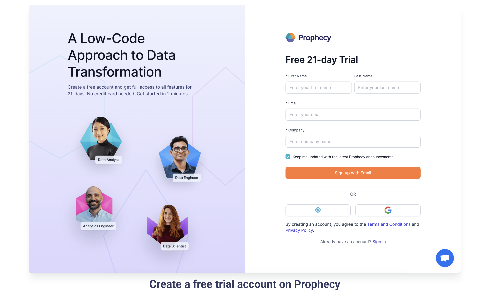](https://app.prophecy.io/metadata/auth/signup)

## 2. Connect to Snowflake

### 2.1 Get Snowflake Account URL and credentials

To connect Prophecy to Snowflake, you'll need to assemble a few items. The Snowflake URL is a combination of the Snowflake organization and account, in the following format:


As a user, you'll login to Snowflake using your username and password credential. Prophecy will use the same credential so that the Prophecy user can obtain the same level of access for Snowflake tables. Snowflake also has a Role for each user; identify the appropriate Role for Prophecy to use.

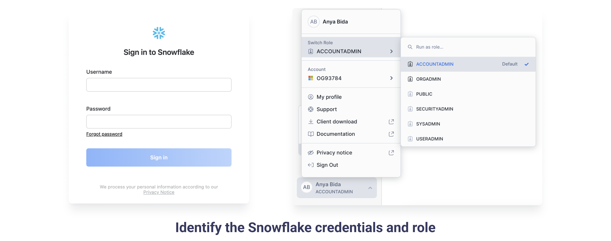

### 2.2 Identify the location for materializations

Identify the desired Warehouse and make sure the Warehouse is started.

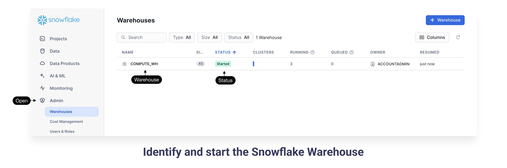

Prophecy needs a default location for materializing tables and views, etc. Identify the desired database and schema for default writes.

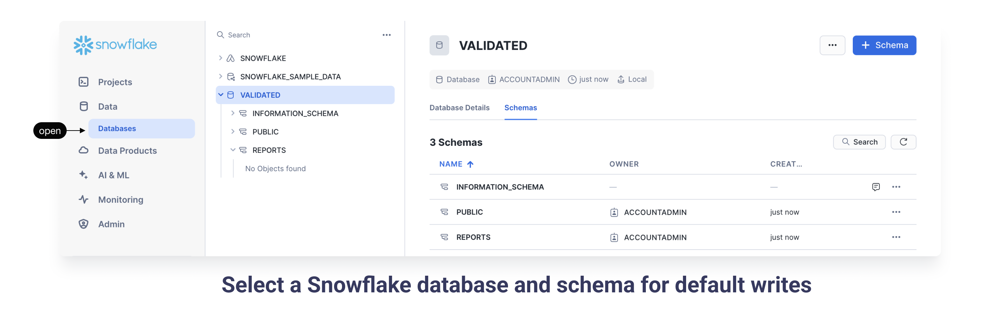

### 2.3 Setup Prophecy's Fabric

Prophecy introduces the concept of a Fabric to describe an execution environment. In this case, we create a single Fabric to connect a Snowflake warehouse and execute SQL models interactively. The Fabric defines the environment where SQL tables and views are materialized. Typically you should setup at least one Fabric each for development and production environments. Use the development environment (Fabric) for quick ad-hoc building purposes with only sample data and use the production environment for daily runs with your production Snowflake Warehouse data for your use case. Many Snowflake users will setup daily scheduled runs using Airflow as detailed [below.](#job-orchestration-on-airflow)

You can read more about Fabrics [here.](/docs/concepts/fabrics/fabrics.md)

Setting up a Fabric is very straightforward because we have already identified the Snowflake URL, credentials, etc the previous steps.

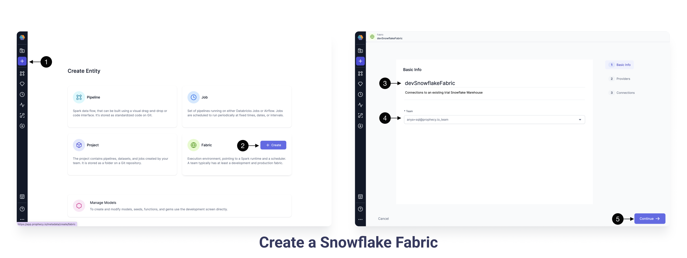

1. **Click** - to add a new entity.

2. **Create** - a new Fabric.

3. **Fabric Name** - Specify a name, like devSnowflake, for your Fabric. “dev” or “prod” are helpful descriptors for this environment setup. Also specify a description (optional)

4. **Team** - Select a team to own this Fabric. Click the dropdown to list the teams your user is a member. If you don’t see the desired team, ask a Prophecy Administrator to add you to a team.

5. **Continue** - to the Provider step.

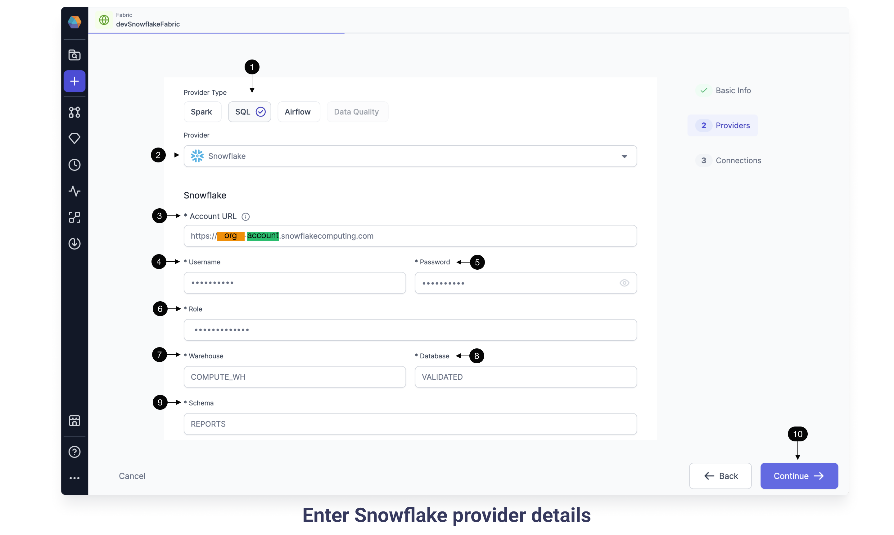

1. **Provider Type** - Select SQL as the Provider type.

2. **Provider** - Click the dropdown menu for the list of supported Provider types. Select Snowflake.

3. **URL** - Add the Snowflake Account URL, which looks like this: `https://<org>-<account>.snowflakecomputing.com`

4. **Username** - Add the username that Prophecy will use to connect to the Snowflake Warehouse.

5. **Password** - Add the password that Prophecy will use to connect to the Snowflake Warehouse. These username/password credentials are encrypted for secure storage. Also, each Prophecy user will provide their own username/password credential upon login. Be sure these credentials are scoped appropriately; Prophecy respects the authorization granted to this Snowflake user.

6. **Role** - Add the Snowflake [role](https://docs.snowflake.com/en/user-guide/security-access-control-overview#roles) that Prophecy will use to read data and execute queries on the Snowflake Warehouse. The role must be already granted to the username/password provided above and should be scoped according to the permission set desired for Prophecy.

7. **Warehouse** - Specify the Snowflake warehouse for default writes for this execution environment.

8. **Database** - Specify the desired Snowflake database for default writes for this execution environment.

9. **Schema** - Specify the desired Snowflake schema for default writes for this execution environment.

10. **Continue** - to complete the Fabric creation.

:::info
Each user can read tables from any database and schema for which they have access. The default write database and schema is set here in the Fabric.
:::

## 3. Create a new Project

Prophecy’s Project is a Git repository or a directory on Git that contains all of your transformation logic. Each Prophecy Project contains a dbt Core™️ project. Learn more about Projects [here.](/docs/concepts/project/project.md)

After Fabric creation you can see one project initialized for you by default called HelloWorld_SQL. If you just want to play around with Prophecy, you can start there. However, for the purpose of this tutorial we’re going to build a brand new project from scratch.

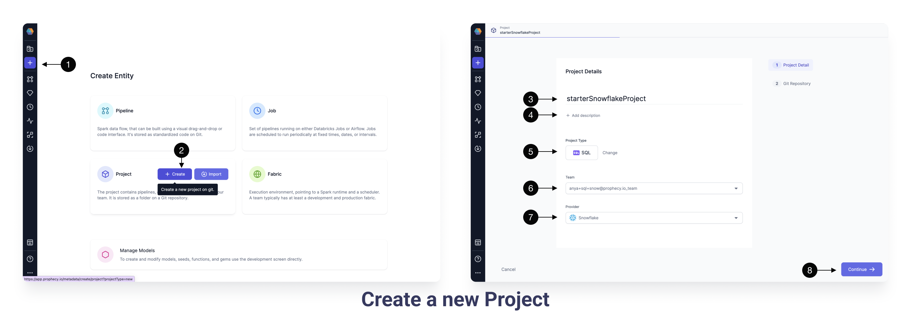

To create a new Project press on the **(1) Create Entity** button on the sidebar and choose **(2) Create** on the Project tile. The Project creation screen will open. Here, on the first page: we configure basic project details; and on the second page: we configure the Git repository details. Fill in the Project’s **(3) Name,** **(4) Description** (optional), and set the **(5) Project Type** to SQL. After that, select the **(6) Team** which is going to own the newly selected project. By default, you can leave the selected team to be your personal one. Finally, we choose the same **(7) Provider** as we selected in the previous step - Snowflake. Once all the details are filled out correctly, you can proceed to the next step by clicking **(8) Continue.**

Once the basic project information is filled out, it’s time to configure the Git repository on which we’re going to store our project. Git brings the best software engineering practices to traditional data engineering. It allows it’s users to version their code, collaborate with teammates easier, and setup robust productionization pipelines.

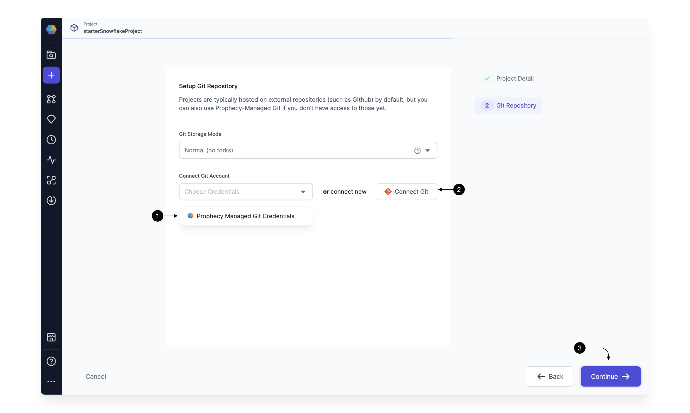

You'll see two options to connect to Git. **(1) Prophecy Managed Git Credentials** are not supported for this use case. You will need a Github account for this getting started guide. If you don't have one, create one by following [these instructions](https://docs.github.com/en/get-started/start-your-journey/creating-an-account-on-github). Select **(2) Connect to External Git** to connect to your external Git account.

### 3.1 Connect to external Git repository

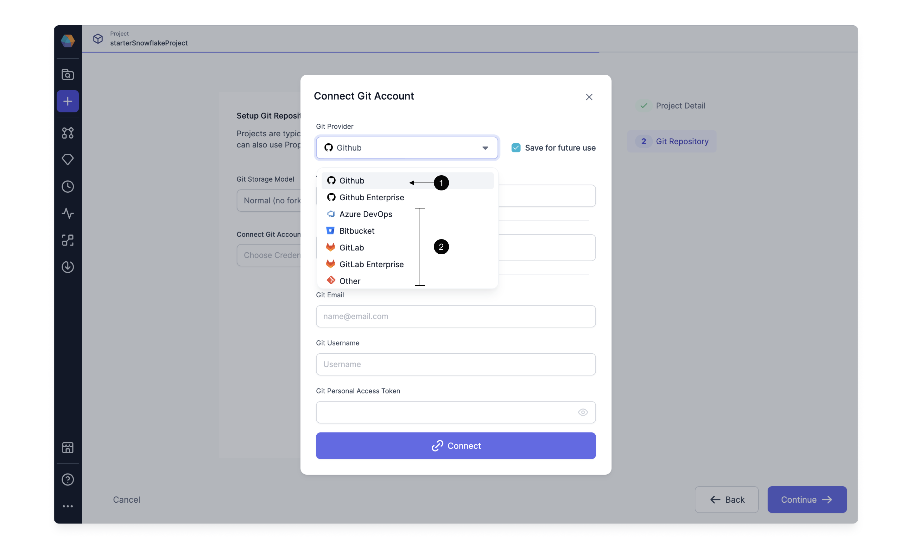

When connecting to external Git repositories, you have to first setup a Git connection with Prophecy. This can be done in two ways: **(1) For GitHub** with single click connection (through GitHub OAuth); **(2) For other Git providers (e.g. Bitbucket, GitLab, etc)** by providing a Personal Access Token.

#### 3.1.1 Connecting with GitHub

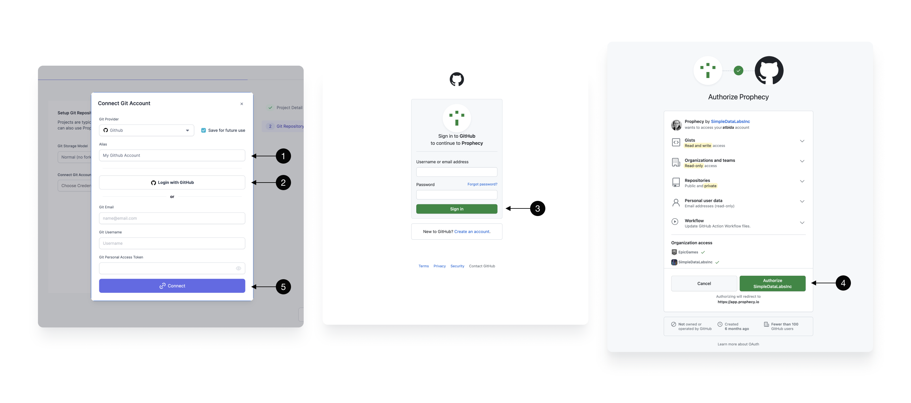

If you have an existing GitHub account this process is very simple, thanks to Prophecy’s strong OAuth GitHub integration. If you don’t have an account, you can create one at [Github.com](http://github.com).

1. **Alias** - Each Git connection in Prophecy starts with an **Alias** that’s going to be used to allow you to identify the right Git account. In most cases, this can be left as default.

2. **Login with Github** - redirects you to a GitHub login page (if you're not yet logged in).

3. **Sign in** - or create a new GitHub account.

4. **Authorize** - Authorize SimpleDataLabs (legal organization name of Prophecy.io). Here you are asked to approve Prophecy as a valid organization.

5. **Connect** - to save the Git connection.

Note that Prophecy will not store any information beyond basic user details (like email) and repository content (only queried at your explicit permission for each repository).

If you’d like to connect Prophecy to one of your GitHub organizations, make sure those are approved in the Organization access section.

The tab should be automatically close and you’ll be redirected back to Prophecy, which will mark the connection as complete. If for some reason this hasn’t happened (which can happen if you switched between other tabs), simply try clicking on the **(2) Login** with GitHub again.

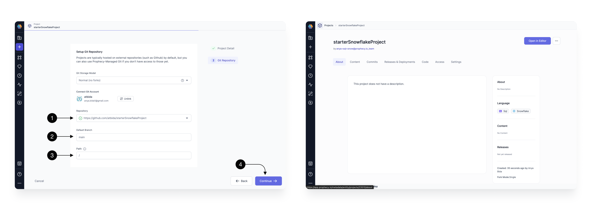

Once your GitHub account is setup, select a repository where Prophecy will store all the code for this project. Choose a **(1) Repository** from the dropdown available. If you’d like to create a new repository from scratch follow [this guide.](https://docs.github.com/en/get-started/quickstart/create-a-repo)

**(2) Default Branch** field should populate automatically based on the repository’s default main branch - you can change if necessary. Default branch is a central point where all the code changes are merged, serving as the primary, up-to-date source for a project.

Sometimes, you might want to load a project that’s within a specific subpath of a repository as opposed to the root. In that case, you can specify that path in the **(3) Path** field. Note, that the selected path should be either empty (in which case, Prophecy is going to treat it as a new project) or contain a valid dbt Core project (in which case, Prophecy is going to import it).

Finally, click **(4) Continue** and your main project page will open. The Project will be populated with our data sources, models, etc. Click **Open in Editor** to begin developing.

#### 3.1.2 Connecting with any other Git

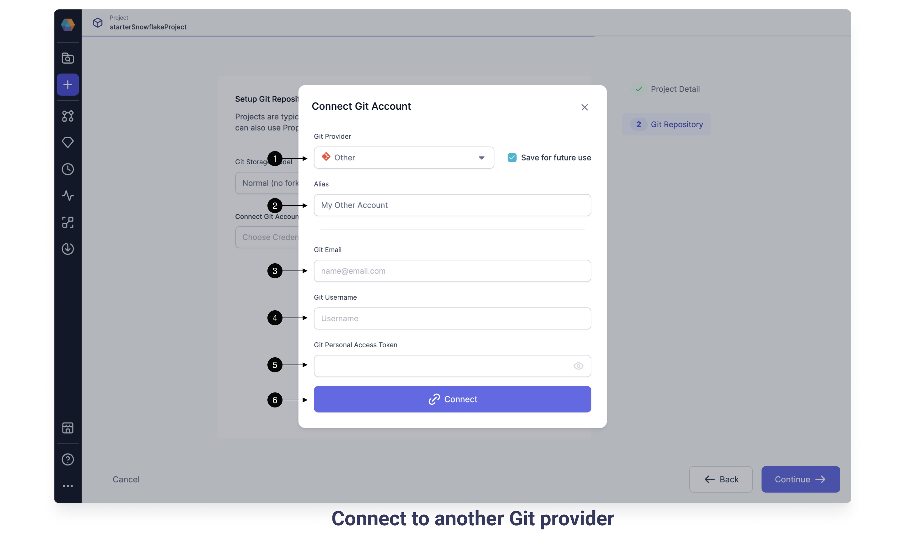

To establish Git connection with any other Git provider, simply choose the provider from the **(1) Git Provider** list or select Other. Setup steps for most providers are the same, as they follow standard secure Git protocol.

Firstly, define the **(2) Alias** that will allow you to easily identify your Git account. If you intend on connecting to only one Git account, you can simply leave as default.

Then, you have to provide your **(3) Git Email,** **(4) Git Username,** and **(5) Git Personal Access Token.** For most of the Git providers the username is the same as the email, however this is not always the case. Ensure to provide correct email, as the commits made by Prophecy are going to appear as if made by it.

Each provider is going to use a slightly different process to generate Personal Access Token, here are the guides for some of the most common providers: [GitHub](https://docs.github.com/en/authentication/keeping-your-account-and-data-secure/creating-a-personal-access-token), [BitBucket](https://support.atlassian.com/bitbucket-cloud/docs/create-a-repository-access-token/), and [Azure DevOps](https://learn.microsoft.com/en-us/azure/devops/organizations/accounts/use-personal-access-tokens-to-authenticate?view=azure-devops&tabs=Windows).

Finally, click **(6) Connect** to save the Git connection.


Once your GitHub account is setup, populate the **(1) Repository** field with an HTTPS URL to a Git repository you’d like to pull.

Then, fill in the **(2) Default Branch** field based on the default main repository’s branch (this is usually main or master). Default branch is a central point where all the code changes are merged, serving as the primary, up-to-date source for a project.

Sometimes, you might want to load a project that’s within a specific subpath of a repository as opposed to the root. In that case, you can specify that path in the **(3) Path** field. Note, that the selected path should be either empty (in which case, Prophecy is going to treat it as a new project) or contain a valid dbt Core project (in which case, Prophecy is going to import it).

Finally, click **(4) Continue** and your main project page will open. The Project will be populated with our data sources, models, etc. Click **Open in Editor** to begin developing.

## 4. Start development

Congratulations! We’ve now successfully completed the one-time setup process of Prophecy with all the required dependencies. We can now execute queries on Snowflake's Warehouse and take advantage of Git’s source code versioning.

It’s time to start building our first data transformation project!

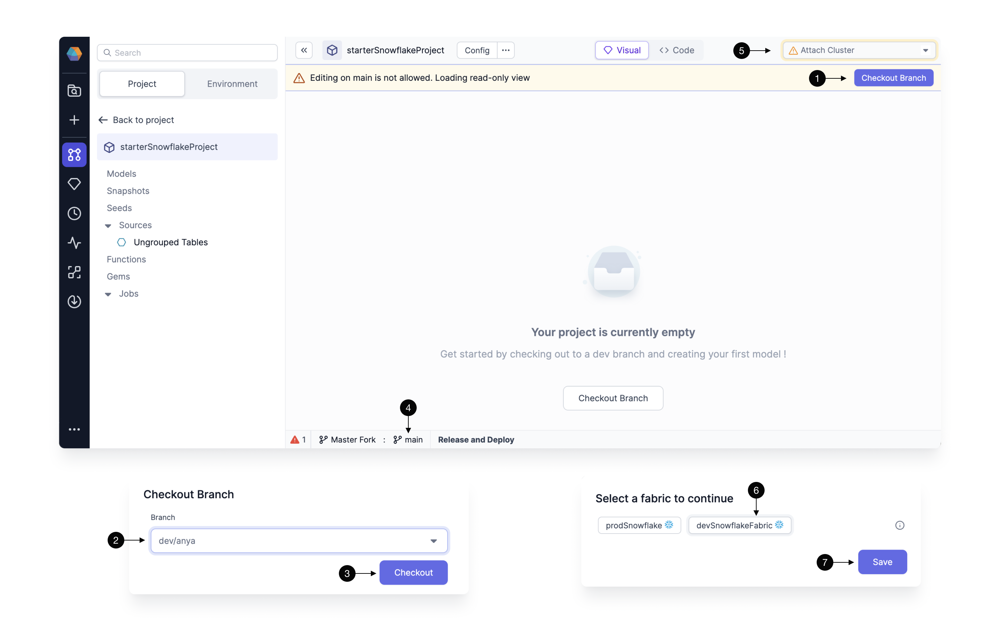

### 4.1 Checkout development branch

As a good teammate, we don’t want to write changes directly on the main branch of our Git repository. Every member should have their own branch on which they can freely build and play around with the project, without interrupting each other’s work. Prophecy enforces this best practice by ensuring that no changes can be made directly on the main branch.

Therefore, to start development we have to create our first development branch. Start by clicking on the **(1) Checkout Branch** and type in the desired name in the **(2) Branch** field. The best branch names should be representative of the changes that you’re making, so that your colleagues can quickly identify which changes are on which branch. The best branch names should be representative of the changes, and who made them, so that your colleagues can quickly identify which changes are on which branch. A good default name is `dev/firstName`. Once you decide on the name, click **(3) Checkout.** The new branch name will be displayed in the **(4) Git footer**.

Note, that if the branch doesn’t exist, Prophecy creates a new branch automatically by essentially cloning what’s on the currently selected branch - therefore make sure to usually create new branch (checkout) from main. If the branch exists, the code for that branch is pulled from Git into Prophecy.

### 4.2 Connect to a Fabric

Prophecy allows for interactive execution of your modeling work. This allows you to run any SQL model directly on the Fabric we’ve connected to and preview the resulting data. Fabric connection also allows Prophecy to introspect the schemas on your data warehouse and ensure that your development queries are correct.

After branch setup, Fabric selection should pop-up automatically; if not, you can easily set the Fabric by clicking on the **(5) Choose cluster** dropdown.

Choose the Fabric of choice by clicking on it in the **(6) Fabrics** list, then simply **(7) Save** the settings.

Prophecy will quickly load all the available warehouses, databases, schemas, tables, and other metadata and shortly after to allow you to start running your transformations!

### 4.3 Define data sources

The first step, before building actual transformation logic, is definition of data sources. There are three primary ways to define data sources in a SQL project:

1. **seeds** - which allow for loading small CSV Datasets into your warehouse (useful for small test Datasets or lookup mappings, like list of countries)
2. **Datasets** - table pointer with schema and additional metadata
3. **other models** - since each model defines a table, models can serve as inputs to another model (we’re going to cover models in the next section)

#### 4.3.1 Create seeds

Seeds allow you to define small CSV-based Datasets that are going to be automatically uploaded to your warehouse as tables, whenever you execute your models. This is particularly useful for business data tables or for integration testing on data samples.

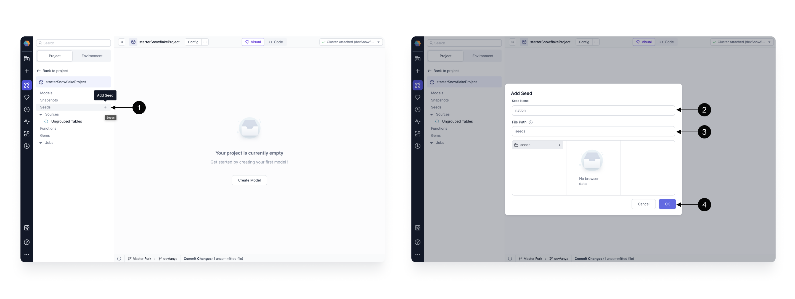

To create a seed click on the **(1) + Add Seed** button. A new pop-up window will appear where you can define metadata of the seed. There you can define the **(2) Name** of seed (which is going to be the same as the name of the table created) and the **(3) Path** for for it. When ready press **(4) OK,** to add.

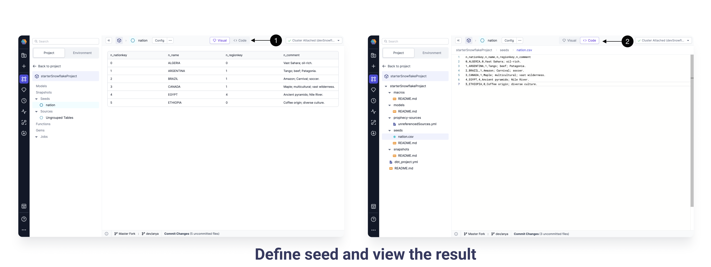

The seed initializes by default empty. To define the value simply copy and paste the content of desired CSV (each column separate by a comma, each row separated by a new line, with a header as the first line) into the **(1) Code editor.** To verify whether the seed is parsed correctly, you can see it after switching again to the **(2) Visual editor.**

For the purpose of this tutorial, create a nation seed, with the following content:

```
NATIONKEY,NAME,REGIONKEY,COMMENT
0,ALGERIA,0,Vast Sahara; oil-rich and culture-rich.
1,ARGENTINA,1,Tango; beef; Patagonia.
2,BRAZIL,1,Amazon; Carnival; soccer.
3,CANADA,1,Maple; multicultural; vast wilderness.
4,EGYPT,4,Ancient pyramids; Nile River.
5,ETHIOPIA,0,Coffee origin; diverse culture.
```

#### 4.3.2 Define Datasets

Importing Datasets is really easy. [Upload a file](/docs/SQL/gems/datasources/upload-files.md) or drag-and-drop existing tables directly into a model. We’re going to demonstrate that in the next step.

### 4.4 Develop your first model

A model is an entity [like a pipeline](/docs/concepts/project/models.md#models-vs-pipelines) that contains a set of data transformations. However, a Model defines a single output - a view or a table that will be created on the warehouse of choice. Each model is stored as a select statement in a [SQL file](#5-code-view) within a project. Prophecy models are based on dbt Core [models](https://docs.getdbt.com/docs/build/models).

<div class="wistia_responsive_padding" style={{padding:'56.25% 0 0 0', position:'relative'}}>
<div class="wistia_responsive_wrapper" style={{height:'100%',left:0,position:'absolute',top:0,width:'100%'}}>
<iframe src="https://fast.wistia.net/embed/iframe/9dtht17yj6?videoFoam=true" title="Edit Code Video" allow="autoplay; fullscreen" allowtransparency="true" frameborder="0" scrolling="no" class="wistia_embed" name="wistia_embed" msallowfullscreen width="100%" height="100%"></iframe>
</div></div>
<script src="https://fast.wistia.net/assets/external/E-v1.js" async></script>

Here we create a `customers_nations` model that’s going to enrich our customers and produce a report of which customers show up in which geographic areas most commonly. Follow along with the `customer` table from your Snowflake Warehouse (Database: SAMPLE_DATA, Schema: TPCH).

The `customers_nations` model is stored as a `.sql` file on Git. The table or view defined by the model is stored on the SQL warehouse, database, and schema defined in the attached Fabric.

Suggestions are provided each step of the way. If Copilot's suggestions aren't exactly what you need, just select and configure the Gems as desired. Click [here](../SQL/gems/joins.md) for details on configuring joins or [here](../SQL/gems/transformations/sql-aggregate) for aggregations.

### 4.5 Interactively Test

Now that our model is fully defined, with all the logic specified, it’s time to make sure it works (and keeps working)!


Prophecy makes **interactively testing** the models incredibly easy! Simply:

1. Click the **Play** button on any of the Gems and the model with all of it’s upstream dependencies will be executed.
2. Once the model runs, the **Result** icon appears.
3. Click the Result icon to view a **Sample** set of records.

Notice Copilot is offering suggested fixes when errors appear. See how **Fix with AI** works [here](/docs/concepts/copilot/copilot-ai-capabilities.md#fix-with-ai). Explore suggested fixes in the canvas, inside each transformation Gem, or inside Gem expressions.

## 5. Code view

The visual developers will appreciate the drag-n-drop canvas, but sometimes it's also nice to view the code. Already Prophecy creates highly performant code behind the scenes. Just click the **Code View** to reveal the SQL queries we've generated using our visual design editor. Each Gem is represented by a CTE or subquery. For example, the Join Gem `NATIONS_CUSTOMERS` is highlighted in both visual and code views.

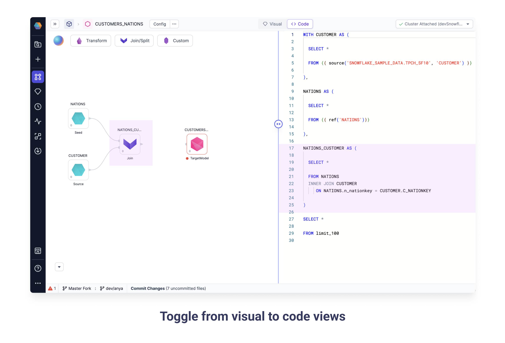

You may wish to edit the code view - give it a try! Add a SQL statement in the code view and notice the visual editor displays the updated code. For example, we've added a limit statement in the code view, and a new limit Gem appears in the visual view.

<div class="wistia_responsive_padding" style={{padding:'56.25% 0 0 0', position:'relative'}}>
<div class="wistia_responsive_wrapper" style={{height:'100%',left:0,position:'absolute',top:0,width:'100%'}}>
<iframe src="https://fast.wistia.net/embed/iframe/gpb6yu0bxv?videoFoam=true" title="Edit Code Video" allow="autoplay; fullscreen" allowtransparency="true" frameborder="0" scrolling="no" class="wistia_embed" name="wistia_embed" msallowfullscreen width="100%" height="100%"></iframe>
</div></div>
<script src="https://fast.wistia.net/assets/external/E-v1.js" async></script>

## 6. Commit and Release with Git

It's a good thing you've been working on your "development branch" for this guide, because now you'll step through the process of integrating your hard work with the rest of your team on the "main branch." Integration with Git is easier than it sounds. Commit early and commit often! You will commit, pull, merge, and release by following the steps [here](./getting-started-with-low-code-sql.md#53-commit-your-changes).

Prophecy guides your team's code management - with version control, tagged releases, and lets multiple individuals contribute to the same project - so you can focus on solving your business problems.

## 7. Schedule Jobs with Airflow

Most Snowflake users want to schedule jobs using Airflow. Prophecy integrates with MWAA and Composer Airflows. Don't have an Airflow account? Prophecy also provides a managed Airflow option. [Setup](/docs/Orchestration/airflow/setup/setup.md) your favorite Airflow option and use this [guide](./getting-started-with-low-code-airflow.md) to schedule Airflow Jobs. Now you can schedule SQL models integrated with your Spark Pipelines, S3 file sensors, etc.

## Wrap up

Great work! 🎉

You've successfully set up, developed, and tested your first SQL project on a Snowflake Warehouse. Integration and Job Scheduling put you on solid footing for production-readiness. Wherever you are in your data journey, know that Prophecy is here to encourage best practices to boost your productivity.

If you ever encounter any difficulties, don't hesitate to reach out to us (Contact.us@Prophecy.io) or join our [Slack community](https://prophecy-io-support.slack.com/join/shared_invite/zt-moq3xzoj-~5MSJ6WPnZfz7bwsqWi8tQ#/shared-invite/email) for assistance. We're here to help!
