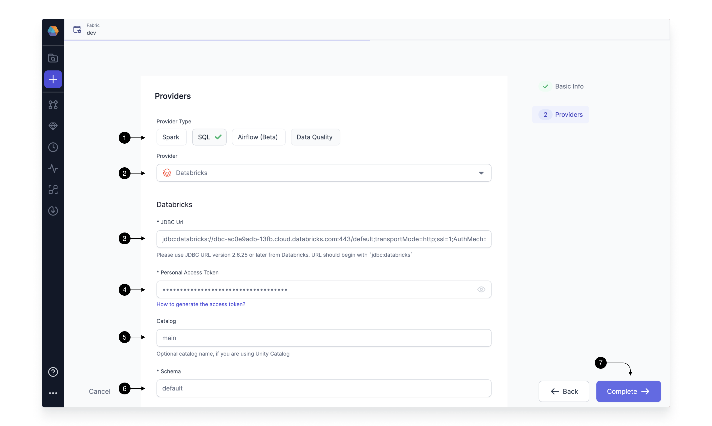

Version 3.0.2 of our platform, Prophecy, introduces an exciting new feature: low-code Airflow capabilities.
Now, users can effortlessly create and oversee Airflow jobs using a user-friendly drag-and-drop interface.
This empowers you to design and schedule intricate workflows without the need for coding expertise.
The tool seamlessly translates your designs into highly optimized Python Airflow code, stored in Git, ensuring complete accessibility and openness to all users.
Moreover, you have the flexibility to enhance functionality by incorporating your custom operators and sensors via our Gem Builder interface.

#### In this quick-start, we will show you how to use Prophecy Managed Airflow to Run and schedule your Spark and SQL Pipelines

We'll take you step by step from connecting your Databricks to Prophecy Managed Airflow to creating your first Airflow DAG and scheduling it. By the end of this training, you'll have an understanding of Airflow DAGss, be able to use our Visual interface to quickly create your DAG, and schedule this DAG on Prophecy Hosted Airflow. Let's dig in!

#### You will need

- Databricks Account
- A Prophecy Project With Spark Pipeline or SQL Model running on Databricks

If you don't have an existing project, please check out [this guide](./getting-started-with-low-code-spark) for setting up a Spark Pipeline, and [this guide](./getting-started-with-low-code-sql.md) for setting up a SQL model in Prophecy.

## 1. Setup Prophecy Fabric for Airflow

Prophecy introduces the concept of a Fabric to describe an execution environment. In this case, we create a Fabric to connect to Airflow, and create and schedule DAGs in it.
For this guide, we would be using Prophecy Managed Airflow, so you don't require to have an Airflow instance running.

Setting up a Fabric is very straightforward. Click the (1) Create Entity button, and choose (2) Create Fabric option. The Fabric creation is composed of two steps: Basic Info and Providers setup.
On the Basic Info screen, enter a (1) Fabric Name, (2) Fabric Description, and choose the (3) Team that’s going to own the Fabric.

Once ready, click (4) Continue.

Since we’re setting up a Fabric connected to Airflow, we choose Airflow as the (1) Provider Type and Prophecy Managed as the (2) Provider.
For connecting to Prophecy Managed Airflow, you don't need to provide any other details, so go ahead and click on (3) Continue.

To be able to Run your Databricks Pipelines and Models, you need to have connection from Prophecy Managed Airflow to your Databricks Environment.
Here you would select the already
