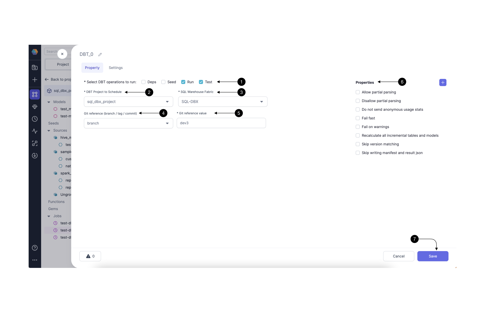
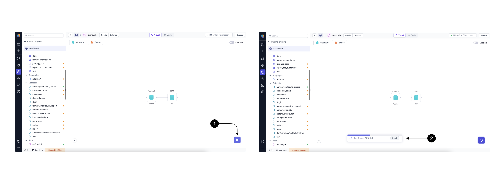
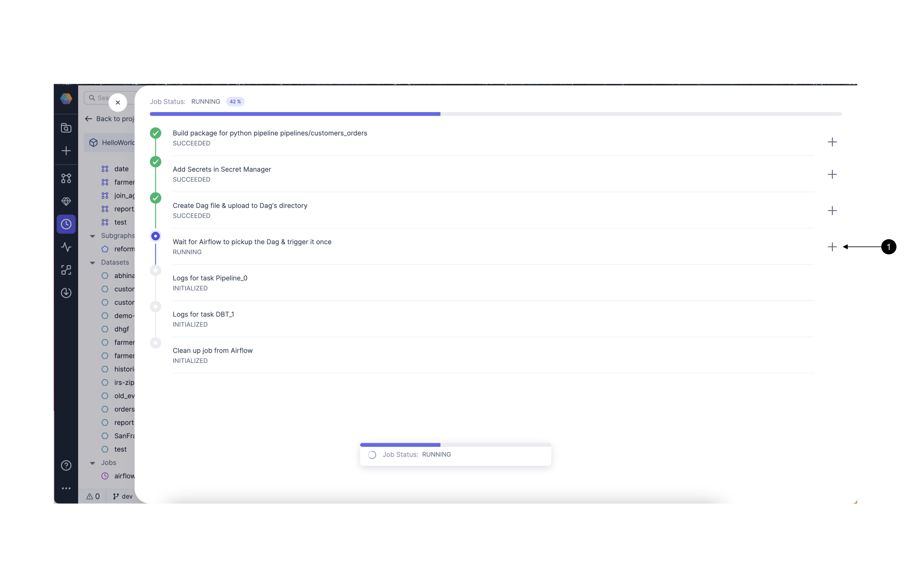
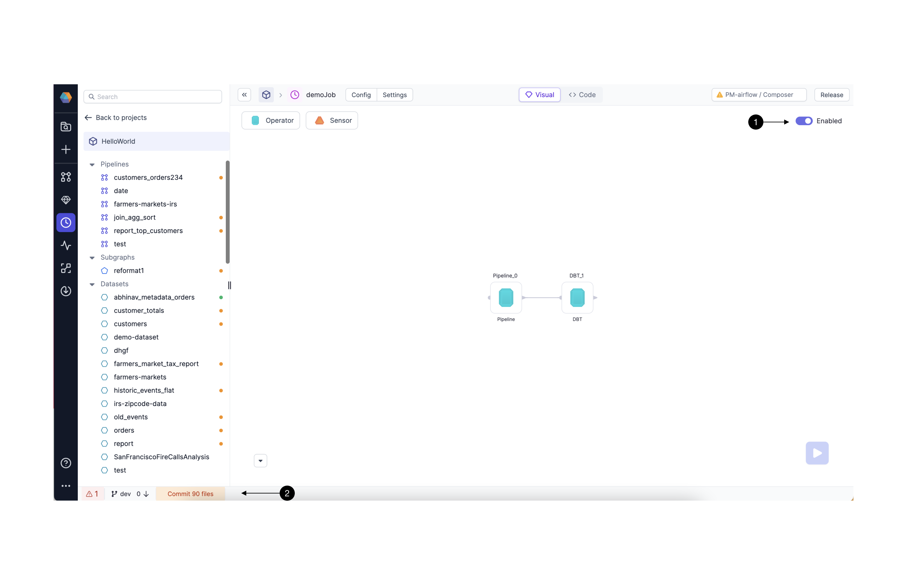
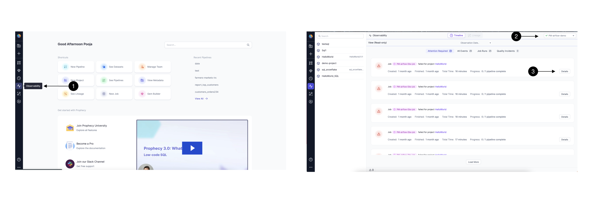

Version 3.0.2 of our platform, Prophecy, introduces an exciting new feature: Low-code Airflow.
Now, users can effortlessly create and manage Airflow jobs using a user-friendly drag-and-drop interface.
This empowers you to design and schedule intricate workflows without the need for coding expertise.
The tool seamlessly translates your designs into highly optimized Python Airflow code, stored in Git, ensuring complete accessibility and openness to all users.
Moreover, you have the flexibility to enhance functionality by incorporating your custom operators and sensors via our Gem Builder interface.

#### In this quick-start, we will show you how to use Prophecy Managed Airflow to Run and schedule your Spark and SQL Pipelines

We'll take you step by step from connecting your Databricks to Prophecy Managed Airflow to creating your first Airflow DAG and scheduling it. By the end of this training, you'll have an understanding of Airflow DAGs, be able to use our Visual interface to quickly create your DAG, and schedule this DAG on Prophecy Hosted Airflow. Let's dig in!

#### You will need

- Databricks Account
- A Prophecy Project With Spark Pipeline or SQL Model running on Databricks

If you don't have an existing project, please check out [this guide](/docs/getting-started/getting-started-with-low-code-spark.md) for setting up a Spark Pipeline, and [this guide](/docs/getting-started/getting-started-with-low-code-sql.md) for setting up a SQL model in Prophecy.

## 1. Setup Prophecy Fabric for Airflow

Prophecy introduces the concept of a Fabric to describe an execution environment. In this case, we create a Fabric to connect to Airflow, and create and schedule DAGs in it.
For this guide, we would be using Prophecy Managed Airflow, so you don't require to have an Airflow instance running.

Setting up a Fabric is very straightforward. Click the **(1) Create Entity** button, and choose **(2) Create Fabric** option. The Fabric creation is composed of two steps: Basic Info and Providers setup.
On the Basic Info screen, enter a **(1) Fabric Name**, **(2) Fabric Description**, and choose the **(3) Team** that’s going to own the Fabric.

Once ready, click **(4) Continue**.

Since we’re setting up a Fabric connected to Airflow, we choose **Airflow** as the **(1) Provider Type** and **Prophecy Managed** as the **(2) Provider**.
For connecting to Prophecy Managed Airflow, you don't need to provide any other details, so go ahead and click on **(3) Continue**.

To be able to Run your Databricks Pipelines and Models, you need to have connection from Prophecy Managed Airflow to your Databricks Environment.
Click on **(1) Add Connection** button. This opens up the Add connection form.

Select Databricks Spark or Databricks SQL in **(1) Connection Type**. Now under the **(2) Fabric**, you would select the already created Fabric for Databricks Spark or Databricks SQL and Prophecy would setup the connection.
You can provide a description in the **(3) Description**.
Once done, click **(4) Save**.

You can add more than one connection for Databricks Spark,Databricks SQL, Email, HTTP, etc.
Once done click **(1) Complete** to complete your Fabric Setup.

You should now start seeing a new Fabric of type `Airflow` in the Fabric listing page.

## 2. Create an Airflow Job

A Job is an entity that contains Gems to represent a DAG consisting of various Tasks (Pipelines/Models/Scripts, etc) which you can Run once or schedule to run at a frequency. Each Job would represent an Airflow DAG in Python.

Let's see how to create an Airflow Job in Prophecy.

Click the **(1) Create Entity** button, and choose **(2) Create Job** option.

On the first screen, you would provide the Basic Info of the Job.

In **(1) Project**, select the Project in which you want to create the Job. You can pick the existing Databricks Spark or SQL project here where you have created Pipelines/Models.
In **(2) Branch**, Pick a development branch for the new Job. Here you can pick an existing branch for development, or create a new one.
In **(3) Name**, provide a name for your Job.
In **(4) Scheduler**, pick the type as **Airflow**.
In **(5) Fabric**, Select the Fabric we created in previous step.
In **(6) Schedule**, Pick a schedule with which you want to schedule the Job. Please note, you can modify this again after testing before releasing your Job.
In **(7) Description**, add a description about the Job you are creating.

Once done, click **(8) Create New**.

This will take you the Job editor page where you would be creating the actual DAG for the Job.
Let's start adding Pipelines/Models to our Job now.

### 2.1 Adding Spark Pipeline Gem For Databricks to your DAG

Click on **(1) Operators**, and Drag the **(2) Pipeline Gem** from the dropdown to the canvas. Then click the newly added Gem and click **(3) Open** to open the Gem Configurations.

Here, you will select the Pipeline and Optionally override any config values for the Pipeline if you want.

In **(1) Pipeline to Schedule** , select the Pipeline you want to Run. As you select the Pipeline, You would start seeing the Configurations defined in the Pipeline. You Would not be able to modify the schema of these configs but can override the Config values.

In (**2) Fabric and Cluster size to run this Pipeline**, pick the Fabric and Job size for running this Pipeline in Databricks. Once done, Click **(3) Save**!!

### 2.2 Adding SQL DBT Gem For Databricks to your DAG

Click on **(1) Operators**, and Drag the **(2) DBT Gem** from the dropdown to the canvas. Then click the newly added Gem and click **(3) Open** to open the Gem Configurations.

Here, we will select the DBT Project/Model to Schedule, what SQL Fabric to schedule it on, and other additional properties for running a DBT model.

In **(1) DBT commands** , select the commands you want to run when scheduling your Models. You can select all (Deps, Seed, Run and Test) here.
In **(2) DBT Project to Schedule** , select the project you want to schedule. In **(3) SQL Warehouse Fabric**, select the Databricks Fabric to schedule the Module on.
In **(4) Git reference**, select if you want to schedule a particular commit/tag or branch. Here you can select `branch` for this guide and then in **(5) Reference Value** give the current branch name you are working on.
In **(6) Properties** , you can provide any additional DBT properties for your run and then click **(7) Save**. !!

Congratulations!!! And just like that, you have created a very simple Airflow Job with one Databricks Pipeline/Model Task.

Let's go ahead and see how to Run and Schedule it.

## 3. Run and Debug

Now that we have our Job ready, we can go ahead and run it.

Click on the **(1) Run button** to trigger the One-time run. This creates a temporary DAG and uploads to Airflow. User can check logs and status in the Prophecy UI itself. When you click on run, you will see a Job Details Toaster.
Click on **(2) Details** to open the detailed logs of the Run.

Here you can see all the steps involved in the Run and also detailed logs for each step.
Click on **(1) + button**, to open the logs for a particular step.

## 4. Release and Schedule

Once we have the **Job** developed and tested it’s time to commit and push our code to our repository and release the Job to our Airflow.

Start by toggling our Job to be **(1) Enabled.** This enables the Job on the Airflow and will ensure that the Job follows the previously set interval. Without enabling the DAG is not uploaded to Airflow.

Click on the **(2) Commit files** button in the middle of the footer (bottom of the screen). This opens an easy-to-use Git management screen.

The process of deploying code is composed of 4 steps:

1. **Commit:** We start by creating a named version of our code and uploading it to our development branch on the secure Git repository. On the left hand side you can see the **Current branch** and the associated history of commits and on the right side, there’s a list of **Entities changed** (models, Jobs, etc) and their status. If everything looks good, type in the **(2) Commit message** which should clearly describe, in few sentences, all the changes that we’ve introduced.
2. **Pull:** Before your changes can be safely merged into the **main** branch, we have to make sure that we’re up to date with it. If your colleagues introduced any code on **main** we have to **Pull** it first. This step is most of the time going to happen automatically for us without any further actions required.
3. **Merge:** Now that our development branch is up to date, we can merge it to master. Here we can either create a **Pull Request** or if you’re the owner of the repository force **Merge** the changes. For now, we **Merge** them directly. Once the code is merged, you can now see the latest commits present on your **main** branch.
4. **Release:** Finally, now that our changes are all versioned on Git, we can release them to our scheduler. Simply specify a **Release Version** number, e.g. `1.0` , and the **(4) Release Note,** which should clearly outline the latest changes. When ready, click **(5) Release.**

## 5. Monitor

During the release process Prophecy automatically packages, tests, and deploys your Jobs to Airflow. Once the process is finished you can see the deployed and running Job, within your Airflow environment. You can monitor this Job within Prophecy in the **(1) Observability** page.

Click on **(1) Observability icon** on the left side menu bar to take you to the Observability page.
Then in **(2) Fabric Selection box**, choose the right Fabric you created in Prophecy in step (1). This will show all the Past and Current Runs of the Jobs you released.
Switch between **Attention Required**, **All events**, **Job Runs** to find any Particular Run you are looking for.  
CLick on the **(3) Details** button to open up the logs of any particular Run.

## What’s next?

Great work! 🎉

You've successfully set up, developed, tested, and deployed your first SQL project in the Databricks workspace. Take a moment to appreciate your accomplishment 🥳.

To continue learning and expanding your skills with Prophecy, explore other tutorials within our documentation, or apply your newfound knowledge to address real-world business challenges!

If you ever encounter any difficulties, don't hesitate to reach out to us (Contact.us@Prophecy.io) or join our [Slack community](https://prophecy-io-support.slack.com/join/shared_invite/zt-moq3xzoj-~5MSJ6WPnZfz7bwsqWi8tQ#/shared-invite/email) for assistance. We're here to help!

---
