At Prophecy, we've added low-code SQL capabilities to version [3.0](https://www.prophecy.io/blog/announcing-prophecy-3-0-low-code-sql-transformations) of our platform, so users can build highly performant queries on par with the best analytics engineers without needing to be coding experts. We built this feature on top of [dbt Core™️ ](https://github.com/dbt-labs/dbt-core), an open-source tool for managing SQL-based data transformations. With low-code SQL, our customers can build complex queries visually, and the tool automatically translates them into optimized SQL code in Git that’s fully open and accessible to all. This makes it simpler for more people to work with data and extract insights.

<div class="wistia_responsive_padding" style={{padding:'56.25% 0 0 0', position:'relative'}}>
<div class="wistia_responsive_wrapper" style={{height:'100%',left:0,position:'absolute',top:0,width:'100%'}}>
<iframe src="https://fast.wistia.net/embed/iframe/hfhh8fieiq?seo=false?videoFoam=true" title="Getting Started With SQL Video" allow="autoplay; fullscreen" allowtransparency="true" frameborder="0" scrolling="no" class="wistia_embed" name="wistia_embed" msallowfullscreen width="100%" height="100%"></iframe>
</div></div>
<script src="https://fast.wistia.net/assets/external/E-v1.js" async></script>

#### In this quick-start, we will show you how to setup Prophecy low-code SQL with an existing Databricks warehouse

We'll take you step by step from account setup to developing your first model. By the end of this training, you'll have an understanding of dbt models, be able to use low-code SQL to define and test your business logic, and commit this code and deploy it to production. That's a lot, but we make building complex queries easy with our drag and drop tooling. Let's dig in!

#### You will need

- Databricks Account
- GitHub Account (recommended)

## 1. Setup Prophecy account

Creating your first account on Prophecy is very simple. Go to [app.prophecy.io](https://app.Prophecy.io/metadata/auth/signup) to Sign-up for an initial 14-day trial. After you’ve tried the product for 14 days, simply reach out to us at Contact.us@Prophecy.io and we will help pick the best offering for you.

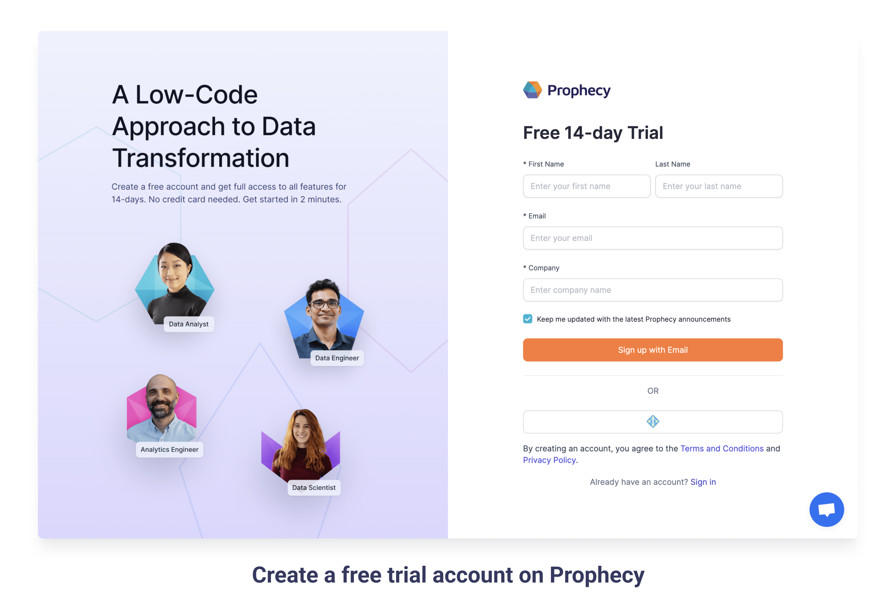

## 2. Connect to Databricks

### 2.1 Get Databricks Cluster or Warehouse URL

When connecting to Databricks, you have the option to either connect to Databricks compute cluster or warehouse. In both cases, make sure to get the 2.6.25 JDBC url that starts with `jdbc:Databricks....`

#### Cluster JDBC End-point

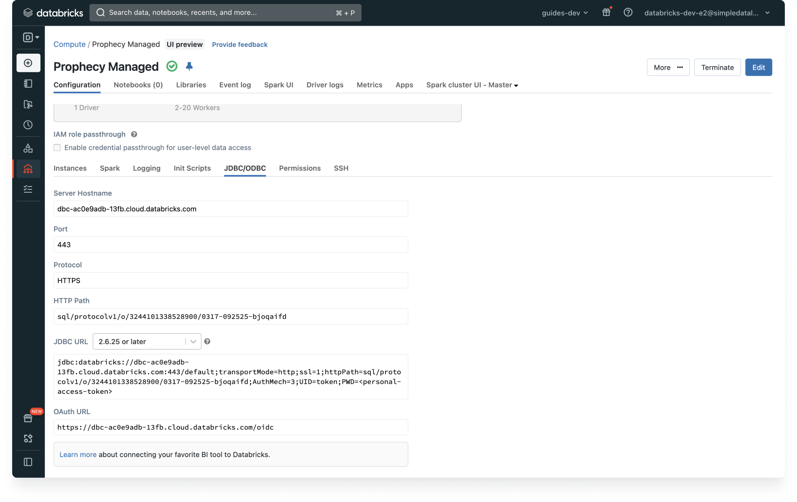

To use a cluster as your execution environment for SQL queries, click on **(1) Compute** element in the menu, choose your preferred cluster, open cluster **(2) Configuration** > **(3) JDBC/ODBC,** switch the JDBC URL to the latest version **(4) 2.6.25 or later,** and finally copy the **(5) JDBC URL.**

When using the compute cluster JDBC end-points, the last parameter of the url contains the password provided as user’s personal access token. Make sure to delete that URL fragment before entering it.

Here’s a correct example `url: jdbc:Databricks://dbc-abc.cluod.Databricks.com:443/...;UID=token;`

For optimal performance and best governance options, we recommend using [Shared, Photon-enabled](https://docs.databricks.com/clusters/cluster-config-best-practices.html) clusters with [Unity-catalog](https://docs.databricks.com/data-governance/unity-catalog/compute.html) enabled.

#### Warehouse JDBC End-point

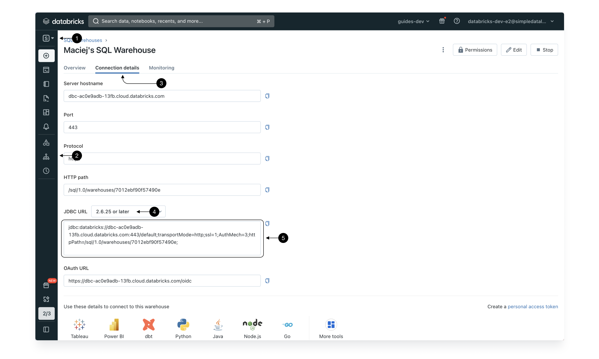

To use a warehouse as your execution environment for SQL queries, switch to the **(1) SQL** persona, choose **(2) SQL Warehouses** from the sidebar menu, pick your preferred warehouse, go to **(3) Connection** details, select the latest version of JDBC URL **(4) 2.6.25 or later** and save the the **(5) JDBC URL.**

For optimal performance and best governance options, we recommend using [Pro](https://docs.databricks.com/sql/admin/create-sql-warehouse.html#upgrade-a-pro-or-classic-sql-warehouse-to-a-serverless-sql-warehouse) Serverless warehouses with [Unity Catalog](https://docs.databricks.com/data-governance/unity-catalog/compute.html) enabled.

### 2.2 Create Personal Access Token (PAT)

To authorize as yourself when accessing your Databricks cluster or warehouse through a JDBC a special password is required. This is what Personal Access Token is created for. It’s a temporary password created specifically for programmatic access.

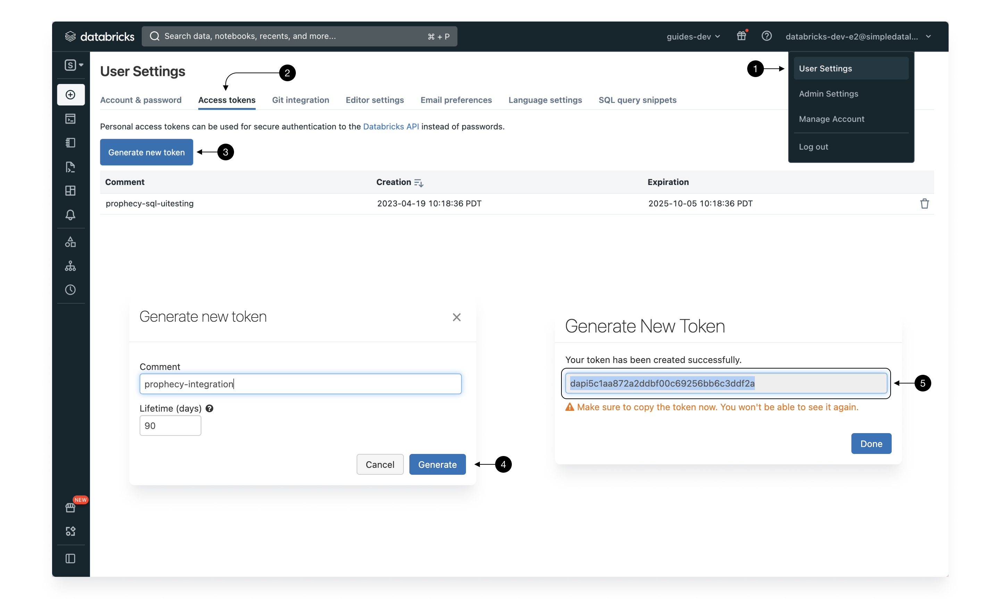

To get the personal access token, navigate to the **(1) User Settings** > **(2) Access tokens** and click the **(3) Generate** new token button button. Give a clearly identifiable name to your access token, in case you ever have to delete and set your preferred lifetime. Please note, that after the lifetime passes and the token expires, it will no longer be valid and you will have to regenerate it again to keep using Prophecy.

Once, the token is generated copy and save it from **(5) Token** and you’re good to go. Save it and we’re going to use both the JDBC url generated in the previous step and the token to setup your Prophecy account!

### 2.3 Setup Prophecy’s Fabric

Prophecy introduces the concept of a Fabric to describe an execution environment. In this case, we create a single Fabric to connect a Databricks cluster or warehouse, execute SQL models interactively, and deploy scheduled Jobs. The Fabric defines the environment where SQL tables and views are materialized. Typically you should setup at least one Fabric each for development and production environments. Use the development environment (Fabric) for quick ad-hoc building purposes with only sample data and use the production environment for daily runs with real data for your use case.

:::info
A Fabric allows Prophecy to connect with your data. 
To make this interface faster for hundreds or thousands of tables, supercharge your Fabric with a Metadata Connection.
:::

You can read more about Fabrics [here.](/docs/concepts/fabrics/fabrics.md)

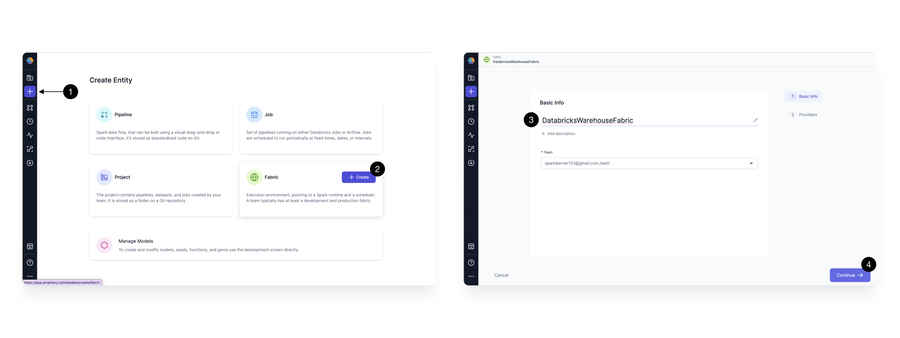

Setting up a Fabric is very straightforward now that we have copied the JDBC URL and Personal Access Token from the previous steps. Click the **(1) Create Entity** button, and choose **(2) Create Fabric** option. Please note, until you setup a Fabric, creation of other entities is going to be disabled. The Fabric creation is composed of three steps: Basic Info, Providers, and optional Connections. On the Basic Info screen, enter a **(3) Fabric Name** with optional Description, and choose the **(4) Team** that’s going to own the Fabric.

Once ready, click **(5) Continue.**

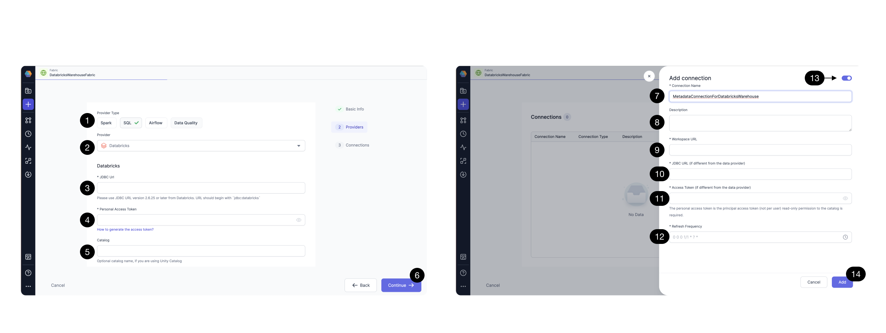

Since we’re setting up a Fabric connected to Databrick’s JDBC SQL endpoint, we choose SQL as the **(1) Provider Type** and Databricks as the **(2) Provider.**

Enter the **(3) JDBC Url** and **(4) Personal Access Token** gathered from the previous steps. Finally, select your **(5) Catalog** and Schema of choice. This step is optional but recommended. When using Databricks Unity Catalog, the default Catalog is `main` and the default Schema is `default`. Make sure you connect to a catalog and schema for which your user has write access. The tables resulting from the model will be written here. Click **(6) Continue**. At this point, Prophecy checks the credentials and details for network and catalog accesses. If either fails, the Fabric won’t be created and you will receive an Exception error.

The Basic Info and Provider setup is complete for the Fabric. Finally, there's an optional Connection step available. 

For users with many hundreds or thousands of tables, a Connection is a great way to sync the metadata in Prophecy so those tables can be listed quickly. Optionally add a Connection by following the steps 7-14 pictured above. If a connection is configured, the connection details will be used to display data tables etc. in the [Project Browser](/docs/concepts/project/project-broswer.md#how-to-access-project-browser) `Environment` tab . **(7)Name** the Connection and provide an optional **(8)Description**. Add a **(9)Workspace URL**, **(10)JDBC URL**, and **(11)Access Token**. The Access Token created for the workspace must have read permission for the Catalogs or JDBC tables of interest. The access token can be a personal access token or service principle token. We recommend using a service principle token. For information on the service principle token, go to the Databricks [documentation.](https://docs.databricks.com/en/administration-guide/users-groups/service-principals.html#manage-service-principals-in-your-account) The JDBC URL and Access Token are only required if different from those defined for the data provider, eg Databricks. Finally, define the **(12)Refresh Frequency** for which the metadata connection should sync with the JDBC. When the connection is **(13)enabled**, Prophecy will sync with the JDBC and any accessible catalogs at the defined frequency. Only one metadata Connection can be enabled at a time for a particular Fabric. Click **(14)Add** the Connection and it will become listed in the Fabric. Now tables will be synced on a regular cadence and appear quickly when listed in the Project browser `Environment` tab.

:::caution
Only one metadata connection can be enabled per fabric at a time. 
:::
 
Please note, Fabrics are owned by Teams. Every Member present within the Team will be able to access the Fabric, however, each individual has to provide their own Personal Access Token. 

:::info
The Fabric token should provide the user's personal permissions to read / write data. 
The Metadata Connection token, optionally provided to enhance performance, should be a service principal with list permissions on the appropriate catalog and JDBC tables. 
:::

## 3. Create a new Project

Prophecy’s Project is a Git repository or a directory on Git that contains all of your transformation logic. Each Prophecy Project contains a dbt Core™️ project. Learn more about Projects [here.](/docs/concepts/project.md)

After Fabric creation you can see one project initialized for you by default called HelloWorld_SQL. If you just want to play around with Prophecy, you can start there. However, for the purpose of this tutorial we’re going to build a brand new project from scratch.

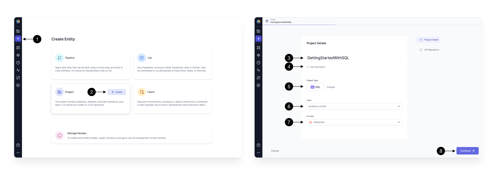

To create a new Project press on the **(1) Create Entity** button on the sidebar and choose **(2) Create** on the Project tile. The Project creation screen will open. Here, on the first page: we configure basic project details; and on the second page: we configure the Git repository details. Fill in the Project’s **(3) Name,** **(4) Description** (optional), and set the **(5) Project Type** to SQL. After that, select the **(6) Team** which is going to own the newly selected project. By default, you can leave the selected team to be your personal one. Finally, we choose the same **(7) Provider** as we selected in the previous step - Databricks. Once all the details are filled out correctly, you can proceed to the next step by clicking **(8) Continue.**

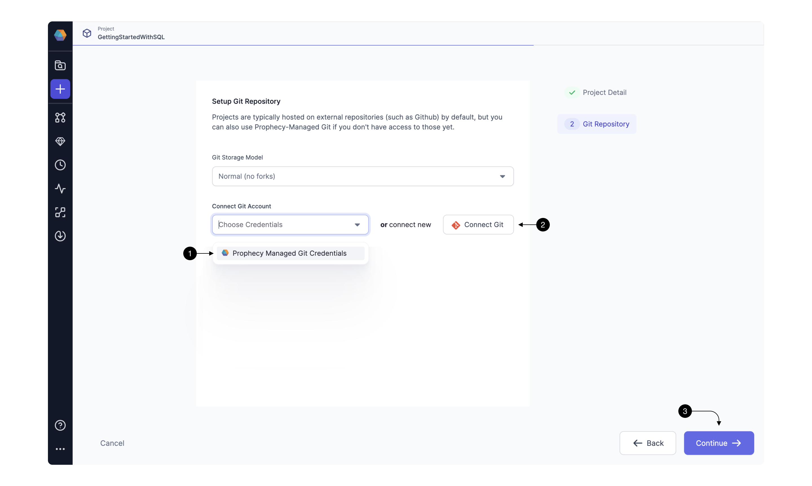

Once the basic project information is filled out, it’s time to configure the Git repository on which we’re going to store our project. Git brings the best software engineering practices to traditional data engineering. It allows it’s users to version their code, collaborate with teammates easier, and setup robust productionization pipelines.

In Prophecy, there are two Git setup options: you can either use **(1) Prophecy Managed Git** or **(2) Connect Git** to an existing external repository.

Once you’re connected to Git using either of the above approaches press **(3) Continue** to finalize project creation.

If you’re new to Git, we recommend starting by connecting to Prophecy Managed Git.

### 3.1. Connect to Prophecy Managed Git

When choosing, Prophecy Managed Git as your default Git repository, there’s no further steps required! Prophecy automatically takes care of repository creation, connection, and initialization. You can just click **(3) Continue** to finalize the project setup.

Using Prophecy Managed Git is very easy, but has some major downsides and therefore not recommended for production use-cases. Primarily, you will not be able to access the repository externally from Prophecy programmatically (which is a common enterprise requirement) or create [Pull Requests](/docs/metadata/pull-request-templates.md/#raising-pull-requests) (which is also recommended as a part of standard [Git flow](https://docs.github.com/en/get-started/quickstart/github-flow)).

If you decide to choose this option, you can always migrate the project to an external Git Repository by cloning it.

### 3.2 Connect to external Git repository

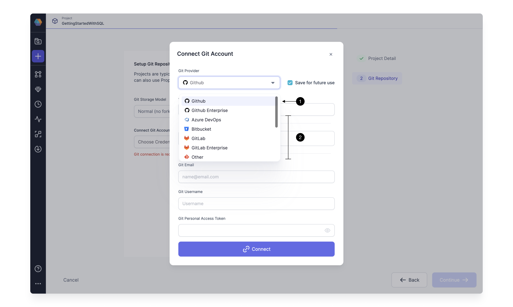

When connecting to external Git repositories, you have to first setup a Git connection with Prophecy. This can be done in two ways:

1. For GitHub - with single click connection (through GitHub OAuth)
2. For other Git providers (e.g. Bitbucket, GitLab, etc) - by providing a Personal Access Token

#### 3.2.1 Connecting with GitHub

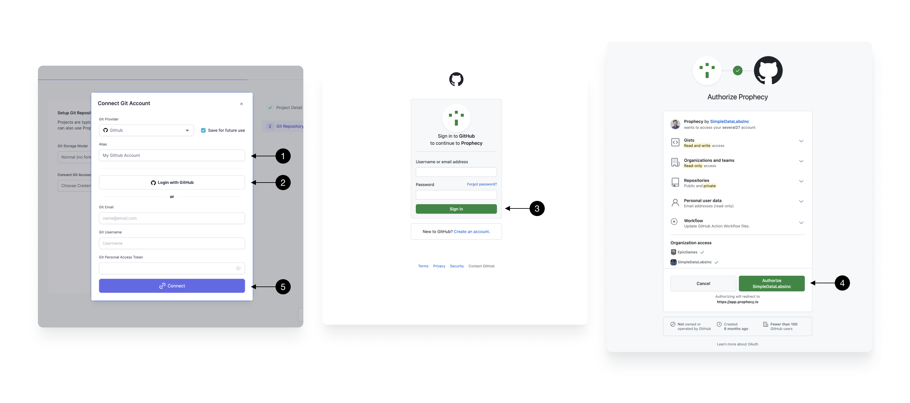

If you have an existing GitHub account this process is very simple, thanks to Prophecy’s strong OAuth GitHub integration. If you don’t, you can create an account at [Github.com](http://github.com).

Each Git connection in Prophecy starts with an **(1) Alias** that’s going to be used to allow you to identify the right Git account. In most cases, this can be left as default. With that set click **(2) Login** with GitHub which will redirect you to a GitHub login page (if you’re not yet logged in). Enter your details and **(3) Sign in** or create a new account. From there, you’ll be asked to approve Prophecy as a valid application.

Please note, that Prophecy will not store any information, beyond basic user details (like email) and repository content (only queried at your explicit permission for each repository).

If you’d like to connect Prophecy to one of your GitHub organizations, make sure those are approved in the Organization access section.

Once done, press on **(4) Authorize** SimpleDataLabsInc (legal organization name of Prophecy.io). The tab should be automatically closed and you’ll be redirected back to Prophecy, which will mark the connection as complete. If for some reason this hasn’t happened (which can happen if you switched between other tabs), simply try clicking on the \*\*(2) Login with GitHub again.

Finally, click **(5) Connect** to save the Git connection.

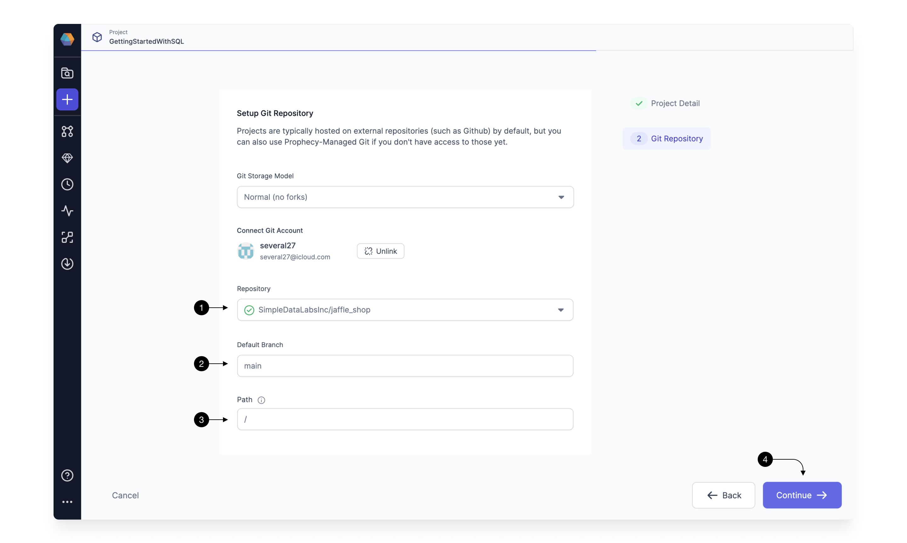

Once your GitHub account is setup, select a repository where Prophecy will store all the code for this project. Choose a **(1) Repository** from the dropdown available. If you’d like to create a new repository from scratch follow [this guide.](https://docs.github.com/en/get-started/quickstart/create-a-repo)

**(2) Default Branch** field should populate automatically based on the repository’s default main branch - you can change if necessary. Default branch is a central point where all the code changes are merged, serving as the primary, up-to-date source for a project.

Sometimes, you might want to load a project that’s within a specific subpath of a repository as opposed to the root. In that case, you can specify that path in the **(3) Path** field. Note, that the selected path should be either empty (in which case, Prophecy is going to treat it as a new project) or contain a valid dbt Core project (in which case, Prophecy is going to import it).

Finally, click **(4) Continue** and your main project page will open.

#### 3.2.2 Connecting with any other Git

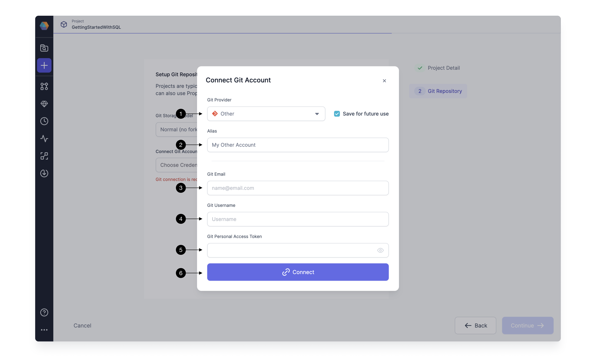

To establish Git connection with any other Git provider, simply choose the provider from the **(1) Git Provider** list or select Other. Setup steps for most providers are the same, as they follow standard secure Git protocol.

Firstly, define the **(2) Alias** that will allow you to easily identify your Git account. If you intend on connecting to only one Git account, you can simply leave as default.

Then, you have to provide your **(3) Git Email,** **(4) Git Username,** and **(5) Git Personal Access Token.** For most of the Git providers the username is the same as the email, however this is not always the case. Ensure to provide correct email, as the commits made by Prophecy are going to appear as if made by it.

Each provider is going to use a slightly different process to generate Personal Access Token, here are the guides for some of the most common providers: [GitHub](https://docs.github.com/en/authentication/keeping-your-account-and-data-secure/creating-a-personal-access-token), [BitBucket](https://support.atlassian.com/bitbucket-cloud/docs/create-a-repository-access-token/), and [Azure DevOps](https://learn.microsoft.com/en-us/azure/devops/organizations/accounts/use-personal-access-tokens-to-authenticate?view=azure-devops&tabs=Windows).

Finally, click **(6) Connect** to save the Git connection.

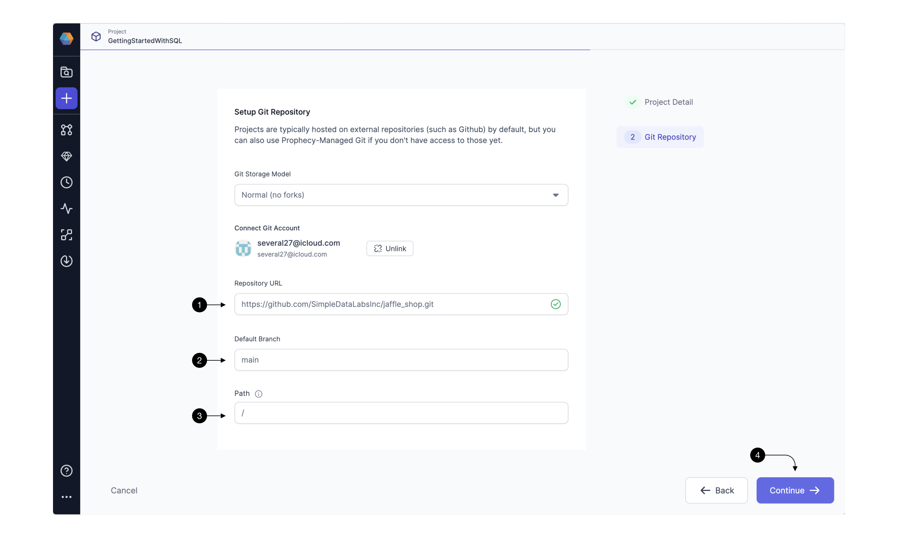

Once your GitHub account is setup, populate the **(1) Repository** field with an HTTPS URL to a Git repository you’d like to pull.

Then, fill in the **(2) Default Branch** field based on the default main repository’s branch (this is usually main or master). Default branch is a central point where all the code changes are merged, serving as the primary, up-to-date source for a project.

Sometimes, you might want to load a project that’s within a specific subpath of a repository as opposed to the root. In that case, you can specify that path in the **(3) Path** field. Note, that the selected path should be either empty (in which case, Prophecy is going to treat it as a new project) or contain a valid dbt Core project (in which case, Prophecy is going to import it).

Finally, click **(4) Continue** and your main project page will open.

## 4. Start development

Congratulations! We’ve now successfully went through the one-time setup process of Prophecy with all the required dependencies. We can now use Databricks’ performant SQL execution engine and Git’s source code versioning.

It’s time to start building our first data transformation project!

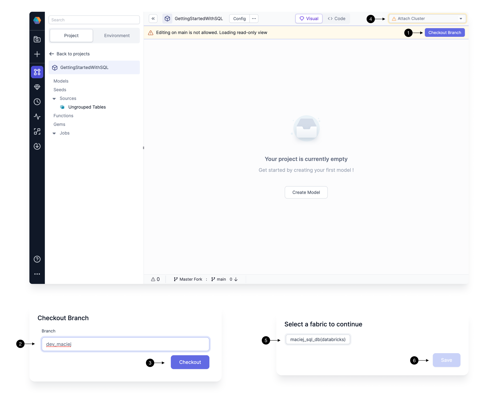

### 4.1 Checkout development branch

As a good teammate, we don’t want to write changes directly on the main branch of our Git repository. Every member should have their own branch on which they can freely build and play around with the project, without interrupting each other’s work. Prophecy enforces this best practice by ensuring that no changes can be made directly on the main branch.

Therefore, to start development we have to create our first development branch. Start by clicking on the **(1) Checkout Branch** and type in the desired name in the **(2) Branch** field. The best branch names should be representative of the changes that you’re making, so that your colleagues can quickly identify which changes are on which branch. The best branch names should be representative of the changes, and who made them, so that your colleagues can quickly identify which changes are on which branch. A good default name is dev\_{first_name} . Once you decide on the name, click **(3) Checkout.**

Note, that if the branch doesn’t exist, Prophecy creates a new branch automatically by essentially cloning what’s on the currently selected branch - therefore make sure to usually create new branch (checkout) from main. If the branch exists, the code for that branch is pulled from Git into Prophecy.

### 4.2 Connect to a Fabric

Prophecy allows for interactive execution of your modeling work. This allows you to run any SQL model directly on the Fabric we’ve connected to and preview the resulting data. Fabric connection also allows Prophecy to introspect the schemas on your data warehouse and ensure that your development queries are correct.

After branch setup, Fabric selection should pop-up automatically; if not, you can easily set the Fabric by clicking on the **(4) Choose cluster** dropdown.

Choose the Fabric of choice by clicking on it in the **(5) Fabrics** list, then simply **(6) Save** the settings.

Prophecy will quickly load all the available catalogs, schemas, tables, and other metadata and shortly after allow you to start running your transformations!

### 4.3 Define data sources

The first step, before building actual transformation logic, is definition of data sources. There are three primary ways to define data sources in a SQL project:

1. **seeds** - which allow for loading small CSV datasets into your warehouse (useful for small test datasets or lookup mappings, like list of countries)
2. **datasets** - table points with schema and additional metadata
3. **other models** - since each model defines a table, models can serve as inputs to another model (we’re going to cover models in the next section)

#### 4.3.1 Create seeds

Seeds allow you to define small CSV-based datasets that are going to be automatically uploaded to your warehouse as tables, whenever you execute your models. This is particularly useful for business data tables or for integration testing on data samples.

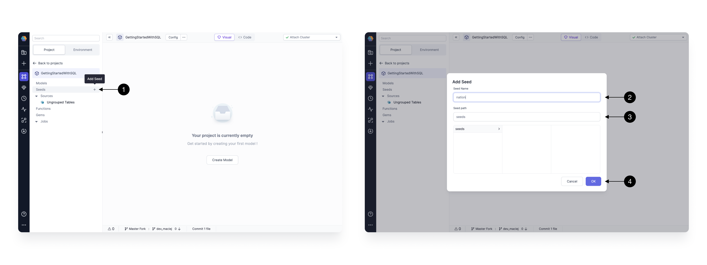

To create a seed click on the **(1) + Add Seed** button. A new pop-up window will appear where you can define metadata of the seed. There you can define the **(2) Name** of seed (which is going to be the same as the name of the table created) and the **(3) Path** for for it. When ready press **(4) OK,** to add.

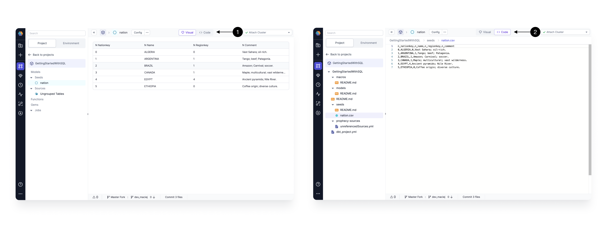

The seed initializes by default empty. To define the value simple copy and paste the content of desired CSV (each column separate by a comma, each row separated by a new line, with a header as the first line) into the **(1) Code editor.** To verify whether the seed is parsed correctly, you can see it after switching again to the **(2) Visual editor.**

For the purpose of this tutorial, create a nation seed, with the following content:

```
n_nationkey,n_name,n_regionkey,n_comment
0,ALGERIA,0,Vast Sahara; oil-rich.
1,ARGENTINA,1,Tango; beef; Patagonia.
2,BRAZIL,1,Amazon; Carnival; soccer.
3,CANADA,1,Maple; multicultural; vast wilderness.
4,EGYPT,4,Ancient pyramids; Nile River.
5,ETHIOPIA,0,Coffee origin; diverse culture.
```

#### 4.3.2 Define datasets

Importing datasets is really easy. We can just drag-and-drop our existing tables directly into a model. We’re going to demonstrate that in the next step.

### 4.4 Develop your first model

A model is an entity that contains a set of data transformations and defines either a view or a table that will be created on the warehouse of choice. Each model is stored as a select statement in a SQL file within a project. Prophecy models are based on dbt Core [models](https://docs.getdbt.com/docs/build/models).

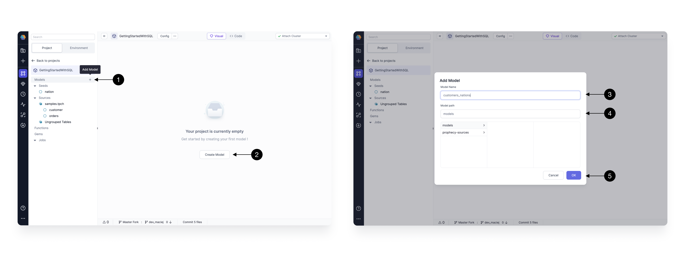

Here we create customers_nations model that’s going to enrich our customers and produce a report of which customers show up in which geographic areas most commonly.

To create a new model simply click on the **(1) + Add Model** in the sidebar, when hovering over Models section, or **(2) Create Model** button. A model creation pop-up will show up, with very similar options, as when we defined the seed, available. Enter the **(3) Model Name** and **(4) Model Path** and that’s it. Finally save the model by pressing **(5) OK.**

#### 4.4.1 Drag and drop model’s graph

<div class="wistia_responsive_padding" style={{padding:'56.25% 0 0 0', position:'relative'}}>
<div class="wistia_responsive_wrapper" style={{height:'100%',left:0,position:'absolute',top:0,width:'100%'}}>
<iframe src="https://fast.wistia.net/embed/iframe/wowmg8l0qq?videoFoam=true" title="Drag and Drop Model Graph Video" allow="autoplay; fullscreen" allowtransparency="true" frameborder="0" scrolling="no" class="wistia_embed" name="wistia_embed" msallowfullscreen width="100%" height="100%"></iframe>
</div></div>
<script src="https://fast.wistia.net/assets/external/E-v1.js" async></script>

Building your model is very simple, thanks to the drag-and-drop interface. In the video above, we’re doing the following, in our newly defined `customer_nations` model:

1. First we add the `nation` seed, that we’ve previously defined, by dragging and dropping it on the canvas.
2. Then we add a table from an **Environment.** We click on the **Environment** tab in the left sidebar and drag the customer table from the `samples.tpch` catalog and database to the canvas.
3. Note, that when two sources are dragged closely to each other a **Join** component is automatically created (as demonstrated on the video).
4. Then we drag and drop an **Aggregate** component from the Transform Gems drawer and connect it to the upstream **Join** component.
5. Finally connect your **Aggregate** to the **TargetModel** that defines your view itself.

#### 4.4.2 Define business logic

Once we have dragged and dropped all the relevant Gems (transformations) on our canvas, it’s time to fill in the business logic.

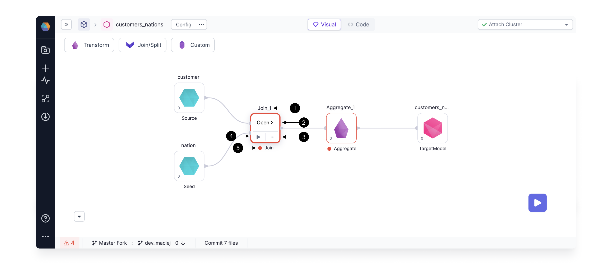

Clicking on any of the Gems shows these options.

**(1) Name Edit** - click to edit the name of the transformation for easy identification.

**(2) Gem Edit** - to modify the Gem logic click on the **Open >** button.

**(3) More** - to see more Gem configuration options, like editing comments, changing phases or deleting the Gem, click on the ... button. Please note, that to delete the selected Gem you can also press **delete / backspace** on your keyboard.

**(4) Run** - runs the model upto the selected Gem. We will learn more about this in the section 7.3 Interactively test.

**(5) See errors** - To see errors related to your Gem, hover over the red icon next to the Gem. If there’s no red icon, that means your Gem has no errors and is good to go!

#### Join definition

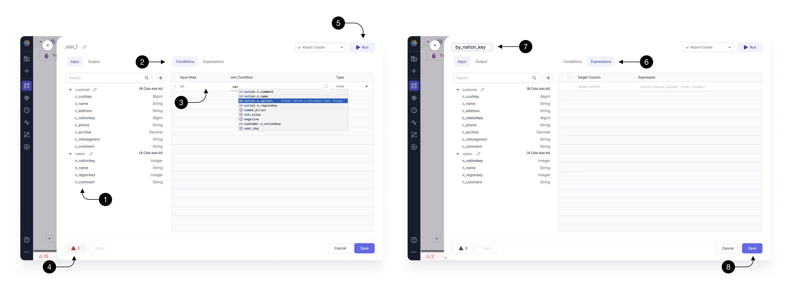

Let’s start by building the **Join** transformation. Upon opening the Gem, you can see a drawer pop-up which provides several helpful features. For transparency, you can always see the **(1) Input schema** on the left hand-side, **(4) Errors** in the footer, and have the ability to **(5) Run** the Gem on the top right.

To fill-in our **(3) Join condition** within the **(2) Conditions** section, type `nation.n_nationkey = customers.c_nationkey`. The following condition, for every single customer, finds a nation based on the c_nationkey field.

When you’re writing your expressions, you’ll be able to see expression builder, which shows you available functions and columns to speed up your development. Whenever the autocomplete appears, press ↑, ↓ to navigate between the suggestions and press tab to accept the suggestion.

The **(6) Expressions** tab allows you to define a set of output columns that are going to be returned from the Gem. We leave it here empty, which by default, passes through all the input columns, from both of the joined sources, without any modifications.

To rename our Gem to describe its functionality, click on it’s **(7) Name** and modify it to e.g. `by_nation_key`. Note, that Gem names are going to be used as query names, which means that they should be concise and composed of alphanumeric characters with no spaces.

Once done, press **(8) Save.**

#### Aggregate definition

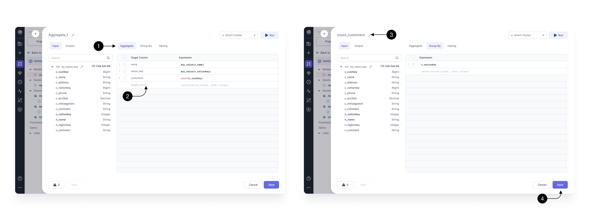

Next, let’s define the transformation logic for our **Aggregate** Gem, which will sum up the number of customers within each of the geographical locations and return a clean set of columns.

Within the **(1) Aggregate** tab define the following expressions on the **(2) Expressions** List. Most importantly, we create the `customers` column by counting customers using the `count(c_custkey)` expression. We also add two columns `name` and `nation_key`, that describe the selected location. Note, that to easily add columns you can simply click on them in the schema browser on the left side.

Once the aggregation expressions are specified, we can consider grouping by a particular column. Switch to the Group By tab, and type in n_nationkey .

Finally, we **(3) Rename** our Gem to `count_customers` and **(4) Save** it.

#### 4.4.3 Interactively test

Now that our model is fully defined, with all the logic specified, it’s time to test it.


Prophecy makes interactively testing the models incredibly easy! Simply click on the **(1) Play** button on any of the Gems and the model with all of it’s upstream dependencies will be executed. Once the model runs, the **(2) Result** icon appears. Click the Result icon to view a **(3) Sample** set of records.

## 5. Orchestrate and Deploy

Now that we’ve developed and tested our models, it’s time to schedule and deploy them to production. This will allow our code to run on a recurrent interval, e.g. daily, depending on how often our upstream data arrives and our business commitments.

### 5.1 Create your Job

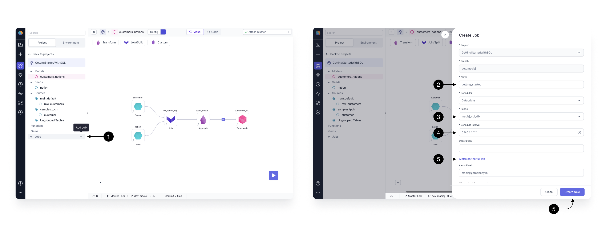

We start by creating a Job. Jobs are graphs that orchestrate various tasks that are executed by the scheduler.

To create a Job, we start by clicking on the **(1) Add Job** button in the **Jobs** section of the project browser. **Create Job** drawer appears, where we define the details of our Job.

Most of the fields, like **Project** or **Branch** are automatically populated for us. We start by populating the **(2) Name** field. Here, we’re going to run a whole project as part of this Job so we give it the same name as the project: `getting_started`.

Most importantly, we have to choose the **(3) Fabric** (Databricks SQL warehouse) on which we’re wishing to execute our models and write our tables. You can leave the default here, as the same Fabric that we were testing our models on.

Next, we choose the **(4) Schedule Interval,** which describes how often our schedule is going to run. The interval is defined by a [CRON expression.](https://en.wikipedia.org/wiki/Cron#Cron_expression) Click on the 🕒 icon to open an easy interval picker.

After that, we can optionally provide a list of email address which are going to receive the success or failure alerts. Those can be written in the **(5) Alerts** on the full Job section.

Finally, we create our Job by clicking on **(6) Create New.**

### 5.2 Configure the DBT task

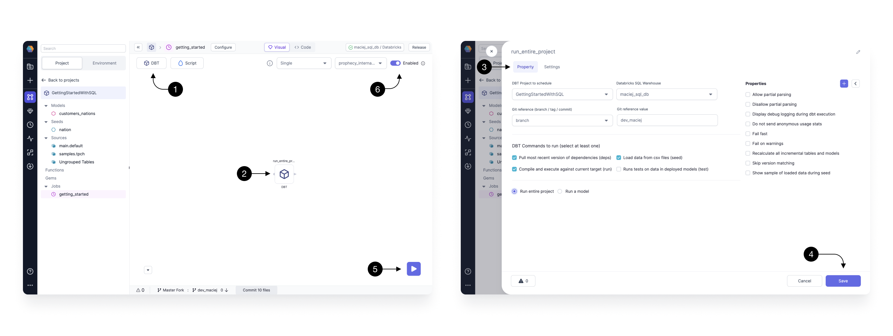

Once your Job is created, you are redirected to the Job editing canvas. You will notice that it looks very similar to the model editor with some subtle differences.

The **(1) Gem drawer** has been restricted to only a few basic Gems relevant to Databricks Jobs. For SQL projects, it’s **DBT** and **Script** tasks only.

Let’s start by dragging and dropping the the **(2) DBT Gem.** Once it’s on the canvas, we open and configure it. Within the **(3) Property** tab, there’s three basic fields we fill:

1. **DBT project to schedule** - which we set to the current project;
2. **Databricks SQL Warehouse** - defines on which warehouse our SQL code is going to execute, we set it to the recently created Fabric;
3. **Git reference value** - defines from which branch on Git, the code is pulled to execute, we set it to the currently used developed branch - same as what we set in the step 5.1 Checkout development branch (the name can be also seen in the footer).

Once all the basic properties are set click **(4) Save.**

We can quickly verify that our schedule runs correctly by executing it, by clicking on the **(5) Play** button. Upon the click, the execution starts and you can track it’s progress. When finished successfully, we know that the project is ready to be deployed.

Finally, we toggle our Job to be **(5) Enabled.** This enables the Job on the scheduler and will ensure that the Job follows the previously set interval.

### 5.3 Commit your changes

Once we have the **Job** developed and tested it’s time to commit and push our code to our repository.

Start by clicking on the **Commit files** button in the middle of the footer (bottom of the screen). This opens an easy to use Git manaGement screen.

The process of deploying code is composed of 4 steps:

1. **Commit:** We start by creating a named version of our code and uploading it to our development branch on the secure Git repository. On the left hand side you can see the **Current branch** and the associated history of commits and on the right side, there’s a list of **Entities changed** (models, Jobs, etc) and their status. If everything looks good, type in the **(2) Commit message** which should clearly describe, in few sentences, all the changes that we’ve introduced.
2. **Pull:** Before your changes can be safely merged into the **main** branch, we have to make sure that we’re up to date with it. If your colleagues introduced any code on **main** we have to **Pull** it first. This step is most of the time going to happen automatically for us without any further actions required.
3. **Merge:** Now that our development branch is up to date, we can merge it to master. Here we can either create a **Pull Request** or if you’re the owner of the repository force **Merge** the changes. For now, we **Merge** them directly. Once the code is merged, you can now see the latest commits present on your **main** branch.
4. **Release:** Finally, now that our changes are all versioned on Git, we can release them to our scheduler. Simply specify a **Release Version** number, e.g. `1.0` , and the **(4) Release Note,** which should clearly outline the latest changes. When ready, click **(5) Release.**

### 5.4 Monitor the release

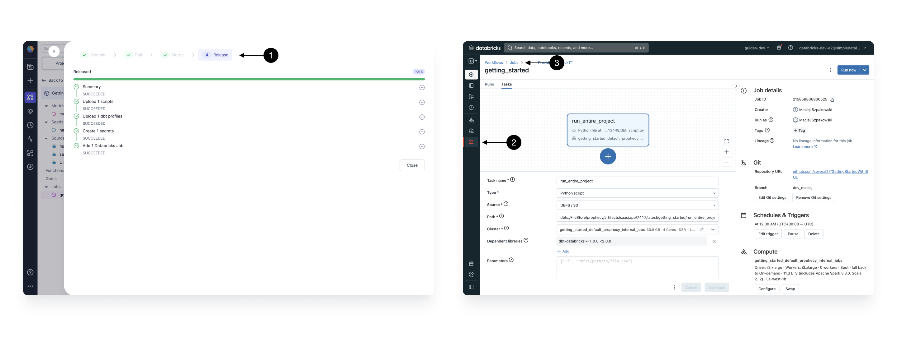

During the release process Prophecy automatically packages, tests, and deploys your project’s artifacts - mostly SQL queries - to your Databricks Warehouse. You can monitor this process in the final **(1) Release** page.

Once the process is finished you can see the deployed and running Job, within your Databricks workspace defined within the Fabric that you released your Job to. To see it, go to your workspace and open the **(2) Workflows** section. Then choose the right Job - the name will be exactly the same as the name of the Job you created in Prophecy. A **(3) Job page** opens, where you can inspect all the details of your newly created Job.

## What’s next?

Great work! 🎉

You've successfully set up, developed, tested, and deployed your first SQL project in the Databricks workspace. Take a moment to appreciate your accomplishment 🥳.

To continue learning and expanding your skills with Prophecy, explore other tutorials within our documentation, or apply your newfound knowledge to address real-world business challenges!

If you ever encounter any difficulties, don't hesitate to reach out to us (Contact.us@Prophecy.io) or join our [Slack community](https://prophecy-io-support.slack.com/join/shared_invite/zt-moq3xzoj-~5MSJ6WPnZfz7bwsqWi8tQ#/shared-invite/email) for assistance. We're here to help!

---
