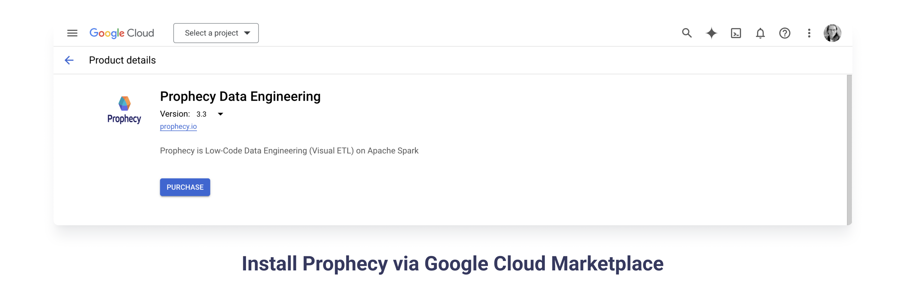

Prophecy offers a few different ways to sign up: public SaaS or private installation in the customer's VPC.

### Prophecy's public SaaS offering on the cloud

- [**Prophecy's Enterprise trial**](https://app.prophecy.io/metadata/auth/signup) - try out Prophecy's software-as-a-service offering free for for 14 days. Connect to your data, or opt for the Prophecy-provided Databricks account.
  

- **Prophecy via Databricks Partner Connect** - try out Prophecy's SaaS offering via an existing Databricks account. The following video shows how to get started with Prophecy using _Partner Connect_ from your Databricks UI.

<iframe src="https://www.youtube.com/embed/mh-6lpYJcqs" title="YouTube video player" frameborder="0" allow="accelerometer; autoplay; clipboard-write; encrypted-media; gyroscope; picture-in-picture" allowfullscreen></iframe>

### Prophecy's private offering installed in customer VPC

- **Prophecy via Cloud Marketplaces** - try out Prophecy's Private cloud offering in your VPC. Login into your preferred cloud marketplace: [AWS](https://aws.amazon.com/marketplace/pp/prodview-gh3pyflmu7mlu?sr=0-1&ref_=beagle&applicationId=AWSMPContessa#external-reviews), [Azure](https://azuremarketplace.microsoft.com/en-us/marketplace/apps/simpledatalabsinc1635791235920.prophecy-data-engineering), or [GCP](https://console.cloud.google.com/marketplace/product/prophecy-on-gcp-public/prophecy-data-engineering), and search for "Prophecy." The [installation](/docs/architecture/deployment/deployment.md) is very simple, takes about 20 minutes (with a confirmation popup), and billing starts after 30 days.

### Next steps

Prophecy can connect to your data wherever it resides, in various formats and storage options. Learn about Prophecy [concepts](/docs/concepts/concepts.md), read more about [deployment options](/docs/architecture/deployment/deployment.md), or reach out to [start a conversation](./getting-help.md) today!
