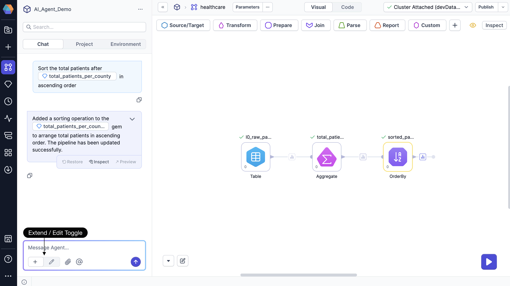
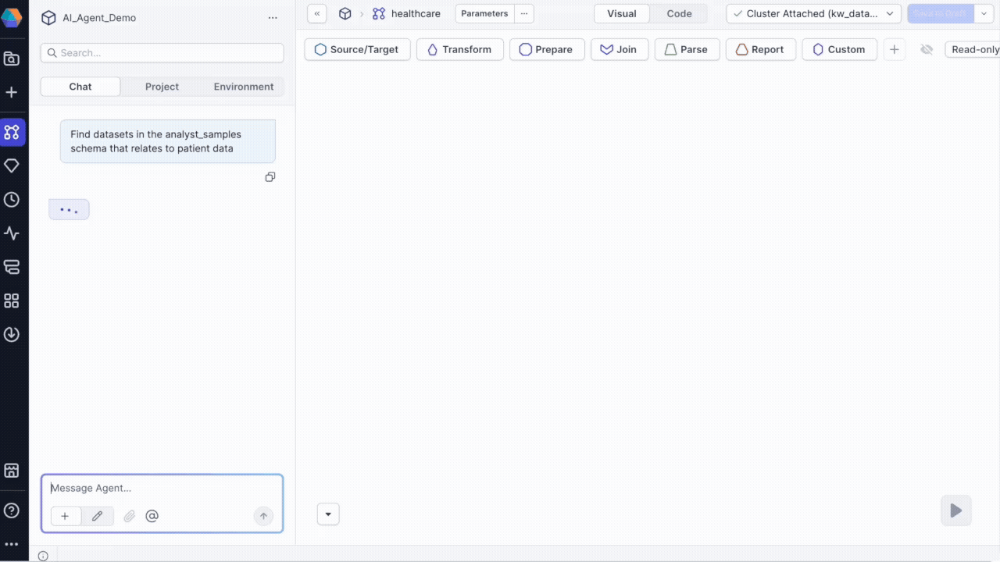

Take a few minutes to try out Prophecy’s AI agent for pipeline development. In this quick start, you'll learn how to use the AI agent to explore data, build transformations, and create complete pipelines through natural language conversations.

## Prerequisites

Make sure you have:

- A Prophecy account with access to Databricks SQL projects.
- A Prophecy fabric with a configured[ Databricks SQL warehouse connection](/administration/fabrics/prophecy-fabrics/connections/databricks).
- Source data available. You may have to reindex your connection so the [knowledge graph](/knowledge-graph) (used by the agent) includes up-to-date information about your data.

:::note
Prophecy’s AI agent can only read and transform Databricks Unity Catalog tables. It cannot read, write, or process data from other sources.
:::

## Step 1: Access the AI agent

To access the AI agent:

1. Open your [project](/projects) in Prophecy. Ensure the the project uses SQL as the primary language.
1. Open or create a [pipeline](/analysts/pipelines) you wish to build or update.
1. Locate the **Chat** tab on the left sidebar. This is where you'll interact with the AI agent.

The agent responds to your prompts and applies changes directly to your pipeline. Keep the **Visual** view open (rather than the Code view) to see updates in real-time as the agent adds or modifies gems on the canvas.

:::note
Each change that the AI agent makes can be viewed in the [project version history](/analysts/versioning/#show-version-history). You can revert the changes at any time.
:::

### Toggle agent modes

Control what the agent can modify in your pipeline using the toggle in the chat footer.

**Extend mode**: Agent adds new gems to the end of pipeline branches without modifying existing gems. This mode assumes you've approved existing gems and want to build upon them without retesting the pipeline.

- For pipelines with multiple branches, the agent uses logic to determine which branch to extend based on your prompt.
- Use `@` mentions to explicitly specify which gem should be the starting point for new transformations.

  Example: `Add a filter after @last_aggregation_gem to show only records from 2024`

**Edit mode**: Agent can rebuild parts of or the entire pipeline, modifying existing gems when necessary.

- Use this mode when you need to change details of existing gems in the flow.
- The agent will highlight all changes for you to review.



You can build an entire pipeline with one prompt, but we suggest building incrementally to reason through changes and inspect inputs and outputs along the way. In most cases, extend mode will be sufficient, but edit mode helps when you need to modify existing elements in the canvas.

### Reference specific tables and gems

Use `@` mentions to refer to specific tables in Databricks or gems in the canvas:

```
// Example 1
How many records are in the @transactions table?

// Example 2
Aggregate the @orders_cleaned gem to show sum of order quantity per month
```

As you type `@`, Prophecy suggests matching table names and gem instances to choose from.

- You can reference tables to find more details about the data or visualize the data
- You can reference gems to specify where in the pipeline you would like to add transformations

:::info
When referencing gems, you refer to the gem label that identifies the instance of the gem, rather than the gem type (Aggregate, Join, etc).
:::

### Upload files

Click the paperclip icon to upload CSV, Excel, or Parquet files from your local system. These files are added to your SQL warehouse and can be used like any other table in your pipeline.

:::tip
You can also drag and drop local files directly onto the pipeline canvas.
:::

## Step 2: Explore your data

Start by understanding what data is available in your fabric. Ask the agent to search for relevant datasets:

```
Find datasets with information pertaining to hospital patients
```

The agent will return:

- A short list of relevant datasets with descriptions.
- A full list of matching datasets.
- The option to add datasets directly to your pipeline on hover.



### Examine dataset details

Click on any dataset in the chat to open a detailed preview dialog where you can:

- View the dataset location (where the data is actually persisted).
- Examine the schema and column structure.
- Preview sample data.
- Review data profiles.
- Open an **Explore** session for dataset-specific queries.


### Get data samples

Request specific data samples to validate your understanding:

```
Provide sample data from @patients_raw_data showing only patients from Boston
```

In this example, `patients_raw_data` is a table in Databricks. The agent returns:

- A table with the requested data.
- An option to preview the table for detailed examination.
- An option to add the dataset to your pipeline.
- SQL execution logs showing the query used.


## Step 3: Create visualizations

Generate charts and insights from your data:

```
Visualize number of patients per city in @patients_raw_data
```

The agent returns:

- An embedded chart in the chat.
- An option to preview the table for detailed examination.
- An option to add the dataset to your pipeline.
- SQL execution logs showing the query used.


### Chart preview options

Click Preview to access:

- **Visualization tab**: View larger charts, download charts as images, and copy charts
- **Data tab**: Examine underlying data, download data as JSON/Excel/CSV, and show/hide columns

## Step 4: Build your first transformation

Once you or the agent has added source data in your pipeline, describe the transformations you want to perform:

```
Transform @l0_raw_patients to show total number of patients per county
```

In this example, `l0_raw_patients` is the gem label for a source gem on the canvas. You can reference any gem on the canvas using @ mentions.

The agent will:

- Add the appropriate gem(s) to your pipeline canvas.
- Execute the pipeline, generating data samples that you can review.
- Provide a description of the changes made.
- Show options to inspect, preview, or restore changes.
- Display SQL execution logs.


### Inspect pipeline changes

To understand what the agent built:

- Click Inspect on the transformation response.
- Review the configuration panel starting with the first modified gem (highlighted in yellow).
- Use the Previous and Next buttons to navigate through modified gems.
- Examine input and output data to verify the transformation produces expected results.


### Restore previous versions

To revert changes or try different transformations:

- Select **Restore** from any chat response.
- The pipeline returns to that previous state.
- All changes are saved in project version history.

## Step 5: Save your results

After building your pipeline, ask the agent to save the final output:

```
Save the final output of this pipeline as a table
```

The agent adds a Target gem to the end of your pipeline. When you run the pipeline, the Target gem writes the data to your default database and schema, allowing you to persist results.

:::caution
If you have multiple pipelines or pipeline branches that do not terminate with tables, the agent will not be able to create an output table.
:::

## Sample prompts

| Task           | Prompt Example                                                                                                                     |
| -------------- | ---------------------------------------------------------------------------------------------------------------------------------- |
| Find data      | `Find datasets containing customer information`                                                                                    |
| Sample data    | `Show me 5 random records from @sales_data`                                                                                        |
| Filter data    | `Filter to only include orders from 2024`                                                                                          |
| Transform data | `Calculate total revenue as quantity * price`                                                                                      |
| Join data      | `Join the orders and customers tables` <br/>**Note**: The AI agent will infer join keys, but you can also specify them explicitly. |
| Parse data     | `Extract the fields from json_data as columns` <br/>**Note**: Works best if you provide a sample JSON object.                      |
| Clean data     | `Remove rows where email is null`                                                                                                  |
| Aggregate data | `Group by region and calculate average sales`                                                                                      |
| Visualize data | `Create a bar chart of monthly sales`                                                                                              |
| Save results   | `Save the final output as a table`                                                                                                 |

## Tips

| Tip                                             | How to do it                                                                                                                                                | Why it helps                                                           |
| ----------------------------------------------- | ----------------------------------------------------------------------------------------------------------------------------------------------------------- | ---------------------------------------------------------------------- |
| Be specific with your requests                  | Instead of `Clean the data` → Try `Remove duplicate customer records and fill null values in the email column`                                              | Reduces ambiguity so the agent applies the correct operations.         |
| Use step-by-step instructions                   | Break complex transformations into smaller requests. For example: `Aggregate orders by customer` → `Join with customers` → `Filter for orders made in 2024` | Improves reliability and makes it easier to debug or adjust each step. |
| Review changes before proceeding                | After a response, click **Inspect** and use **Previous/Next** to review highlighted gem configuration and output                                            | Ensures the transformation matches expectations before you continue.   |
| Leverage both the AI agent and visual interface | Use chat to scaffold transformations, then switch to the **Visual** canvas to fine-tune or add gems                                                         | Combines speed (AI) with precision and control (visual editor).        |

## Troubleshooting

| Symptom                                | Probable cause                                                                          | How to fix                                                                                             |
| -------------------------------------- | --------------------------------------------------------------------------------------- | ------------------------------------------------------------------------------------------------------ |
| Agent can’t find tables                | [Knowledge graph](/knowledge-graph) is out of date, or the table isn’t in Unity Catalog | Reindex your Databricks connection so the knowledge graph includes the table                           |
| Conversation feels “stuck” or off      | Chat context isn’t relevant anymore                                                     | Click `… > Reset` in the chat interface to start a fresh session                                       |
| Need to report a bad or great response | You want to provide feedback to improve results                                         | Click the thumbs-up or thumbs-down on the agent’s message. This helps us improve the agent’s behavior. |
