When you build pipelines in Prophecy, you can connect to a variety of execution engines to run those pipelines. Complete the tutorial below to learn about using Databricks to compute with Spark and try it yourself!

## Requirements

For this tutorial, you will need:

- A Prophecy account.
- A Databricks account.
- Permission to create Spark clusters in Databricks.

## Create a Databricks Spark fabric

A [fabric](docs/getting-started/concepts/fabrics.md) in Prophecy is an execution environment. In this tutorial, you'll see how to use Databricks as your execution environment in Prophecy. Let's begin!

1. Open Prophecy.
1. Click on the **Create Entity** button in the left navigation bar.
1. Select the **Fabric** tile.
1. Give the fabric any name, like `DatabricksTutorial`.
1. Select the team that will be able to use the fabric. For this tutorial, you might want to select your personal team. (It will match your individual user email.)
1. Click **Continue**.

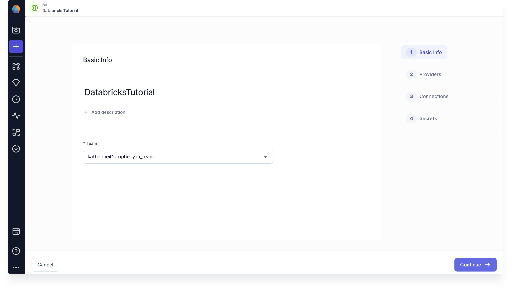

Now, you will enter your Databricks credentials.

1. Choose **Spark** as the Provider Type.
1. Select **Databricks** under Provider.
1. Enter your Databricks Workspace URL. This will be the URL that you use to open your Databricks Workspace.
1. For this tutorial, we'll use a **Personal Access Token** for authentication. Visit the Databricks documentation to learn how to [generate a personal access token](https://docs.databricks.com/en/dev-tools/auth/pat.html).
1. Paste your Databricks Personal Access Token.
1. Now, click **Test Connection**. This test must be successful to continue with fabric creation.
1. After the test succeeds, click **Continue**.

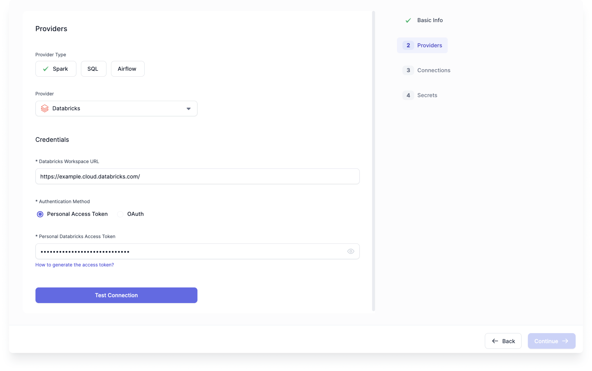

You are almost done setting up your Databricks fabric!

1. We'll skip the Connection section for now. Click **Continue**.
1. We don't need to add any secrets at this point. Click **Complete**.

## Create a Prophecy project

After you create your first Spark fabric, you'll see a [project](/docs/getting-started/concepts/project.md) in Prophecy called HelloWorld. If you just want to play around with Prophecy, you can start there. However, for the purpose of this tutorial, let's build a new project from scratch.

1. Once again, click on the **Create Entity** button in the left navigation bar.
1. Hover over the **Project** tile and select **Create**.
1. Give your project a name.
1. For the Project Type, choose **Spark/Python (PySpark)**.
1. Select the team that will have access to your project. Again, you might want to use your personal team.

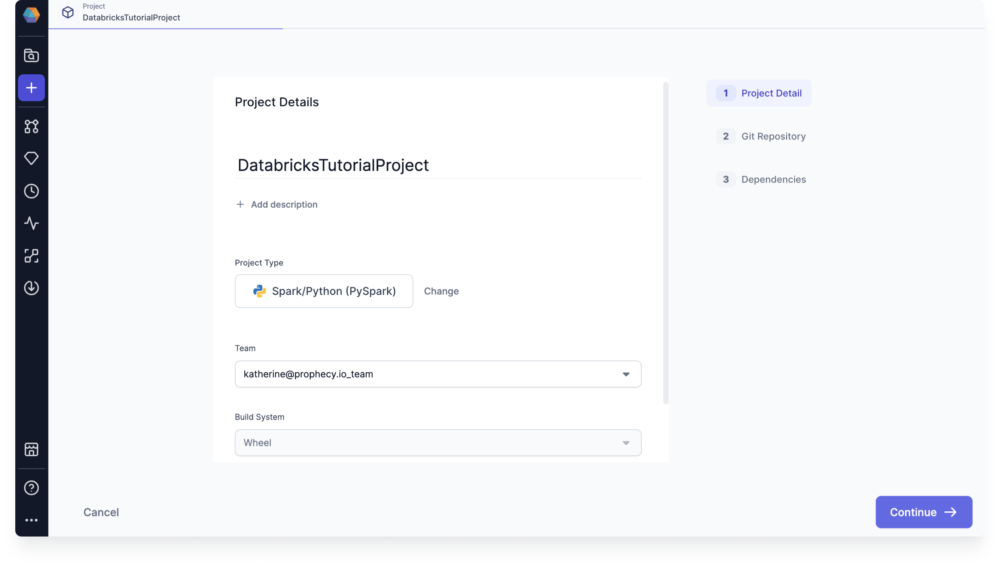

### Set up Git repository

Prophecy uses [Git](docs/ci-cd/git/git.md) for version control. Each project in Prophecy is stored as code in its own repository or folder in a repository. For this project, we suggest that you use **Prophecy-managed Git**. When you are ready to use Prophecy for a production use case, [connect to an external Git provider](docs/ci-cd/git/git.md#Git-credentials). This provides extra functionality for you to work with.

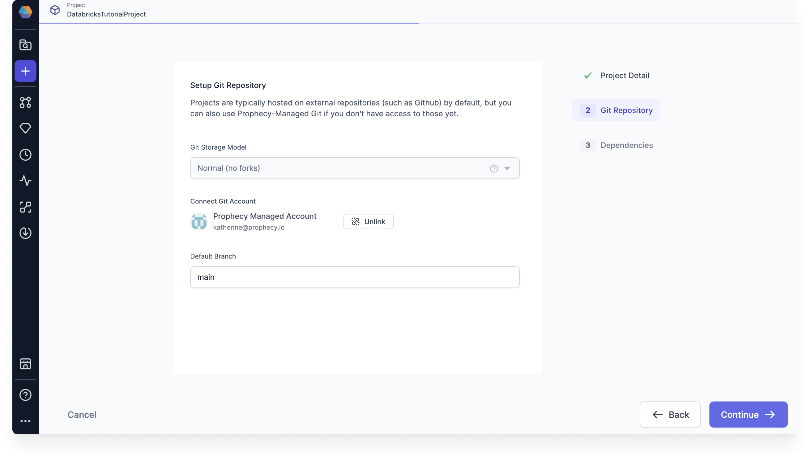

Once you have set up your Git repository, click **Continue**.

### Select project dependencies

In the Project Dependencies section, you have the option to include [additional functionality](docs/extensibility/dependencies/spark-dependencies.md) in your project. A few dependencies are added by default, and these are all we will need to get started. Click **Complete**, and then **View Project**.

### Project metadata and editor

You should see the project metadata page. Project metadata includes information about the contents, dependencies, settings, and more related to your project. We want to start editing the project, so click **Open in Editor**.

## Develop a pipeline

You should now see your empty project. Let's add a pipeline!

1. To get started, click the **Create Pipeline** button.
1. Create a new Git branch where you will begin developing this pipeline.
1. Give the pipeline a name, like `dev`.
1. Choose **Batch** mode.
1. Click **Create New**.

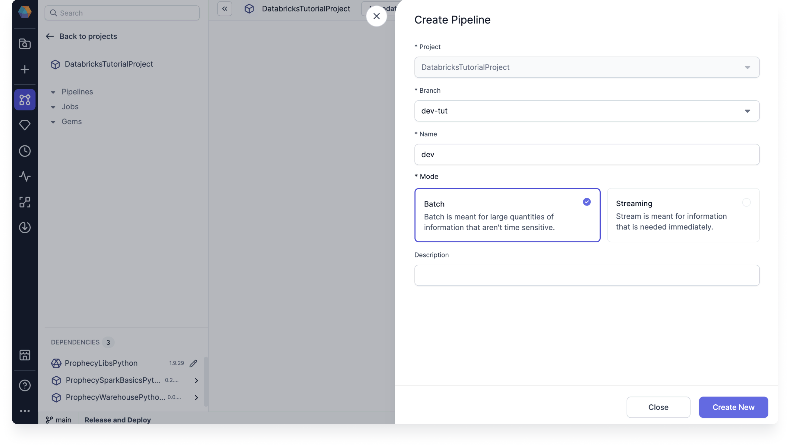

Next, we can start building the pipeline. If you want to run the pipeline as you develop it, you need to attach your Databricks fabric now.

1. In the upper right corner of the pipeline editor, click on the **Attach a cluster** dropdown.
1. Select the fabric you created earlier.
1. Choose a cluster to attach to. If you don't have any clusters, or if your clusters aren't running, you can choose to create a new cluster from the Prophecy UI.

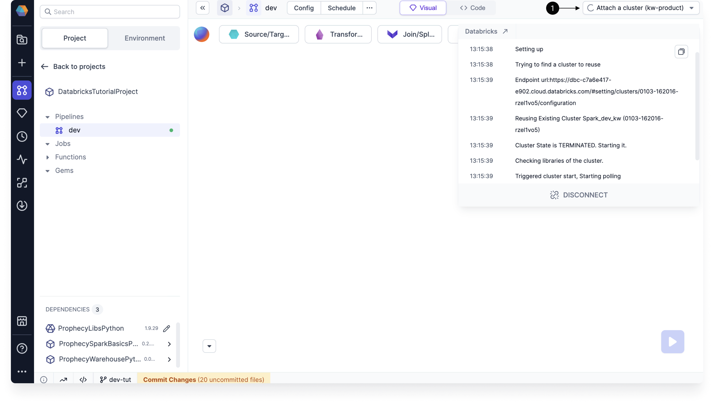

The cluster may take some time to start up. Once the cluster is up and running, you can move on to the next section.

### Source gem

The first thing we need in the pipeline is a data source.

When you are connected to a Databricks fabric, you can browse the Databricks catalogs in the **Environment** tab of the left sidebar. From here, you can drag and drop tables onto the pipeline canvas. To make things easy, we'll use one of Databricks' sample tables.

1. Open the **Environment** tab of the left sidebar.
1. Select the **samples** catalog.
1. Under **tpch > Tables**, click the **plus** sign next to the **orders** table.
1. In the dialog, choose **Source** gem and name the gem. Then, click **Add**.
1. A [Source](docs/Spark/gems/source-target/source-target.md) gem should be added to the pipeline canvas.

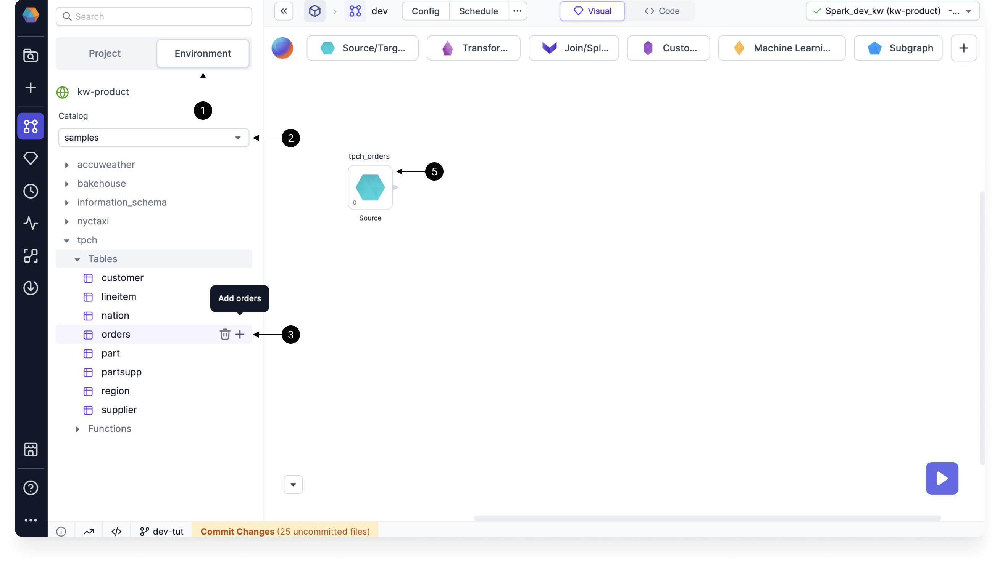

### Reformat gem

Next, let's add a new column to the dataset using the [Reformat](docs/Spark/gems/transform/reformat.md) gem to extract the month and year from the order date.

1. Click on **Transformations** to see the transformation gems.
1. Select **Reformat**. This adds the gem to the canvas.
1. Connect the **Source** gem output to the **Reformat** gem input.
1. Hover the **Reformat** gem and click **Open**.

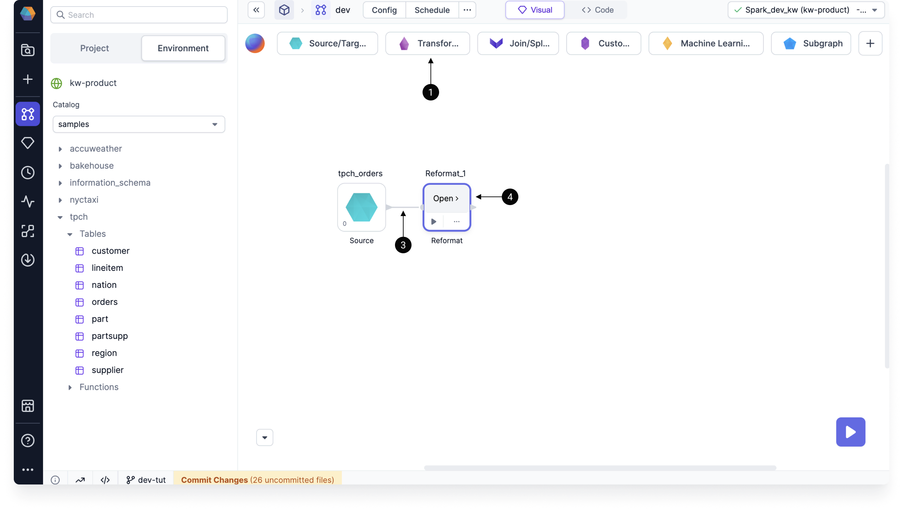

Add the following configurations:

1. Hover **in0:tpch_orders** and click **Add 9 columns**.
1. In the next available row, type `ordermonth` in the **Target Column**.
1. In the **Expression** cell, paste `month(o_orderdate)`.
1. In the next available row, type `orderyear` as the target column and `year(o_orderdate)` as the expression.
1. Review the new output schema in the **Output** tab of the gem.

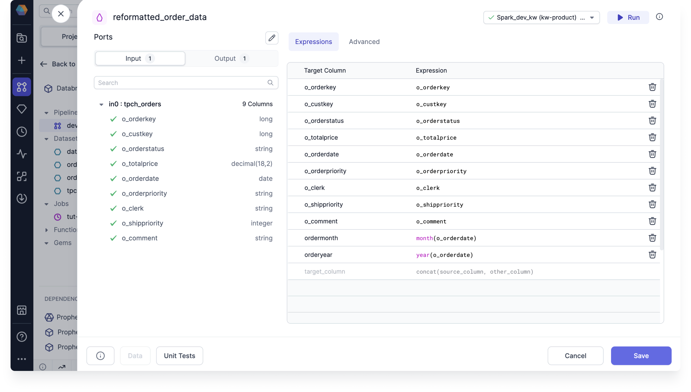

To preview the output of the gem:

1. Click **Run** in the top right corner. This will execute the pipeline up to and including the gem.
1. You'll be able to see a sample output dataset under **Data** in the gem footer.
1. If you **Save** and close the gem, you will also be able to see a new small icon in the output of the Reformat gem. You can click on this to open the [interim data sample](docs/Spark/execution/interactive-execution.md).

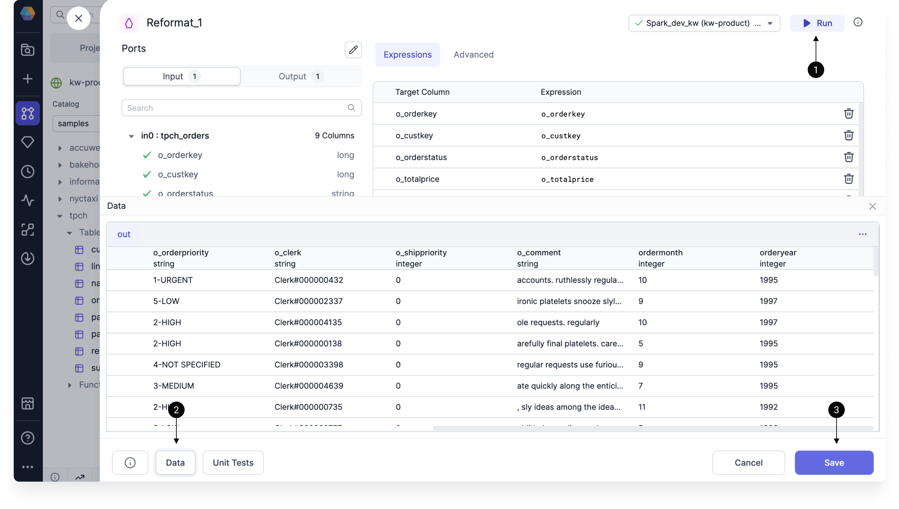

:::note

- To learn more about running pipelines, visit [Interactive Execution](docs/Spark/execution/interactive-execution.md).
- To learn more about Spark SQL expressions in gems, visit [Expression Builder](docs/Spark/expression-builder.md).

:::

### Aggregate gem

Another common gem to use is the [Aggregate](docs/Spark/gems/transform/aggregate.md) gem. Let's use it to find the total sales amount per month each year.

1. Select **Transformations > Aggregate** to add the Aggregate gem to the canvas.
1. Connect the output of **Reformat** to the input of **Aggregate**. Then, open the Aggregate gem.
1. Add the **o_totalprice** column to the Aggregate table.
1. Next to amount, write `sum(o_totalprice)` as the expression.
1. Switch to the **Group By** tab, and add the **orderyear** and **ordermonth** columns.
1. **Save** the gem.

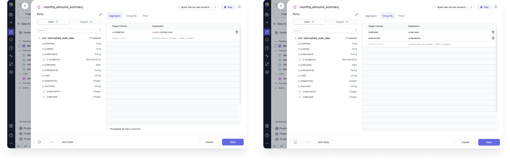

### Target gem

Once you know how to use a couple of gems, you can experiment with others in the pipeline. When you are finished transforming your data, you should write the final table to a target location:

1. Select **Source/Target > Target** to add the Target gem to the canvas.
1. Connect the Target gem after the **Aggregate** gem and open it.
1. Click **+ New Dataset** and give the new dataset a name.
1. Choose the format to save the dataset, then click **Next**.
1. Choose the location to save the dataset, then click **Next**.
1. In the Properties tab, under **Write Mode**, select [overwrite](/Spark/gems/source-target/file/delta#supported-write-modes).
1. Confirm the schema, and then click **Create Dataset**.

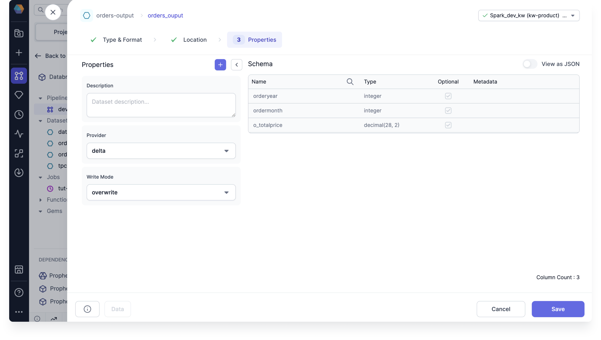

To write the data, we should run the whole pipeline. Click on the big play button in the bottom right corner to do so.

## Review the code

This far, we've only made changes in the visual editor of the project. If you want to see how your pipeline looks in code, switch to the **Code** view. Since we made a Python project in this tutorial, the code is in Python.

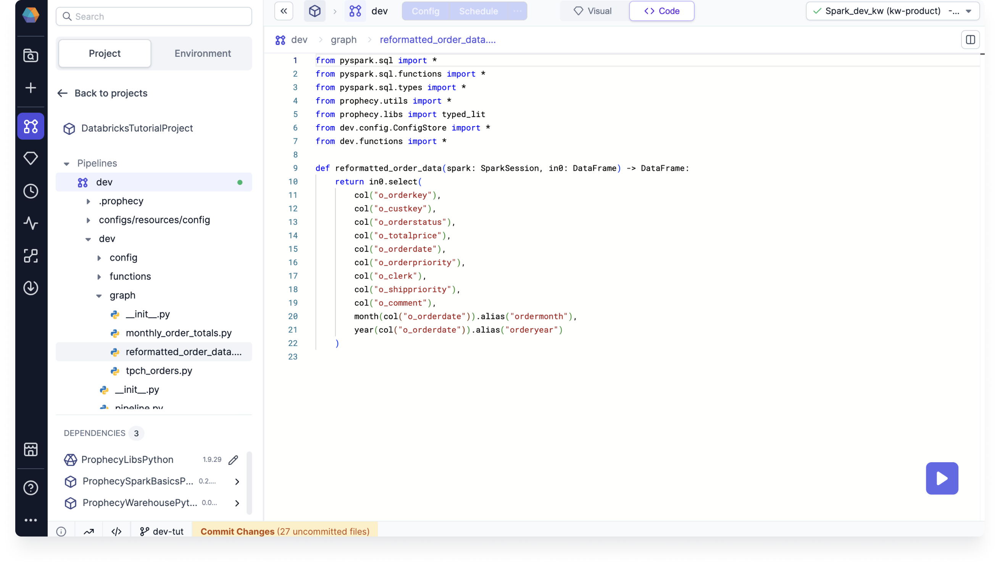

## Release and deploy the project

1. In the project footer, click **Commit Changes**. This will open the Git dialog.
1. Review your changes and the auto-generated commit message. Then, select **Commit**.
1. Because there were no changes made to remote or source branches, we can skill the **Pull** step.
1. Merge your current branch into the main branch by clicking **Merge**.
1. Lastly, you can **Release and Deploy** your project. This makes a certain version of your project available for use (in a CI/CD workflow, for example).

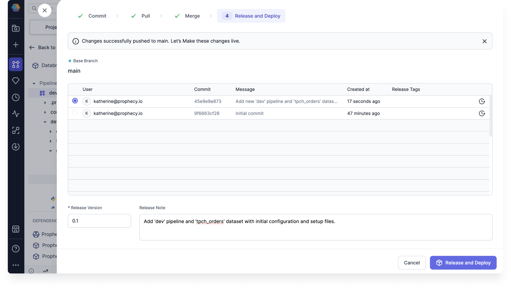

## Create a Databricks job

If you want to schedule your pipeline to run periodically, you can create a job to do so.

1. In the left sidebar, hover over **Jobs** and click the **plus** sign.
1. Fill in the required fields. For this project, use the **Databricks** scheduler.
1. Leave the schedule interval blank for now. This is where you define the job run frequency.
1. Click **Create New**.

Now, you can configure the flow of your job.

1. Click on **Pipeline** to add it to the canvas.
1. Under **Pipeline to schedule**, choose the pipeline you created in this tutorial.
1. Click **Save**.

### Enable the job

To enable this job, you **must** complete the following two steps:

1. Turn on the **Enabled** toggle.
1. **Release your project**.

**If you do not release your project, the Databricks scheduler will not see that you have enabled this job.**

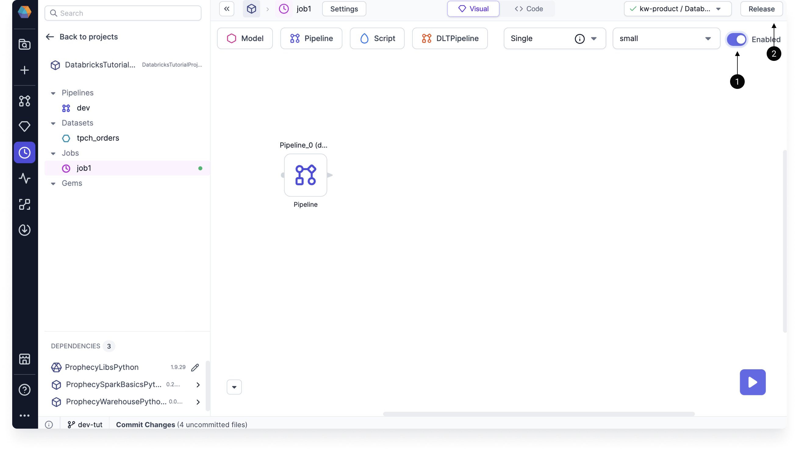

## What's next

Great work! You've successfully set up, developed, run, and deployed your first Spark project using a Databricks execution environment. Take a moment to appreciate your accomplishment!

To continue learning and expanding your skills with Prophecy, keep exploring our documentation and apply your newfound knowledge to address real-world business challenges!

If you ever encounter any difficulties, don't hesitate to reach out to us (Contact.us@Prophecy.io) or join our [Slack community](https://prophecy-io-support.slack.com/join/shared_invite/zt-moq3xzoj-~5MSJ6WPnZfz7bwsqWi8tQ#/shared-invite/email) for assistance. We're here to help!
