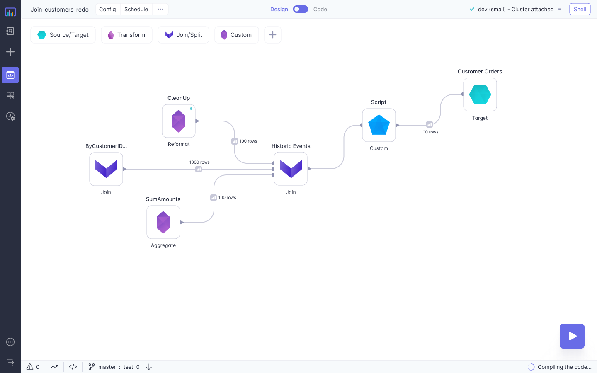
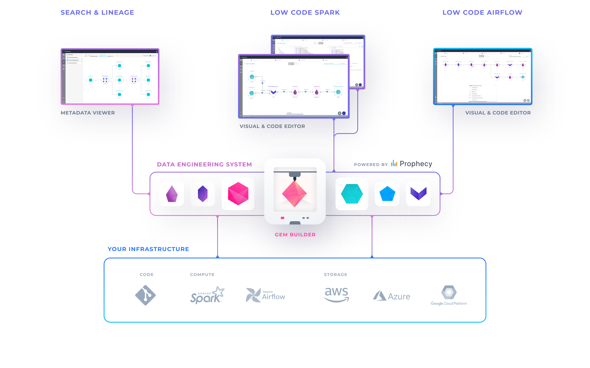
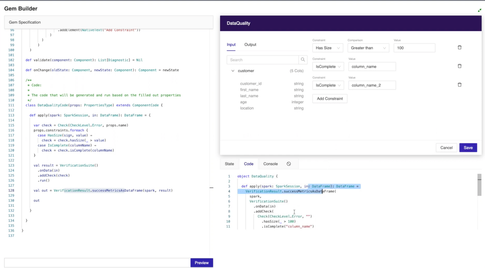

# Prophecy - Low Code Data Engineering

Prophecy is designed to enable all users to be productive with data engineering. It also replaces legacy ETL products. Following are the primary pillars of Prophecy

## Visual Interface

Prophecy's low-code designer provides a visual drag-and-drop canvas to develop data pipelines, where business logic can be written as simple SQL expressions. We believe it is superior in every way to developing custom scripts:

* **Many data users:** Our users don't need to be experts in Spark or Airflow, and this enables all the data users - data engineers, visual ETL developers, data scientists and data analysts to succeed.
* **Productive development:** It is very quick to develop pipelines - you can drag and drop visual blocks into a pipeline and interactively run them to see the data after every step along the journey. Even coding data engineers are more productive with our product.

## Code & DevOps
Running at scale requires bringing the best software engineering practices to the refinement of data. Rapid development & deployment of data pipeline can be achieved by code on git & high test coverage, coupled with continuous integration & continuous deployment. Prophecy does the following to make this process work:

* **Visual data pipelines as code:** Prophecy low-code editor stores visual data pipelines as high-quality code on git
* **High test coverage:** Prophecy makes test-generation & editing easy, and this results in high test coverage for our users after the switch
* **Metadata as code:** Much of the metadata from projects including workflows, schedules and datasets, and computed metadata such as column-level lineage are also stored on git with Prophecy.

These provide the following benefits:

* **DevOps practices:** For data projects, the pipeline code, schedules & tests are stored on git - with every developer working on her branch. Every change gets reviewed, and on every commit tests are run. The code is then deployed to be run per the schedule. Bad changes can be rolled back reliably. This process enables data teams to quickly move new and edited changes to production with high confidence.
* **Zero lock-in:** Prophecy generated code is in 100% open-source format with data pipelines in Apache Spark format and schedules in Apache Airflow format. This ensures freedom from lock-in and cost management.
* **Git versioning for time travel:** Given that data projects including metadata are stored together on git, the user can traverse across time, and for example see how a value is computed today, and compare it with how it was computed a month earlier to understand why a breakage has occurred.

## Complete Product

In the cloud, data engineering only has point products forcing the customer data platform teams to stitch together custom solutions. However, this means that development, deployment and metadata is spread across multiple systems - this is not sustainable over the medium term.

Prophecy instead chooses to provide a complete product:

* Build data pipelines on Spark
* Deploy & Schedule data pipelines on Airflow
* Get unified metadata with search that includes business logic, datasets, execution information
* Column level lineage to see how values flow end-to-end

## Extensibility

Standardization is essential to scale but the scope of Data Engineering has increased quite beyond what traditional ETL or data integration products provide. It is no longer acceptable to only have a limited palette of visual components, where users get stuck if something does not fit the paradigm.

Prophecy provides extensibility via templates - not as an afterthought - but as the concept at the heart of our architecture. Prophecy provides a set of inbuilt visual operators - such as Spark standard library, and Delta lake library. New visual operators are defined by our customers - usually the data platform teams develop standards for their organizations. This includes custom connectors, and transforms such as an encryption library. Customers also ask us to develop new operators as they need them and we're happy to add new libraries as requested.

### Gems

Prophecy enables you to construct data pipelines from standard visual blocks (like Lego pieces), that we call gems. The gems require the users to be able to write Spark code and our customers often rely on Prophecy to help out. Gems include Spark code, properties that are blanks to be filled by the user from UI, and a function to describe the visual layout of the gem.

In the gem builder UI, the left half is where you write the template code for the gem. The top right has a functional UI generated in real time from the template code. You can fill business logic values into this generated UI, and you can immediately see the generated code at the bottom right. You can run this generated code against input data and see the results to ensure everything is working well.

